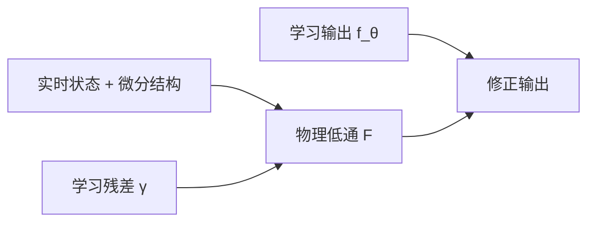
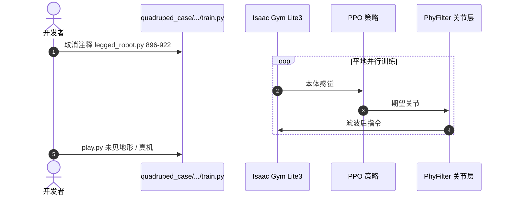

# PhyFilter：用物理滤波换数据规模

**PhyFilter**（*Physics Filtering Favors the Generalization of Robot Learning*，[arXiv:2608.22701](https://arxiv.org/abs/2608.22701)，[项目页](https://scoardyy.github.io/PhyFilter)，[代码](https://github.com/JIAjindou/PhyFilter)）由 **南洋理工大学（NTU）**、**北京航空航天大学（BUAA）** 与 **新加坡国立大学（NUS）** 提出：把学习残差送进与运动学/动力学结构绑定的低通滤波器，用实时状态反馈修正 RL 或监督学习输出，而不是把泛化押在 LLM 级数据规模上。

## 一句话定义

**机器人泛化可以来自「身体结构 + 实时反馈」：把学不到的低频残差滤出来加回去，比再采集一个数量级演示更便宜。**

## 英文缩写速查

| 缩写 | 英文全称 | 简要说明 |
|------|----------|----------|
| PhyFilter | Physics Filter | 本文可插拔物理滤波模块 |
| SL | Supervised Learning | 无人机/空中操作/感知三例 |
| RL | Reinforcement Learning | 四足 Isaac Gym 例 |
| SEER-I | 学习自适应估计器（对照） | 能估质量、泛化不到风扰 |
| MAE | Mean Absolute Error | 无人机跟踪主指标 |

## 为什么重要

- 真机示教无法复制互联网文本规模；仿真/视频仍有域差。
- 多数 PINN 要改网络并重训；PhyFilter 可叠在已有策略或估计器上。
- 四足实验表明：训练期滤波也能塑造更好策略——部署关掉修正，部分真机地形仍过。

## 核心信息

| 项 | 内容 |
|----|------|
| **机构** | 南洋理工大学（NTU）；北京航空航天大学（BUAA）；新加坡国立大学（NUS） |
| **形式** | \(\hat f = f_\theta + \mathcal{F}(\gamma)\)，\(\gamma=f-f_\theta\) |
| **学参** | 伴随梯度自动搜极点，可不用手调 |
| **开源** | **已开源** — 四案例目录 |

## 流程总览

## 源码运行时序图

关键复现路径：四足用 Isaac Gym 1.0rc4；无人机与空中操作为 MATLAB/Simulink `*.slx`。

## 实验与评测读法

| 系统 | 设定 | 读法 |
|------|------|------|
| 四足 | 只在仿真平地训 | 真机石板/草坪/沙/砾可走；基线沙砾即摔；未见速度 2.8 m/s、负载至体重 60% |
| 无人机 | SEER-I + 风 | 相对 SEER-I MAE **↓30.22%**，相对基线 **↓50.17%** |
| 空中臂 | 5 m/s 风 + 0.3 kg | 端执行误差上限 **2.5 cm**；基线/SEER-I 抓空 |
| 加速度 | 训练 0–2 m/s，测 0–3 | 滤波阶与自动学参接近手调最优 |

## 结论

**缺数据时，先把已知物理当反馈通道，而不是默认「再 scale 数据」。**

1. **四足：** 平地策略能出沙砾，说明低层滤波降低了高层 RL 的随机化负担。
2. **SL 例：** SEER-I 停在训练见过的质量不确定；风扰要靠滤波补。
3. **即插即用有边界：** 仍需正确的微分结构；乱套滤波不会创造缺失的可控性。
4. **复现：** 四足是 Python；飞控两例是 Simulink，团队栈要分开估。

## 与其他工作对比

| 对比轴 | PhyFilter | 域随机化 RL | PINN 重训 |
|--------|-----------|-------------|-----------|
| 改网络 | 通常不 | 不 | 要 |
| 数据需求 | 刻意降低 | 靠并行与 DR | 物理损失 |
| 部署修正 | 可开关 | 无显式滤波 | 融在权重 |

## 工程实践

| 项 | 说明 |
|----|------|
| 四足接入 | 关节空间，在 `legged_robot.py` 打开指定行 |
| 自动学参 | `auto_learning/` 伴随梯度 |
| 对照 | RL2AC、SEER-I、跟踪微分器 |

## 局限与风险

- 人形仅补充材料初步展示。
- 依赖「残差低频」假设；高频冲击/接触可能滤掉有用信号。
- 飞控复现需要 MATLAB 与机型对应的 `slx`。

## 关联页面

- [Locomotion](../tasks/locomotion.md)
- [Sim2Real](../concepts/sim2real.md)
- [Reinforcement Learning](../methods/reinforcement-learning.md)
- [Indi](./paper-indi.md) — 同专辑「结构补强 vs 放大模型」
- [开源 7 篇系统结构地图](../overview/open-source-7-papers-system-structure-technology-map.md)

## 参考来源

- [论文摘录](../../sources/papers/phyfilter_arxiv_2608_22701.md)
- [项目页归档](../../sources/sites/phyfilter-scoardyy.md)
- [仓库归档](../../sources/repos/phyfilter.md)
- [具身智能小站 7 篇盘点](../../sources/blogs/wechat_embodied_station_7_papers_vla_intent_space_2026-08-26.md)

## 推荐继续阅读

- [arXiv:2608.22701](https://arxiv.org/abs/2608.22701)
- [GitHub JIAjindou/PhyFilter](https://github.com/JIAjindou/PhyFilter)
