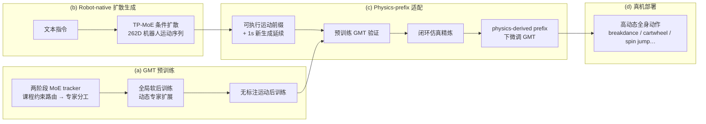

# PhyGile（Physics-Prefix Guided Motion Generation for Agile General Humanoid Motion Tracking）

**PhyGile** 是西北工业大学、上海 AI Lab、中科大、清华、复旦、字节与东北大学等团队的 **文本驱动人形敏捷全身控制** 工作（arXiv:2603.19305）：在 **262 维机器人骨骼空间** 做 **physics-prefix 引导的 robot-native 扩散生成**，并与 **General Motion Tracking (GMT)** 通才跟踪器形成 **生成–验证–微调–部署** 闭环，避免传统「人体 text-to-motion → 重定向」在真机上的 **物理不可行** 与 **生成–执行鸿沟**。

## 英文缩写速查

| 缩写 | 英文全称 | 简要说明 |
|------|----------|----------|
| GMT | General Motion Tracking | 通用人形全身参考运动跟踪控制器 |
| MoE | Mixture of Experts | 多专家混合，按路由将样本分给不同子网络 |
| TP-MoE | Text-Prefix MoE（论文命名） | 文本条件扩散生成侧的专家混合结构（以项目页图示为准） |
| RL | Reinforcement Learning | 跟踪器训练常用的策略优化范式 |
| WBT | Whole-Body Tracking | 全身参考运动跟踪任务总称 |
| T2M | Text-to-Motion | 文本条件人体/机器人运动生成 |
| PD | Proportional–Derivative | 底层关节阻抗/位置控制，tracker 常输出其 setpoint |
| Sim2Real | Simulation to Real | 仿真精炼与策略上真机的迁移考量 |

## 为什么重要

- **直击 text-to-motion 落地痛点**：人体动捕先验经重定向后常只剩 **运动学合理**，却在扭矩、接触与质量分布上 **物理不可行**；PhyGile 把生成空间改到 **机器人原生 262D**，并用 **physics-derived prefix** 约束推理。
- **生成与执行不再割裂**：不是「先生成再 hope retarget」，而是 **预训练 GMT 验证生成延续**、**闭环仿真精炼**、再 **physics-prefix 阶段微调 GMT**——与 [Heracles](../entities/paper-heracles-humanoid-diffusion.md) 的 middleware 思路不同，这里是 **统一框架内的生成–跟踪共训**。
- **敏捷动作真机证据**：项目页展示 **breakdance spin、前后侧手翻、高踢、180°/360° 空中旋跳** 等，明确对标「仅行走/低动态」的既有 text-driven 人形控制。
- **GMT 作为可复用执行底座**：课程式 **MoE tracker + 无标注后训练 + 动态专家扩展**，为大规模机器人运动与后续 prefix 适配提供 **鲁棒跟踪器**；与 [GMT 计划实体](paper-notebook-gmt.md) 同族但本工作给出 **与生成闭环耦合** 的完整栈。

## 流程总览

## 核心机制（归纳）

### 问题：人体先验 vs 机器人执行

| 路线 | 典型流程 | 主要风险 |
|------|----------|----------|
| **Human T2M + retarget** | 人体数据集训练 → GMR/NMR → tracker | 几何可行但 **动力学/接触不可行** |
| **PhyGile** | 文本 → **262D robot-native** 扩散 + **physics prefix** | 生成与 tracker **同空间、同闭环验证** |

### GMT 跟踪器（执行层）

| 阶段 | 机制 | 目的 |
|------|------|------|
| **MoE 课程路由** | 两阶段 tracker，约束路由诱导专家专精 | 覆盖动作难度谱 |
| **全局软后训练** | 动态扩展专家容量 | 吸收持续困难动作 |
| **无标注后训练** | 大规模机器人运动，无逐帧标签 | 提升跟踪 **鲁棒性与规模** |

### 生成与 physics-prefix 适配（生成层）

| 组件 | 作用 |
|------|------|
| **TP-MoE 扩散策略** | 文本条件生成 **262D** 机器人骨骼运动序列 |
| **Physics-prefix 引导** | 推理时用 **物理可行前缀** 约束续写，减少 retarget 类伪影 |
| **1s 延续拼接** | 可执行前缀 + 新生成短段 → **GMT 可跟踪性检验** |
| **闭环仿真精炼** | 强化 **动态可行性** 与 **生成–可跟踪一致性** |
| **GMT 微调** | 在 physics-derived prefix 目标下更新 tracker，服务真机敏捷动作 |

### 与相关路线的对照

| 工作 | 生成空间 | 执行层 | 文本入口 | PhyGile 差异 |
|------|----------|--------|----------|--------------|
| [Harmon](paper-notebook-harmon.md)（计划） | 人形机器人（语言→全身） | 待深读 | ✓ | PhyGile 强调 **physics prefix + GMT 闭环** 与 **262D native** |
| [Humanoid-GPT](paper-humanoid-gpt.md) | 重定向参考跟踪 | 规模化 Transformer tracker | ✗（跟踪为主） | PhyGile 主贡献在 **T2M 生成–GMT 共闭环**，非纯 tracker scaling |
| [Heracles](../entities/paper-heracles-humanoid-diffusion.md) | 状态条件 flow 中间件 | 通用 tracker | ✗ | Heracles **改参考缓冲**；PhyGile **从头生成 robot-native 轨迹** |
| 人体 T2M + GMR | 人体/SMPL | 任意 tracker | ✓ | PhyGile 避免 **推理期人体→机 retarget** |

## 实验与评测

- **平台**：离线实验 + **真机人形**（项目页视频；具体硬件型号与指标以 **PDF** 为准）。
- **定性案例（项目页）**：
  - **生成 → 微调 → 真机** 三段对比：breakdance、cartwheel、high kick、180°/360° spin jump。
  - **更多真机**：crawl、frog jump、monkey、jump、spin kick、hop、punch、kneel、wave 等。
- **论文主张**：相对既有 text-driven 人形控制，将可行动作推进到 **高动态、高难度全身** 区间，而非停留于行走与低动态。
- **量化协议**：完整 benchmark、消融与成功率/跟踪误差表以 **arXiv PDF** 为准；本页为策展索引级摘要。

## 常见误区或局限

- **不是纯人体 T2M 论文**：核心卖点是 **robot-native 262D** 与 **physics prefix**，而非在 AMASS 上刷 FID。
- **GMT 仍需预训练与后训练**：敏捷真机依赖 **成熟 tracker 底座**；prefix 适配是附加阶段，不是零样本单模型端到端。
- **与独立 GMT 论文关系**：本库 [GMT 实体](paper-notebook-gmt.md) 仍为 Paper Notebooks **待深读** 占位；PhyGile 复用 **GMT 命名与跟踪范式**，但是 **生成–跟踪统一框架** 的独立工作。
- **开源状态**：截至 2026-06-19 项目页 **未列公开代码仓库**；复现需关注后续 release 与 PDF 实现细节。
- **文本→敏捷动作的泛化边界**：演示集中在 **高动态技能类** 指令；日常 loco-manipulation 与复杂场景交互未在首页强调。

## 与其他页面的关系

- [扩散运动生成](../methods/diffusion-motion-generation.md) — PhyGile 属 **控制环内 robot-native 扩散 + tracker** 家族
- [人形运动跟踪方法选型](../queries/humanoid-motion-tracking-method-selection.md) — 文本驱动场景下的 **生成–GMT 闭环** 分支
- [Motion Retargeting（GMR）](../methods/motion-retargeting-gmr.md) — 对比「为何跳过推理期人体重定向」
- [Whole-Body Tracking Pipeline](../concepts/whole-body-tracking-pipeline.md) — retarget→tracker 经典管线上下文
- [Humanoid-GPT](paper-humanoid-gpt.md) — 同任务 **规模化 tracker** 前沿；正交互补（跟踪 vs 生成闭环）
- [GMT（计划实体）](paper-notebook-gmt.md) — 跟踪器命名与任务族交叉索引

## 推荐继续阅读

- 论文：<https://arxiv.org/abs/2603.19305>
- 项目页：<https://baojch.github.io/phygile-page/>
- 人体 text-to-motion 综述入口：[Awesome Text-to-Motion](../entities/awesome-text-to-motion-zilize.md)
- 对照：[Humanoid-GPT 项目页](https://qizekun.github.io/Humanoid-GPT/)（规模化 tracker）

## 参考来源

- [phygile_arxiv_2603_19305.md](../../sources/papers/phygile_arxiv_2603_19305.md) — arXiv 与项目页策展摘录
- [phygile-page.md](../../sources/sites/phygile-page.md) — 官方项目页方法图与真机视频索引

## 关联页面

- [扩散运动生成](../methods/diffusion-motion-generation.md)
- [Diffusion Policy](../methods/diffusion-policy.md)
- [人形运动跟踪方法选型](../queries/humanoid-motion-tracking-method-selection.md)
- [GMT（计划实体）](paper-notebook-gmt.md)
- [Harmon（计划实体）](paper-notebook-harmon.md)
- [Humanoid-GPT](paper-humanoid-gpt.md)
- [Whole-Body Control](../concepts/whole-body-control.md)
