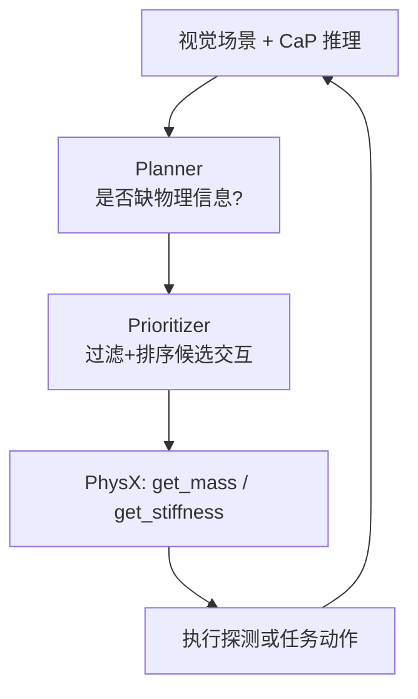

# PhysCaP：物理信息探索的 Code-as-Policy

**PhysCaP: Grounding Code-as-Policy Agent with Physics-Informed Exploration**（[arXiv:2608.21031](https://arxiv.org/abs/2608.21031)，[项目页](https://physcap.github.io/)）由 **台湾大学（NTU Taiwan）**、**英伟达研究院（NVIDIA Research）**、**谷歌 DeepMind**、**阳明交大（NYCU）** 等提出：在 **Code-as-Policy（CaP）** 代理上叠加 **免训练 PhysX 模块**，用 **本体感觉** 主动估计隐藏 **质量与刚度**，并以 **Planner + Prioritizer** 双代理平衡探索成本与信息收益。

## 一句话定义

**主动感知的核心不是多做动作，而是选择信息增益更高的物理交互——PhysCaP 把这一点写进可解释的 CaP 探索环。**

## 英文缩写速查

| 缩写 | 英文全称 | 简要说明 |
|------|----------|----------|
| CaP | Code-as-Policy | 用可执行代码模块组合感知/推理/控制 |
| PhysX | Physics property extraction modules | 本文质量/刚度估计模块（非 NVIDIA PhysX 引擎） |
| VLA | Vision-Language-Action | 被动观察模仿策略对照基线 |
| OI | Object Interactions | 成功试验平均探索性物体交互次数 |
| LIBERO | LIBERO benchmark | 仿真空罐推理任务评测环境 |

## 为什么重要

- **隐藏物理状态：** 空罐、成熟度、杯下藏物等任务无法仅靠 RGB 解决。
- **相对 VLA：** OpenVLA、π₀.₅、MolmoAct-2 等在隐藏属性任务上失败或需过量交互。
- **相对朴素 CaP+PhysX：** 无 Planner/Prioritizer 时 over-explore，时间与交互次数飙升。
- **无额外传感：** 质量/刚度来自关节力矩与夹爪位移，降低硬件门槛。

## 核心信息

| 项 | 内容 |
|----|------|
| **机构** | 台湾大学；英伟达研究院；谷歌 DeepMind；阳明交大 |
| **平台** | AgileX PiPER 7-DoF 真机 + LIBERO 仿真 |
| **开源** | **未开源** — 项目页截至入库日无 GitHub 链 |

### 流程总览

## 工程实践

| 项 | 建议 |
|----|------|
| **任务分型** | 先判断失败来自「看不见」还是「摸不着」——后者适合 PhysCaP 类探索 |
| **探索预算** | 用 OI 与 wall-clock 双指标，避免只看成功率 |
| **模块替换** | PhysX 为 training-free 插件，可嵌入现有 CaP 栈 |
| **与 ViTacPhys 对照** | [ViTacPhys](./paper-vitacphys.md) 用视触觉示范 **离线** 学属性；PhysCaP 用 **在线** 本体感觉探测 |

## 局限与风险

- 质量/刚度估计依赖特定交互协议（抬升轨迹、夹持扰动），泛化到复杂接触动力学待验证。
- 无官方代码，复现依赖论文与项目页描述。
- VLM 优先级启发式可能引入语义偏见。

## 评测

| 任务 | PhysCaP SR | 典型 OI | 时间 (s) |
|------|------------|---------|----------|
| Find Blue Cube | 9/10 | 1.33 | 40.48 ± 15 |
| Identify Empty Can | 8/10 | 2.5 | 239.0 ± 27 |
| Pick Ripe Avocado | 9/10 | 2.0 | 300.47 ± 53 |

- 相对 CaP 基线：隐藏属性任务从 **1–2/10** 提升到 **8–9/10**，且交互更少。

## 结论

**当物理属性是隐藏状态变量时，CaP 需要显式探索层，而不是更大的 VLA。**

- PhysX 模块免训练、仅依赖本体感觉
- Planner 决定探索启停，Prioritizer 抑制 over-explore
- 真机三任务 SR 8–9/10，OI 约 1.3–2.5
- 被动 VLA 与朴素 CaP+PhysX 在隐藏状态任务上明显不足
- 官方代码未发布，工程落地需自研或等待开源

## 源码运行时序图

| 项 | 说明 |
|----|------|
| **源码运行时序图** | **不适用**（截至 **2026-08-25** 无官方可运行仓库） |

## 与其他页面的关系

- [VLA](../methods/vla.md)
- [manipulation](../tasks/manipulation.md)
- [paper-vitacphys](./paper-vitacphys.md)
- [open-source-8-papers-technology-map](../overview/open-source-8-papers-technology-map.md)
- [机器人视觉感知栈选型闭环](../queries/robot-perception-stack-selection-loop.md) — 该链把「看得见」的检测/分割/语义建图串成选型链；PhysCaP 补的是链尾之外的一段：视觉看不见的质量/刚度需靠本体感觉主动探测

## 参考来源

- [physcap_arxiv_2608_21031](../../sources/papers/physcap_arxiv_2608_21031.md)
- [physcap-github-io](../../sources/sites/physcap-github-io.md)
- [wechat_embodied_station_8_papers_open_source_2026-08-25](../../sources/blogs/wechat_embodied_station_8_papers_open_source_2026-08-25.md)

## 推荐继续阅读

- [arXiv:2608.21031](https://arxiv.org/abs/2608.21031)
- [PhysCaP 项目页](https://physcap.github.io/)
