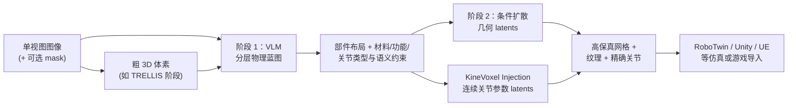

# PhysForge（Physics-Grounded 3D Assets for Interactive Virtual Worlds）

**PhysForge** 是 HKU MMLab 与腾讯混元等合作者的论文工作（arXiv:2605.05163，项目页 [PhysForge](https://hku-mmlab.github.io/PhysForge/)）：把 **单视图（+ 可选 2D mask）** 条件下的 **部件化、可仿真交互 3D 资产** 生成表述为 **「物理规划」与「物理实现」解耦** 的两阶段管线——先由 **VLM** 产出 **分层物理蓝图（Hierarchical Physical Blueprint）**，再由 **物理接地扩散模型** 在 **KineVoxel Injection（KVI）** 中与几何 **联合去噪**，显式合成 **关节原点、轴向与限位** 等连续运动学量，以缓解「仅有静态外壳网格」在 **具身仿真与交互世界** 中的部署缺口。

## 一句话定义

**用世界知识做部件级物理规划，用扩散做几何—运动学协同落地，使生成资产在仿真里具备可操作的关节与物理语义，而不是只能看的壳。**

## 英文缩写速查

| 缩写 | 英文全称 | 简要说明 |
|------|----------|----------|
| Sim2Real | Simulation to Real | 把仿真中学到的策略迁移落地真机的工程主线 |
| VLM | Vision-Language Model | 视觉-语言多模态理解模型，VLA 的上游 |
| SDK | Software Development Kit | 软件开发工具包 |
| Manipulation | Robot Manipulation | 抓取、移动、操作物体的任务总称 |

## 为什么重要

- **数据引擎视角：** 交互式虚拟世界与机器人操作仿真都受限于 **高质量、可关节、带物理字段** 的资产供给；论文将问题从「好看」推进到 **功能 plausible + simulation-ready**。
- **分工明确：** **VLM** 擅长 **结构/语义/离散物理属性** 与 **部件分解消歧**；**扩散头** 负责 **连续关节参数** 的精细回归；**KVI** 给出二者在同一去噪框架内的 **耦合接口**。
- **可对照工程路线：** 与 **程序化 agent + SDK** 生成（如 [Articraft](./articraft.md)）、**VLM + RLE 体素统一三类物理对象**（如 [PhysX-Omni](./physx-omni.md)）形成 **学习式端到端** vs **符号程序 + 验证闭环** vs **PhysX 系 sim-ready 统一生成** 的对照谱系。

## 核心结构

| 模块 | 作用 |
|------|------|
| **PhysDB** | 约 **150k** 对象；**四档**标注：**整体**（尺度、场景）、**静态**（语义、材料、质量）、**功能**（内在功能、状态机）、**交互**（affordance、关节类型与运动学定义）；Objaverse 来源 + 人机协同标注；关节数值真值训练辅以 **PartNet-Mobility**、**Infinite-Mobility**（论文 §3.1）。 |
| **阶段 1：VLM 蓝图** | 基于 **Qwen2.5-VL** 微调；输入图像、可选 mask、**TRELLIS** 风格粗体素；**PartField** 编码 + 3D 卷积下采样体素嵌入；自回归输出部件 **AABB**（离散坐标 token）及每部件物理字段；论文强调 **共预测物理属性可减轻部件粒度歧义**（可无 mask 规划）。 |
| **阶段 2：KVI 扩散** | 在 **OmniPart** 二阶段之上扩展：每部件 **8 维**关节参数向量经缩放后入 **\(E_{\text{kine}}\)** 得 **KineVoxel** latent，与几何 voxel latents 拼接进 **middle transformer**；**关节类型嵌入** 来自蓝图；**CFM** 复合损失 \( \mathcal{L}_{\text{geo}} + \lambda_{\text{kine}} \mathcal{L}_{\text{kine}} \)，\(\lambda_{\text{kine}}=10\)。 |

### 流程总览

## 常见误区或局限

- **误区：** 把 **PhysDB 规模**直接等同于 **任意类别上关节数值标注都已精确到可用真值**；论文明确大规模下 **精确 3D 轴** 标注困难，需 **PartNet-Mobility 等**补运动学监督。
- **局限：** 管线依赖 **VLM 微调、多数据源与扩散训练栈**，复现与算力门槛高；与 **纯程序化资产生成**相比，**可解释编辑**（逐字段人工改蓝图）的工具体验需结合官方代码评估（以仓库为准）。

## 关联页面

- [Articraft](./articraft.md) — **Agent + SDK** 式可关节资产生成对照。
- [PhysX-Omni](./physx-omni.md) — **Qwen2.5-VL + 模板 RLE + TRELLIS**，统一刚体/可变形/关节体 sim-ready 生成与 PhysXVerse / PhysX-Bench。
- [RoboTwin 2.0](./robotwin.md) — 论文展示 **双臂操作仿真** 下游语境之一。
- [SAPIEN（仿真引擎）](./sapien.md) — 关节体交互仿真栈语境。
- [Sim2Real](../concepts/sim2real.md) — 资产 **动力学/碰撞/关节** 与仿真器一致性总提醒。
- [Manipulation（任务总览）](../tasks/manipulation.md) — 操作学习对 **可交互场景资产** 的需求背景。

## 方法栈

见上文 **核心结构** 与 **流程总览**（`###` 小节）；完整机制与模块分工以原文为准。

## 实验与评测

- 量化指标、消融与 sim2real / 实机结果见 **原文 PDF** 与 [参考来源](#参考来源)；本页正文侧重方法结构与知识库交叉引用。

## 与其他工作对比

- 正文已给出与相邻路线 / baseline 的 **定性对照**；定量表格与 ablation 见原文（[参考来源](#参考来源)）。

## 参考来源

- [PhysForge 论文摘录（arXiv:2605.05163）](../../sources/papers/physforge_arxiv_2605_05163.md)

## 推荐继续阅读

- 论文 PDF：<https://arxiv.org/pdf/2605.05163>
- 项目主页：<https://hku-mmlab.github.io/PhysForge/>
