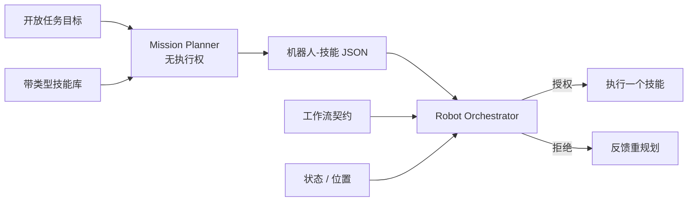
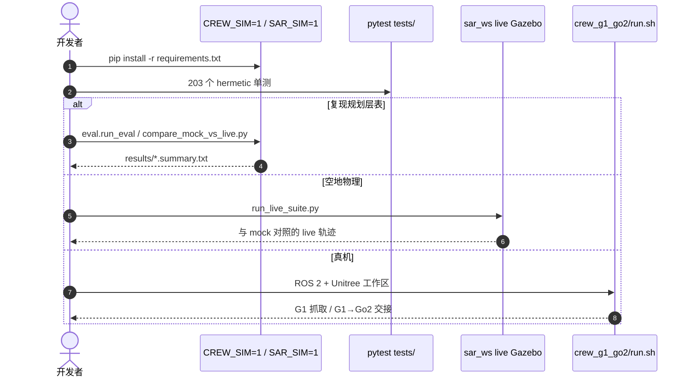

# Physical Agentic AI：可验证的多机器人编排

**Physical Agentic AI**（*An Architecture for Orchestrating a Robot Crew with LLMs*，[arXiv:2608.22657](https://arxiv.org/abs/2608.22657)，[代码](https://github.com/Liuuuxy/physical-agentic-ai)）由 **亚利桑那州立大学（Arizona State University）** 提出：机器人暴露带类型的技能库，无执行权的 Mission Planner 分解任务并分配机器人–技能对，再由确定性 Robot Orchestrator 按状态、位置和工作流契约逐项授权。

## 一句话定义

**LLM 可以提出计划，但物理系统的最终执行权必须可验证——检索改善技能落地，门控才把错误派发降到零。**

## 英文缩写速查

| 缩写 | 英文全称 | 简要说明 |
|------|----------|----------|
| LLM | Large Language Model | 无执行权的 Mission Planner |
| RO | Robot Orchestrator | 唯一执行权、逐项验证 |
| UGV | Unmanned Ground Vehicle | 空地任务中的地面车 |
| SITL | Software-in-the-Loop | PX4 + Gazebo 仿真层 |
| ROS | Robot Operating System | 真机与仿真通信 |

## 为什么重要

- **接地与安全可分离：** 检索把技能落地从 51% 抬到 96%，知情规划器仍派发 23–29% 故障步。
- **契约不漂移：** 同一份 `contract_spec` 既渲染 prompt 又驱动门控。
- **分层可读：** mock / live-Gazebo / hardware 三层；读任何数字先看它属于哪一层。

## 核心信息

| 项 | 内容 |
|----|------|
| **机构** | 亚利桑那州立大学（Arizona State University） |
| **平台** | PX4 Iris + TurtleBot3（Gazebo）；Unitree G1 + Go2（真机） |
| **开源** | **已开源** MIT：[Liuuuxy/physical-agentic-ai](https://github.com/Liuuuxy/physical-agentic-ai) |

## 核心原理（方法）

四条设计原则：推理与执行分离；技能接地规划；契约中介协调；执行时验证。Planner 只出结构化 JSON，从不发底层指令。Orchestrator 一次授权一个技能，失败可触发一次反馈重规划。

四条件评测只改一项：`llm-only` / `skill-list` / `rao-prompt`（契约进 prompt）/ `rao`（再开门控）。

### 流程总览

## 源码运行时序图

节点对齐 [`sources/repos/physical-agentic-ai.md`](../../sources/repos/physical-agentic-ai.md)。

- **最短复现：** `CREW_SIM=1 python3 -m pytest tests/ -q`，不需要 API key、ROS 或机器人。
- **读表：** `crew_g1_go2/results/` 四条件对比是 **mock 规划层**，不是物理成功率。

## 工程实践

| 项 | 建议 |
|----|------|
| 部署读法 | 把 LLM 当提案器，执行权留在编排器 |
| 安全模式 | 无 G1 时用 `go2_only.sh`，避免误发 `/user_lowcmd` |
| 指标分层 | 先看目录 README 的 tier 标签再引用数字 |
| 对照 | `rao-prompt` vs `rao` 才能把「写进提示」和「执行门控」拆开 |

## 实验与评测

| 设定 | 结果 |
|------|------|
| 检索后技能落地 | **51% → 96%** |
| 知情规划器故障派发 | 仍 **23–29%** |
| 逐项 enforcement | 错误派发 **0%**，无误拦 |
| 注入 8 故障 | 无门控：8/8 越界、6 个产生运动；有门控：8/8 运动前拒绝 |
| 真机 | G1 抓取 + G1→Go2 交接（硬件等价接口 + 两次物理试验） |

## 结论

**多机器人 Agent 的关键不是让 LLM 更懂技能名，而是把最终执行权做成可验证门控。**

1. **接地指标会骗人** — 96% 落地仍可能派发两成故障步。
2. **契约必须同一份 spec** — prompt 与 gate 分叉就会漂移。
3. **held-plan 消融先于新规划器** — 证明是门控负责，不是计划变好。
4. **mock 不是仿真** — `CREW_SIM=1` 只打桩；唯一物理仿真是 SAR Gazebo。
5. **真机视频 ≠ 四条件表** — 表在 mock，视频在 hardware。

## 与其他工作对比

| 对照 | 差异读法 |
|------|----------|
| [Meta-Ctrl](./paper-meta-ctrl.md) | 保证单机计划语法/语义；本页保证多机技能派发 |
| [ACE-Brain-0.5](./paper-ace-brain-0-5.md) | 统一具身脑；本页是编排壳，不训基础模型 |
| SayCan / 技能列表提示 | 只改善接地，不关门控 |

## 局限与风险

- G1+Go2 无物理仿真器，规划表不能外推成搬运成功率。
- 真机依赖 Unitree 工作区与 ROS 2 Humble，复现成本高于 mock。
- 仓内部分视频为人审匿名打码，不是完整原始记录。

## 关联页面

- [Meta-Ctrl](./paper-meta-ctrl.md) — 计划合法性对照
- [ACE-Brain-0.5](./paper-ace-brain-0-5.md) — Physical Agentic 叙事下的统一脑
- [VLA](../methods/vla.md) — 技能层常见执行器
- [48ms WAM / 编排 10 篇地图](../overview/glancewam-vla-crew-10-papers-technology-map.md)

## 参考来源

- [physical_agentic_ai_arxiv_2608_22657](../../sources/papers/physical_agentic_ai_arxiv_2608_22657.md)
- [physical-agentic-ai 仓库](../../sources/repos/physical-agentic-ai.md)
- [具身智能小站 10 篇盘点](../../sources/blogs/wechat_embodied_station_10_papers_glancewam_vla_crew_2026-08-30.md)

## 推荐继续阅读

- [arXiv:2608.22657](https://arxiv.org/abs/2608.22657)
- [GitHub](https://github.com/Liuuuxy/physical-agentic-ai)
