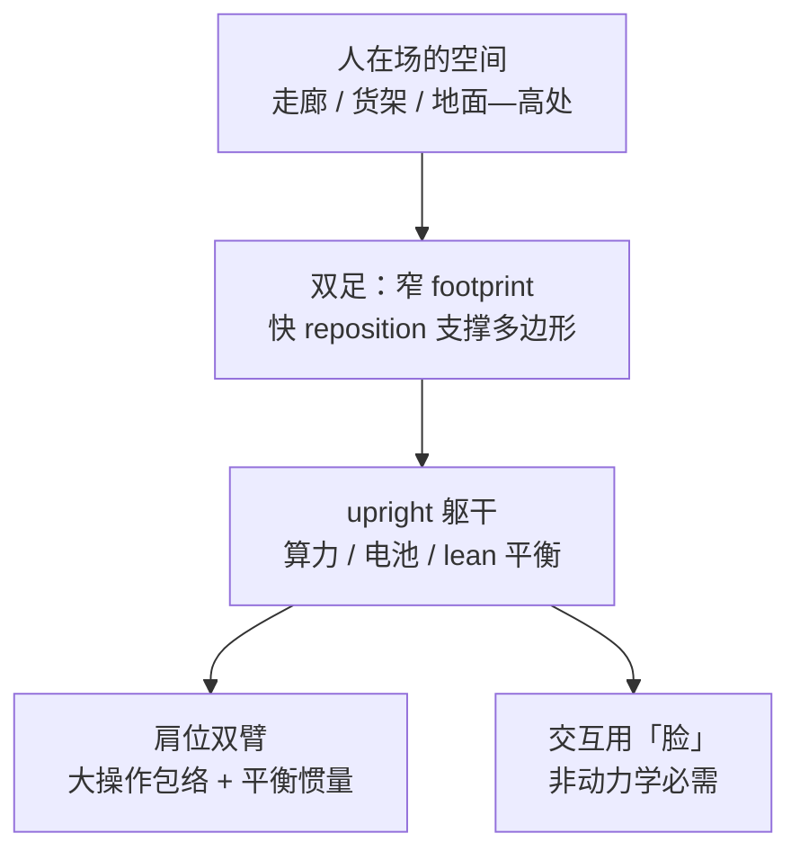
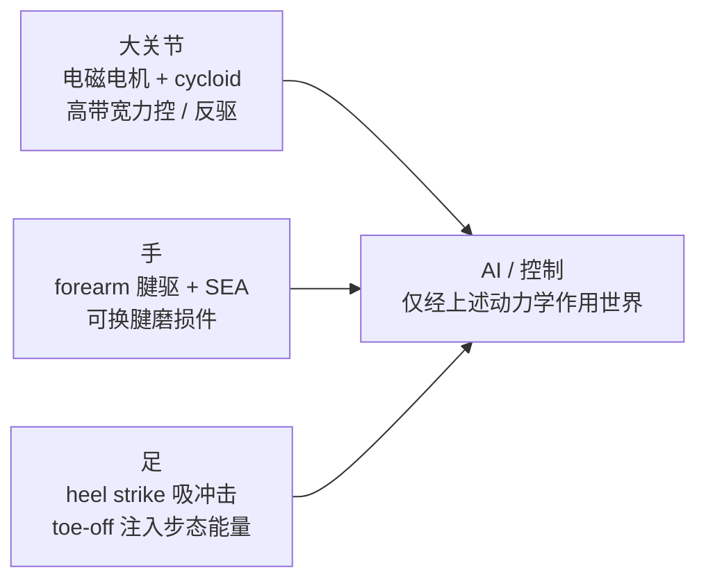

# Physical AI is enabled by mechanical hardware

**Physical AI is enabled by mechanical hardware**（Jonathan W. Hurst；[*Science Robotics* **11**(117)，2026-08-12](https://doi.org/10.1126/scirobotics.aee2921)；[PubMed:42585280](https://pubmed.ncbi.nlm.nih.gov/42585280/)）是一篇 **Perspective**：主张多用途 AI 时代里，**机械动力学** 才是 loco-manipulation 的上限，而非可忽略的「平台」。作者来自 **敏捷机器人（Agility Robotics）** 与 **俄勒冈州立大学（Oregon State University）**；[Agility 作者版全文](https://www.agilityrobotics.com/research-analysis/physical-ai-is-enabled-by-mechanical-hardware) 与 DOI 同源（含利益冲突声明：作者持股 Agility）。

## 一句话定义

**AI 只是困在硬件物理后面的软件 — 人形要「以人为中心」地选对动力学（SEA、cycloid、腱指、功能性足），而不是指望纯软件通才抹平与人类的力交互差距。**

## 英文缩写速查

| 缩写 | 英文全称 | 简要说明 |
|------|----------|----------|
| Physical AI | Physical Artificial Intelligence | 在物理世界中闭环感知–决策–作动的 AI |
| SEA | Series Elastic Actuator | 串联弹性执行器；柔顺、力控与冲击耐受 |
| QDD | Quasi-Direct Drive | 准直驱；高反驱、高带宽力控（文中对比对象） |
| Loco-manipulation | Locomotion + Manipulation | 移动与操作一体的全身任务 |
| HRI | Human-Robot Interaction | 人机交互；文中「脸」等人因要素 |
| Digit | Agility Digit humanoid | 文内商业部署案例（物流人形） |

## 为什么重要

- **纠正产业叙事：** 反对「硬件 soon commodity、人形几乎全由软件定义」；外形可仿人，**惯量、摩擦、柔顺** 决定控制器能否在扰动与接触中表现像人。
- **与算法页互补：** 不替代 VLA / RL 方法论文，而是回答 **「什么执行器栈值得为这些算法买单」** — 与 [Actuator 102 · 柔顺](../overview/humanoid-actuator-102-compliance-sensing.md) 中 Digit/SEA 叙事一致。
- **可操作的硬件预测：** 大关节 **滚动接触 cycloid + 高扭矩密度电磁电机**；手 **forearm 腱驱 + SEA**；足 **heel strike / toe-off** — 可直接对照选型与 sim2real 难度。
- **部署时间线语言：** 从 dull/dirty/dangerous 仓储 → 零售 → 家庭，强调 **安全认证级力控** 与监管，而非只谈参数量。

## 核心信息

| 项 | 内容 |
|----|------|
| **机构** | 敏捷机器人（Agility Robotics）；俄勒冈州立大学（Oregon State University） |
| **类型** | Science Robotics **Perspective**（单作者观点文） |
| **平台案例** | Agility **Digit**（文内称首个商业部署做物理劳动的人形之一） |
| **开放全文** | 出版社 DOI；可读 [Agility 作者版](https://www.agilityrobotics.com/research-analysis/physical-ai-is-enabled-by-mechanical-hardware)（非 redistribution） |
| **开源** | **不适用** — 无论文代码 / 数据；Digit 商业栈未列公开训练仓（截至 2026-09-27） |

## 核心原理

### 软件不能单独补上的鸿沟

工业自动化擅长 **高精度位置轨迹**（机加工、点焊、高速 pick-place）；人类擅长 **任意地形、移动操作、力基交互**。作者强调：即使外观逼真，**不同的关节摩擦、惯量与 compliance** 也会在阶跃、触地等扰动下暴露与人类的动力学差异 — 控制与 AI **只能** 通过这条硬件通道施力于世界。

### 人形形态：第一性原理 vs 仿生过度

- **不必** 像素级仿人：早期飞行器仿鸟扑翼的类比 — loco-manipulation 物理未完全理解前，**五指手与人等尺寸** 可能是过度仿生。
- **应当** 保留双足、 upright、双臂等人因 **功能** 要素。

### 作者预测的硬件栈（摘要）

| 子系统 | 主张 | 工程读法 |
|--------|------|----------|
| **电机** | 电磁为主；轴向/横向磁通等提 **扭矩密度** | 与 YASA 类轴向磁通汽车电机类比；聚合物肌肉等仍远 |
| **大关节传动** | **滚动接触 cycloid** | 低摩擦、耐重复冲击、紧凑、易与电机模块化 |
| **手** | **腱驱 + SEA**；电机在 forearm | 高减速 → 非直接反驱，但需 **力控 + 冲击耐受**；腱像 **鞋底** 一样可换 |
| **足** | **heel strike + toe-off** | 直膝 gait 省支撑能；结构需专门吸收触地，非金属平板 |

聚合物肌肉、纯液压/气动被点名 **能效或人形适用性** 存疑。

## 源码运行时序图

**不适用** — Perspective 无官方可运行训练 / 部署代码；Digit 产品栈不在本文开源范围（截至 2026-09-27）。

## 工程实践

| 项 | 建议 |
|----|------|
| **选型先问动力学** | 对比人形时除 DoF / 载荷，查 **SEA vs 刚性谐波**、cycloid **反驱与冲击**、手指 **力控带宽** |
| **sim2real 预期** | SEA / 腱驱 **弹簧、摩擦、磨损** 抬高建模成本 — 与 [Digit RL 行走](./paper-digit-humanoid-locomotion-rl.md) 的厂商仿真闸口对照 |
| **叙事防坑** | 勿把「通才 VLA」误读为可跳过执行器；可与 [Physical AI 通信 testbed](./paper-goal-oriented-comms-physical-ai.md) 的 **系统栈** 一起读 |
| **利益冲突** | 作者持股 Agility；硬件主张应与其他厂商 / 学术硬件论文交叉验证 |
| **全文获取** | 优先 DOI；无 arXiv — 可用 Agility 作者版辅助阅读 |

## 实验与评测

- **本文无定量实验表** — 属观点与产业预测；引文为经典 SEA、cycloid、足动力学与人–机物理交互 atlas 等。
- **读法：** 将主张当作 **硬件路线图假设**，用后续系统论文与 Digit 类部署案例检验，而非当作已证实的统一 benchmark。

## 与其他工作对比

- **[腿式机器人五柱综述](./paper-legged-robots-advances-challenges.md)** — 同刊、同领域但 **Review**：五柱盘点 + 政策伦理；本文 **单一作者、硬件第一性** 更强。
- **[Goal-Oriented Comms for Physical AI](./paper-goal-oriented-comms-physical-ai.md)** — 通信 / 边缘栈；本文 **机内执行器与机构**。
- **[Digit RL 行走](./paper-digit-humanoid-locomotion-rl.md)** — 算法 + sim2real 实例；本文解释 **为何 Digit 路线偏 SEA / 柔顺**。

## 结论

**Physical AI 的「智能」必须穿过真实的惯量、摩擦与接触力学；把人形硬件当 commodity 会低估 loco-manipulation 十年量级的机构赌注。**

1. **动力学 > 外形** — 像人的轮廓不能保证像人的扰动响应；AI 不能绕过 SEA/cycloid/腱指等物理选择。
2. **cycloid + 高扭矩电机 + 腱驱 SEA 手 + 功能性足** — 可作为对照竞品人形的 ** checklist**，而非唯一真理。
3. **部署节奏** — 仓储 dull 任务先行；零售与家庭取决于 **安全力控 + 监管 + 成本**，不是单点模型发布。
4. **无复现栈** — 读本文做 **战略与硬件 spec**，勿期待官方代码。
5. **交叉验证** — 结合同刊综述、学术 QDD/SEA 原型与 [商业平台速览](../overview/notable-commercial-robot-platforms.md) 避免单一厂商视角。

## 关联页面

- [Actuator 102 · 柔顺与感知](../overview/humanoid-actuator-102-compliance-sensing.md)
- [Actuator 102 · 决策物种](../overview/humanoid-actuator-102-decision-species.md)
- [Digit 人形 RL 行走](./paper-digit-humanoid-locomotion-rl.md)
- [Agility Robotics（策展节点）](./painode-041-agilityrobotics.md)

## 推荐继续阅读

- 正式版：[DOI 10.1126/scirobotics.aee2921](https://doi.org/10.1126/scirobotics.aee2921)
- 作者版：[Agility — Physical AI Is Enabled By Mechanical Hardware](https://www.agilityrobotics.com/research-analysis/physical-ai-is-enabled-by-mechanical-hardware)

## 参考来源

- [Physical AI is enabled by mechanical hardware（sources/papers）](../../sources/papers/physical_ai_mechanical_hardware_scirobotics_aee2921_2026.md)
- [Agility 作者版网页（sources/sites）](../../sources/sites/agility_physical_ai_mechanical_hardware.md)
