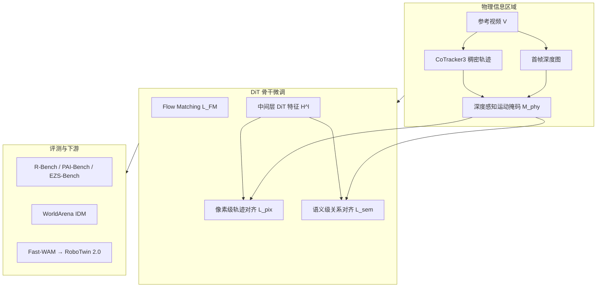

# PhysisForcing（Physics Reinforced World Simulator）

**PhysisForcing**（*PhysisForcing: Physics Reinforced World Simulator for Robotic Manipulation*，arXiv:2606.28128，[项目页](https://dagroup-pku.github.io/PhysisForcing.github.io/)）由 **北京大学** 与 **NVIDIA** 提出：在 **DiT 视频生成骨干微调阶段** 注入 **分层、区域聚焦的物理监督**，缓解操纵视频中 **轨迹断裂、穿透、抓取漂移** 等违例，使生成结果更适合作 **具身世界模拟器** 与 **下游 WAM / 策略学习** 表征。

## 一句话定义

**用深度感知运动掩码锁定操纵/接触区域，在 DiT 中间层同时做像素级点轨迹对齐与语义级 token 关系对齐——训练期强化物理一致性，推理不增算力。**

## 英文缩写速查

| 缩写 | 英文全称 | 简要说明 |
|------|----------|----------|
| DiT | Diffusion Transformer | 视频扩散骨干；物理损失作用于其中间层特征 |
| FM | Flow Matching | 标准视频生成主损失 $\mathcal{L}_{\mathrm{FM}}$ |
| I2V | Image-to-Video | 图像条件视频生成；Wan2.2-I2V-A14B 骨干设定 |
| WAM | World Action Model | 联合世界预测与动作；本文作 Fast-WAM 视频骨干评测 |
| IDM | Inverse Dynamics Model | WorldArena action-planner 协议中的逆动力学闭环 |
| WM | World Model | 学习环境/观测演化的前向模型；本文侧重物理对齐视频 WM |

## 为什么重要

- **对准生成式 WM 的核心短板：** [Generative World Models](../methods/generative-world-models.md) 长期受 **物理幻觉** 制约；PhysisForcing 把「物理合理」形式化为 **可微、可局部化、可分层** 的训练目标，而非仅靠后验 preference 或全帧几何约束。
- **与 preference / 几何单点路线的分界：** 相对 DPO/GRPO 类 **稀疏后验对齐**，本文在 **训练期** 直接正则化 DiT 表征；相对纯 depth/tracking 几何方法，额外对齐 **语义级区域关系**（抓–物耦合、推–物联动）。
- **跨家族骨干可插拔：** 在 **Wan2.2** 与 **Cosmos3-Nano** 上均报告增益，说明框架不绑定单一视频栈；**PF-Cosmos** 在 **R-Bench** 达 **63.8** 整体最佳（项目页口径）。
- **下游闭环证据：** **WorldArena IDM** 成功率 **16.0%→24.0%**；作 **Fast-WAM** 骨干时 **RoboTwin 2.0** 平均 **+4.6%**——物理对齐不只改善开环视频指标，也强化 **可执行表征**。

## 核心结构与方法

| 模块 | 作用 |
|------|------|
| **物理信息区域 $\mathbf{M}^{\mathrm{phy}}$** | CoTracker3 轨迹幅度 × 首帧深度前景权重 → 自适应阈值时空掩码 |
| **$\mathcal{L}^{\mathrm{phy}}_{\mathrm{pix}}$** | DiT 中间层特征 → MLP → query/key 相似度期望坐标；掩码 MSE 对齐参考点轨迹 |
| **$\mathcal{L}^{\mathrm{phy}}_{\mathrm{sem}}$** | 掩码 token 上对齐 DiT 与冻结视频理解编码器的 **相似度矩阵** |
| **$\mathcal{L}_{\mathrm{FM}}$** | 标准 flow matching 主损失；$\lambda_{\mathrm{pix}},\lambda_{\mathrm{sem}}$ 平衡物理项 |
| **推理** | 辅助 tracker / encoder **全部丢弃** → **零额外推理开销** |

### 流程总览

### 训练设定（索引）

| 项 | 口径 |
|----|------|
| **数据** | RoVid-X 过滤子集约 **500K** clips |
| **骨干** | Wan2.2-I2V-A14B、Wan2.2-TI2V-5B、Cosmos3-Nano（LoRA，720p，最长 189 帧） |
| **变体命名** | PF-Wan14B、PF-Wan5B（WorldArena）、PF-Cosmos |
| **机构** | 北京大学（PKU）· NVIDIA |

## 实验要点（索引级）

| 轴 | 报告口径（以论文 / 项目页为准） |
|----|--------------------------------|
| **R-Bench Avg** | PF-Wan14B **62.0**（+7.1% vs vanilla ft）；PF-Cosmos **63.8**（最佳） |
| **PAI-Bench Domain** | PF-Cosmos **93.26**；PF-Wan14B **88.20** |
| **EZS-Bench Domain** | PF-Cosmos **85.20**；零样本泛化基准 |
| **WorldArena IDM** | PF-Wan5B **24.0%** avg（基线 **16.0%**；+50% 相对增益） |
| **RoboTwin 2.0 + Fast-WAM** | 平均成功率 **72.8%**（+4.6%） |

| 机构 | 北京大学（PKU）· 英伟达（NVIDIA） |
|------|----------------------------------|
| arXiv | [2606.28128](https://arxiv.org/abs/2606.28128) |
| 项目页 | [dagroup-pku.github.io/PhysisForcing](https://dagroup-pku.github.io/PhysisForcing.github.io/) |

## 常见误区或局限

- **误区：** 把 PhysisForcing 当成新推理期物理引擎；它是 **纯训练期正则**，不改变扩散采样图。
- **误区：** 认为开环 R-Bench 领先即等于闭环真机可靠；仍需 **WorldArena / RoboTwin** 等策略向指标交叉验证。
- **局限：** 依赖 **参考视频** 上的 CoTracker3 与深度估计质量；对极端遮挡或高速运动，区域掩码可能漏标或误标。
- **局限：** 论文讨论 **形变物体** 与 **多体长程推理** 仍为未来方向（§Limitations）。

## 与其他工作对比

| 维度 | 几何/跟踪约束（如 RoboScape） | Preference 对齐（如 DPO/GRPO 类） | PhysisForcing |
|------|------------------------------|-----------------------------------|---------------|
| **监督层级** | 偏像素/几何局部 | 稀疏全局偏好 | **像素 + 语义双层** |
| **空间聚焦** | 常全帧或手工 ROI | 弱局部 | **深度感知自动掩码** |
| **训练阶段** | 训练期 | 多为后训练 | **训练期联合 FM** |
| **推理开销** | 视方法而定 | 无额外 | **零额外** |

与 [Cosmos 3](./cosmos-3.md) 的关系：**Cosmos3-Nano** 是平台级全模态 WM；PhysisForcing 是 **可叠加的后训练物理对齐配方**（PF-Cosmos）。与 [Kairos](./paper-kairos-native-world-model-stack.md) 的 **原生 CEDC 课程** 正交：后者从数据课程注入物理，PhysisForcing 从 **损失结构** 注入。

## 关联页面

- [Generative World Models](../methods/generative-world-models.md) — 生成式 WM 总览与物理一致性挑战
- [Video-as-Simulation](../concepts/video-as-simulation.md) — 视频作为操纵闭环模拟器
- [World Action Models](../concepts/world-action-models.md) — 视频骨干对 WAM / IDM 表征的影响
- [Cosmos 3](./cosmos-3.md) — PF-Cosmos 骨干对照
- [manipulation 任务页](../tasks/manipulation.md) — 接触丰富操纵学习路线
- [robot-world-models-training-loop-taxonomy](../overview/robot-world-models-training-loop-taxonomy.md) — 开环生成 vs 闭环策略评测分工

## 参考来源

- [PhysisForcing（arXiv:2606.28128）](../../sources/papers/physisforcing_arxiv_2606_28128.md)
- [项目页](https://dagroup-pku.github.io/PhysisForcing.github.io/)

## 推荐继续阅读

- [arXiv:2606.28128](https://arxiv.org/abs/2606.28128) — 完整方法、消融与局限讨论
- [Cosmos 3 技术报告](https://arxiv.org/abs/2606.02800) — PF-Cosmos 骨干背景
- [World Model for Robot Learning Survey（arXiv:2605.00080）](https://arxiv.org/abs/2605.00080) — 学术 WM 三线 taxonomy
