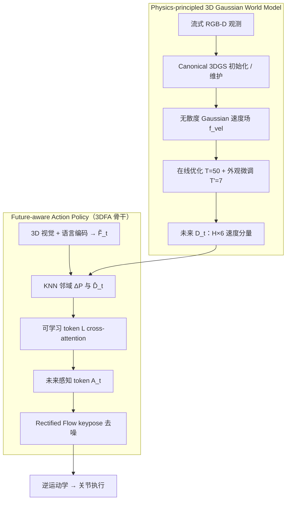

# PhysMani（Physics-principled 3D World Model for Dynamic Manipulation）

**PhysMani**（*Physics-principled 3D World Model for Dynamic Object Manipulation*，arXiv:2607.01938，**ECCV 2026**，[代码](https://github.com/vLAR-group/PhysMani)）由 **香港理工大学 vLAR Group** 与 **Astribot** 提出：在 **非结构化 3D 环境** 中操纵 **快速运动目标** 时，将 **physics-principled 3D Gaussian 世界模型** 与 **future-aware 动作策略** 并行耦合——世界模型 **在线** 学习 **无散度 Gaussian 速度场** 以低延迟预报物理可信的未来动态，策略侧通过 **可学习 token 交叉注意力** 把预报注入 **3D FlowMatch Actor（3DFA）** 决策。

> **发布状态：** 官方仓库当前仅为 **项目 landing page**；训练代码、PhysMani-Bench 数据与权重 **尚未公开**（见 [仓库归档](../../sources/repos/vlar_group_physmani.md)）。

## 一句话定义

**用在线 3D Gaussian 速度场做物理可信的未来场景预报，再用 KNN 邻域 + 可学习 query token 把预报写进 3DFA 流匹配策略，使机械臂在传送带、旋转架等动态目标上比纯 3D IL 或 π₀.₅ 更准、更快。**

## 英文缩写速查

| 缩写 | 英文全称 | 简要说明 |
|------|----------|----------|
| PhysMani | Physics-principled Manipulation | 本文动态操作框架简称 |
| 3DGS | 3D Gaussian Splatting | 用 Gaussian 核表示场景几何与外观 |
| WM | World Model | 学习环境动态以供预测/规划 |
| 3DFA | 3D FlowMatch Actor | Rectified Flow 版 3D Diffuser Actor 策略骨干 |
| 3DDA | 3D Diffuser Actor | DDPM 扩散式 3D 模仿学习策略（3DFA 前身） |
| VLA | Vision-Language-Action | 视觉-语言-动作多模态策略（如 π₀.₅ 基线） |
| KNN | K-Nearest Neighbors | 策略侧检索邻近 Gaussian 以融合速度信息 |
| IL | Imitation Learning | 从专家轨迹学习策略的范式 |
| SR | Success Rate | 任务成功率，主评测指标 |

## 为什么重要

- **填补动态操作空白：** 多数 VLA / 视频 WM 聚焦 **静态或准静态** 任务；PhysMani 针对 **接球、向移动容器投物、向旋转台面放盘** 等须 **预见未来** 的场景，给出 **通用框架** 而非单一任务特化。
- **3D + 物理 + 延迟三角：** 相对 **2D 视频 WM**，显式 **3D Gaussian 几何** 与 **无散度速度场** 提供 **物理有意义** 的轨迹预报；相对 FreeGave 等 **离线 3DGS 物理学习**，**在线优化 + 静态计算图** 实现 **~200 ms/帧** 世界模型更新（论文 **3.0×** 于 FreeGave）。
- **世界模型增益可消融：** 策略骨干与 3DFA **相同训练策略**，唯一差异是 **注入 D_t 未来动态**；仿真 **Mean SR +8.1** 点、真机 **+17.2** 点，且去掉 D_t 后性能回落至 3DFA 量级——说明增益来自 **预报质量** 而非 backbone 换参。
- **Benchmark 贡献：** **PhysMani-Bench**（**16** 任务，RLBench 风格扩展）为 **通用动态操作** 提供可复现评测；移动目标速度可达 Franka 末端上限（~**2 m/s**）。

## 核心结构（方法栈）

| 模块 | 角色 |
|------|------|
| **Canonical 3D Gaussian** | t=0 多相机 RGB-D → 稀疏点云初始化 **G₀**；L1+SSIM 优化几何/外观 |
| **Gaussian velocity module** | MLP **f_vel** 预测六基本速度 **V_t**；经 **B(g_t)** 组合为 **无散度 v(g_t,t)**（延续 FreeGave 理论） |
| **Online optimization（Alg. 1）** | 流式 RGB-D → 速度推进 Gaussian → **T=50** 优化位置/朝向与 f_vel → **T'=7** 冻结速度网微调外观；**~200 ms/轮**（RTX 4090） |
| **3DFA policy backbone** | 当前 RGB-D → 稀疏 **4096** 点云 token + 语言 token；Rectified Flow 预测 **J 步 keypose** |
| **Future dynamics injection** | 每点 **KNN** 邻近 Gaussian → ΔP 与 **D̂_t** MLP 编码 → **可学习 L** query cross-attention → **D̃_t** 加至视觉 token |
| **Execution** | keypose → **逆运动学** → 关节指令；真机 **5 Hz** + action buffer temporal ensemble |

### 流程总览

## PhysMani-Bench（16 任务）

自 **RLBench** 扩展 **8 组任务 × 常速/高速**：

| 任务组 | 动态模式示例 |
|--------|----------------|
| Beat rotating buzz | 沿旋转导线 steer 环，避免碰撞 |
| Insert ring onto rotating peg | 环对准旋转垂直 peg |
| Drop basketball into moving hoop | 球投入移动篮筐 |
| Pick moving cube | 桌上多立方体中抓取移动块 |
| Push moving button | 按压桌上移动按钮 |
| Deposit rubbish into moving bin | 分拣垃圾投入移动 bin |
| Place / remove cup on rotating rack | 旋转架挂杯 / 取杯 |

- **设置：** 4 固定相机；每任务 **160** 轨迹（100/20/40）；**单模型** 跨 16 任务训练。
- **基线：** Act3D、3DDA、3DFA、3DFA-OF（+2D 光流）、ManiGaussian、π₀.₅（LoRA）。

## 评测要点（论文报告）

### 仿真 PhysMani-Bench

| 方法 | Mean SR（16 任务） | 备注 |
|------|-------------------:|------|
| **PhysMani** | **45.9 ± 0.8%** | 最佳均值 |
| 3DFA | 37.8 ± 0.9% | 同骨干无动态注入 |
| 3DFA-OF | 37.5 ± 1.0% | 2D 光流无增益 |
| ManiGaussian | 22.5 ± 0.8% | 辅助动态 GS 预测 |
| π₀.₅ | 8.3 ± 0.2% | 高速变体几乎失效 |

**未来帧预测（Table 2，第 1 帧）：** PhysMani **PSNR 26.90** / traj err **0.008 m** vs FreeGave **19.47** / **0.010 m** vs ManiGaussian **14.32** / **0.388 m**。

### 真机（Astribot S1，4 任务）

| 方法 | Mean SR |
|------|--------:|
| **PhysMani** | **62.5%** |
| 3DFA | 45.3% |

任务：传送带 **pick/place** 玩具、旋转架 **place cube / remove cup**；4× RGB-D **240×320**，**5 Hz** 控制。

### 效率

| 指标 | PhysMani |
|------|----------|
| 训练 | 53 h / 22 GB GPU |
| 推理 | **272.8 ms/keyframe**（WM ~200 ms 并行） |
| 相对 FreeGave | **3.0×** 帧率，更高 PSNR |

## 常见误区或局限

- **误区：** 把 PhysMani 当作 **通用 VLA**——核心是 **3D IL + 3DGS 物理 WM**，语言仅作任务条件，未走大规模 VLM 预训练路线。
- **误区：** 认为 **2D 光流** 可替代 3D 动态——**3DFA-OF** 相对 3DFA **无增益**，仍远低于 PhysMani。
- **局限：** 依赖 **多固定 RGB-D** 与 **脚本专家数据**；WM 在线优化仍占 **~200 ms**，与极高速交互（如乒乓球）仍有差距。
- **局限：** **代码/数据未发布**（2026-07），复现须等待官方 release；Astribot 真机设置与 Franka 仿真存在 **域差**。

## 与相邻路线对比

| 对照 | PhysMani 的差异 |
|------|-----------------|
| **Kairos / 视频 WAM** | 未来在 **像素/视频 token**；PhysMani 在 **3D Gaussian 速度场**，更适合 **精确 3D 轨迹** 与 **物理约束** |
| **ManiGaussian** | 同样用动态 GS，但 PhysMani **无散度速度 + 在线优化**，预报与 SR 显著更优 |
| **π₀.₅ / VLA** | 开放世界静态操作强；**动态 3D 几何 + 物理预报** 不足，Bench 上 SR 极低 |
| **3DFA** | 同骨干；PhysMani 增益 **完全来自未来动态注入**（消融去掉 D_t ≈ 3DFA） |

## 关联页面

- [Manipulation](../tasks/manipulation.md) — 动态目标操作在操作任务谱系中的位置。
- [Generative World Models](../methods/generative-world-models.md) — **3DGS 物理 WM** 与 **2D 视频扩散 WM** 对照。
- [World Action Models](../concepts/world-action-models.md) — 世界预测与动作联合的 broader 语境。
- [Kairos（原生世界模型栈）](./paper-kairos-native-world-model-stack.md) — **Video DiT WAM** 路线对照。
- [MINT](./paper-mint-vla.md) — **3D IL 泛化**（频域动作 tokenization）相邻样本。
- [GS-Playground](./gs-playground.md) — **3DGS + 仿真** 高吞吐视觉 RL，偏训练观测而非在线 WM。

## 参考来源

- [PhysMani 论文摘录（ECCV 2026 / arXiv:2607.01938）](../../sources/papers/physmani_arxiv_2607_01938.md)
- [vLAR-group/PhysMani 仓库归档](../../sources/repos/vlar_group_physmani.md)

## 推荐继续阅读

- 论文 PDF：<https://arxiv.org/pdf/2607.01938v1>
- arXiv 摘要页：<https://arxiv.org/abs/2607.01938>
- 官方仓库：<https://github.com/vLAR-group/PhysMani>
- 相关 3DGS 物理学习：FreeGave（论文 Related Work 基线）
- 策略骨干：3D FlowMatch Actor / 3D Diffuser Actor 原文
