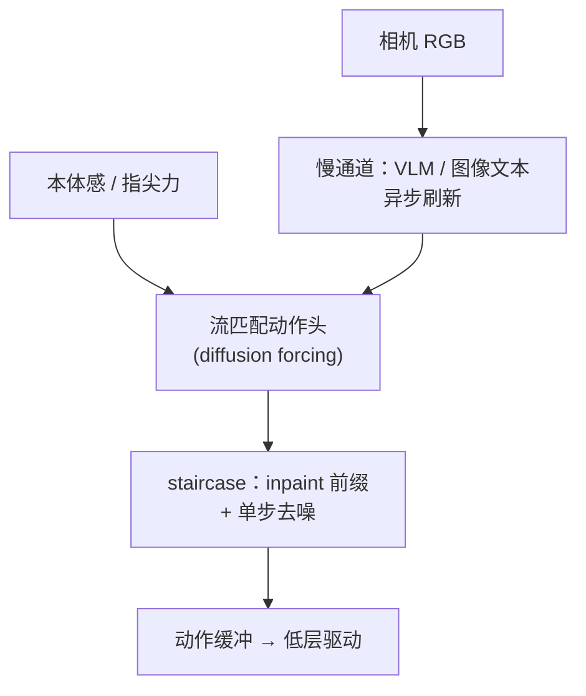
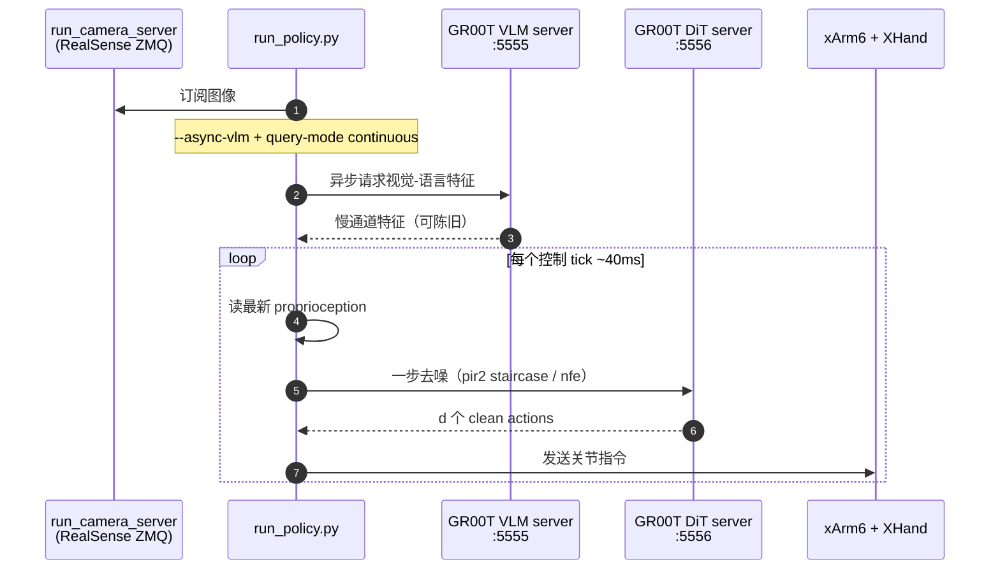

# πR²（Reactive Real-time Flow Policies）

**πR²**（*πR²: Reactive Real-time Flow Policies*，亦作 **PI-R2**，[arXiv:2607.26055](https://arxiv.org/abs/2607.26055)，[项目页](https://pi-r2-flow.github.io/)，[代码](https://github.com/pi-r2-flow/pi-r2-flow)）由 **卡内基梅隆大学（CMU）** Sungjae Park / Shubham Tulsiani 提出：在保留大 backbone、多模态 flow 与多步动作预测的前提下，把开环 action-chunking 策略改成可对 **新鲜本体感** 反应、并对齐 **硬件推理延迟** 的实时闭环流策略。在 **GR00T-N1.7** 上微调后，于 **xArm6 + XHand** 达到约 **25 Hz** 闭环重规划（相对基座约 **4×**），真机成功率相对最强基线最高约 **+30%**。

## 一句话定义

**对已有 action-chunking flow 策略做最小改动的双通道条件化 + 时延自适应阶梯噪声日程，使大 VLA 能在真机上以单步去噪、对齐实测延迟的方式高频闭环重规划。**

## 英文缩写速查

| 缩写 | 英文全称 | 简要说明 |
|------|----------|----------|
| πR² / PI-R2 | Reactive Real-time Flow Policies | 本文方法；反应式实时流策略 |
| VLA | Vision-Language-Action | 视觉–语言–动作通才策略；本文以 GR00T-N1.7 为基座 |
| RTC | Real-Time Chunking / Train-Time RTC | 训练期把 in-flight 动作当 clean inpaint 的基线 |
| NFE | Number of Function Evaluations | 流匹配去噪步数；部署 CLI `--nfe` |
| GR00T | Generalist Robot 00 Technology | NVIDIA 开源人形/操作 VLA 族；本文部署 N1.7 |
| FoM | Flow Matching | 连续动作头训练范式；与 diffusion forcing 结合 |

## 为什么重要

- **对准真机带宽：** 大 VLA 的「chunk 开环 + 多步去噪」正是 [实时性↔泛化取舍](../concepts/embodied-fm-latency-generalization-tradeoff.md) 的痛点；πR² 直接改 **执行/推理日程**，而非再堆参数。
- **可插拔：** 声称对现有 flow 架构改动小，从预训练策略 **微调** 即可，仓库给出 GR00T-N1.7 三变体旗标。
- **接触期可读：** 真机力觉曲线显示相对 RTC，对落地/夹持尖峰反应更及时——适合 [接触丰富操作](../concepts/contact-rich-manipulation.md) 的闭环窗口。
- **工程可复现：** 官方开源 `deployment/` + `learning/Isaac-GR00T`，与 [VLA 部署指南](../queries/vla-deployment-guide.md) 同轴。

## 核心信息

| 项 | 内容 |
|----|------|
| **机构** | 卡内基梅隆大学（CMU） |
| **基座** | GR00T-N1.7（微调） |
| **平台** | xArm6 + XHand（12-DoF）+ RealSense；动作 18 维 |
| **控制率** | 约 **25 Hz**（A5000；~40 ms/观测） |
| **开源** | **已开源**（训练+部署；见 [repos](../../sources/repos/pi-r2-flow.md)） |

## 核心原理

### 方法栈

| 模块 | 作用 |
|------|------|
| Diffusion forcing | 逐时间位独立噪声级，支持流式去噪 |
| Fast channel | Proprioception（关节/力矩/指尖力）每 tick 刷新 |
| Slow channel | Vision–language 特征异步更新 + delay embedding |
| Staircase schedule | Clean front（in-flight）+ ramp + noise tail；单步 emit \(d\) 个动作 |
| Finetune | 在预训练 flow 头上开 streaming / `pir2` 旗标 |

### 流程总览

关键直觉：视觉–语言提供粗任务几何，但推理慢；接触修正依赖新鲜本体感。把二者拆开后，再让噪声日程吸收实测延迟 \(d\)，这样 **不必** 在每个控制 tick 跑完整多步去噪管线。

## 源码运行时序图

复现路径：`git clone --recursive` → 部署机 `pip install -e deployment` → GPU 机起 GR00T server（双卡可用 `gr00t_inference_2gpu.sh`）→ `run_policy.py --ckpt-type pir2 --query-mode continuous --async-vlm`。训练见 `learning/Isaac-GR00T` 的 `launch_finetune.py` + `--streaming-schedule-mode pir2`。

## 工程实践

| 项 | 建议 / 仓库设定 |
|----|----------------|
| 查询模式 | πR² 推荐 `continuous`；RTC 用 `pipelined`+`--inpaint` |
| `--chunk-len` | πR² 示例常取 **2**；需 ≥ 有效推理延迟（步） |
| `--nfe` | 示例 pir2 用 **24**；plain_flow/RTC 常用更小 |
| 异步 VLM | `--vlm-host/--vlm-port` + `--async-vlm`（双端口拆分） |
| 数据 | LeRobot 格式；自备 GR00T-N1.7-3B 基座 |
| 调试 | 先 `sync` 验证通信，再切 `pipelined`/`continuous` |

## 实验与评测

- **仿真：** 固定单位延迟预算下扫描；πR² 在延迟增大时相对 Naive Async / RTC 更稳，成功率最高约 **+23%**。
- **真机四任务：** Catch Book、Insert Box、Tidy Up Book、Don't Spill；成功率与子目标 progress 全面领先；相对最强基线最高约 **+30%**。
- **反应性分析：** 指尖力尖峰处 πR² 更快收紧/放松；RTC 易过冲或打滑。

## 结论

**πR² 证明：通才 flow VLA 的实时闭环瓶颈，优先改「条件刷新频率 + 噪声日程对齐延迟」，而不是再加更重的端到端搜索；真影响指标是接触期反应与固定 GPU 上的有效重规划赫兹。**

1. **真影响：快/慢通道拆分** — 本体感每 tick 进头，视语言可异步滞后。
2. **真影响：staircase 单步 emit \(d\)** — 一模型适配不同硬件延迟，避免卡死等待。
3. **真影响：可微调插拔** — 建立在 GR00T-N1.7 上，仓库给出与 RTC/plain_flow 对照入口。
4. **次要代价：仍是局部重规划** — 早期去噪锁定的子任务方向可能纠正偏晚。
5. **部署读法：先测 \(d\)，再定 chunk-len/query-mode** — 与 [action chunking 缓冲](../methods/action-chunking.md) 同一工程账。
6. **数据读法：反应式示范仍稀缺** — 策略能反应的上限受采数是否含恢复行为约束。

## 与其他工作对比

| 对照 | 差异读法 |
|------|----------|
| 同步 flow chunk | 推理时机器人停或持末指令；πR² continuous 不冻 |
| Train-Time RTC | 共享噪声级 inpaint；πR² 用 ramp+tail 单步吐 \(d\) 个 clean |
| Naive async / temporal ensembling | 不显式建模延迟日程；延迟大时易陈旧 |
| [RoboTTT](./paper-robottt-test-time-training-vla-context.md) | 扩 visuomotor 上下文 / 在线 TTT；πR² 攻闭环执行日程 |
| [Chronos](./paper-chronos.md) | 改历史状态与生成头；πR² 改 conditioning 与调度 |

## 局限与风险

- **反应式数据难：** 遥操作示范本身常缺少高速恢复，策略可学到的闭环行为有限。
- **本体感偏置：** 视语言刷新慢时，远距离视觉扰动可能纠正滞后。
- **局部重规划：** 不能保证推翻 chunk 早期语义计划。
- **硬件绑定：** 公开部署栈锚定 xArm6+XHand；换手需重做驱动与 modality config。
- **许可：** GitHub API 未挂 SPDX；商用前核对仓库 LICENSE。

## 关联页面

- [GR00T N1](./paper-hrl-stack-34-gr00t_n1.md) — 基座论文
- [Isaac GR00T](./isaac-gr00t.md) — 官方工程栈
- [Action Chunking](../methods/action-chunking.md) — chunk 与延迟缓冲
- [VLA](../methods/vla.md) — 通才策略层
- [具身大模型实时性↔泛化取舍](../concepts/embodied-fm-latency-generalization-tradeoff.md) — 带宽边界
- [VLA 部署指南](../queries/vla-deployment-guide.md) — 真机部署清单
- [Manipulation](../tasks/manipulation.md) — 操作任务入口

## 参考来源

- [πR² 论文摘录（arXiv:2607.26055）](../../sources/papers/pi_r2_arxiv_2607_26055.md)
- [项目页归档](../../sources/sites/pi-r2-flow-github-io.md)
- [仓库归档](../../sources/repos/pi-r2-flow.md)
- [arXiv:2607.26055](https://arxiv.org/abs/2607.26055)
- [GitHub: pi-r2-flow/pi-r2-flow](https://github.com/pi-r2-flow/pi-r2-flow)

## 推荐继续阅读

- 项目页交互演示：<https://pi-r2-flow.github.io/>
- [NVIDIA Isaac-GR00T](https://github.com/NVIDIA/Isaac-GR00T) — 上游基座
- Black et al. 等 flow / π 系动作头文献（与 RTC 对照阅读）
