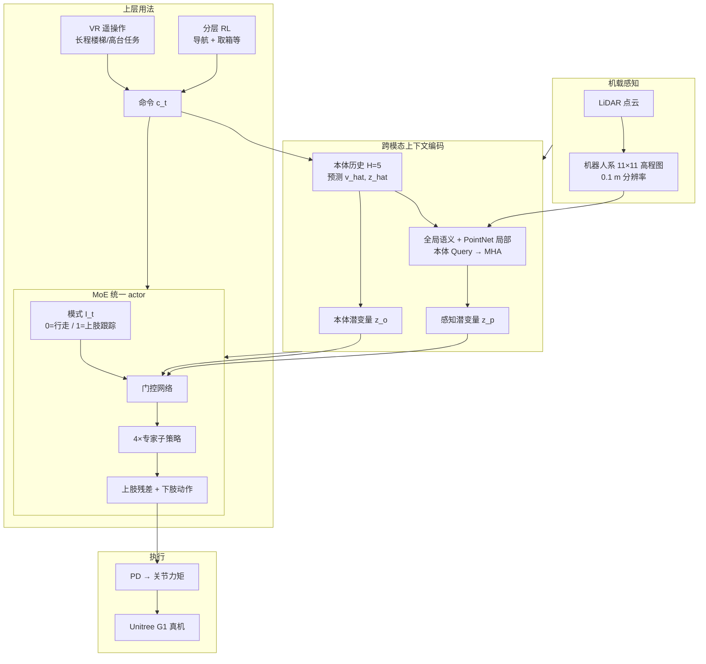

# PILOT：非结构化场景感知统一 loco-manipulation 低层控制器

**PILOT**（*A Perceptive Integrated Low-level Controller for Loco-manipulation over Unstructured Scenes*，上海交通大学等，arXiv:2601.17440）提出 **单阶段强化学习** 低层控制器：在 **同一策略** 内同时完成 **带地形前瞻的行走** 与 **29 DoF 全身操作跟踪**，面向楼梯、坡面、高台与崎岖地面上的 **边走边动手**；在 **Unitree G1** 上通过 **LiDAR 机器人系高程图**、**VR 遥操作** 与 **分层 RL 自主任务** 验证。

## 一句话定义

**把「11×11 高程图 + 本体历史预测」与「4 专家 MoE 全身策略」焊成一块可复用的 loco-manipulation LLC，让上层只发速度/姿态/上肢目标而不用替机器人猜台阶。**

## 英文缩写速查

| 缩写 | 英文全称 | 简要说明 |
|------|----------|----------|
| PILOT | Perceptive Integrated Low-level Controller | 本文方法：感知一体化低层全身控制器 |
| LLC | Low-Level Controller | 相对高层规划/VLA 的力矩或关节目标层 |
| MoE | Mixture-of-Experts | 门控网络加权组合多个专家子策略 |
| MDP | Markov Decision Process | 目标条件马尔可夫决策过程建模 |
| PPO | Proximal Policy Optimization | 策略优化算法 |
| MHA | Multi-Head Attention | 本体 Query、地形 Key/Value 的交叉注意力 |
| DoF | Degrees of Freedom | 自由度；G1 全身 29 维动作 |
| WBC | Whole-Body Control | 全身协调控制（本文用学习型统一策略实现） |

## 为什么重要

- **填补「全身 LLC 失明」空白：** 多数 loco-manipulation 低层策略 **无外感知**，楼梯/高台场景需操作者或高层 **代偿地形**；PILOT 把 **落脚与上肢稳定** 绑在同一感知闭环。
- **单阶段 vs 分层堆叠：** 相对 HOMIE 式「腿 RL + 臂 PD」或 AMO 式「下身 RL + 上身优化」，**统一 29DoF** 保留全身协同；相对 MoCap 模仿，用 **渐进随机命令** 减轻 **分布偏置**。
- **工程接口清晰：** 命令 $c_t$ 含 **基座速度/高度/躯干 RPY** 与 **上肢目标关节** $q^{\mathrm{upper}^*}$；上肢动作为 **残差修正**，便于 VR 遥操作与上层 RL **只调目标**。
- **可作 WholebodyVLA 等的上游：** [OpenDriveLab/WholebodyVLA](https://github.com/OpenDriveLab/WholebodyVLA) 将本文列为相关全身 loco-manipulation 工作，定位上接近 **稳健 LLC API** 而非端到端 VLA。

## 方法

| 模块 | 作用 |
|------|------|
| **状态** | 本体 $o_t^n$（$q,\dot q,\omega^{\mathrm{base}},g,c,a_{t-1}$）+ 历史 $H{=}5$；感知 $o_t^p\in\mathbb{R}^{121}$（11×11×0.1 m 高程） |
| **跨模态编码** | 本体分支预测 $\hat v_t,\hat z_{t+1}$（借鉴 PIM）；外感知 **全局 MLP + PointNet 局部 + 本体引导 MHA** → $z_t^p$ |
| **MoE actor** | 4 专家 + 门控；输入 $\{z_t^p,z_t^o,I_t\}$；$I_t$ 切换「协调行走」与「上肢跟踪」 |
| **动作** | $a_t\in\mathbb{R}^{29}$ → PD；$a^{\mathrm{upper}}$ 加在 $q^{\mathrm{upper}^*}$ 上 |
| **课程** | 先 locomotion → 高度 → 躯干姿态 → 上肢（指数半径采样）；地形含楼梯/坡/台/崎岖 |
| **部署感知** | 实机 **LiDAR 高程图**；仿真 Isaac Lab |

### 流程总览

## 实验要点（归纳）

| 设置 | 要点 |
|------|------|
| 平台 | Unitree G1，29 DoF；Isaac Lab 训练，RTX 4090 |
| 基线（简单地形） | HOMIE、FALCON、AMO、PILOT w/o vision；PILOT 跟踪误差更低（Table IIa） |
| 全地形 | 无感知基线 **无法穿越**；消融：去视觉 / 去注意力 / 去 MoE 均升高 stumble 误差 |
| 实机 | 楼梯、高台等非结构化场景；**VR 遥操作** + **自主分层 RL** |
| 代码 | 入库时 **无官方公开仓库**（见 [参考来源](#参考来源)） |

## 常见误区或局限

- **误区：「PILOT = 又一个楼梯 locomotion 论文」。** 主任务是 **loco-manipulation LLC**（同时跟踪行走与上肢命令）；楼梯只是非结构化场景之一，与 [Explicit Stair Geometry](./paper-explicit-stair-geometry-humanoid-locomotion.md) 的 **几何 token 专精爬梯** 不同。
- **误区：「统一策略一定优于分层」。** 训练难度高；论文用 **MoE + 课程 + 残差上肢** 缓解；高层仍可用 **分层 RL**，PILOT 定位 **低层**。
- **误区：「11×11 图 = 任意感知」。** 与 [FastStair](./paper-faststair-humanoid-stair-ascent.md) 更大范围高程图或点云 BEV 相比，感知 **范围较局部**；优势在 **与全身操作联合端到端**。
- **局限：** 暂无公开代码；与 [VIRAL](./paper-viral-humanoid-visual-sim2real.md) 等 **视觉高层** 正交，需自行对接命令接口；跨平台需重训感知与动力学。

## 与其他工作对比

| 维度 | PILOT | HOMIE / FALCON / AMO | ULC / MoCap 统一 | Explicit Stair Geometry |
|------|-------|----------------------|------------------|-------------------------|
| 感知 | **LiDAR 高程 + cross-attn** | 基线多 **无** | 多 **无** | 点云 BEV → 几何 token |
| 架构 | **单阶段 MoE 全身** | 解耦或混合 | 单策略无感知 | 下身 PPO 为主 |
| 命令 | 速度+高度+躯干+**上肢关节** | 各异 | 跟踪参考 | 速度为主 |
| 数据偏置 | **无 MoCap**，随机课程 | — | MoCap 偏置风险 | — |
| 平台 | **G1** | 论文对比设置 | — | **G1** |

## 关联页面

- [Loco-Manipulation（移动操作任务）](../tasks/loco-manipulation.md) — 全身边走边操作总览
- [楼梯与障碍 Locomotion 中心节点](../tasks/stair-obstacle-perceptive-locomotion.md) — 带感知楼梯/崎岖索引
- [Whole-Body Control](../concepts/whole-body-control.md) — 学习型统一 LLC 与经典 WBC 对照
- [Terrain Adaptation](../concepts/terrain-adaptation.md) — 高程图与注意力编码路线
- [Teleoperation](../tasks/teleoperation.md) — VR 长程遥操作上下文
- [Unitree G1](./unitree-g1.md) — 实验平台
- [VIRAL](./paper-viral-humanoid-visual-sim2real.md) — 另一路「高层视觉 + 预训练 WBC」全栈

## 参考来源

- [PILOT 论文摘录（arXiv:2601.17440）](../../sources/papers/pilot_arxiv_2601_17440.md)

## 推荐继续阅读

- [机器人论文阅读笔记：PILOT](https://imchong.github.io/Humanoid_Robot_Learning_Paper_Notebooks/papers/04_Loco-Manipulation_and_WBC/PILOT__A_Perceptive_Integrated_Low-level_Controller_for_Loco-manipulation/PILOT__A_Perceptive_Integrated_Low-level_Controller_for_Loco-manipulation.html)
- 论文 HTML：<https://arxiv.org/html/2601.17440>
- 论文 PDF：<https://arxiv.org/pdf/2601.17440>
- [OpenDriveLab/WholebodyVLA](https://github.com/OpenDriveLab/WholebodyVLA) — 统一 latent VLA 全身 loco-manipulation（README 引用 PILOT 为相关工作）
- [Explicit Stair Geometry](./paper-explicit-stair-geometry-humanoid-locomotion.md) — 同 G1 平台的显式楼梯几何条件化对照
