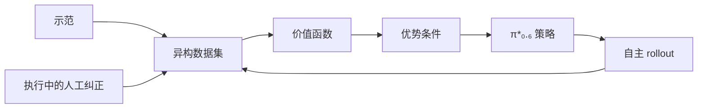

# π\*₀.₆：用经验改进的 VLA

**π\*₀.₆**（*π\*₀.₆: a VLA That Learns From Experience*，[arXiv:2511.14759](https://arxiv.org/abs/2511.14759)，[博客](https://www.pi.website/blog/pistar06)）由 **物理智能（Physical Intelligence）** 提出。方法名 **RECAP**（RL with Experience and Corrections via Advantage-conditioned Policies）：用优势值告诉策略哪些片段该模仿，从而把演示、自主 rollout 和人工纠正放进同一次训练。

## 一句话定义

> **不把 VLA 改写成策略梯度，而是用优势条件挑选该模仿的经验，让通才先离线预训练、再上真机变专精。**

## 英文缩写速查

| 缩写 | 英文全称 | 简要说明 |
|------|----------|----------|
| RECAP | RL with Experience and Corrections via Advantage-conditioned Policies | 本文的优势条件训练 |
| VLA | Vision-Language-Action | 被专精的通才策略 |
| KI | Knowledge Insulation | π₀.₆ 骨干与动作专家的训练隔离，见 [KI](./paper-knowledge-insulation.md) |

## 为什么重要

只靠模仿，复杂操作常常停在「有时成功」。可靠性与节拍需要执行结果：失败、纠正和更快的成功轨迹。RECAP 把这些数据写回 π₀.₆，得到的专精模型被 π₀.₇ 当作可蒸馏的高表现行为来源。公司时间轴上它不是 π₀.₇ 的别名。

## 核心原理

预训练阶段用离线 RL 得到通才 π\*₀.₆，而不是 π₀.₅ 那种纯监督。下游再收集该任务的示范与真机交互，迭代更新价值并条件化策略。优势被二值化后作为提示的一部分，让同一网络既能吸收次优轨迹，也知道哪些行为值得靠近。模型卡描述的 π₀.₆ 结构（Gemma 3 4B 骨干、约 860M 动作专家、KI、可选控制元数据）是这套策略的载体；RECAP 是训练环，不是另一个动作头。

## 评测

论文与博客的代表任务是家庭叠多种衣物、工厂折箱、用专业咖啡机做饮品。作者称在部分最难任务上，完整 RECAP 相对只做到模仿的版本把吞吐提高到两倍以上，失败率大约减半。运行例子包括咖啡连续制作约 13 小时、在新家庭叠未见衣物约两小时无中断、以及真实包装用的箱子。这些是作者现场统计，干预协议和「失败」定义以论文为准。

## 结论

**通才 VLA 要提高成功率和节拍，需要一条能吃下失败与纠正的优势条件，而不是再采一轮成功演示。**

- 离线预训练和真机专精是两段，不要只记住最终演示视频
- 优势条件是接口；价值函数、奖励和数据混合决定它学到什么
- π₀.₇ 吸收的是这条专精路线产生的 rollout，二者不要合成一个模型页
- openpi 的监督 `train.py` 不是 RECAP

## 源码运行时序图

**不适用**。截至 2026-09-28，[openpi#857](https://github.com/Physical-Intelligence/openpi/issues/857) 仍在询问价值函数、优势条件和在线环，仓库未提供 π\*₀.₆ 权重或 RECAP 训练入口。

## 局限与风险

- 确认未开源。吞吐「翻倍」是相对作者自己的监督或更少经验的对照，不是跨实验室榜。
- 人工纠正的质量和何时介入会改变优势标签；这条成本没有在博客标题里单独计价。
- 咖啡演示使用了训练期 RTC（见 [RTC](./paper-real-time-chunking.md) 的后续论文），不要把它算进 RECAP 本身的成功率。

## 关联页面

- [π₀.₇](../methods/pi07-policy.md)
- [Knowledge Insulation](./paper-knowledge-insulation.md)
- [RTC](./paper-real-time-chunking.md)
- [数据飞轮最小闭环](../concepts/embodied-data-flywheel-minimal-closed-loop.md)

## 参考来源

- [pistar06_arxiv_2511_14759](../../sources/papers/pistar06_arxiv_2511_14759.md)
- [PI 官网技术文章索引](../../sources/sites/pi-website-technical-articles.md)

## 推荐继续阅读

- [arXiv:2511.14759](https://arxiv.org/abs/2511.14759)
- [博客](https://www.pi.website/blog/pistar06)
