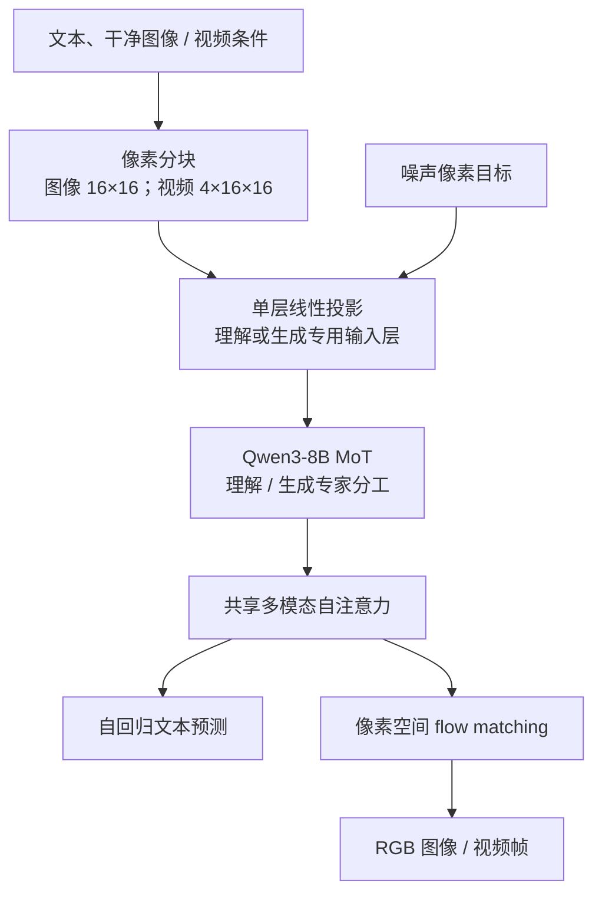
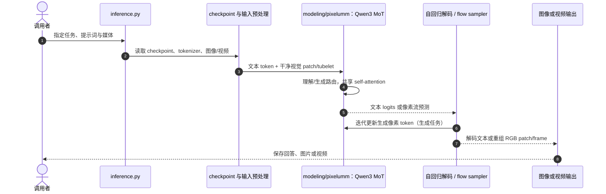

# PixelUMM：Encoder-Free Unified Image and Video Understanding and Generation

## 一句话定义

**PixelUMM** 是 NVIDIA 与 University of Waterloo 提出的像素空间多模态模型：用空间 patch 与时空 tubelet 作为视觉 token，在共享多模态注意力中联合支持图像/视频理解、文本生成与像素生成。

## 英文缩写速查

| 缩写 | 英文全称 | 简要说明 |
|------|----------|----------|
| UMM | Unified Multimodal Model | 在同一模型中连接视觉理解和生成的多模态系统 |
| VAE | Variational Autoencoder | PixelUMM 采用的统一视觉接口不经过此类潜变量编码路径 |
| MoT | Mixture-of-Transformers | 按 token 路由理解/生成专家、并共享注意力的结构 |
| RGB | Red, Green, Blue | 原始彩色图像与视频帧的像素通道 |
| FPS | Frames Per Second | 视频采样率；项目提供密集与稀疏理解输入模式 |
| CFG | Classifier-Free Guidance | 条件生成引导系数；高 CFG 下像素边界伪影更明显 |

## 为什么重要

许多统一多模态系统会用语义视觉编码器承接理解、用 VAE 或其他视觉 tokenizer 承接生成。PixelUMM 把输入和生成目标都直接放在像素空间，探索能否用一种视觉接口同时支持图像与视频理解、生成及编辑。它并非把所有参数彻底合并：理解和生成由 MoT 中不同专家处理，只共享注意力交互。

对机器人研究者而言，它是视觉表征和视频生成建模的上游参照；论文与项目页没有给出机器人动作策略或闭环实机验证，因此不能把通用视觉 benchmark 等同于 VLA 或机器人控制能力。

## 流程总览

## 核心机制

### 像素接口与共享主干

- **图像 token：** RGB 图像切为不重叠的 16×16 patch，每个 patch 含 768 个原始值，经一层线性映射到主干维度。
- **视频 token：** 默认 tubelet 为 4×16×16，每个含 3072 个 RGB 值，再投影为一个 token。截图中的 832×464、24 FPS 是演示输入，不是模型固定输入规格。
- **直接输出像素：** 输出头把隐藏状态映回 RGB patch/tubelet，再 unpatchify；生成目标通过像素空间 flow matching 迭代去噪。
- **统一条件序列：** 干净视觉条件走理解输入层，噪声生成目标走生成输入层；两者在共享多模态自注意力中交互。

### 理解生成分工与共享注意力

主干从 decoder-only Qwen3 初始化。公开模型卡标注 8B 级 MoT；模型权重文件的总参数规模约 15.2B。MoT 使用 token-level hard routing：理解专家读取干净视觉 token 并预测文本，生成专家预测像素流。各专家具有各自的归一化、投影和 FFN 参数，Transformer block 的多模态 self-attention 共享。

文本使用自回归目标，图像/视频采用 flow-matching 目标，在同一序列中组织指令、参考视觉条件和待生成的噪声 token。它统一视觉接口，但不是单一共享 FFN 的完全参数共享架构。

### 视频理解接口

- **dense_mode：** 对较高帧率视频采样，默认 4 FPS，再把连续 4 帧组成 tubelet。
- **sparse_mode：** 对低帧率视频按 1 FPS 取帧，每帧独立经图像理解投影，避免重复画面来凑满 tubelet。

在相同单帧分辨率预算下，项目消融中的 dense 与 sparse 在四个视频 benchmark 上结果接近。这个结论限定于该设置，不代表两条路径对所有视频都等价。

## 评测与结果

论文报告图像/视频理解与生成的竞争性结果。项目页指出各对照模型训练数据不同，横向 benchmark 不能单独证明架构优劣。

| 消融观察 | 结果与边界 |
|---|---|
| 图像 patch 尺寸 | 32×32 在相同 token budget 下每步可容纳四倍图像数，但 16×16 在报告的后期训练区间保持较低 T2I loss。 |
| 视频压缩率 | 较少的时空压缩通常带来更低生成 loss；最终模型采用 16×16、4 帧 tubelet。 |
| 线性输出头伪影 | 平滑区域出现与 16-pixel patch 和 4-frame tubelet 边界对齐的强度变化；卷积头可缓解，但成本更高且需额外训练。发布 checkpoint 与 benchmark 仍使用线性头。 |
| 多任务上下文微调 | 8 项任务、15K steps 后，四个视频 benchmark 提升 0.89–3.49；图像理解指标变化不一（BLINK +2.37、CV-Bench +2.27、SEED-I −5.41）。 |
| 视频理解输入 | F8-R01 下，4-FPS tubelet 与 1-FPS 独立帧路径的四项视频指标接近；结论限于相同 448² 单帧预算和该 checkpoint。 |

## 与其他工作对比

相较于用 ViT 等语义视觉编码器服务理解、用 VAE latent 服务生成的统一多模态架构，PixelUMM 用同一像素 patch/tubelet 接口承载两类任务，并让理解与生成专家共享 self-attention；两支专家仍保留专用投影、归一化与 FFN，因此不是完全参数共享。项目页的跨模型 benchmark 受训练数据差异影响，只能说明当前 checkpoint 的任务表现，不能据此判定像素接口总体优于双表征路线。

## 结论

**PixelUMM 的核心价值是把图像与视频的输入/输出统一为原始像素 token，并让理解/生成专家共享注意力；代价是绕开潜空间压缩后，序列长度与像素生成效率成为关键约束。**

1. “无 VAE / 无视觉编码器”说的是视觉接口路径；模型仍有 patch 投影、MoT 专家和图像/视频输出头。
2. 4×16×16 RGB tubelet 将 3072 个值映成一个 Transformer token；压缩率影响序列长度与学习难度。
3. 线性输出头较轻，但公开模型平滑区域可见 patch 边界伪影；卷积头以额外计算换取减轻伪影，且尚未替换发布 checkpoint。
4. benchmark 结果应按任务和训练数据差异解读；论文支持“有竞争力”，不支持脱离条件的全面领先结论。
5. 代码已公开，模型权重另行下载且限非商业研究/评估；toy training 不等于完整训练复现。
6. 现有资料未验证机器人动作输出、控制闭环或实机部署，不要把 PixelUMM 直接视作 VLA。

## 工程实践

- **环境：** 官方仓库要求 Linux、NVIDIA GPU、CUDA 版 PyTorch 和 FlashAttention。按 `ENVIRONMENT.md` 安装，再依 `CHECKPOINT.md` 准备 PixelUMM checkpoint 与 Qwen3-8B config/tokenizer。
- **推理入口：** `inference.py` 支持 text-to-image、image-conditioned text、video understanding 和 text-to-video；先用 `check_checkpoint.py` 检查 checkpoint 完整性与 tensor 兼容。
- **训练边界：** `train_toy.py` 只演示任务混合与训练路径；官方估算约 7 张、每张至少 48 GiB GPU，产物约 61 GB，数据与权重另行下载。
- **安全检查：** 单条 T2V 推理默认使用 Cosmos guardrail，需单独获准访问。README 说明批量入口不运行该 guardrail，使用时应另行落实内容审核。
- **许可：** 代码多数为 Apache-2.0，具体文件需检查第三方声明；权重使用 NVIDIA One-Way Noncommercial License，不适用于商业模型部署。

## 局限与风险

1. **像素 token 成本：** 高分辨率信号直接进入 token 序列与生成张量，分辨率、帧数和压缩率对显存与推理成本敏感。
2. **边界伪影：** 默认线性输出层可能产生 patch/tubelet 边界痕迹；修正方案增加计算量，还需继续训练，尚不在当前 checkpoint 中。
3. **通用基准不等于机器人能力：** 现有资料没有接触、状态估计、动作生成、实时延迟或真机控制评测。用于机器人系统前需任务级数据、闭环和安全验证。
4. **训练资料有限：** 官方提供 inference 与 toy training 示例；完整规模训练数据和 recipe 的公开程度应以仓库更新为准。

## 源码运行时序图

下图按官方 README 的 `inference.py` 入口和仓库的 `data/`、`modeling/` 目录概括推理路径，不是论文训练图。

图中简化了任务分支：理解任务走自回归文本输出；图像/视频合成由 flow sampler 迭代更新像素。复现入口与许可边界见[官方仓库归档](../../sources/repos/nv-tlabs-pixelumm.md)。

## 关联页面

- [视觉感知骨干知识链](../overview/hub-vision-backbone.md) — 视觉表征与生成模型的上游入口
- [生成式视觉预训练](../concepts/generative-vision-pretraining.md) — 对照视觉生成预训练的表征选择
- [VLA（Vision-Language-Action）](../methods/vla.md) — 区分视觉理解模型与带动作输出的机器人策略

## 参考来源

- [PixelUMM 论文摘录（arXiv:2609.38597）](../../sources/papers/pixelumm_arxiv_2609_38597.md)
- [官方项目页与实验汇总](../../sources/sites/pixelumm-project.md)
- [官方源码与权重许可核查](../../sources/repos/nv-tlabs-pixelumm.md)
- [arXiv:2609.38597](https://arxiv.org/abs/2609.38597) · [项目页](https://nv-tlabs.github.io/PixelUMM/) · [代码](https://github.com/nv-tlabs/PixelUMM) · [模型卡](https://huggingface.co/nvidia/PixelUMM)
