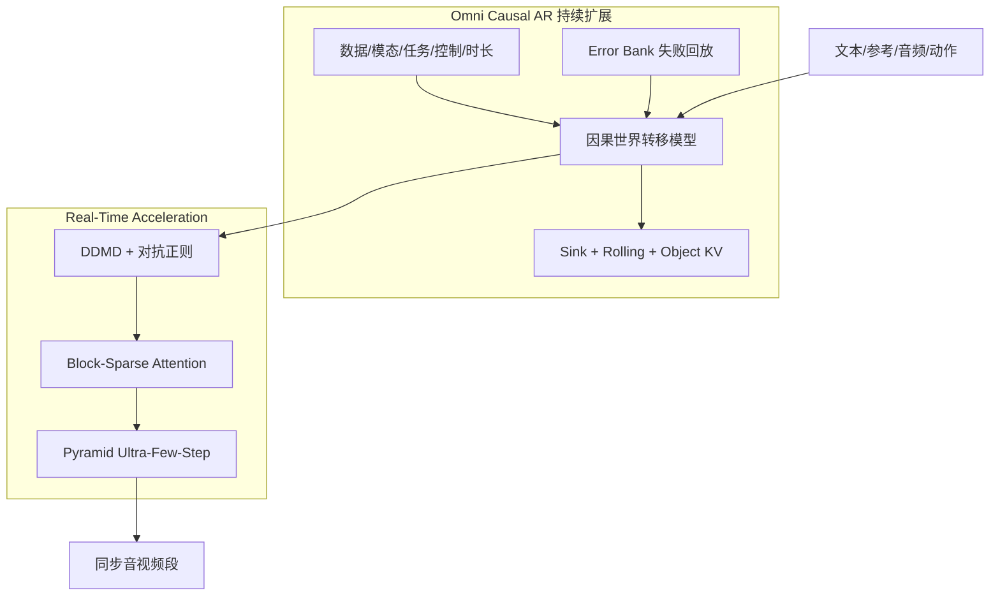

# PixVerse R2：Scaling Real-Time Omni World Models

**PixVerse R2**（[项目页](https://pixverse.ai/en/model/pixverse-r2)，[技术报告](https://pixverse.ai/en/blog/pixverse-r2-scaling-real-time-omni-world-models)，[在线 World](https://world.pixverse.video/)）是 PixVerse 在 R1「首个公开发布通用实时音视频世界模型」之后的 **统一扩展架构**：把 **数据 / 模态 / 任务 / 控制 / 时间跨度** 的持续预训练（Omni Causal AR）与 **同骨干实时加速**（Real-Time Acceleration）合成一条路径，而非传统五段式「双向→AR→蒸馏教师→DMD→自回归 DMD」链式 handoff。

## 一句话定义

**R2 让「正在生成的世界」持续接收文本、参考、音频与动作，并在 ultra-few-step 预算下保持身份锚点、长程稳定与音画同步。**

## 英文缩写速查

| 缩写 | 英文全称 | 简要说明 |
|------|----------|----------|
| R2 | PixVerse R2 | 本文实时全模态世界模型 |
| OCA | Omni Causal AR | 可持续扩展的因果世界建模骨干 |
| DDMD | Decoupled Distribution Matching Distillation | 条件对齐与分布匹配解耦蒸馏 |
| RoPE | Rotary Position Embedding | 相对时间位置编码 |
| WM | World Model | 预测环境动态的前向模型 |

## 为什么重要

- **交互范式：** 相对「一次请求→完整视频」，R2 强调 **运行中** 接收 WASD、prompt、音频与参考，改变 **下一状态** 而非重置会话——与 [Matrix-Game 3.0](./paper-sa-2604-08995-matrix-game-3-0-real-time-and-streaming-interact.md)、[Infinite World](./paper-sa-2602-02393-infinite-world-scaling-interactive-world-models.md) 等同属 **Game & Open-World 交互 WM** 线，但 R2 突出 **音画联合** 与 **产品级在线 World**。
- **工程路线：** 把多阶段能力迁移压成 **两过程**（持续预训练 + 同骨干加速），降低 stage boundary 上的质量与长程稳定性损失。
- **记忆与恢复：** Sink / Rolling / Object 三通道记忆 + **Error Bank** 把部署失败写回训练——对长程亮度漂移等漂移指标报告 **−35.8%**（内部 stage eval）。

## 核心信息

| 项 | 内容 |
|----|------|
| **机构** | PixVerse Research（爱诗科技） |
| **前置** | PixVerse R1 — 实时音视频世界模型公开产品化 |
| **在线体验** | [world.pixverse.video](https://world.pixverse.video/) |
| **开源** | **未开源（模型）** — GitHub 仅有 CLI/MCP/Skills；权重与训练代码未发布 |

### 流程总览

### Omni Causal AR 要点

- **Dynamic Chunk Generation：** 按活跃控制信号的语义边界切分音视频块——短块响应 WASD，长块保留事件结构与运动连贯。
- **Hybrid Teacher Forcing / Diffusion Forcing：** 干净历史保质量，噪声历史练恢复；配合因果 mask 与 **Relative Temporal RoPE** 限制绝对位置外推压力。
- **Multi-Timescale Memory：** 持久锚点（角色/环境/风格/规则）+ 近期动力学 + 仍相关的 object-level KV。

### Real-Time Acceleration 要点

- **Accelerate, not relearn：** 学生 ODE 初始化与蒸馏教师同源 OCA，避免 few-step 生成器重学长程动力学。
- **>90% attention sparsity**（内部四维质量评测仍保持）；**Pyramid** 低分辨率建结构、高分辨率补纹理。

## 源码运行时序图

**不适用**（截至入库日 2026-09-23，PixVerse R2 **模型权重与训练/推理代码未公开**；[PixVerseAI](https://github.com/PixVerseAI) 组织仓库为 API/Agent 工具链。在线体验入口：[world.pixverse.video](https://world.pixverse.video/)。）

## 工程实践

| 场景 | 读法 |
|------|------|
| **产品体验** | 从 World 页进入；队列与功能以当日产品配置为准 |
| **研究对照** | 与 Matrix-Game / Infinite World 等对比 **控制接口、记忆结构、音画同步、开源边界** |
| **复现预期** | 无官方训练代码前，仅能做 API/产品层评测，不能复现 OCA 内部指标 |

## 局限与风险

- **非游戏引擎：** 官方明确 R2 **不是** 完整开放世界或成品游戏引擎，而是 **模型生成世界的 live demo**。
- **闭源权重：** 内部稀疏度、Error Bank 等数字 **无法独立复现**；选型时区分「产品演示」与「可复现研究」。
- **物理正确性：** 与机器人 embodied WM 不同，R2 优化 **交互音视频连贯** 与 **控制响应**；勿直接等同于 manipulation 物理仿真器。

## 与其他工作对比

| 维度 | PixVerse R2 | Matrix-Game 3.0 | 机器人 Tri-View WM 评测 |
|------|-------------|-----------------|-------------------------|
| 交互 | 运行中多模态控制 | 流式游戏世界 | 双臂三视角预测一致性 |
| 输出 | 同步音视频 | 视频为主 | 多相机未来观测 |
| 开源 | 模型未开源 | 部分开源 | Benchmark 已开源 |
| 站点节点 | 本页 | [paper-sa-2604-08995-…](./paper-sa-2604-08995-matrix-game-3-0-real-time-and-streaming-interact.md) | [TriWorldBench](./paper-triworldbench.md) |

## 实验与评测

- **评测性质：** 本页可核的数字来自 **官方技术报告的内部 stage eval**，没有公开第三方复跑通道（权重与训练/推理代码未开源），因此所有数值应当作 **厂商自报** 读。
- **已报告的量：** 长程亮度漂移等漂移指标 **−35.8%**（Error Bank 消融口径）；注意力稀疏度 **>90%** 时内部四维质量评测仍保持。
- **评的是什么能力：** 运行中多模态控制响应、长程身份/规则锚点、音画同步、ultra-few-step 延迟——**不是** 单次 T2V 画质榜，也不是机器人 action-conditioned 世界模型的物理忠实度。
- **可做与不可做的评测：** 外部只能做 **API/产品层** 评测（进 [world.pixverse.video](https://world.pixverse.video/) 实测交互与延迟）；**不能** 复现 OCA 内部指标，也不能按 [评测闭环](../queries/embodied-eval-benchmark-selection-loop.md) ② 层的机器人 WM 口径给它打分。

## 结论

**PixVerse R2 把「实时可进入的世界」从 R1 的产品验证推进到可扩展的 OCA+加速双进程架构——适合作为生成式交互 WM 的产品向深读，但不替代机器人 action-conditioned 世界模型选型。**

1. **真影响指标：** 运行中多模态控制、长程身份/规则锚点、音画同步与 ultra-few-step 延迟——而非单次 T2V 画质榜。
2. **次要代价：** 模型闭源、物理/action 忠实性未按机器人 WM 口径评测。
3. **部署读法：** 体验用 World；研究对照读技术报告 + 站内 [Generative World Models](../methods/generative-world-models.md)；机器人管线请看 [TriWorldBench](./paper-triworldbench.md) 等 embodied 基准。

## 关联页面

- [Generative World Models](../methods/generative-world-models.md)
- [Matrix-Game 3.0](./paper-sa-2604-08995-matrix-game-3-0-real-time-and-streaming-interact.md)
- [Infinite World](./paper-sa-2602-02393-infinite-world-scaling-interactive-world-models.md)
- [TriWorldBench](./paper-triworldbench.md)

## 参考来源

- [pixverse_r2_technical_report_2026.md](../../sources/papers/pixverse_r2_technical_report_2026.md)
- [pixverse-r2.md](../../sources/sites/pixverse-r2.md)
- [pixverse-ai.md](../../sources/repos/pixverse-ai.md)

## 推荐继续阅读

- [PixVerse R2 技术报告](https://pixverse.ai/en/blog/pixverse-r2-scaling-real-time-omni-world-models)
- [在线 World 体验](https://world.pixverse.video/)
- [Awesome World Models 技术地图](../overview/sun-awesome-wm-technology-map.md)
