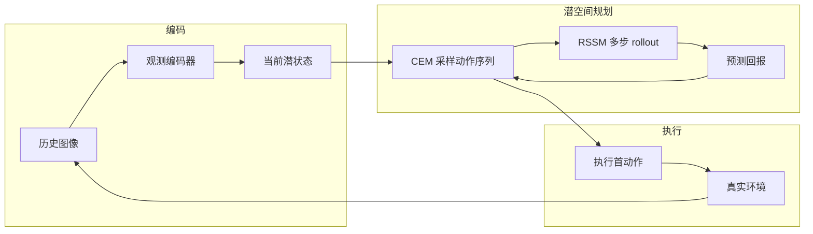
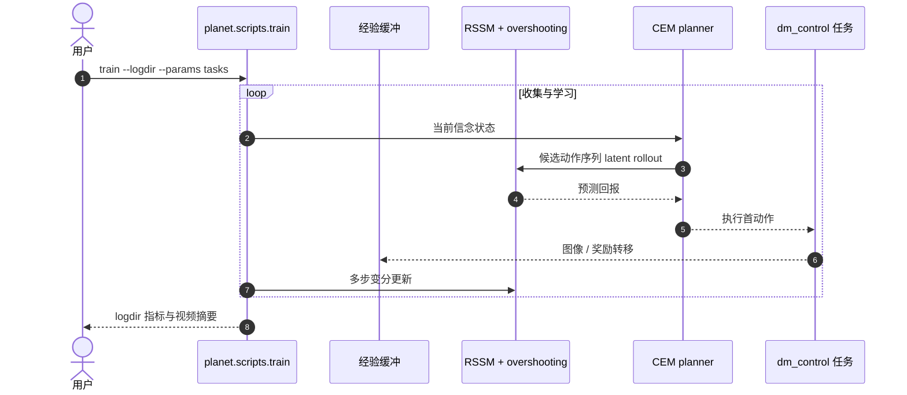

# PlaNet（Learning Latent Dynamics for Planning from Pixels）

**PlaNet**（*Deep Planning Network*，[arXiv:1811.04551](https://arxiv.org/abs/1811.04551)，ICML 2019，Danijar Hafner 等 · **谷歌（Google Brain）**；[项目页](https://planetrl.github.io/)，[代码](https://github.com/google-research/planet)）从像素学习紧凑 **RSSM**，在潜空间用 **CEM** 做在线规划——不依赖 model-free 策略网络作为主决策器，却在接触、部分可观与稀疏回报任务上达到接近强 model-free 的终局表现。

## 一句话定义

**纯模型基智能体：用带确定性+随机性的潜动态模型从图像预测多步回报，并在 latent 中快速规划动作。**

## 英文缩写速查

| 缩写 | 英文全称 | 简要说明 |
|------|----------|----------|
| PlaNet | Deep Planning Network | 本文方法名 |
| RSSM | Recurrent State-Space Model | 确定性路径 + 随机状态的序列模型 |
| CEM | Cross-Entropy Method | 潜空间轨迹优化 / 规划器 |
| MPC | Model Predictive Control | 执行首步后重规划 |
| ELBO | Evidence Lower Bound | 变分训练目标；本文强调多步 overshooting |
| SSM | State-Space Model | 消融中的纯随机变体 |

## 为什么重要

- **像素规划可行：** 证明「学到够准的潜动态 + 在 latent 规划」可解此前规划派难以覆盖的视觉控制难度。
- **RSSM 祖型：** 确定性与随机分量并存的序列模型，直接被 Dreamer 系列继承并改为「想象中学策略」。
- **样本效率叙事：** 相对强 model-free，用显著更少的环境交互接近终局性能。
- **物理保真度坐标：** 仍属 [低维潜状态输出族](../overview/world-model-physics-fidelity-outputs.md)——规划看的是 latent 回报，不是可检视频帧。

## 核心信息

| 字段 | 内容 |
|------|------|
| 论文 | Learning Latent Dynamics for Planning from Pixels |
| arXiv | [1811.04551](https://arxiv.org/abs/1811.04551) |
| 会议 | ICML 2019 |
| 作者 | Hafner, Lillicrap, Fischer, Villegas, Ha, Lee, Davidson |
| 机构 | 谷歌（Google Brain）等 |
| 规划 | 潜空间 CEM（MPC） |
| 开源 | **已开源** · Apache-2.0 · 仓库 **archived** |
| 项目页 | [planetrl.github.io](https://planetrl.github.io/) |

## 流程总览

## 核心原理 / 机制

### RSSM

世界被建成紧凑隐状态序列：既有 **确定性** 循环路径（稳定长期结构），也有 **随机** 状态（多模态与部分可观）。规划时先把历史图像编码进当前状态，再在无像素解码的路径上预测未来。

### Latent overshooting

单步变分目标不足以约束长程预测。Overshooting 用多步一致性强化「规划真正用到的」多步回报预测，缓解短视拟合。

### CEM 规划

在潜空间并行评估多条动作序列的累计回报，选优后只执行第一步，观察到新图像再重规划——经典 MPC 环，但动力学完全是学出来的。

### 与 World Models 的分界

[World Models](./paper-ha-schmidhuber-world-models.md) 侧重梦中训小控制器；PlaNet 侧重 **在线规划**，决策时显式搜索动作序列。Dreamer 则把「在模型里」从规划搜索转向 **actor-critic 想象学习**。

## 工程实践

| 项 | 实践要点 |
|----|----------|
| 开源状态 | **已开源**：[`google-research/planet`](https://github.com/google-research/planet) · Apache-2.0；项目页明确链到该仓。 |
| 维护 | 仓库 **archived**；TensorFlow 1.x / 旧 dm_control——适合算法对照，不适合新项目默认依赖。 |
| 训练入口 | `python3 -m planet.scripts.train --logdir DIR --params '{tasks: [cheetah_run]}'` |
| 消融开关 | README：`mean_only`、`model: ssm`、`planner_iterations: 0` 等 |
| 选型 | 学 RSSM+规划读本页；要通配超参想象 RL 用 [DreamerV3](./paper-shenlan-wm-13-dreamerv3.md)；要隐式模型+现代 MPC 用 [TD-MPC2](./paper-td-mpc2.md)。 |

## 源码运行时序图

节点对齐 [`sources/repos/google-research-planet.md`](../../sources/repos/google-research-planet.md)。

- **最短复现路径：** 按 README 装齐 TF1 + dm_control → `cheetah_run` 冒烟 → 再对照论文消融参数。
- **预期摩擦：** archived 依赖；现代 Python/MuJoCo 栈需自行打补丁。

## 实验与评测

| 轴 | 报告口径（以论文 / 项目页为准） |
|----|--------------------------------|
| 任务族 | 连续控制，含接触动力学、部分可观、稀疏回报 |
| 对照 | 强 model-free；随机收集；纯确定性 / 纯随机动力学 |
| 样本效率 | 更少 episode 接近终局；部分任务终局可更高 |
| 规划 | 相对随机动作 / 关规划器，CEM 显著必要 |

## 结论

**PlaNet 证明「像素→RSSM→潜空间 MPC」可成为主决策环；它是 Dreamer 想象学习之前的规划式 latent WM 标杆。**

1. **RSSM 混合路径** — 纯随机或纯确定性都弱于混合。
2. **Overshooting** — 为多步规划服务的训练目标，不只是单步重建。
3. **CEM-MPC** — 决策时搜索，而非只训反应式策略。
4. **开源可对照但已归档** — 学概念用；新工程前出到 Dreamer/TD-MPC2。
5. **保真度** — 规划成功不保证 latent 编码了真实接触物理。
6. **谱系** — 上承 World Models 压缩思想，下启 Dreamer / TD-MPC。

## 局限与风险

- **归档栈：** 复现成本高。
- **无策略网络主路径：** 规划算力与时域长度敏感。
- **潜空间不可视：** 调试动力学错误难，需依赖回报与行为。
- **域：** 仿真连续控制为主，非真机视频模拟器。

## 与其他工作对比

| 对比轴 | PlaNet | [World Models](./paper-ha-schmidhuber-world-models.md) | [DreamerV3](./paper-shenlan-wm-13-dreamerv3.md) | [TD-MPC2](./paper-td-mpc2.md) |
|--------|--------|--------------------------------------------------------|--------------------------------------------------|--------------------------------|
| 决策 | CEM 规划 | 小 C 反应式（可梦中训） | 想象中 actor-critic | 隐式模型 + 局部轨迹优化 |
| 模型 | RSSM | VAE+MDN-RNN | RSSM + 稳健化 | Decoder-free 隐式 WM |
| 开源 | planet（archived） | 交互站+实验仓 | dreamerv3 MIT | tdmpc2 MIT + 权重集 |

## 关联页面

- [世界模型物理保真度 × 输出轴](../overview/world-model-physics-fidelity-outputs.md)
- [Model-Based RL](../methods/model-based-rl.md)
- [Latent Imagination](../concepts/latent-imagination.md)
- [Generative World Models](../methods/generative-world-models.md)
- [World Models](./paper-ha-schmidhuber-world-models.md) · [DreamerV3](./paper-shenlan-wm-13-dreamerv3.md) · [TD-MPC2](./paper-td-mpc2.md) · [UniSim](./paper-unisim.md)

## 参考来源

- [PlaNet 论文归档（arXiv:1811.04551）](../../sources/papers/planet_latent_dynamics_arxiv_1811_04551.md)
- [google-research/planet 代码索引](../../sources/repos/google-research-planet.md)
- [PlaNet 项目页归档](../../sources/sites/planetrl-github-io.md)
- [微信：世界模型物理保真度策展](../../sources/blogs/wechat_embodied_ai_lab_world_model_physics_fidelity.md)

## 推荐继续阅读

- [arXiv:1811.04551](https://arxiv.org/abs/1811.04551)
- [项目页](https://planetrl.github.io/)
- [GitHub — google-research/planet](https://github.com/google-research/planet)
- [DreamerV3](./paper-shenlan-wm-13-dreamerv3.md) — 同谱系下一站
