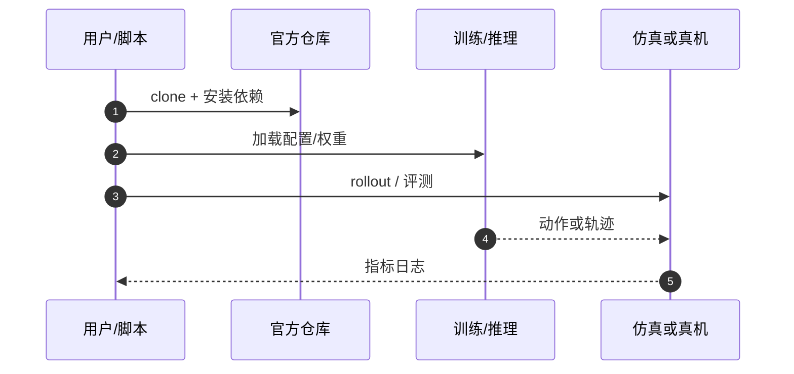

# PLANTORV（arXiv:2609.28184）

**VLMs Can Describe, But Not Measure: Object-Centric Scene Understanding for Robotic Manipulation**（[代码](https://github.com/idra-lab/plantorv)，[项目页](https://www.github.com/idra-lab/plantorv)，[arXiv:2609.28184](https://arxiv.org/abs/2609.28184)）来自 [具身智能小站 · 13 篇盘点](../../sources/blogs/wechat_embodied_13_papers_forgetmimic_2026-09-24.md)（2026-09-24）。

## 一句话定义

**VLM 擅长语义描述但不等于可靠几何；框架把 VLM 标注与 RGB-D 几何拆开再合成对象级表示。**

## 英文缩写速查

| 缩写 | 英文全称 | 简要说明 |
|------|----------|----------|
| VLA | Vision-Language-Action | 视觉–语言–动作策略 |
| RL | Reinforcement Learning | 强化学习 |
| TO | Trajectory Optimization | 轨迹优化 |
| HITL | Human-in-the-Loop | 人在回路 |

## 为什么重要

- 陌生桌面操作既要语义又要可用尺寸/深度；纯 VLM 描述无法直接驱动抓取规划。
- 纳入 [13 篇技术地图](../overview/embodied-13-papers-technology-map.md) 阅读坐标。
- 开源结论（步骤 2.5，2026-09-24）：**已开源**。

## 核心机制

| 项 | 内容 |
|----|------|
| **arXiv** | [2609.28184](https://arxiv.org/abs/2609.28184) |
| **开源** | **已开源** |
| **要点** | VLM 产语义标签；RGB-D 分支产定位与深度；融合为 object-centric scene graph 供操作栈消费。 |
| **文内指标** | **151** 场景验证从描述到可执行感知（具体指标以 PDF 为准）。 |

## 源码运行时序图

## 实验与评测

- **151** 场景验证从描述到可执行感知（具体指标以 PDF 为准）。
- **读法：** 公众号归纳；逐项 baseline 与协议以 arXiv PDF 为准。

## 与其他工作对比

- 横向索引见 [13 篇技术地图](../overview/embodied-13-papers-technology-map.md)。

## 结论

**描述 ≠ 测量 — 部署链上必须显式几何分支** — 复现核对相机与深度标定。

1. 开源边界：**已开源** — 以项目页/仓库实际链接为准（入库日 2026-09-24）。
2. 核心机制：VLM 产语义标签；RGB-D 分支产定位与深度；融合为 object-centric scene graph 供操作栈消费。…
3. 部署前核对任务协议与硬件条件，勿直接横比公众号摘录数字。

## 关联页面

- [Manipulation](../tasks/manipulation.md)
- [Vla](../methods/vla.md)
- [2D To 3D Semantic Lifting Gap](../concepts/2d-to-3d-semantic-lifting-gap.md)
- [Embodied 13 Papers Technology Map](../overview/embodied-13-papers-technology-map.md)

## 参考来源

- [13 篇盘点（公众号）](../../sources/blogs/wechat_embodied_13_papers_forgetmimic_2026-09-24.md)
- [VLMs Can Describe, But Not Measure: Object-Centric Scene Understanding for Robotic Manipulation](../../sources/papers/plantorv_arxiv_2609_28184.md)

## 推荐继续阅读

- [arXiv:2609.28184](https://arxiv.org/abs/2609.28184) — 原文
