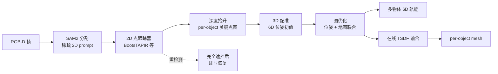

# Point2Pose

**Point2Pose**（*Occlusion-Recovering 6D Pose Tracking and 3D Reconstruction for Multiple Unknown Objects via 2D Point Trackers*，[arXiv:2604.10415](https://arxiv.org/abs/2604.10415)，Tzu-Yuan Lin / Ho Jae Lee / Kevin Doherty / Yonghyeon Lee / Sangbae Kim · **麻省理工（MIT）** & **波士顿动力（Boston Dynamics）**；[项目页](https://point2pose.github.io/)，[代码](https://github.com/tzuyuan/point-to-pose)）从单目 **RGB-D** 视频对 **多个未知刚体** 做 **因果 6D 位姿跟踪**，并在跟踪同时 **在线 TSDF 重建** 各物体 mesh。

## 一句话定义

**用长程 2D 点跟踪维持跨帧对应，将跟踪点抬升为 3D 关键点图后经图优化恢复多物体 6D 位姿，并在估计位姿下融合深度得到 per-object TSDF mesh；完全遮挡后靠点跟踪器重检测即时恢复，无需 CAD 或类别先验。**

## 英文缩写速查

| 缩写 | 英文全称 | 简要说明 |
|------|----------|----------|
| 6D / 6-DoF | Six Degrees of Freedom | 刚体位姿：3D 平移 + 3D 旋转 |
| RGB-D | Red-Green-Blue + Depth | 彩色图与对齐深度，Point2Pose 主输入 |
| TSDF | Truncated Signed Distance Function | 截断有符号距离场；在线融合深度建 mesh |
| SAM | Segment Anything Model | SAM2 用于交互式物体分割与 mask |
| mocap | Motion Capture | 真机 YCBMultiTrack 的 OptiTrack 位姿真值 |
| CAD | Computer-Aided Design | 计算机辅助设计模型；本文 **不需要** per-object CAD |

## 为什么重要

- **无模型多物体跟踪：** 仅需在物体上点击少量 2D 点（配合 SAM2），即可同时跟踪多个 **从未见过** 的刚体，适合 clutter 桌面/手持操作，无需 FoundationPose 式 CAD 或类别训练。
- **遮挡恢复是硬需求：** 帧间特征匹配在 **完全遮挡** 后常失效；Point2Pose 用 **持久 2D 点查询** 在物体重现时立即重关联，避免单独 relocalization 管线。
- **跟踪 + 重建一体：** 位姿估计与 **在线 TSDF** 并行，为操作规划提供物体坐标 mesh，而不必先离线扫描资产。
- **模块化可替换：** segmenter / tracker / register / optimizer / reconstructor 全由 YAML registry 组装，便于对照 [机器人感知栈选型](../queries/robot-perception-stack-selection-loop.md) 中的跟踪器与重建前端。
- **新基准 YCBMultiTrack：** 填补多物体动态 RGB-D + 遮挡 + mocap GT 空白，仿真（Isaac Lab）与真机（RealSense + OptiTrack）双 split。

## 核心信息

| 项 | 内容 |
|----|------|
| **机构** | 麻省理工（MIT）Biomimetic Robotics Lab；波士顿动力（Boston Dynamics，Doherty 注为个人时间） |
| **发表** | **ECCV 2026** |
| **输入** | 单目 RGB-D 视频流；每物体稀疏 2D prompt 点（+ 可选 SAM2 负样本） |
| **输出** | 每物体因果 6D 位姿轨迹；在线 TSDF mesh（`.ply` / 纹理 `.glb`） |
| **默认跟踪器** | BootsTAPIR（`tapir`）；可换 TAPNext++、Track-On2、LiteTracker、CoTracker3 |
| **开源（截至 2026-09-12）** | **已开源（BSD 3-Clause）**：RealSense demo、数据集 runner、完整模块化管线；合成数据生成器另仓公开 |

## 核心原理（方法）

### 四段式管线

| 阶段 | 机制 | 作用 |
|------|------|------|
| **分割与初始化** | SAM2 + 用户点击 | 确定每物体 mask 与初始 2D 查询点 |
| **长程 2D 跟踪** | BootsTAPIR 等 | 跨数百帧维持像素对应，遮挡后重检测 |
| **抬升与配准** | 深度 → 3D 关键点图 + SVD/RANSAC 等 | 恢复每物体 6-DoF 位姿 |
| **图优化 + TSDF** | `lm_graph` / iSAM2 + `sdf_builder` | 时序一致位姿；深度融合重建 mesh |

相对依赖 **帧间匹配** 的无模型跟踪器，Point2Pose 把 **数据关联** 交给学习式 **长程点跟踪器**，使对应关系在遮挡期间仍可被重新激活。

### 流程总览



## 源码运行时序图

节点对齐 [`sources/repos/point-to-pose.md`](../../sources/repos/point-to-pose.md)。典型 **RealSense 实时** 路径：

```mermaid
sequenceDiagram
    autonumber
    actor U as 用户
    participant RS as RealSense / datareader
    participant MP as ModularPipeline
    participant SAM as segmenter (sam2)
    participant TRK as tracker (tapir)
    participant SAMPL as sampler (super_point)
    participant REG as register (svd_*)
    participant OPT as optimizer (lm_graph / isam2)
    participant REC as reconstructor (sdf_builder)
    participant VIZ as Rerun / cv2 UI
    U->>MP: 点击 prompt + 按 s 开始
    loop 每帧
        RS->>MP: RGB-D Frame
        MP->>SAM: 更新 mask
        MP->>TRK: track_once()
        TRK-->>MP: 2D 点轨迹
        MP->>SAMPL: 关键点采样
        MP->>REG: 3D 配准
        REG-->>MP: 6D 位姿
        MP->>OPT: 图优化 refine
        OPT-->>MP: 优化位姿 + 地图
        MP->>REC: 深度融合 TSDF
        REC-->>VIZ: mesh / 位姿轴
    end
    U->>MP: pose_save_path
    MP-->>U: TUM 格式 obj_*_pose.txt
```

离线评测：`experiments/ho3d/run_ho3d_single.py`、`experiments/ycbinisaac/run_ycbinisaac_all.py` 等读取数据集 reader 后走同一 `ModularPipeline`。

## 工程实践

| 步骤 | 说明 |
|------|------|
| 环境 | `git clone --recurse-submodules` → `conda env create -f environment.yml` → 安装 `requirements-third-party.txt`（SAM2-realtime、tapnet、LightGlue） |
| 权重 | `checkpoints/sam2.1/`、`checkpoints/tapir/` 等；修改 YAML 中 **绝对路径** |
| 实时 demo | `python examples/realsense_tracking/realsense_tracking.py`；3D 用 `realsense_tracking_3d.py` + Rerun |
| 交互 | 左/右键正负 prompt → `n` 切换物体 → `s` 开始跟踪 |
| 录制数据 | `record_rgbd.py` 输出 YCBMultiTrack 布局（`rgb/`、`depth/`、`cam_K.txt`） |
| 评测 | HO3D / YCBInEOAT / YCBMultiTrack：`configs/*/eccv_final.yaml`；输出 ADD/ADD-S AUC、mesh Chamfer |
| 跟踪器消融 | `configs/pipeline/pipeline_test2.yaml` 切换 `tracker.type`；latency 表见 README |
| Model-based 扩展 | `examples/model_based_tracking/` — 给定 mesh / Gaussian 的跟踪（2026-08） |

## 局限与风险

- **单物体精度权衡：** 论文承认相对部分单物体 SOTA **略牺牲精度**，换取多物体与遮挡恢复；高精度单物体 CAD 场景仍可能偏好 FoundationPose 类方法。
- **刚体假设：** 方法针对 **刚体**；项目页野外 demo 含可形变物体，实际为近似或局限场景。
- **依赖 GPU 与较重栈：** SAM2 + 点跟踪器 + 图优化需 NVIDIA CUDA（demo ≥8 GB）；第三方安装与 checkpoint 管理成本高。
- **深度质量敏感：** RealSense 立体深度噪声影响配准；README 建议 `residual_thres` ~0.006 m、注意光照与纹理。
- **许可边界：** 主仓 BSD；CoTracker3 / LiteTracker 权重 **CC BY-NC**，商用需另选 `tapir` / `tapnext` / `trackon`。
- **配置可移植性：** shipped YAML 含作者机器路径；新环境必须逐项改 checkpoint 与输出目录。

## 评测与指标（论文/项目口径）

- **数据集：** HO3D-v3、YCBInEOAT、**YCBMultiTrack**（新）；后两者强调多物体与遮挡。
- **指标：** ADD / ADD-S AUC、误差-时间曲线；重建侧 Chamfer distance（相对 GT mesh，有 GT 时）。
- **跟踪器对比：** BootsTAPIR 为论文默认；TAPNext++ 单物体遮挡重检测更强但多物体较弱；LiteTracker 最快但无远距重检测。
- **真机：** 手持与机械臂序列；完全遮挡后 **即时** 恢复位姿（项目页视频与 Rerun demo）。

## 结论

**Point2Pose 把「长程 2D 点跟踪」当作多物体无 CAD 6D 跟踪的数据关联层，用图优化与在线 TSDF 同时给出轨迹与 mesh，在完全遮挡恢复上比帧间匹配路线更实用。**

- **真影响指标：** 是否需要 **多未知物体 + 遮挡恢复** 的因果 6D 轨迹；能否接受 **略低的单物体精度** 与 **GPU 重栈**。
- **次要代价：** 刚体假设、深度与纹理依赖、配置/权重安装门槛、部分 tracker 权重 NC 许可。
- **部署读法：** clutter 操作/遥操作前景感知 → RealSense demo 或录制的 YCBMultiTrack 布局；已知 mesh 可试 2026-08 **model-based** 分支。
- **与抓取栈分工：** [Grasp Pose Estimation](../methods/grasp-pose-estimation.md) 输出夹爪 6-DoF 候选；Point2Pose 输出 **物体在世界系的跟踪位姿 + mesh**，更贴近 **场景理解 / 伺服 / 重规划**。
- **开源：** 主仓与合成数据生成器均已公开；非「将开源」状态。

## 与其他页面的关系

- [Grasp Pose Estimation](../methods/grasp-pose-estimation.md) — 同为 6-DoF 感知，任务目标不同（抓取候选 vs 物体跟踪）
- [Embodied Perception Six Spatial Representations](../concepts/embodied-perception-six-spatial-representations.md) — RGB-D、TSDF、物体坐标系表示选型
- [Manipulation](../tasks/manipulation.md) — 多物体 clutter 操作的上游感知
- [Visual Servoing](../methods/visual-servoing.md) — 位姿跟踪在闭环伺服中的角色
- [Robot Perception Stack Selection Loop](../queries/robot-perception-stack-selection-loop.md) — 感知模块选型总览

## 参考来源

- [`sources/papers/point2pose_arxiv_2604_10415.md`](../../sources/papers/point2pose_arxiv_2604_10415.md) — 论文摘录与开源核查
- [`sources/repos/point-to-pose.md`](../../sources/repos/point-to-pose.md) — 官方仓库入口与模块 registry
- [`sources/repos/point2pose-synthetic-data-generator.md`](../../sources/repos/point2pose-synthetic-data-generator.md) — YCBMultiTrack 仿真生成
- [`sources/sites/point2pose.md`](../../sources/sites/point2pose.md) — 项目页 demo 与数据集说明

## 推荐继续阅读

- [官方项目页（含 Rerun 交互 demo）](https://point2pose.github.io/)
- [GitHub 主仓库](https://github.com/tzuyuan/point-to-pose)
- [arXiv:2604.10415](https://arxiv.org/abs/2604.10415)
- [YCBMultiTrack 合成数据生成器](https://github.com/hojae-io/Point2Pose-SyntheticDataGenerator)
