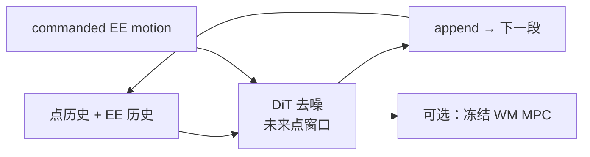
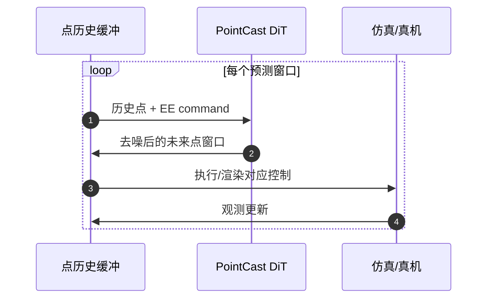

# PointCast（轻量点集世界模型）

**PointCast: One World Model for Rigid, Articulated, and Deformable Object Manipulation**（[arXiv:2609.28393](https://arxiv.org/abs/2609.28393)，[项目页](https://pointcast-wm.github.io/)，**ICRA 2027 匿名投稿**) 用 **持久 3D 点集** 作状态：每点保 identity、监督 **自身轨迹**；**19.8M** Diffusion Transformer 去噪 **短窗口未来点位置**，条件于点历史与 **commanded end-effector motion**；**同一架构 + 同一训练配方** 覆盖 **刚性 / 铰接 / 可变形** 操纵。

## 一句话定义

**不建 mesh、不绑拓扑：用带身份的物体+夹爪点云当 WM 状态，DiT 预测下一段点轨迹，再用同一 checkpoint 做仿真 rollout、真机 PGND 与冻结 MPC 规划。**

## 英文缩写速查

| 缩写 | 英文全称 | 简要说明 |
|------|----------|----------|
| WM | World Model | 动作条件未来状态预测 |
| DiT | Diffusion Transformer | 去噪骨干；8 blocks |
| MPC | Model Predictive Control | 冻结 WM + 采样规划；每窗口 1 次网络评估 |
| PGND | — | 真机 teleop 数据集 benchmark（项目页） |
| EE | End-Effector | 末端执行器；**actor tokens** 表夹爪点 |

## 为什么重要

- **操纵 WM 常被按材质分裂：** PointCast 主张 **点集 + 身份轨迹** 可统一 rigid / cloth / rope / cabinet。
- **轻量：** **19.8M** 参数级，相对视频 WM 更易嵌进 **MPC 内环**。
- **规划闭环：** 不仅开环 rollout，还在 **64 episodes × 4 sim tasks** 上与 baseline 比 MPC。

## 核心信息

| 项 | 内容 |
|----|------|
| **参数量** | **19.8M** |
| **状态** | 物体 + EE 上持久 3D 点；mesh-free |
| **训练** | 随机化仿真；**每 regime 一个 checkpoint**（文意：one checkpoint per regime） |
| **开源** | **待发布**（匿名投稿页，2026-09-25） |

## 核心原理

### 预测接口

- 输入：点 **近期历史** + **指令 EE motion**。
- 输出：短窗口 **未来点位置**（扩散去噪）。
- Rollout：**append** 预测窗口到 history → 再条件化下一段（项目页 Euler 单步叙事）。

### DiT 注意力模式（Fig.3）

| 模式 | 作用 |
|------|------|
| **kNN-local** | 每 query 16 近邻 — 局部形变 |
| **Global（registers）** | register token 看全物体点 — 长程结构 |
| **Cross → actor** | 读夹爪 actor tokens — 学 **EE–材料耦合** |

## 流程总览

## 源码运行时序图

**不适用** — 代码 **待发布**。推理环概念：

## 实验与评测

- **仿真四 regime：** rigid push / cloth lift / rope push / cabinet articulation — **4 中 3 第一**，rigid **第二**（站页 Table I 叙事）。
- **真机 PGND 六类：** **4 类 mean 最佳**，2 类第二；**六类均优于** 数据集自带模型。
- **Zero-shot：** 仿真 ckpt 无 real 训练 → **4 captures 中 2 best**。
- **MPC：** SE(2) push、顺序 articulation、dragging 等；**每窗口 1 forward**。

## 结论

**PointCast 的价值在于用「点身份轨迹 + 统一 DiT」把操纵 WM 的多材质问题压到一个 20M 级接口里，并证明可接到 MPC；弱项仍在 rigid 上与 specialist 的差距与匿名期不可复现。**

1. **状态设计优先于 backbone 炫技** — 身份点轨迹监督 > 只拟合整体形状。
2. **actor cross-attention 承载耦合** — EE 点 token 是物理接口。
3. **分 regime checkpoint** — 「一个架构」≠ 单个权重通吃所有材料。
4. **MPC 是 WM 的硬验收** — 开环视频好看不够。
5. **匿名 + 待发布** — 机构与代码待审稿后更新。
6. **与视频 WM 分工** — 点集适合 **几何/接触**；语义长任务仍可能需要 VLA/WAM 上层。

## 与其他工作对比

| 维度 | PointCast | [Ctrl-World](./paper-ctrl-world.md) |
|------|-----------|-------------------------------------|
| 表征 | **3D 点集 + identity** | 多视角 **像素视频** |
| 规模 | **~20M** | ~1.5B 级视频扩散 |
| 材质 | rigid / deformable / articulated 统一 | 刚体操作场景为主 |
| 下游 | **冻结 MPC** | VLA policy-in-the-loop |

## 关联页面

- [Generative World Models](../methods/generative-world-models.md)
- [Model-Based RL](../methods/model-based-rl.md)
- [Manipulation](../tasks/manipulation.md)

## 参考来源

- [`pointcast_arxiv_2609_28393.md`](../../sources/papers/pointcast_arxiv_2609_28393.md)
- [`pointcast-wm-github-io.md`](../../sources/sites/pointcast-wm-github-io.md)
- *PointCast: One World Model for Rigid, Articulated, and Deformable Object Manipulation*, arXiv:2609.28393, 2026

## 推荐继续阅读

- [项目页](https://pointcast-wm.github.io/)
- [arXiv:2609.28393](https://arxiv.org/abs/2609.28393)
