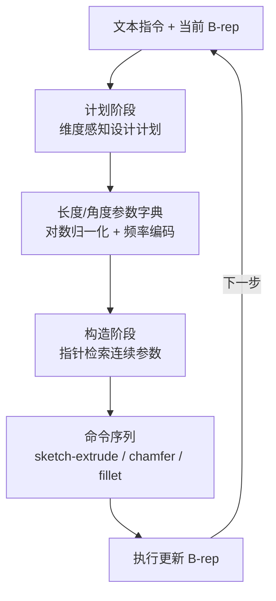

# Pointer-CAD v2（Plan-Then-Construct 参数精度 CAD 生成）

**Pointer-CAD v2**（*Plan-Then-Construct CAD Generation with Dimension-Aware Parametric Precision*，[arXiv:2606.29301](https://arxiv.org/abs/2606.29301)，ECCV 2026）由 **齐大成、王晨宇、徐经纬、马毅、高盛华** 等提出（香港大学 / 深圳河套研究院 / TranscEngram / 莫纳什大学 / UC Berkeley）。它在 [Pointer-CAD v1](https://arxiv.org/abs/2603.04337) 的 **逐步构造 + 指针引用 B-rep 实体** 范式上，引入 **Plan-Then-Construct**：每步先生成 **带公制单位** 的结构化设计计划，再通过 **指针机制** 从参数字典检索 **连续数值** 写入命令序列，从而 **消除命令序列表示中的量化误差**。论文还发布 **OmniCAD-Plan / OmniCAD-Plan+** 计划级标注数据，并提出 **顶点 / 边 / 面** 三级几何精度指标。官方仓库 [Snitro/Pointer-CAD-v2](https://github.com/Snitro/Pointer-CAD-v2) 截至入库日为 **待发布**（README：Code coming soon）。

## 一句话定义

**把 CAD 生成的「参数推理」与「几何构造」解耦：先写带单位的符号设计计划，再用指针从计划字典取连续尺寸驱动命令序列，而不是在量化词表里猜数字。**

## 英文缩写速查

| 缩写 | 英文全称 | 简要说明 |
|------|----------|----------|
| CAD | Computer-Aided Design | 计算机辅助设计；本文输出可执行命令序列与 B-rep |
| LLM | Large Language Model | 大语言模型；骨干为 Qwen2.5-0.5B/1.5B |
| CD | Chamfer Distance | 倒角距离；形状级指标，对毫米级参数偏差不敏感 |
| IoU | Intersection over Union | 交并比；本文强调其不足以评估公差级精度 |
| B-rep | Boundary Representation | 边界表示；逐步执行命令后更新的中间几何真值 |
| RMR | Repairable Model Rate | 可修复模型率；RMR@3 表示错误面数 ≤3 的样本占比 |
| RoPE | Rotary Positional Encoding | 旋转位置编码；用于参数嵌入 |

## 为什么重要

- **问题对准工业公差，不是刷形状像不像：** CD/IoU 在视觉相近时无法区分 **5 mm vs 5.1 mm** 半径；命令序列方法为适配 LLM 自回归，常把连续尺寸 **量化到有限词表**，微小偏差即可违反加工容差。
- **Plan-Then-Construct 是表示层改革：** 与「LLM 直接写 CADQuery 代码」（token 约为命令序列的 ~4×）或「DeepCAD 式离散参数 token」不同，v2 在 **文本计划** 里保留 **符号 + 单位 + 参数引用**，构造阶段只做 **检索式插入**。
- **评测协议可复用：** Vertex / Edge / Face Accuracy 在 **原始尺度、不归一化** 下检验参数对齐；RMR@3 反映「少量面错误可后处理修复」的工程可用性。
- **机器人硬件链路：** 夹具/支架若走 Text-to-CAD，最终仍要 **STEP + 公差审图**（见 [文字生成 CAD](../concepts/text-to-cad.md)）；v2 把「尺寸真值」从生成目标里显式拉出来，比纯 mesh 或形状指标更接近制造前态。

## 核心信息

| 字段 | 内容 |
|------|------|
| 机构 | 香港大学（HKU）；深圳河套研究院（Shenzhen Loop Area Institute）；忆生科技 / TranscEngram；莫纳什大学（Monash University）；加州大学伯克利分校（UC Berkeley） |
| arXiv | [2606.29301](https://arxiv.org/abs/2606.29301)（2026-06-28） |
| 会议 | ECCV 2026 Poster [#3855](https://eccv.ecva.net/virtual/2026/poster/3855) |
| 前作 | [Pointer-CAD v1](https://arxiv.org/abs/2603.04337) — 指针引用 B-rep 实体，参数精度仍受限 |
| 代码 | **待发布**：[Snitro/Pointer-CAD-v2](https://github.com/Snitro/Pointer-CAD-v2)（README：Code coming soon） |
| 骨干 | Qwen2.5-0.5B / 1.5B；10 epoch @ H800 |
| 数据 | OmniCAD-Plan（202K）、OmniCAD-Plan+（209K，含 chamfer/fillet）；基于 Recap-OmniCAD，Qwen3 自动生成 plan 并校验 |
| 主要基线 | Pointer-CAD、CADmium；以及 Qwen3/Gemini/GPT/Claude 生成 CADQuery 代码 |

## 核心原理

### 输入 / 输出

| 侧 | 内容 |
|------|------|
| 输入 | 文本设计指令（及当前步已有 B-rep 条件） |
| 计划输出 | 结构化设计计划：`<>` 内符号参数，类型 L（长度）/ A（角度），绑定单位，可算术与引用 |
| 构造输出 | sketch-extrude / chamfer / fillet 等 **命令序列**；参数经指针从计划字典检索 |
| 最终产物 | 逐步执行后的 **B-rep**（论文在原始 metric scale 下评测） |

### 流程总览

每步在 **单次 forward** 内顺序生成 plan tokens 与 command tokens，用控制 token 分隔，双模态解码头解耦。

### 关键机制（压缩）

1. **相对 v1 的精度升级：** v1 指针主要用于 **实体引用**（边中点、已有顶点等）；v2 扩展为 **数值参数也走指针**，从计划嵌入池余弦检索，避免量化词表。
2. **参数字典编码：** 提取计划内全部 L/A 参数 → 统一米/度 → sign-preserving log 归一化 → Fourier 频率带 + 门控 MLP → RoPE；与 LLM 预测向量同空间匹配。
3. **数据集流水线：** 从 Recap-OmniCAD JSON 抽关键参数 + 专家标注 hint → **Qwen3** 生成 plan → 完整性校验，缺失则最多重试 2 次。
4. **分层精度指标：** 容差 \(\epsilon = 0.001 \times \min(\mathbf{b}^{max}-\mathbf{b}^{min})\)；顶点看欧氏距离，边看端点+几何参数（弧半径、圆法向等），面看边界边+ primitive 类型。

## 源码运行时序图

| 项 | 状态 |
|----|------|
| 源码运行时序图 | **不适用** — 官方 [Snitro/Pointer-CAD-v2](https://github.com/Snitro/Pointer-CAD-v2) 截至入库日仅有 README「Code coming soon」，无 train/eval/data 入口；代码发布后应按 README 补 mermaid sequenceDiagram。 |

## 工程实践

| 项 | 建议 |
|----|------|
| 选型 | 需要 **公制尺寸可控** 的命令序列 CAD 生成时优先跟踪 v2；仅要形状原型可仍用 CD 友好的扩散/检索路线（如 [GenCAD](./gencad.md)） |
| 评测 | 除 CD/F1 外，应报告 **Vertex/Edge/Face Acc** 与 **RMR@3**；对比时确认 **未归一化到单位立方体** |
| 与 v1 关系 | v1 解决 **操作表达力**（chamfer/fillet、实体引用）；v2 解决 **参数精度**；二者论文链连续，复现时勿混用数据集（OmniCAD-Plan vs Recap-OmniCAD） |
| 与代码 CAD 对照 | CADQuery/LLM 代码路线 token 多但 **天然连续参数**；v2 试图在 **命令序列效率** 下逼近同等精度 |
| 开源跟进 | 订阅 GitHub 仓库；发布后立即核查 **OmniCAD-Plan 下载、checkpoint、推理脚本** 是否与论文 Qwen2.5 设定一致 |

## 实验与评测

- **OmniCAD-Plan（1.5B）：** 相对 CADmium-1.5B，三级平均精度 **+13.49%**；RMR@3 **91.25%**；Vertex/Edge/Face 平均约 **92.76 / 89.18 / 88.73**（% Acc）。
- **OmniCAD-Plan+（更复杂，含 chamfer/fillet）：** Ours-1.5B RMR@3 **90.97%**，仍显著高于 Pointer-CAD-1.5B（61.42%）与 CADmium-1.5B（43.41%）。
- **传统指标（0.5B，OmniCAD-Plan）：** Line/Circle F1 ~96–98% 已饱和；**Arc F1** Ours **63.59%** vs Pointer-CAD **51.00%**；Mean CD **3.15** vs **3.69**（改善有限，印证形状指标不敏感）。
- **通用 LLM 写 CADQuery：** 论文附录对比 Qwen3/Gemini/GPT/Claude；在 proposed metrics 上整体弱于专用方法（细节见补充材料）。

## 与其他工作对比

> 下表做**定位对照**：本页数字取自论文 OmniCAD-Plan(+) 表格（**未归一化**到单位立方体），与下列各页的评测设定不通用。

| 对照 | 差异读法 |
|------|----------|
| **Pointer-CAD v1 / CADmium**（本文的直接基线） | 同为命令序列 CAD 生成，差别在**连续参数从哪来**：v1 的指针只引 B-rep 实体、数值仍走量化词表，CADmium 同样受限；v2 把数值也改成从计划字典指针检索。OmniCAD-Plan+ 上 RMR@3 **90.97%** vs **61.42% / 43.41%** 就是这一处的代价差 |
| **LLM 直接写 CADQuery 代码**（Qwen3 / Gemini / GPT / Claude） | 参数天然连续、无量化误差，但 token 约为命令序列 **4×**；v2 要的是「命令序列的效率 + 代码路线的精度」。论文附录在 proposed metrics 上通用 LLM 整体弱于专用方法 |
| [GenCAD](./gencad.md) / [GenCAD-3D](./gencad-3d.md) | 目标函数不同：这两条以 CD 类形状指标为主；v2 明确指出 CD 分不开 5 mm 与 5.1 mm——Mean CD **3.15 vs 3.69** 改善有限，Arc F1 却从 **51.00%** 到 **63.59%**。要形状原型走前者，要公差走 v2 |
| [Multi-Agent CAD](./multi-agent-cad.md) / [CAD Skills](./cad-skills.md) | 抽象层不同：这两条在**编排 / 工具链**层组织 LLM 与 build123d / STEP，v2 改的是单模型的表示层。正交，可叠加 |
| [文字生成 CAD](../concepts/text-to-cad.md) | 该页给能力边界；v2 把「尺寸真值」显式拉出来，但仍不等于工程图 + GD&T + DFM，下游审图不可省 |

## 结论

**Pointer-CAD v2 把 Text-to-CAD 的主战场从「看起来像」推进到「尺寸对、单位对、可修」——计划阶段写公制参数、构造阶段用指针取连续值，是命令序列路线里针对工业公差的明确架构回答。**

1. **Plan-Then-Construct 有效解耦** — 参数推理在文本计划完成，构造阶段不再预测量化 token，从机制上消除 discretization error。
2. **指针机制从「引实体」扩展到「引尺寸」** — 继承 v1 的 B-rep 实体池，同时用同一相似度检索插入 **连续参数字典** 条目。
3. **新指标比 CD 更贴工程** — Vertex/Edge/Face Accuracy + RMR@3 能拉开视觉相近但尺寸不同的模型；部署评估应 **并列报告**，不能只看 CD。
4. **相对 Pointer-CAD / CADmium 提升大且稳定** — 在 OmniCAD-Plan(+) 上 0.5B/1.5B 均一致领先；复杂操作集（Plan+）上优势保持。
5. **Arc F1 等细粒度指标仍有空间** — 即使 Ours 提升明显，Arc F1 63.59% 说明 **圆弧/复杂边** 仍是短板。
6. **代码尚未开放** — 论文写 code available，但 GitHub 仍为 coming soon；复现前以 **待发布** 计，勿假设可跑通训练。
7. **机器人夹具场景** — 生成结果仍须 **人工审图 + STEP 下游 + 公差签核** 后再进加工或 [Sim2Real](../concepts/sim2real.md) 碰撞链。

## 局限与风险

- **任务域：** 基于 Recap-OmniCAD 命令集（sketch-extrude 为主，Plan+ 含 chamfer/fillet）；工业 **loft/revolve/装配约束** 未覆盖。
- **计划质量依赖 Qwen3 标注流水线** — 数据构造与推理都假设 plan 结构可解析；域外文本或单位混用需额外校验。
- **开源空窗：** 无代码则无法验证 OmniCAD-Plan 发布形态、训练细节与 ECCV 版本是否一致。
- **与制造闭环距离：** 高精度 B-rep 仍不等于 **工程图 + GD&T + DFM**；见 [Text-to-CAD](../concepts/text-to-cad.md) 能力边界。

## 关联页面

- [文字生成 CAD（Text-to-CAD）](../concepts/text-to-cad.md) — LLM 脚本 CAD vs 学习式命令序列谱系
- [GenCAD](./gencad.md) — 图像条件 CAD program + 潜扩散（形状指标导向）
- [GenCAD-3D](./gencad-3d.md) — 点云/网格条件 CAD program
- [Multi-Agent CAD（MAC）](./multi-agent-cad.md) — LLM + build123d 多智能体编排对照
- [CAD Skills](./cad-skills.md) — Agent Skills 制造向 STEP 链
- [Sim2Real](../concepts/sim2real.md) — CAD/STEP 进入仿真的几何一致性

## 推荐继续阅读

- [arXiv:2606.29301](https://arxiv.org/abs/2606.29301) · [HTML 全文](https://arxiv.org/html/2606.29301)
- [Pointer-CAD v1（arXiv:2603.04337）](https://arxiv.org/abs/2603.04337) — 指针实体引用与 Recap-OmniCAD 语境
- [DeepCAD（ICCV 2021）](https://arxiv.org/abs/2105.09492) — 命令序列 CAD 生成基线与数据格式
- [ECCV 2026 Poster](https://eccv.ecva.net/virtual/2026/poster/3855)

## 参考来源

- [Pointer-CAD v2 论文摘录（arXiv:2606.29301）](../../sources/papers/pointer_cad_v2_arxiv_2606_29301.md)
- [Snitro/Pointer-CAD-v2 仓库归档（待发布）](../../sources/repos/snitro-pointer-cad-v2.md)
