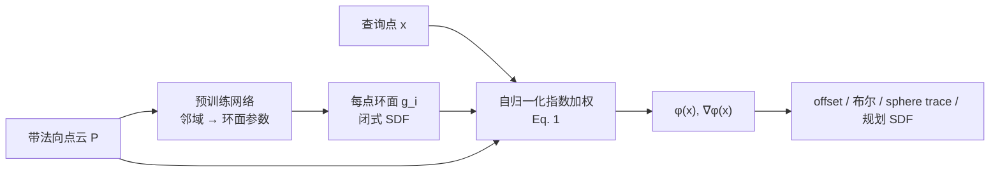
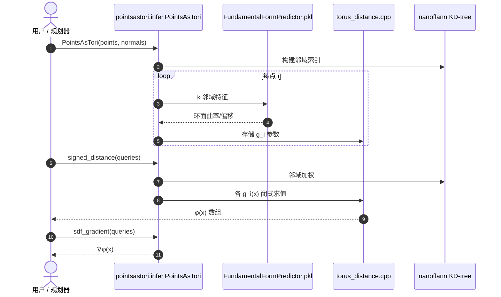

# Points as Tori（PAT）

**Points as Tori（PAT）**（*Fast Pointwise Signed Distance for Point Clouds*，[arXiv:2607.16946](https://arxiv.org/abs/2607.16946)，Nicole Feng / Ioannis Gkioulekas† / Keenan Crane† · **卡内基梅隆大学（CMU）**；[项目页](https://nzfeng.github.io/research/PointsAsTori/index.html)，[代码](https://github.com/nzfeng/points-as-tori)）从 **带法向点云** 直接估计 **有符号距离场（SDF）**，支持任意空间分辨率的 **点查询**，无需体素离散或全局优化。

## 一句话定义

**用预训练网络为每个点拟合局部环面 SDF，再以自归一化指数加权聚合，得到既可重建又可距离查询的解析 SDF。**

## 英文缩写速查

| 缩写 | 英文全称 | 简要说明 |
|------|----------|----------|
| PAT | Points as Tori | 本文方法：点云局部环面 + 加权 SDF 聚合 |
| SDF | Signed Distance Function / Field | 有符号距离；内外侧符号相反，\(\|\nabla\phi\|\approx 1\) |
| PSR | Poisson Surface Reconstruction | 经典全局隐式重建；本文理论统一对象之一 |
| KD-tree | K-Dimensional Tree | 官方实现用 nanoflann 加速邻域与查询 |
| GPU | Graphics Processing Unit | 预训练 ≈45 h（RTX 3090）；查询可 CPU/OpenMP 并行 |

## 为什么重要

- **机器人管线接口：** 激光/RGB-D/深度融合点云常缺稠密 mesh；PAT 把点云直接变成 **可查询 SDF**，可接入 [碰撞距离优化](../concepts/collision-distance-optimization.md)、导航软惩罚与穿透检测，而不必先体素化或跑 Poisson。
- **快且可并行：** 相对全局优化或 per-shape 神经隐式，推理侧是 **点级独立查询** + 一次环面预计算；官方报单次查询 **10⁻⁴–10⁻³ s**（百万点云预计算 <60 s，RTX 3090）。
- **学习用量克制：** 只对「邻域→环面参数」预训练一次（≈6.4 MB）；避免端到端神经 SDF 的 eikonal 局部极小与 per-shape 训练成本。
- **理论澄清：** 说明 decades 的卷积距离 / winding number / Poisson 路线为何对 **采样几何** 不能同时给出好重建与好距离，并给出可泛化的自归一化 + 局部基设计空间。

## 核心信息

| 项 | 内容 |
|----|------|
| **机构** | 卡内基梅隆大学（CMU） |
| **作者** | Nicole Feng；Ioannis Gkioulekas†；Keenan Crane†（† 同等贡献） |
| **发表** | ACM Transactions on Graphics（**SIGGRAPH 2026**）；DOI [10.1145/3811385](https://doi.org/10.1145/3811385) |
| **输入** | 点云 \(\{(\mathbf{p}_i,\mathbf{n}_i)\}\)（需法向） |
| **输出** | 任意查询点 \(\mathbf{x}\) 的 \(\phi(\mathbf{x})\) 与 \(\nabla\phi(\mathbf{x})\) |
| **预训练** | `FundamentalFormPredictor.pkl`（随官方仓）；训练数据 Google Drive 6.2 GB |
| **开源（截至 2026-09-12）** | **已开源（MIT）**：推理 API、`demo/`、`training/train.py`；PyPI 发布为 TODO |

## 核心原理（方法）

### 自归一化环面聚合

对查询点 \(\mathbf{x}\)，PAT 计算

\[
\phi(\mathbf{x})=\frac{\sum_{i=1}^{|P|} g_i(\mathbf{x})\,\exp\!\left(-\lambda_{\mathbf{x}}\|\mathbf{x}-\mathbf{p}_i\|\right)}{\sum_{i=1}^{|P|}\exp\!\left(-\lambda_{\mathbf{x}}\|\mathbf{x}-\mathbf{p}_i\|\right)},
\]

其中 \(g_i\) 是拟合到点 \(\mathbf{p}_i\) 邻域的 **环面闭式 SDF**（二阶局部逼近 + 廉价距离查询），\(\lambda_{\mathbf{x}}\) 自动选取。

相对单点卷积距离公式（Hopf–Cole / winding number 极限），自归一化变体可通过 \(g_i\) **塑造最近点处流形景观**，从而从离散采样泛化到连续表面。

### 数据驱动环面拟合

| 组件 | 作用 |
|------|------|
| **固定大小 k 邻域** | 避免手工核带宽在边/角处的鸡生蛋问题 |
| **预训练网络** | 输入邻域几何 → 曲率/偏移等环面参数 |
| **C++ 环面距离** | `torus_distance.cpp` 闭式 SDF + OpenMP |

训练在大量合成局部块上 **一次性完成**；推理时对任意新点云只做环面预计算（与点数线性），再做点查询。

### 流程总览

## 源码运行时序图

节点对齐 [`sources/repos/points-as-tori.md`](../../sources/repos/points-as-tori.md)。典型 **推理** 路径：

可选：`demo/demo_3d.py` 对 φ 做切面 sphere tracing 可视化。

## 工程实践

| 步骤 | 说明 |
|------|------|
| 环境 | `git submodule update --init --recursive` → `pip install .`（nanobind + OpenMP） |
| 法向 | 输入必须含一致法向；噪声法向会传导到环面拟合 |
| 预计算 | 100k 点 <10 s；1M <60 s（RTX 3090）；可序列化 tori 复用 |
| 查询 | `pat.signed_distance(queries)` / `pat.sdf_gradient(queries)` |
| 训练 | `training/train.py` + Drive 数据；仅扩展网络时需要 |
| 机器人接入 | 将 φ 接入 TrajOpt / NMPC 软惩罚或硬约束；注意与 [cuRobo](../entities/curobo.md) 等 GPU 体素 SDF 的坐标系与尺度对齐 |

## 局限与风险

- **预计算随点数线性增长：** 千万级以上点云需分钟–十分钟级预处理，不适合每帧全量重算。
- **分布外几何：** 项目页指出全局非学习方法（如 signed heat method）在严重 OOD 输入上可能更稳；PAT 依赖预训练邻域统计。
- **法向质量敏感：** 无鲁棒法向估计时，符号与细节会退化。
- **非机器人专用：** 未集成机器人 URDF / 自碰撞；需自行把场景点云与机器人 SDF 合成。
- **demo 依赖重：** 可视化需 Python 3.9–3.11 + pyglet；生产管线可只用 API。

## 评测与指标（论文/项目口径）

- **速度：** 单次查询 10⁻⁴–10⁻³ s；相对端到端神经隐式拟合，环面预计算快一个数量级以上（作者自述）。
- **质量：** 在摄影测量、mesh 采样、3D Gaussian、神经隐式等多源点云上展示 offset / 布尔 / sphere tracing；定量表见论文。
- **资源：** 网络磁盘 ≈6.4 MB；预训练 ≈45 h（单 RTX 3090）。

## 结论

**PAT 把「点云 → 可查询 SDF」做成一次预训练 + 每云环面预计算 + 点级聚合，在几何处理侧同时兼顾速度与泛化，对机器人是「免体素化的距离场前端」候选。**

- **真影响指标：** 是否接受 **法向点云 + 预计算** 换取 **无体素、点级并行** 的 φ 查询；百万点规模下预计算 <1 min 通常可接受。
- **次要代价：** 千万点预计算、OOD 鲁棒性、PyPI/轻量 demo 仍待完善。
- **部署读法：** 静态场景或低频地图更新 → 预计算 tori 后复用；高频动态障碍仍需更快增量更新或回退体素 ESDF。
- **与 cuRobo 等分工：** GPU 体素 SDF 擅长已知 mesh 障碍批量规划；PAT 擅长 **传感器点云直接距离化**。
- **开源：** MIT 仓含推理与训练；不是「将开源」状态。

## 与其他页面的关系

- [Collision Distance Optimization](../concepts/collision-distance-optimization.md) — SDF 在规划优化中的角色
- [Embodied Perception Six Spatial Representations](../concepts/embodied-perception-six-spatial-representations.md) — 点云 vs TSDF/ESDF 表示选型
- [Grasp Pose Estimation](../methods/grasp-pose-estimation.md) — 点云感知上游
- [Smooth Navigation Path Generation](../methods/smooth-navigation-path-generation.md) — 导航 SDF 软惩罚
- [cuRobo](../entities/curobo.md) — GPU 运动规划中的 SDF 查询对照

## 参考来源

- [`sources/papers/points_as_tori_arxiv_2607_16946.md`](../../sources/papers/points_as_tori_arxiv_2607_16946.md) — 论文摘录与开源核查
- [`sources/repos/points-as-tori.md`](../../sources/repos/points-as-tori.md) — 官方仓库入口与 API
- [`sources/sites/points-as-tori.md`](../../sources/sites/points-as-tori.md) — 项目页理论与 demo

## 推荐继续阅读

- [官方项目页（含长文解读）](https://nzfeng.github.io/research/PointsAsTori/index.html)
- [GitHub 仓库](https://github.com/nzfeng/points-as-tori)
- [arXiv:2607.16946](https://arxiv.org/abs/2607.16946)
