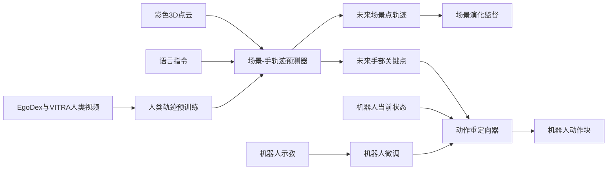

# PointWAM：灵巧操作的 3D 世界动作模型

**PointWAM** 把场景与手都表示为同一三维坐标系下的点轨迹，联合预测二者如何共演化，并将未来手部轨迹转成机器人动作。

## 英文缩写速查

| 缩写 | 英文全称 | 简要说明 |
|------|----------|----------|
| WAM | World Action Model | 联合预测环境变化与机器人动作的模型 |
| VLA | Vision-Language-Action | 视觉/语言条件动作策略对照范式 |
| 3D | Three-Dimensional | 场景、手与轨迹共享的空间表示 |
| EgoDex | Egocentric Dexterous Manipulation | PointWAM 使用的人类第一视角灵巧操作数据来源之一 |

## 为什么重要

灵巧操作取决于手指相对物体表面的接触几何。RGB 帧未来预测能够保留外观，却可能弱化接触关系；只预测末端动作又缺少场景将怎样变化的显式表示。PointWAM 用点轨迹同时承载场景与手运动，使人类示范和机器人示范可在相同的三维运动形式中预训练/微调。

## 方法栈：场景与手的共同 3D 轨迹

### 输入表示与前向预测

输入为彩色点云与语言任务指令。轨迹 forecaster 接收场景点、手部关键点和指令 token，经 Transformer 与两个预测头输出每个可见 scene point 和 hand keypoint 的未来轨迹。两类点共享 space-time frame，并不要求手工挑选任务物体或物体关键点。

### 从未来手运动到机器人动作

action retargeter 读取预测的手部运动轨迹和机器人状态，解码动作 chunk。场景预测作为世界演化监督；手轨迹是可 retarget 的动作计划。其核心区分是：scene future 不只是像素生成，hand future 也不只是孤立的动作向量。

### 人类演示预训练与机器人微调

论文将 EgoDex 和 VITRA 合计 1.15M 人类演示片段表示为 3D scene/hand trajectories 进行 forecaster 预训练，再以机器人示教微调。人类视频没有机器人动作标签；模型学习人手与对象的运动耦合，之后再适配机器人手的运动学。

## 工程实践

- **人类视频轨迹化：** 论文附录用单目/ego 视频重建深度并对场景点做跟踪、反投影；手部关键点按手腕与指尖状态构造。点数、voxel 尺度和可见性过滤影响算力与几何细节。
- **训练数据边界：** RoboDojo-Precision 数据没有逐帧场景轨迹标签，因此该设置微调只监督手和动作，scene head 冻结；不要认为每个 benchmark 都完整使用 joint scene supervision。
- **代码状态：** 项目页明确 “Code soon”，arXiv 没给 PointWAM 官方 GitHub；截至 2026-10-06 不存在可核验运行入口，源码运行时序图不适用。
- **潜在工程成本：** 点云深度、相机标定、点跟踪、跨人/机器人坐标约定与灵巧手关键点重定向会构成前处理和本体适配成本；论文结果不能直接替代这些系统模块。

## 实验与评测

- **DexJoCo：** Franka + 16-DoF Allegro hands，6 个单臂与 4 个双臂任务；平均十任务成功率 69.0%，超过此前最强多任务基线 11.7 个百分点。单任务设置的均值和多任务设置不同，比较时不要混用。
- **人类视频预训练消融：** 平均成功率提升 56.9 个百分点；加入 scene-trajectory supervision 相对只预测 hands 提升 10.9 个百分点。
- **RoboDojo-Precision：** 双 ARX X5 与平行夹爪设定；因示教缺少场景轨迹标注，微调只对 hand points / actions 监督。
- **真机：** OpenArm、两只 Inspire hands、ZED 2i；项目页和论文展示香蕉 pick-and-place、方孔插销等真机任务。实机成功证据覆盖两个任务，不应外推为任意物体/灵巧任务泛化。

## 与其他工作对比

- **视频 WAM：** 常以 RGB frame 或 latent 预测未来；PointWAM 显式预测可解释的三维场景点和手点轨迹，更直接地保留空间/接触关系，但依赖点云几何和轨迹估计。
- **Point policy：** 以手部轨迹预测动作的点策略没有显式建模环境共同变化；PointWAM 增加 scene trajectory head，消融显示该监督有额外收益。
- **普通 VLA：** 视觉—语言到动作直接映射，不显式要求同时预测 scene evolution；PointWAM 的优势主要在结构化 3D world modeling 与 action retargeting，不代表在所有大规模任务上取代 VLA。

## 结论

**PointWAM 的关键不是「用点云替代图像」，而是用 scene 与 hand 的共同三维轨迹把世界演化监督接到灵巧动作生成上。**

1. **共同预测场景与手** — 相比只预测手，scene trajectory supervision 在论文消融中提升 10.9 个百分点。
2. **人类视频可作 action-free 预训练信号** — 1.15M EgoDex/VITRA episodes 提供人手—场景运动先验，再用机器人示教对齐 embodiment。
3. **对象选择从输入中移除** — 每个观测场景点参与预测，减少 task-specific 预选物体依赖，但带来大规模点轨迹计算。
4. **多任务成功率要对齐协议** — DexJoCo 多任务十项约 69.0%；单任务、全随机化与真机结果须分别读。
5. **当前还不能按仓库复现** — 项目页仅标 “Code soon”，论文实体不应添加虚构的 GitHub 链接或可执行时序图。

## 局限与风险

- 深度估计、场景点跟踪和相机标定可能将视觉误差传入未来轨迹与动作 retargeting。
- 人类手部轨迹与机器人灵巧手运动学不同，机器人示教微调不可省略。
- 不同 benchmark 的监督信息并不相同；部分机器人数据没有 scene trajectory labels。
- 官方代码待发布，论文数字目前不足以判断训练成本、部署时延、资源需求及完整复现难度。

## 关联页面

- [World Action Models（WAM）](../concepts/world-action-models.md) — PointWAM 是显式 3D 轨迹型实例，已补入站内链接。
- [VLA](../methods/vla.md) — 直接观测到动作范式的对照。
- [Manipulation](../tasks/manipulation.md) — 灵巧操作与真机评测任务背景。

## 参考来源

- [论文来源归档](../../sources/papers/pointwam_arxiv_2610_02840.md)
- [项目页来源归档](../../sources/sites/pointwam.md)
- [arXiv:2610.02840](https://arxiv.org/abs/2610.02840)

## 推荐继续阅读

- [PointWAM 项目页](https://chrockey.github.io/PointWAM/)
- [PointWAM 论文](https://arxiv.org/abs/2610.02840)
