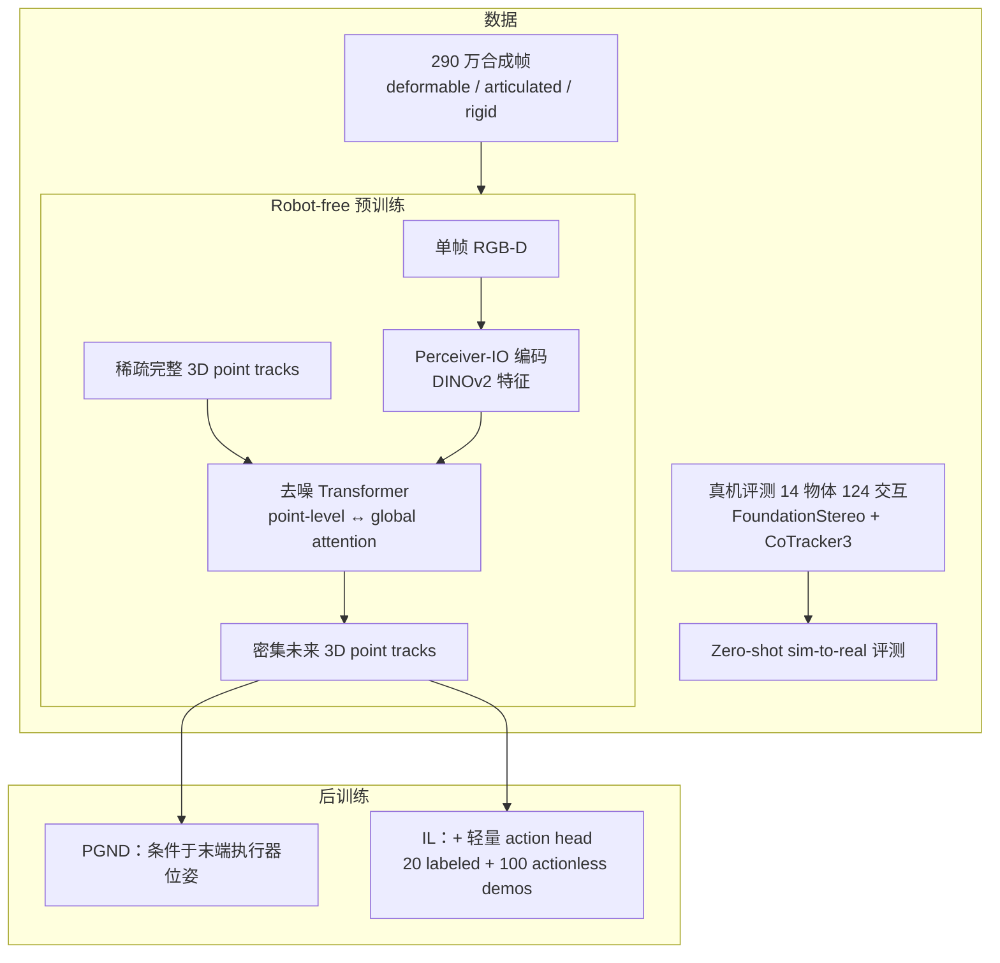
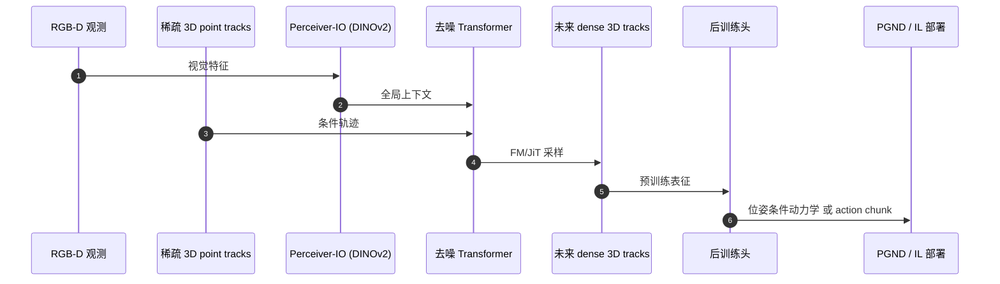

# PointZero（arXiv:2609.19142）

**PointZero**（*PointZero: 3D Point Track Completion for Learning Transferable 3D Dynamics*，[arXiv:2609.19142](https://arxiv.org/abs/2609.19142)，[项目页](https://pointzero-wm.github.io/)，[GitHub](https://github.com/Duisterhof/pointzero)）由 **CMU / Columbia / NVIDIA** 联合提出：把 **3D 点轨迹补全** 当作 **无需机器人动作标签** 的预训练目标，从 RGB-D 与稀疏轨迹预测全场景未来 3D tracks，再微调到 **动作条件动力学** 与 **模仿学习**。本页基于 [项目页直 ingest](../../sources/sites/pointzero.md)（2026-09-21）补全；初稿来自 [具身智能小站 11 篇盘点](../../sources/blogs/wechat_embodied_station_11_papers_constraint_control_2026-09-20.md)。

## 一句话定义

**用 RGB-D + 稀疏 3D 点轨迹补全学 robot-free 3D 动力学先验，再后训练到末端位姿条件预测与 IL action head，在 PGND 与 7 任务操作基准上显著优于同架构从零训练与 DP3 等基线。**

## 英文缩写速查

| 缩写 | 英文全称 | 简要说明 |
|------|----------|----------|
| WM | World Model | 预测场景/物体如何随交互演化 |
| RGB-D | RGB-Depth | 单帧彩色 + 深度观测 |
| FM | Flow Matching | 生成式轨迹采样目标，优于直接回归 |
| IL | Imitation Learning | 20 条带动作 + 100 条无动作视频/任务 |
| PGND | — | 真机 3D 动力学 benchmark（Bread/Paperbag/Cloth 等 6 场景） |
| MDE | Mean Displacement Error | 轨迹误差（项目页表，单位 cm） |
| CD | Chamfer Distance | 点集形状距离 |
| EMD | Earth Mover's Distance | 分布距离 |
| DP3 | 3D Diffusion Policy | IL 对比基线 |
| Sim2Real | Simulation to Real | 合成预训练 → 真机 IL / PGND 评测 |

## 为什么重要

- **扩大预训练数据池：** 监督仅为 3D point tracks（仿真可得，原则上也可从视频点跟踪得到），**不依赖机器人动作标签**，可把 web 视频动力学纳入世界模型预训练。
- **统一 3D 接口：** 标签与条件都是 3D 轨迹，与像素 rollout 世界模型相比更几何化、更易接到操作栈。
- **预训练 + 后训练闭环验证：** 同架构 **Scratch** 在 PGND 与 IL 上均显著落后，说明增益来自 **预训练目标与数据**，而非仅架构调参。
- **操作侧证据：** 7 个仿真+真机任务中 **6 个达或超基线**，且 **全面优于 DP3**；Blockstack 99.8%、Drawer/Cup 100% 等具名任务成功率来自项目页 Table。
- **与点云 WM 线对照：** 同数据上优于 [ParticleFormer](./paper-sa-2506-23126-particleformer-a-3d-point-cloud-world-model-for.md)、PGND、GBND 等；与 [3D Point World Models](./paper-sa-2607-00148-3d-point-world-models-point-completion-enables-m.md) 同属「点补全 → 动力学」思路，PointZero 强调 **track completion + robot-free 预训练 + IL 后训练**。

## 流程总览

## 核心机制（归纳）

### 预训练：3D Point Track Completion

- **输入：** 单帧 RGB-D + 少量 **完整** 3D point tracks（稀疏条件）。
- **输出：** 场景中 **所有观测点** 的未来 3D 轨迹（dense completion）。
- **关键设计：** 监督与条件均为 3D tracks → **interaction-agnostic**，无需 robot action；仿真与（原则上）视频点跟踪皆可提供标签。
- **架构：** **Perceiver-IO** 视觉编码（**DINOv2** 特征）+ **去噪 Transformer**，交替 **point-level** 与 **global attention**。
- **生成目标：** **Flow Matching / JiT** 优于直接回归；项目页 ablation 在同合成 held-out 上 PointZero-FM 全面优于 GBND、ParticleFormer、PGND、PTv3。

### 后训练路径

| 路径 | 条件/头 | 评测 |
|------|---------|------|
| **动作条件动力学** | 微调节点于 **末端执行器位姿** | PGND 6 真机–物体场景 |
| **模仿学习** | **轻量 action head** + 点轨迹 | 3 sim + 4 real 操作任务 |

### 合成 held-out 误差（项目页，cm，oracle-10）

| 方法 | Deformable MDE↓ | Articulated MDE↓ | Rigid MDE↓ |
|------|-----------------|------------------|------------|
| PGND | 9.01 | 8.70 | 67.58 |
| PTv3 | 9.20 | 8.25 | 61.97 |
| PointZero-FM-oracle-10 | **2.80** | **1.96** | **19.91** |

*Mean-10 / CD / EMD 等同表见项目页；Bold 为各列最优。*

## 源码运行时序图

节点对齐 [`sources/repos/pointzero.md`](../../sources/repos/pointzero.md) 与 [Duisterhof/pointzero](https://github.com/Duisterhof/pointzero)。截至 2026-09-21 仓库 **尚无** 可运行脚本，下图据项目页方法描述；官方 release 后应对齐 README 入口。

- **预期复现路径（待官方发布）：** 合成数据预训练 → checkpoint → PGND 或 IL 微调 → 对照 Scratch / DP3 协议。

## 实验与评测

### PGND 动作条件动力学（真机，cm，oracle best-of-10）

PointZero-FT 在 **Bread / Paperbag / Cloth / Box / Rope / Sloth** 六场景中，**4/6 场景 MDE 最优**；同架构 **PointZero-Scratch** 全面落后 PGND 与 PointZero-FT。

| 场景 | PGND MDE↓ | PointZero-FT MDE↓ | PointZero-Scratch MDE↓ |
|------|-----------|-------------------|------------------------|
| Bread | 2.0 | **1.5** | 4.2 |
| Cloth | 4.5 | **4.0** | 5.6 |
| Sloth | 4.3 | **3.9** | 7.3 |

### 模仿学习成功率（%，20 labeled + 100 actionless demos/任务）

| 任务 | DP3 | ATM | 3PoinTr | PointZero-FT |
|------|-----|-----|---------|--------------|
| Blockstack (sim) | 44.4 | 40.0 | 90.9 | **99.8** |
| Microwave (sim) | 31.4 | 30.4 | 80.8 | **93.1** |
| Glass (sim) | 74.9 | 3.9 | 95.2 | **95.9** |
| Drawer (real) | 70.0 | 30.0 | 90.0 | **100.0** |
| Cup (real) | 80.0 | 30.0 | 100.0 | **100.0** |
| Paper (real) | 10.0 | 0.0 | 90.0 | 70.0 |
| Sock (real) | 20.0 | 0.0 | 90.0 | **90.0** |

- **读法：** 7 任务中 **6 个 best/joint-best**；**全面优于 DP3**；Paper-into-cup 唯一未达最高（3PoinTr 90%）。

### 预训练消融（sim，20 labeled demos，无 extra videos）

| 设定 | Scratch 平均成功率 | Pretrained 平均成功率 |
|------|-------------------|----------------------|
| 全参数微调 + 下游 track 监督 | 80.5% | **88.2%** |
| 冻结预训练点流 | 74.1% | **80.0%** |

## 工程实践

| 项 | 内容 |
|----|------|
| **机构** | 卡内基梅隆大学（CMU）、哥伦比亚大学（Columbia）、英伟达（NVIDIA） |
| **观测** | 单帧 RGB-D + 稀疏 3D tracks |
| **预训练数据** | 290 万合成帧；真机评测集 14 物体 / 124 交互 |
| **IL 数据协议** | 20 action-labeled + 100 actionless demos / 任务 |
| **开源状态** | **待发布** — 见下节 |
| **部署前核对** | PGND / IL 任务协议、demo 数量、oracle vs mean-10 报告口径 |

## 局限与风险

### 开源状态（步骤 2.5，2026-09-21）

| 资源 | 状态 |
|------|------|
| 论文 PDF | **已公开**（arXiv） |
| GitHub 代码 | **待发布** — README：*Release coming soon* |
| 合成/真机数据集 | **待发布** — 项目页 Dataset **Coming Soon** |
| Checkpoints / 训练配方 | **待发布** — 页上尚无下载链 |

- 公众号初稿写「已开源」系指 **仓库 URL 存在**；以 **2026-09-21 项目页 + README 再核** 为准，复现前需等待官方 release。
- **Oracle-10 指标** 用 GT 从 10 次采样中选最优，部署默认 **mean-10** 可能更低。
- **Paper-into-cup** 真机 70% 仍低于 3PoinTr 90%，说明并非全任务碾压。
- 预训练依赖 **高质量 3D track 标注**；从 raw video 迁移需 CoTracker 等跟踪链，误差会传导。

## 与其他工作对比

- **vs 动作条件 3D WM（PGND 等）：** PointZero 预训练 **不要 action label**，后训练才引入末端位姿；同数据合成 held-out 上 FM 版全面领先 PGND / ParticleFormer。
- **vs [DP3](../methods/diffusion-policy.md)：** IL 线 7 任务全面更高成功率，但 PointZero 额外需要 **点轨迹预训练栈** 与 **actionless 视频**。
- **vs [ParticleFormer](./paper-sa-2506-23126-particleformer-a-3d-point-cloud-world-model-for.md)：** 同属点云/点轨迹 3D WM；PointZero 强调 **track completion 预训练 + IL 后训练** 与 **290 万帧合成数据**。
- **vs Scratch：** 同架构预训练 vs 从零，PGND 与 IL 均显示 **预训练关键**。

## 结论

**PointZero 把「3D 点轨迹补全」做成可规模化的 robot-free 3D 动力学预训练，后训练到 PGND 与 IL 的证据链完整，但代码与数据截至入库日仍待官方发布。**

1. **预训练目标** 是核心：无 action label 即可从合成（及潜在 web video）学 transferable 3D dynamics。
2. **同架构 Scratch 对照** 证明增益来自预训练，而非仅 Transformer 容量。
3. **IL 线** 7 任务 6 胜、全面超 DP3，适合「少量 labeled + 大量 actionless 视频」数据 regime。
4. **PGND 线** 4/6 场景最优，但 Scratch 仍远弱于 FT — 部署动力学预测务必用预训练 checkpoint（发布后）。
5. **复现门槛：** 等待 GitHub / Dataset / checkpoint 发布；勿按「已开源」假设可立即跑通。
6. **评测读法：** 区分 oracle-10 vs mean-10；Paper 任务等个别场景仍有更强基线。

## 关联页面

- [Generative World Models](../methods/generative-world-models.md)
- [World Action Models](../concepts/world-action-models.md)
- [Manipulation](../tasks/manipulation.md)
- [Diffusion Policy / DP3](../methods/diffusion-policy.md)
- [ParticleFormer](./paper-sa-2506-23126-particleformer-a-3d-point-cloud-world-model-for.md)
- [3D Point World Models（Awesome WM #089）](./paper-sa-2607-00148-3d-point-world-models-point-completion-enables-m.md)
- [RoboVAD](./paper-robovad.md)
- [11 篇约束控制技术地图](../overview/constraint-control-11-papers-technology-map.md)

## 参考来源

- [pointzero_arxiv_2609_19142.md](../../sources/papers/pointzero_arxiv_2609_19142.md)
- [pointzero 项目页归档](../../sources/sites/pointzero.md)
- [pointzero 官方仓库归档](../../sources/repos/pointzero.md)
- [wechat_embodied_station_11_papers_constraint_control_2026-09-20.md](../../sources/blogs/wechat_embodied_station_11_papers_constraint_control_2026-09-20.md)
- [arXiv:2609.19142](https://arxiv.org/abs/2609.19142)

## 推荐继续阅读

- [项目页](https://pointzero-wm.github.io/) — 完整表格、视频与 method 交互图
- [arXiv PDF](https://arxiv.org/pdf/2609.19142)
- [GitHub（待 release）](https://github.com/Duisterhof/pointzero)
- [ParticleFormer 实体页](./paper-sa-2506-23126-particleformer-a-3d-point-cloud-world-model-for.md) — 同赛道点云 WM 对照
