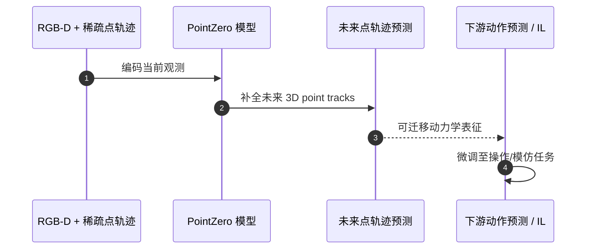

# PointZero（arXiv:2609.19142）

**PointZero**（*PointZero: 3D Point Track Completion for Learning Transferable 3D Dynamics*，[arXiv:2609.19142](https://arxiv.org/abs/2609.19142)，[项目页](https://pointzero-wm.github.io/)，[代码](https://github.com/Duisterhof/pointzero)）来自 [具身智能小站 11 篇盘点](../../sources/blogs/wechat_embodied_station_11_papers_constraint_control_2026-09-20.md)（2026-09-20）。

## 一句话定义

**RGB-D + 稀疏 3D 点轨迹预测未来轨迹；290 万合成帧覆盖刚体/关节/可变形；微调到动作预测与 IL 后 7 任务中 6 个达或超基线，无需机器人动作标签预训练。**

## 英文缩写速查

| 缩写 | 英文全称 | 简要说明 |
|------|----------|----------|
| WM | World Model | 环境/物体动力学预测 |
| RGB-D | RGB-Depth | 彩色深度观测 |
| IL | Imitation Learning | 模仿学习 |
| Sim2Real | Simulation to Real | 仿真到真机迁移 |

## 为什么重要

- 机器人动作标签难规模化；网络视频含丰富物体运动，可用点轨迹补全学可迁移 3D 动力学。
- 开源结论：**已开源**（步骤 2.5，2026-09-20）。
- 与 [11 篇技术地图](../overview/constraint-control-11-papers-technology-map.md) 中同类工作可横向对照。

## 核心机制

| 项 | 内容 |
|----|------|
| **arXiv** | [2609.19142](https://arxiv.org/abs/2609.19142) |
| **开源** | **已开源** |
| **要点** | 从 RGB-D 与稀疏点轨迹预测未来 3D point tracks；大规模合成预训练 → 下游动作预测/模仿微调。 |
| **文内指标** | 2.9M 合成帧；7 个仿真+真机操作任务中 6 个 ≥ baseline（作者报告）。 |

## 源码运行时序图

节点对齐 [`sources/repos/pointzero.md`](../../sources/repos/pointzero.md) 与 [Duisterhof/pointzero](https://github.com/Duisterhof/pointzero)。

- **最短路径：** 克隆仓库 → 按 README 预训练/微调 → 在 7 任务协议上对照 baseline。

## 实验与评测

- 2.9M 合成帧；7 个仿真+真机操作任务中 6 个 ≥ baseline（作者报告）。
- **读法：** 索引级摘要；逐项对照与 baseline 以原文 PDF 为准。

## 与其他工作对比

- 横向索引见 [11 篇技术地图](../overview/constraint-control-11-papers-technology-map.md)；与同 arXiv 节点不重复造页。

## 结论

**PointZero 用点轨迹补全把 web 视频动力学先验迁到机器人，适合无动作标签预训练路线。**

1. 开源边界：**已开源** — 以项目页实际链接为准（入库日 2026-09-20）。
2. 核心机制：从 RGB-D 与稀疏点轨迹预测未来 3D point tracks；大规模合成预训练 → 下游动作预测/模仿微调。…
3. 部署前核对任务协议与硬件条件，勿直接横比公众号摘录数字。

## 关联页面

- [generative-world-models](../methods/generative-world-models.md)
- [world-action-models](../concepts/world-action-models.md)
- [manipulation](../tasks/manipulation.md)
- [paper-robovad](./paper-robovad.md)

## 参考来源

- [pointzero_arxiv_2609_19142.md](../../sources/papers/pointzero_arxiv_2609_19142.md)
- [wechat_embodied_station_11_papers_constraint_control_2026-09-20.md](../../sources/blogs/wechat_embodied_station_11_papers_constraint_control_2026-09-20.md)
- [arXiv:2609.19142](https://arxiv.org/abs/2609.19142)

## 推荐继续阅读

- [arXiv PDF](https://arxiv.org/pdf/2609.19142)
- [项目页](https://pointzero-wm.github.io/)
- [官方代码](https://github.com/Duisterhof/pointzero)

