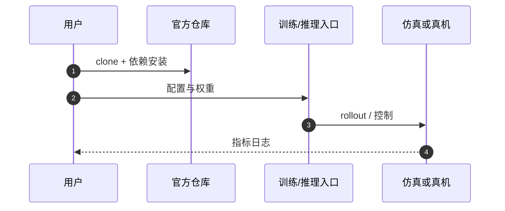

# PolyUMI

**PolyUMI**（*Accessible Visual-Tactile-Audio Data Collection for Object Inference and Manipulation*，[arXiv:2609.29760](https://arxiv.org/abs/2609.29760)，[代码](https://github.com/polyumi/PolyUMI-platform)，[项目页](https://polyumi-vista.github.io/)）收录自 [具身智能小站 12 篇清单](../../sources/blogs/wechat_embodied_station_12_papers_research_checklist_2026-09-26.md)。

## 一句话定义

**把接触音频与光学触觉与腕部视觉、本体同步采进示范，并用 token 级 VisTA 融合，让采集端接触线索能进机器人执行端。**

## 英文缩写速查

| 缩写 | 英文全称 | 简要说明 |
|------|----------|----------|
| VLA | Vision-Language-Action | 视觉-语言-动作策略 |
| IL | Imitation Learning | 模仿学习 |
| SR | Success Rate | 任务成功率 |
| WM | World Model | 世界模型 |

## 为什么重要

- 纳入 [12 篇具身研究清单](../../wiki/overview/embodied-research-12-papers-technology-map.md) 主线，与同期 VLA / 接触 / 规划 / 安全论文可横向对照。
- 公众号强调的可操作读法：先看 **任务信息需求**（如 PolyUMI 旋灯泡仍以视觉最优）与 **评测口径**（如 Self-Adaptive 多 trial、BeyondRetarget 仿真片段非真机 SR）。
- 开源状态（步骤 2.5）：**已开源**。

## 核心信息

| 项 | 内容 |
|----|------|
| **arXiv** | [2609.29760](https://arxiv.org/abs/2609.29760) |
| **项目页** | https://polyumi-vista.github.io/ |
| **代码** | https://github.com/polyumi/PolyUMI-platform |
| **开源** | **已开源** |

## 实验与评测（公众号口径）

| 任务 / 设定 | 文内要点 |
|-------------|----------|
| 物体推断 / 擦板 / 旋灯泡 | 覆盖 VisTA 多模态融合与 **感知手指** 迁移 |
| 螺丝刀 **滑移控制** | 视+触+听 **8/10** vs 纯视觉 **2/10**（**80** 条示范，规模较小） |
| 旋灯泡 | **视觉策略最好**——多模态并非每项都赢 |
| 采集 | 腕部图像 + 光学触觉 + **接触音频** + 本体同步 |

- 读法：按任务 **信息需求** 选模态，而不是默认「模态越多越好」。

## 源码运行时序图

## 结论

**总判：PolyUMI 适合作为「把接触音频与光学触觉与腕部视觉、本体同步采进示范，并用 token 级 VisT…」方向的入口页；细节以 arXiv 与项目页为准。**

1. 与 [12 篇技术地图](../overview/embodied-research-12-papers-technology-map.md) 对照选型，避免与同名不同 arXiv 的工作混淆（如 RAPID vs RAPID-VLM-RL）。
2. 开源为 **已开源** 时优先从项目页 Code 区核实，再写复现计划。
3. 长程 / 部署类条目（AdaHVLA、HarnessPAI、Self-Adaptive VLA）同时记录 **成功率定义** 与 **失败恢复预算**。

## 关联页面

- [具身研究 12 篇技术地图](../overview/embodied-research-12-papers-technology-map.md)
- [Manipulation](../tasks/manipulation.md)
- [VLA](../methods/vla.md)

## 参考来源

- [polyumi 论文归档](../../sources/papers/polyumi_arxiv_2609_29760.md)
- [公众号 12 篇清单](../../sources/blogs/wechat_embodied_station_12_papers_research_checklist_2026-09-26.md)

## 推荐继续阅读

- [arXiv:2609.29760](https://arxiv.org/abs/2609.29760)
- [项目页](https://polyumi-vista.github.io/)
