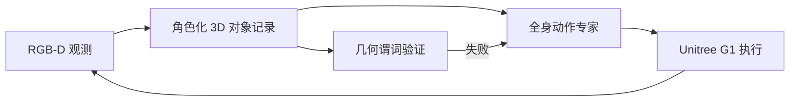

# POT-VLA：持久 3D 对象状态的人形闭环 VLA

**POT-VLA** 用 RGB-D 持续维护按任务角色索引的三维对象记录，使动作生成、完成判定与失败恢复共享同一物理状态。

## 英文缩写速查

| 缩写 | 英文全称 | 简要说明 |
|---|---|---|
| POT | Persistent Object Tokenization | 持久对象 token 化 |
| VLA | Vision-Language-Action | 视觉–语言–动作策略 |
| RGB-D | Red Green Blue + Depth | 彩色与深度观测 |
| G1 | Unitree G1 | 论文实机平台 |

## 为什么重要

长时程移动操作的关键故障并不只在动作预测，而在对象移动、遮挡或操作失败后，系统用来规划与验收的状态已经不一致。POT 把对象身份、角色和 3D 关系设为闭环的公共接口，便于插入传统几何校验和恢复逻辑。

## 方法与结果

- G1 八类真实任务：直接 GR00T-N1.7 **39/80**，POT-VLA **71/80**。
- Being-0 对齐服务任务：**44/50**，对照论文报告值为 **37/50**。
- 最大收益来自必须长期保持 3D 关系的任务，支持对象中心状态是有效抽象。

## 与其他工作对比

| 维度 | POT-VLA | 直接 GR00T-N1.7 | Being-0（对齐服务任务基线） |
|------|---------|-----------------|------------------------------|
| 状态表示 | 持久、角色化 3D 对象记录（RGB-D） | 端到端策略，无显式持久对象状态 | 分层服务式框架 |
| 闭环验收 | 动作生成、完成判定、失败恢复共享同一物理状态 | 缺显式几何验收 | 依框架而定 |
| 长时程鲁棒性 | 遮挡/移动/失败后仍保持一致对象关系 | 对象状态易分叉 | 依框架而定 |
| G1 八类任务 | 明显优于直接基线（见「方法与结果」） | 作为被超越基线 | — |
| 可审计性 | 对象中心状态可插入传统几何校验与恢复触发 | 弱 | 依框架而定 |

## 工程实践与局限

- 可把 POT 放在高层 VLA 与低层全身控制之间，作为可审计的场景状态和恢复触发器。
- 结果来自特定 G1 系统，跨传感器标定、对象重识别和动态场景鲁棒性仍需验证。
- **源码运行时序图：不适用。** 截至 2026-07-22，arXiv 未列官方代码、权重或数据入口。

## 关联页面

- [VLA](../methods/vla.md)
- [Unitree G1](./unitree-g1.md)
- [Loco-Manipulation](../tasks/loco-manipulation.md)

## 推荐继续阅读

- [论文 PDF](https://arxiv.org/pdf/2607.18016)

## 参考来源

- [POT-VLA 论文归档](../../sources/papers/pot_vla_arxiv_2607_18016.md)

