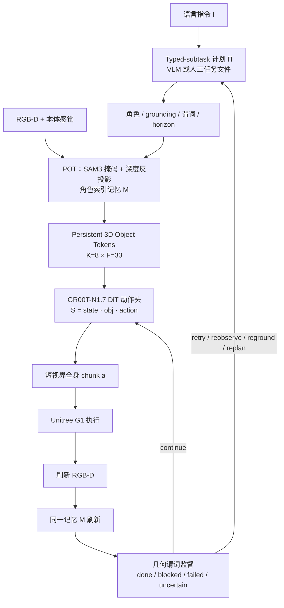

# POT-VLA（Persistent 3D Object Tokens · 可验证人形 Loco-Manipulation）

**POT-VLA**（*Closing the Loop in Humanoid VLA: Persistent 3D Object Tokens for Verifiable Loco-Manipulation*，[arXiv:2607.18016](https://arxiv.org/abs/2607.18016)，2026-07-20）由 **北航 / 北京中关村学院 / 天津大学 / 机智赛博（DeepCybo） / 中关村人工智能研究院（ZGCI）** 提出：把长时程人形移动操作中的 **object-state divergence**（动作条件用的对象状态 ≠ 验收用的对象状态）显式建模，用 **Persistent Object Tokenization（POT）** 从 RGB-D 维护角色索引的度量 3D 对象记录，序列化为 Persistent 3D Object Tokens，插入 **GR00T-N1.7** 全身动作头；同一刷新记忆再驱动几何谓词监督与局部恢复。

## 一句话定义

**用共享的角色化 3D 对象记忆同时条件化全身 VLA 动作 chunk 与几何谓词验收，在 Unitree G1 上把「可行动」与「可验证」绑成同一闭环状态。**

## 英文缩写速查

| 缩写 | 英文全称 | 简要说明 |
|------|----------|----------|
| POT | Persistent Object Tokenization | 角色索引持久 3D 对象记录 → token 的核心抽象 |
| VLA | Vision-Language-Action | 视觉–语言–动作策略；本文动作专家为 GR00T-N1.7 |
| RGB-D | Red-Green-Blue + Depth | 头戴彩色+深度观测，反投影到机器人 base 系 |
| DiT | Diffusion Transformer | GR00T 动作头；对象 token 插入其自注意力序列 |
| SAM3 | Segment Anything Model 3 | 在线/缓存掩码，支撑角色/查询 grounding |
| G1 | Unitree G1 | 真机平台（Dex3-1 + 头戴 RGB-D） |

## 核心信息

| 字段 | 内容 |
|------|------|
| **机构** | 北京航空航天大学（BUAA）；北京中关村学院（Zhongguancun Academy / BZA）；天津大学（TJU）；机智赛博（DeepCybo）；中关村人工智能研究院（ZGCI / ZGCA） |
| **作者** | Peng Ren\*、Haoyang Ge\*、Jiang Zhao、Cong Huang、Yukun Shi、Pei Chi†、Kai Chen† |
| **arXiv** | [2607.18016](https://arxiv.org/abs/2607.18016)（cs.RO，2026-07-20） |
| **动作骨干** | GR00T-N1.7（匹配 Direct 基线同 embodiment / runtime） |
| **实机** | Unitree G1；八类办公室长时程任务 + Being-0 对齐服务任务套件 |
| **开源** | **确认未开源**（截至 2026-07-26；无项目页/代码/权重） |

## 为什么重要

- **把「对象记不住」从感知 slogan 写成可测失败模式：** 过早子任务切换、错对象、假完成、无效恢复，往往不是语义听不懂，而是度量对象状态在 act 与 verify 两侧分叉。
- **最小政策侧改动、最大对照可读：** 固定 GR00T-N1.7 与全身动作空间，只加共享对象状态环（token 条件化 + 谓词恢复），匹配对照 **39/80 → 71/80**。
- **token 与 verifier 分工清晰：** 消融显示对象 token 贡献主增益（15→31/40），谓词主要吃掉残余假完成（31→34/40）。
- **工程可读接口：** 角色槽（TARGET/DESTINATION/SUPPORT/HANDOVER_PARTNER）+ 几何谓词，便于插入传统几何校验与恢复触发，而不必先换整套规划器。

## 流程总览

```mermaid
flowchart TB
  I[语言指令 I] --> PLAN[Typed-subtask 计划 Π<br/>VLM 或人工任务文件]
  PLAN --> ROLE[角色 / grounding / 谓词 / horizon]
  RGBD[RGB-D + 本体感觉] --> POT[POT：SAM3 掩码 + 深度反投影<br/>角色索引记忆 M]
  ROLE --> POT
  POT --> TOK[Persistent 3D Object Tokens<br/>K=8 × F=33]
  TOK --> HEAD[GR00T-N1.7 DiT 动作头<br/>S = state · obj · action]
  HEAD --> CHUNK[短视界全身 chunk a]
  CHUNK --> G1[Unitree G1 执行]
  G1 --> RGBD2[刷新 RGB-D]
  RGBD2 --> POT2[同一记忆 M 刷新]
  POT2 --> PRED[几何谓词监督<br/>done / blocked / failed / uncertain]
  PRED -->|continue| HEAD
  PRED -->|retry / reobserve / reground / replan| PLAN
```

## 核心原理

### Object-state divergence

人形 VLA 常把对象状态隐式压进当前视觉–语言特征，而进度检查用另一套 monitor。遮挡、接触、移动与失败恢复后，两侧状态不再指同一物理实体——论文称之为 **object-state divergence**。POT 的目标是提供 **持久、可行动、可验证** 的对象中心状态，且不依赖仿真器、显式物理引擎或学习动力学模型。

### Persistent Object Tokenization

| 组件 | 内容 |
|------|------|
| **任务角色记录** | 对活跃子任务 \(\tau_i\)，维护 \(\mathcal{M}^{\tau_i}_t=\{m_t^e\}\)：角色、短语、2D box、3D 质心/外延、置信度、可见性、关系特征（容器距离、支撑高度、末端偏移、交接线索等） |
| **坐标系** | 度量场在 **机器人 base 系**；经相机内参与 camera-to-base 标定，工作空间滤波 |
| **Token schema** | \(x_t^{\mathrm{obj}}=T(\mathcal{M})\)；默认 8 槽 × 33 维；空槽 PADDING 并 mask；遮挡时槽位保留但标 uncertain |
| **角色 ID** | TARGET、DESTINATION、SUPPORT、HANDOVER_PARTNER 等 |

### 对象 token 条件化的 VLA 执行

- **投影：** \(Z_t^{\mathrm{obj}}=f_\theta^{\mathrm{obj}}(x_t^{\mathrm{obj}})\)（LayerNorm→Linear→GELU→Dropout→Linear）+ 学习式角色/上下文 embedding；可用可见性/置信度门控。
- **插入位置：** 仅进 **动作头自注意力**，不改视觉–语言骨干；布局 \(S_t=[Z_t^{\mathrm{state}},Z_t^{\mathrm{obj}},Z_t^{\mathrm{action}}]\)。
- **训练：** 与基座同一 action-chunk 目标；演示配 object-token sidecar；关闭对象条件时推理路径退回原 GR00T。
- **安全：** 每 chunk 后刷新感知；命令平滑、关节/速度限幅、平衡与碰撞敏感工作空间约束、急停。

### 谓词级验收与恢复

谓词 \(p=\langle\kappa,\alpha,\mathrm{op},\nu,n\rangle\) 在刷新记忆上评估 containment / support / 邻近 / 位移 / 双臂分配 / 交接距离等；返回 in_progress / done / blocked / failed / uncertain，并带诊断（抓取失败、支撑不稳、落点出界、交接过远等）。局部恢复优先于整任务语言重规划。

## 源码运行时序图

**不适用。** 截至 **2026-07-26**，arXiv 与公开检索均未发现官方项目页、训练/推理代码或权重；无法对齐仓库模块画运行时序。动作骨干可对照公开 [Isaac GR00T](./isaac-gr00t.md) / [GR00T N1](./paper-hrl-stack-34-gr00t_n1.md)，但 **POT 侧车与谓词环无公开入口**。

## 工程实践

| 项 | 建议 |
|----|------|
| 放置位置 | 把 POT 当作高层 VLA 与低层全身控制之间的 **可审计场景状态层**，而不是再叠一层黑盒规划器 |
| Token 契约 | 部署与微调 sidecar 用 **同一** 角色/特征 schema；否则动作头看到的对象语义会漂移 |
| 验收门槛 | 完成判定绑在刷新后的几何谓词 + 稳定窗口，而不是「策略尝试过该动作」 |
| 失败读法 | Direct 基线失败多为 **度量** 错误（抓偏、叠歪、落点出篮），不是指令语义误解 |
| 标定依赖 | 深度、camera-to-base、工作空间边界决定记录质量；遮挡时走 uncertain→reobserve，勿静默当成功 |
| 复现预期 | 无官方代码；可读论文 Table 3 字段组设计对照自研对象记忆，动作用公开 GR00T-N1.7 |

### 实现侧车提示（论文附录）

对象 payload 经 `observation["extras"]["object_tokens"]` 进入，含 `x_t_obj` / `token_mask` / `role_ids` 等，物化为动作头消费的 `object_*` 张量——自研对接时可对齐该接口形状。

## 实验与评测

### 主对照（Table 1A，匹配 Direct GR00T-N1.7）

| 任务族 | Direct | POT-VLA |
|--------|--------|---------|
| Cart transport/place | 3/10 | 8/10 |
| Chip box → basket | 9/10 | 10/10 |
| Two balls → basket | 5/10 | 9/10 |
| Stack three cups | 1/10 | 8/10 |
| Garments → basket | 3/10 | 9/10 |
| Drawer/tray place-close | 4/10 | 8/10 |
| Tabletop sorting | 5/10 | 9/10 |
| Close-range handover | 9/10 | 10/10 |
| **合计** | **39/80** | **71/80** |

### Being-0 对齐外部参考（Table 1B，非本地复现）

| 套件合计 | Being-0（论文报告） | POT-VLA |
|----------|---------------------|---------|
| 五类服务任务 | 37/50 | **44/50** |

### 消融与对象状态泛化（Table 2）

| 变体 / 扰动 | 结果 |
|-------------|------|
| Direct / Verifier only / Tokens only / Full | 15 / 22 / 31 / **34**/40 |
| 新实例 / 布局移位 / 干扰物 / 执行中扰动 | Direct 6·5·8·4 → POT-VLA **9·9·9·8**/10 |

## 结论

**一句话总判：对人形长时程 loco-manipulation，共享的角色化 3D 对象记忆比再堆隐式视觉–语言特征更能同时抬高动作对准与验收可信度；对象 token 是主增益，几何谓词是防假完成的保险丝。**

1. **先对齐 act/verify 状态，再谈更强 VLA** — 匹配同骨干下 +32/80 说明瓶颈常在对象状态环，而非换更大 backbone。
2. **Token 条件化 > 仅加 verifier** — 消融 15→31 vs 15→22；先把角色化 3D 状态喂进动作头。
3. **完成判定必须绑刷新后的度量关系** — 叠杯、双球、抽屉等「需跨 chunk 维持 3D 关系」的任务增益最大。
4. **遮挡与低置信走 uncertain，不静默推进** — 槽位持久 + 可见性/置信度字段是闭环必要部分。
5. **Being-0 数字只作外部参考** — 非同设定复现；选型时以匹配 Direct 对照为主。
6. **复现与部署受限** — 无官方代码；自研需自建 SAM3/RGB-D 记录、sidecar 与谓词层，并严控标定。

## 与其他工作对比

| 维度 | POT-VLA | Direct GR00T-N1.7 | [Being-0](./paper-loco-manip-161-057-being-0.md) | [EventVLA](./paper-eventvla-visual-evidence-memory.md) / [Harness VLA](./paper-harness-vla.md) |
|------|---------|-------------------|--------------------------------------------------|--------------------------------------------------------------------------------------------------|
| 状态抽象 | 角色化持久 3D 对象记录 | 隐式 VL 特征 | VLM + 模块化技能 | 稀疏关键帧记忆 / 冻结 VLA 原语编排 |
| 闭环验收 | 共享记忆上的几何谓词 | 无显式对象验收 | 技能/路由层反馈 | 记忆写入或 agentic 重试 |
| 政策改动 | 动作头插 object tokens | 基线 | 分层技能系统 | 不改或少改 VLA 权重 |
| G1 匹配对照 | **71/80** | 39/80 | —（外部服务套件） | 不同基准 |
| 开源 | 未开源 | 骨干公开 | 有项目页 | 有代码 |

## 局限与风险

- **记录质量上限：** SAM3/RGB-D、标定与遮挡决定记忆可信度；论文自身将此列为主要限制。
- **无学习动力学：** 不预测接触/形变未来，只维护测量驱动的状态流；对强接触与高灵巧交互仍弱。
- **embodiment 绑定：** 结果来自特定 G1 + Dex3-1 + 头戴相机办公室布置；跨机/跨传感需重标定与重微调。
- **Typed-subtask 仍需规划脚手架：** 角色、谓词阈值与重试预算由任务文件/VLM 给出，不是端到端从语言涌现。
- **开源缺口：** 无法直接复现 POT 侧车与谓词环；读者易误把公开 GR00T 当作本系统可跑实现。

## 关联页面

- [VLA](../methods/vla.md) — 视觉–语言–动作方法总览
- [Loco-Manipulation](../tasks/loco-manipulation.md) — 移动操作任务
- [Unitree G1](./unitree-g1.md) — 实机平台
- [Isaac GR00T](./isaac-gr00t.md) / [GR00T N1](./paper-hrl-stack-34-gr00t_n1.md) — 动作骨干对照
- [Being-0](./paper-loco-manip-161-057-being-0.md) — 外部服务任务参考
- [EventVLA](./paper-eventvla-visual-evidence-memory.md) — 另一类长程视觉记忆
- [Harness VLA](./paper-harness-vla.md) — 冻结 VLA + 编排闭环对照

## 参考来源

- [POT-VLA 论文归档](../../sources/papers/pot_vla_arxiv_2607_18016.md)
- [arXiv:2607.18016](https://arxiv.org/abs/2607.18016)

## 推荐继续阅读

- [论文 PDF](https://arxiv.org/pdf/2607.18016)
- [论文 HTML](https://arxiv.org/html/2607.18016v1)
- [NVIDIA Isaac GR00T / GR00T-N1.7 权重入口](https://huggingface.co/nvidia/GR00T-N1.7-3B)（仅动作骨干，非 POT 系统）
