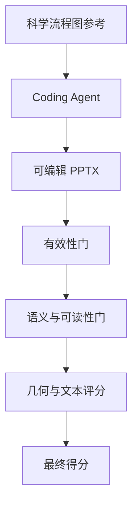
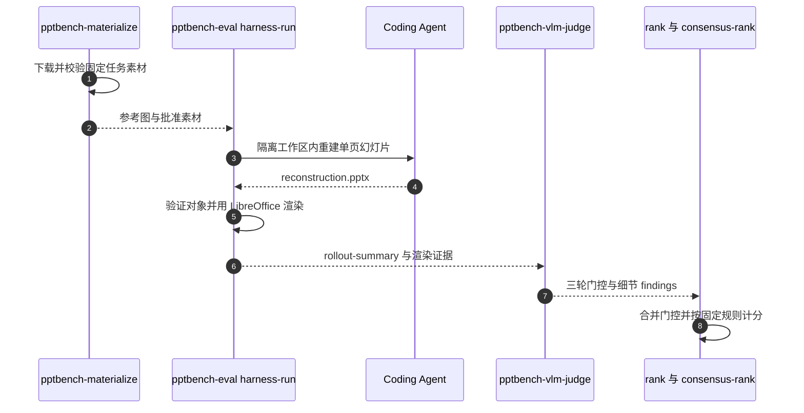

# PPTBench（可编辑幻灯片视觉重建 · arXiv:2609.29718）

**PPTBench**（*Can Coding Agents Reconstruct the Visual World through Structured, Editable Slides*，[arXiv:2609.29718](https://arxiv.org/abs/2609.29718)，[项目页](https://lab.einsia.ai/pptbench)，[GitHub](https://github.com/Einsia/PPTBench)）由 **Einsia.AI / Navers Lab** 与 **清华大学** 等发布：评测 **coding agent** 能否从 **固定参考图** 端到端重建 **原生可编辑** 幻灯片对象图（非贴图、非不可编辑源码）。

## 一句话定义

> **给定论文流程图一张图，agent 必须猜对结构并写成 PPTX 对象——测的是「看见结构 + 程序化落地」，不是主观 deck 文案生成。**

## 英文缩写速查

| 缩写 | 英文全称 | 简要说明 |
|------|----------|----------|
| PPTBench | — | 本文 benchmark |
| PPTX | Office Open XML Presentation | 输出必须是可编辑对象图 |
| Agentic Judge | — | 四阶段自动评判（含 LLM 门控 + 确定性计分） |
| arXiv | — | 任务图来源（50 主类 / 10 展示域） |

## 为什么重要

- **补 visual coding 榜：** 与 chart-to-code、screenshot-to-markup 邻近，但输出必须是 **读者可改的对象图**；禁止 raster 参考图作弊。
- **与机器人线间接相关：** 科学流程图大量出现在机器人论文；agent 能否重建 **方法框图** 影响 slide / 文档 / 教学资产自动化（非控机闭环）。
- **与 [RLE-Bench](./rle-bench.md) 互补：** RLE-Bench 测 **仿真里改训练代码**；PPTBench 测 **视觉结构 → 可编辑文档 artifact**。

## 流程总览

以下按本页已归纳的机制与资料绘制，表示模块或阅读路径关系。

## 核心信息

| 项 | 内容 |
|----|------|
| **规模** | **500** frozen 任务；31 agent 配置 × 46.5k judge 判决 |
| **代码** | [Einsia/PPTBench](https://github.com/Einsia/PPTBench)（**已开源**） |
| **Session 示例** | [AgentGit @einsia/ppt-bench](https://agent-git.com/@einsia/ppt-bench) |

## 任务与 Judge

- 输入：单张科学 **flow diagram** raster（来自真实 arXiv 论文，经自动检索 + 人工筛）。
- 输出：单页 PPTX，**native shapes / connectors / text frames**；可选 approved 子图 raster 嵌入。
- **四阶段 Judge（乘法）：** (1) artifact 有效性（确定性）；(2) 语义（节点、箭头方向）；(3) 渲染可读性；(4) 细粒度几何/文本 diff。
- 人类一致性：200 盲测 gate \(\kappa=0.696\)。

## 评测与指标

- **设置：** 500 项 frozen 任务（50 个 arXiv 主类 / 10 展示域），31 个 agent 配置，共 46.5k 次 judge 判决；四阶段乘法门控打分（0–100），语义错即零分。
- **主结果：** 最佳 Kimi K3 high effort **67.80**，中位配置 **19.47**；仅 **2.08%** 无法产出可用文件，**70.43%** 在可读 deck 后仍丢语义（数值摘自论文摘要）。
- **机制：** 文本细节占扣分 **51.6%**；reasoning 主要帮助过 hard gate，自检渲染与分数相关更高（\(r=0.881\)）；Judge 与人类在 200 盲测 gate 上一致性 \(\kappa=0.696\)。

## 与其他工作对比

| 维度 | PPTBench | 对照 |
|------|-------------|------|
| 评测对象 | coding agent 从流程图重建 **可编辑 PPTX 对象图** | [RLE-Bench](./rle-bench.md)：coding agent 在物理仿真中完成控机 / 训策略 / 感知 / 机械设计四类工程闭环 |
| 交付物与判据 | 单页 PPTX；四阶段乘法 Judge（有效性 × 语义 × 渲染 × 细粒度 diff） | [RLE-Bench](./rle-bench.md)：harness、ONNX policy、VLA recipe、MJCF 等 artifact，Harbor hidden test 打分并汇总为 RLE Index |
| 与机器人的关系 | 间接：重建论文方法框图，服务文档 / 教学资产 | [ENPIRE](../methods/enpire.md)：真机策略自改进 harness，直接进控机闭环 |

## 结论

**Agent 已会「写出合法 PPTX」，但还不会稳定「看懂流程图语义」——排行榜主要由过 gate 率驱动，细粒度质量靠自检渲染。**

- 仅 **2.08%** 无法产出可用文件；**70.43%** 在可读 deck 后仍丢语义
- 文本细节占扣分 **51.6%**（ unintended wrapping 等）
- 加 reasoning 主要帮 **过 hard gate**；**自检渲染** 与分数相关更高（\(r=0.881\)）
- 最佳 **Kimi K3 high effort 67.80**；中位配置 **19.47**

## 源码运行时序图

入口以 [PPTBench 仓库归档](../../sources/repos/pptbench.md) 和官方 README 为准；这是评测运行链路，素材下载、代理生成、渲染与裁判各自有依赖，图不表示本库已执行完整 benchmark。

## 局限与风险

- 任务域偏 **科学流程图**，不覆盖照片级 UI 或 3D 场景。
- 源论文像素 **不随仓再分发**；需用官方 materializer 拉取合规素材。
- Einsia 机构未进 `institutions.json`；`tsinghua` tag 覆盖联合单位之一。

## 关联页面

- [AI Agent 评测](../concepts/ai-agent-evaluation.md)
- [RLE-Bench](./rle-bench.md)
- [Agentic Coding 软件工程基础](../concepts/agentic-coding-software-fundamentals.md)
- [具身大模型评测基准选型闭环](../queries/embodied-eval-benchmark-selection-loop.md) — 评测基准选型知识链；PPTBench 属 coding agent 评测轴的邻接基准

## 参考来源

- [pptbench_arxiv_2609_29718](../../sources/papers/pptbench_arxiv_2609_29718.md)
- [pptbench-lab-einsia](../../sources/sites/pptbench-lab-einsia.md)
- [pptbench 仓库](../../sources/repos/pptbench.md)

## 推荐继续阅读

- [arXiv:2609.29718](https://arxiv.org/abs/2609.29718)
- [PPTBench 项目页](https://lab.einsia.ai/pptbench)
