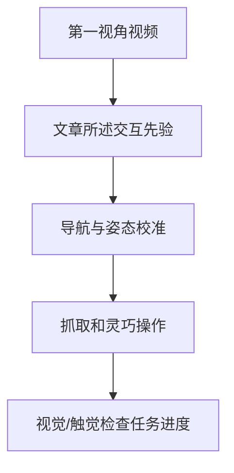

# Praxis：第一视角交互先验与全身操作（待核）

> **来源边界**：此条按 Day 4 PDF 原样归档。项目 URL 当前展示另一标题和作者单位，二者是否同一工作尚未确认。

## 一句话定义

文章称该方法从第一视角视频提取手腕、手指及手物接触信息，并连接导航、姿态校准与灵巧操作。

## 英文缩写速查

| 缩写 | 英文全称 | 说明 |
|---|---|---|
| Egocentric video | First-person video | 操作者自身视角视频 |
| IK | Inverse Kinematics | 检查操作姿态是否可达 |
| WBC | Whole-Body Control | 协调身体与手部操作 |

## 流程总览

## 文章报告与核查状态

PDF 报告躯干相机导航、头部相机近距离操作、五指手触觉反馈，以及五项长程真机任务平均成功率 76.97%。这些结果尚未在与该标题一致的一手论文页中复核。所给项目 URL 当前展示 *Praxis: Scaling One-Shot Human Demonstration to Generalist Policy for Whole-Body Manipulation*；本页不把项目页信息并入该待核论文。

## 结论

- 文章把该条目定位为由第一视角交互视频获得全身操作先验。
- 项目页标题与文章标题不一致；需要作者或论文标识符消除歧义。
- 76.97% 为文章转述，尚未独立核实。

## 参考来源

- [Praxis 标题核查记录](../../sources/papers/praxis_day4_project_title_mismatch_2026_10_05.md)
- [Day 4 文章来源](../../sources/blogs/humanoid_motion_intelligence_day4_loco_manipulation_2026_10_05.md)
- [文章所给项目 URL](https://edem-ai.github.io/Praxis/)
