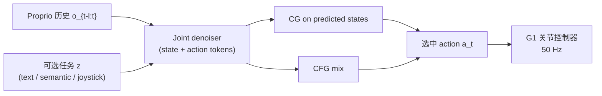

# PredActor（arXiv:2609.24840）

**PredActor**（*Predictive Action Diffusion for Steerable Onboard Humanoid Control*，[arXiv:2609.24840](https://arxiv.org/abs/2609.24840)，[项目页](https://masteryip.github.io/predactor.github.io/)）在 **joint state–action diffusion** 框架内，把 **未来状态留在策略内部** 供 CG/CFG 引导，**只执行选中动作**，无需独立 motion-reference tracker 或外部全身体态估计。在 **Unitree G1 Jetson Orin NX** 上实现 **50 Hz** 完整 onboard 闭环。

## 一句话定义

用 proprio 历史联合去噪未来状态与动作，内部状态支持 test-time 目标与文本条件，选中动作直接下发关节控制器，并在 Orin NX 上压到 20 ms 控制周期以内。

## 英文缩写速查

| 缩写 | 英文全称 | 简要说明 |
|------|----------|----------|
| CG | Classifier Guidance | 对预测状态加 test-time 目标梯度 |
| CFG | Classifier-Free Guidance | 条件/空预测混合以强化行为条件 |
| WBG | Whole-Body Guidance | 论文中对 predicted-state 目标 steering 的实现块 |
| DAgger | Dataset Aggregation | 在 learner 访问状态聚合 teacher 标签 |
| FK | Forward Kinematics | 观测构造中的正向运动学链 |

## 为什么重要

- **统一 steering 接口：** 代表 joint diffusion 里少见的 **CFG（文本/行为）+ CG（状态目标）并存**，且 **仅 proprio** 输入 — 对比 Diffuse-CLoC、SCDP、SCRIPT 等（见论文 Table 1）。
- **机载闭环证据：** 声称首个 **全 onboard** joint state–action diffusion 在 G1 Orin NX **50 Hz** 部署；p50 **16.790 ms**、p95 **19.383 ms**。
- **相对 hierarchy：** 不做 generator→tracker 分拆，disturbance recovery 留在同一策略，避免规划/控制双时钟。

## 核心信息

| 字段 | 内容 |
|------|------|
| 机构 | 哈尔滨工业大学（HIT）、上海创智学院、RoboParty Lab、清华大学、上海交通大学等 |
| 平台 | Unitree G1 + Jetson Orin NX |
| 输入 | Proprio 历史 + 可选任务 token（文本/语义/摇杆） |
| 输出 | 选中关节动作；未来状态 **不外发** |
| 开源 | **待发布** — [MasterYip/PredActor](https://github.com/MasterYip/PredActor) 占位 README（Code Coming Soon） |

## 流程总览

## 核心原理

- **Joint representation：** 并行去噪 horizon 上 interleaved state/action；states 为 **internal guidance**，actions 直接执行。
- **训练：** 动作库 + 自动标签；异步 **扰动 teacher rollout** + **DAgger** 聚合 recovery 数据。
- **部署：** **Rolling denoising**（跨 tick 复用部分去噪 horizon）+ 计算保留优化 + **延迟坐标插值**。

## 源码运行时序图

**不适用（待发布）** — 官方仓截至 2026-09-24 无训练/部署脚本；公开后应对齐 README 中 rolling inference 与 onboard callback 路径。

## 工程实践

| 检查项 | 建议 |
|--------|------|
| 输入边界 | 勿假设 full-body state 作 policy 输入 — 仅 proprio + 任务上下文 |
| 实时预算 | 以 **complete callback p95 < 20 ms** 为机载门禁；换导出/设备需 requalify |
| 对照读法 | 文本检索 **0.580 vs 0.373** 是主要语义增益；推扰存活与 action-only 相近 |
| 开源跟进 | 跟踪 [PredActor 仓](https://github.com/MasterYip/PredActor) release，勿与 anonymous 项目页 demo 混为已可复现 |

## 实验与评测读法

| 指标 | PredActor | 备注 |
|------|-----------|------|
| 15 目标导航 | 15/15 | 仿真 |
| Text retrieval | 0.580 | vs conditional action diffusion 0.373 |
| Push survival | 0.535 | vs 0.564（相近） |
| Orin NX callback p50/p95 | 16.790 / 19.383 ms | 593/600 ≤ 20 ms |

真机 demo：文本 walk/jog/squat、摇杆转向、外扰反应、语义插值（stand↔raise hand / stand↔run）。

## 结论

**PredActor 把 joint diffusion 的「预测态引导 + 直接动作执行」落到 G1 机载 50 Hz，是 onboard generative humanoid control 的部署基准点；复现需等官方代码/权重。**

1. **CG+CFG+proprio** 三件套在同一条可执行策略里闭合 — 相对 SCDP/BeyondMimic 等差异明确。
2. **Rolling + 优化** 是 latency 主因，不是单纯减 denoise 步数。
3. **Recovery 数据**（扰动 teacher + DAgger）与 disturbance demo 一致 — 选型时勿只看 kinematic 指标。
4. **开源：** 占位仓已建，训练/评测/checkpoint **Coming Soon** — 入库日不可当已复现。
5. 与 [SONIC](./../methods/sonic-motion-tracking.md) tracker 路线对照：PredActor 不走 reference tracking，而是 **端到端 joint policy**。

## 关联页面

- [Diffusion Policy](../methods/diffusion-policy.md)
- [SONIC](../methods/sonic-motion-tracking.md)
- [Whole-Body Control](../concepts/whole-body-control.md)
- [Locomotion](../tasks/locomotion.md)
- [Sample, Simulate, Select](./paper-sample-simulate-select.md) — 同 G1+SONIC 生态的不同 text-to-motion 路线

## 推荐继续阅读

- [PredActor 项目页](https://masteryip.github.io/predactor.github.io/)
- [arXiv:2609.24840](https://arxiv.org/abs/2609.24840)

## 参考来源

- [PredActor 论文归档](../../sources/papers/predactor_arxiv_2609_24840.md)
- [PredActor 项目页归档](../../sources/sites/predactor-masteryip-github-io.md)
- [PredActor GitHub 占位仓](../../sources/repos/predactor.md)
