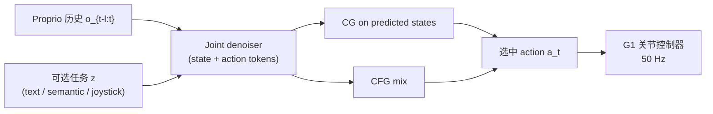
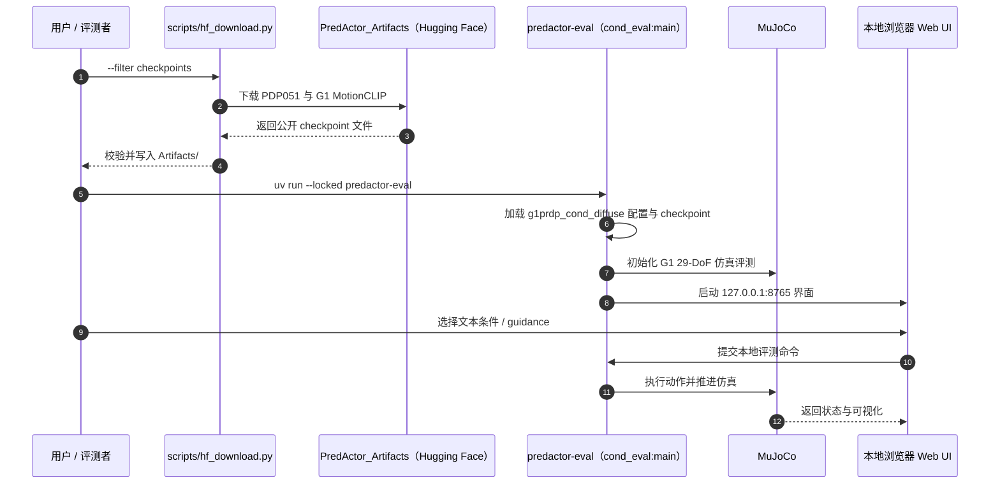

# PredActor（arXiv:2609.24840）

**PredActor**（*Predictive Action Diffusion for Steerable Onboard Humanoid Control*，[arXiv:2609.24840](https://arxiv.org/abs/2609.24840)，[项目页](https://masteryip.github.io/predactor.github.io/)）在 **joint state–action diffusion** 框架内，把 **未来状态留在策略内部** 供 CG/CFG 引导，**只执行选中动作**，无需独立 motion-reference tracker 或外部全身体态估计。在 **Unitree G1 Jetson Orin NX** 上实现 **50 Hz** 完整 onboard 闭环。

## 一句话定义

用 proprio 历史联合去噪未来状态与动作，内部状态支持 test-time 目标与文本条件，选中动作直接下发关节控制器，并在 Orin NX 上压到 20 ms 控制周期以内。

## 英文缩写速查

| 缩写 | 英文全称 | 简要说明 |
|------|----------|----------|
| CG | Classifier Guidance | 对预测状态加 test-time 目标梯度 |
| CFG | Classifier-Free Guidance | 条件/空预测混合以强化行为条件 |
| WBG | Whole-Body Guidance | 论文中对 predicted-state 目标 steering 的实现块 |
| DAgger | Dataset Aggregation | 在 learner 访问状态聚合 teacher 标签 |
| FK | Forward Kinematics | 观测构造中的正向运动学链 |
| HF | Hugging Face | PredActor 公开评测 checkpoint 的托管平台 |
| BC | Behavior Cloning | README 列为尚未发布的策略训练代码 |
| UI | User Interface | 本地浏览器端 MuJoCo 评测界面 |
| CPU | Central Processing Unit | 无 CUDA 时评测器回退使用的处理器 |

## 为什么重要

- **在扩散学习路线中的位置：** 可作为[扩散与流匹配纵深路线](../../roadmap/depth-robotics-diffusion-dit-flow.md)的人形机载控制专题；重点从通用动作 chunk 去噪转向 joint state–action prediction、test-time steering 与端侧时延预算。

- **统一 steering 接口：** 代表 joint diffusion 里少见的 **CFG（文本/行为）+ CG（状态目标）并存**，且 **仅 proprio** 输入 — 对比 Diffuse-CLoC、SCDP、SCRIPT 等（见论文 Table 1）。
- **机载闭环证据：** 声称首个 **全 onboard** joint state–action diffusion 在 G1 Orin NX **50 Hz** 部署；p50 **16.790 ms**、p95 **19.383 ms**。
- **相对 hierarchy：** 不做 generator→tracker 分拆，disturbance recovery 留在同一策略，避免规划/控制双时钟。

## 核心信息

| 字段 | 内容 |
|------|------|
| 机构 | 哈尔滨工业大学（Harbin Institute of Technology）、上海创新研究院（Shanghai Innovation Institute）、RoboParty Lab、清华大学、上海交通大学 |
| 平台 | Unitree G1 + Jetson Orin NX |
| 输入 | Proprio 历史 + 可选任务 token（文本/语义/摇杆） |
| 输出 | 选中关节动作；未来状态 **不外发** |
| 开源 | **部分开放（2026-10-08）** — [GitHub](https://github.com/MasterYip/PredActor) 提供 PDP051 的 MuJoCo 浏览器评测入口；[Hugging Face](https://huggingface.co/MasterYip/PredActor_Artifacts) 发布 PDP051 与 G1 MotionCLIP checkpoint；训练、数据采集、DAgger 与真机部署仍未发布 |

## 流程总览

```mermaid
flowchart LR
  prop["Proprio 历史 o_{t-l:t}"]
  task["可选任务 z\n(text / semantic / joystick)"]
  denoise["Joint denoiser\n(state + action tokens)"]
  cg["CG on predicted states"]
  cfg["CFG mix"]
  act["选中 action a_t"]
  wbc["G1 关节控制器\n50 Hz"]
  prop --> denoise
  task --> denoise
  denoise --> cg
  denoise --> cfg
  cg --> act
  cfg --> act
  act --> wbc
```

## 核心原理

- **Joint representation：** 并行去噪 horizon 上 interleaved state/action；states 为 **internal guidance**，actions 直接执行。
- **训练：** 动作库 + 自动标签；异步 **扰动 teacher rollout** + **DAgger** 聚合 recovery 数据。
- **部署：** **Rolling denoising**（跨 tick 复用部分去噪 horizon）+ 计算保留优化 + **延迟坐标插值**。

## 源码运行时序图

```mermaid
sequenceDiagram
  autonumber
  participant User as 用户 / 评测者
  participant DL as scripts/hf_download.py
  participant HF as PredActor_Artifacts（Hugging Face）
  participant CLI as predactor-eval（cond_eval:main）
  participant Sim as MuJoCo
  participant UI as 本地浏览器 Web UI
  User->>DL: --filter checkpoints
  DL->>HF: 下载 PDP051 与 G1 MotionCLIP
  HF-->>DL: 返回公开 checkpoint 文件
  DL-->>User: 校验并写入 Artifacts/
  User->>CLI: uv run --locked predactor-eval
  CLI->>CLI: 加载 g1prdp_cond_diffuse 配置与 checkpoint
  CLI->>Sim: 初始化 G1 29-DoF 仿真评测
  CLI->>UI: 启动 127.0.0.1:8765 界面
  User->>UI: 选择文本条件 / guidance
  UI->>CLI: 提交本地评测命令
  CLI->>Sim: 执行动作并推进仿真
  Sim-->>UI: 返回状态与可视化
```

运行入口来自官方 README 的 Quick evaluation；当前公开路径只复现带 checkpoint 的 MuJoCo 评测，不包含训练、数据采集/标注、DAgger 训练或真机控制部署。
## 工程实践

- 官方仓现提供 Linux 上的公开 MuJoCo 评测：Python 3.10 + uv，执行 `uv sync --locked`、`uv run --locked python scripts/hf_download.py --filter checkpoints`，再运行 `uv run --locked predactor-eval`；启动本地 Web UI（默认 `127.0.0.1:8765`），CUDA 可用时优先使用，否则回退 CPU。完整命令和环境要求见[仓库归档](../../sources/repos/predactor.md)。

| 检查项 | 建议 |
|--------|------|
| 输入边界 | 勿假设 full-body state 作 policy 输入 — 仅 proprio + 任务上下文 |
| 实时预算 | 以 **complete callback p95 < 20 ms** 为机载门禁；换导出/设备需 requalify |
| 对照读法 | 文本检索 **0.580 vs 0.373** 是主要语义增益；推扰存活与 action-only 相近 |
| 开源跟进 | 跟踪 [PredActor 仓](https://github.com/MasterYip/PredActor) release，勿与 anonymous 项目页 demo 混为已可复现 |

## 实验与评测读法

| 指标 | PredActor | 备注 |
|------|-----------|------|
| 15 目标导航 | 15/15 | 仿真 |
| Text retrieval | 0.580 | vs conditional action diffusion 0.373 |
| Push survival | 0.535 | vs 0.564（相近） |
| Orin NX callback p50/p95 | 16.790 / 19.383 ms | 593/600 ≤ 20 ms |

论文与项目页展示了 G1 真机文本控制、摇杆转向、外扰反应和语义插值；这些真机结果仍属于论文/项目演示，当前公开仓的评测入口运行在 MuJoCo，不提供真机部署工具链。

## 与其他工作对比

> 下表只做**定位对照**，不做跨设定横比：各行与本页不共享同一评测协议，数字不可直接相减。

| 对照 | 差异读法 |
|------|----------|
| [SONIC](../methods/sonic-motion-tracking.md) | SONIC 是 **reference tracking** 路线（上游给参考运动、策略负责跟踪）；PredActor 不走 generator→tracker 分拆，**同一 joint diffusion 策略**直接出关节动作，扰动恢复也在该策略内 |
| [Sample, Simulate, Select](./paper-sample-simulate-select.md) | 同在 G1 上做文本驱动运动：S³ **零训练**，冻结 MoMask + SONIC 仿真 best-of-N 选优；PredActor 需训练 joint state–action 去噪器，换来机载 50 Hz 闭环与 test-time CG/CFG 引导 |
| [Diffusion Policy](../methods/diffusion-policy.md) | 经典 DP 只去噪**动作**；PredActor 联合去噪**未来状态 + 动作**，预测态作为引导内部量（不外发），并用 rolling denoising 压延迟 |
| Diffuse-CLoC / SCDP / SCRIPT（论文 Table 1） | 同属 joint / 条件扩散人形控制；PredActor 的差异点是 **CFG + CG 并存且仅 proprio 输入**，并给出全 onboard 部署计时 — 以原文表格为准 |

## 结论

**PredActor 把 joint diffusion 的「预测态引导 + 直接动作执行」落到 G1 机载 50 Hz；现在可用公开 checkpoint 复跑 MuJoCo 评测，但论文训练流程和真机部署仍不可复现。**

1. **CG+CFG+proprio** 三件套在同一条可执行策略里闭合 — 相对 SCDP/BeyondMimic 等差异明确。
2. **Rolling + 优化** 是 latency 主因，不是单纯减 denoise 步数。
3. **Recovery 数据**（扰动 teacher + DAgger）与 disturbance demo 一致 — 选型时勿只看 kinematic 指标。
4. **开源：** 已有 MuJoCo 评测代码与 PDP051、MotionCLIP checkpoint；训练数据、训练/DAgger 流程和硬件部署包仍未发布。
5. 与 [SONIC](./../methods/sonic-motion-tracking.md) tracker 路线对照：PredActor 不走 reference tracking，而是 **端到端 joint policy**。

## 局限与风险

- **发布范围有限。** 当前开源内容是绑定公开 checkpoint 的 MuJoCo evaluator；没有训练数据收集与标注、行为克隆训练、DAgger 迭代或 G1 硬件部署工具。
- **仿真评测不等于真机复现。** 软件启动与 checkpoint 可加载性不能证明新硬件上的安全性或运动质量；实际部署仍需独立的控制、安全和硬件验证。
- **权重文件需校验来源。** PyTorch checkpoint 使用 pickle-compatible 反序列化；仅从官方仓链接的 Hugging Face 仓下载，并核对公开 SHA-256。
- **锁定环境影响结果。** 官方环境目标为 Python 3.10；CUDA、驱动、模拟器或依赖版本变化可能改变评测结果。

## 关联页面

- [Diffusion Policy](../methods/diffusion-policy.md)
- [SONIC](../methods/sonic-motion-tracking.md)
- [Whole-Body Control](../concepts/whole-body-control.md)
- [Locomotion](../tasks/locomotion.md)
- [Sample, Simulate, Select](./paper-sample-simulate-select.md) — 同 G1+SONIC 生态的不同 text-to-motion 路线

## 推荐继续阅读

- [PredActor 项目页团队与联系](https://masteryip.github.io/predactor.github.io/#people)
- [PredActor GitHub 评测代码](https://github.com/MasterYip/PredActor)
- [PredActor Hugging Face checkpoint](https://huggingface.co/MasterYip/PredActor_Artifacts)
- [PredActor 项目页](https://masteryip.github.io/predactor.github.io/)
- [arXiv:2609.24840](https://arxiv.org/abs/2609.24840)

## 参考来源

- [PredActor 论文归档](../../sources/papers/predactor_arxiv_2609_24840.md)
- [PredActor 项目页归档](../../sources/sites/predactor-masteryip-github-io.md)
- [PredActor GitHub 评测代码归档](../../sources/repos/predactor.md)
- [PredActor Hugging Face checkpoint 归档](../../sources/repos/predactor-artifacts.md)
