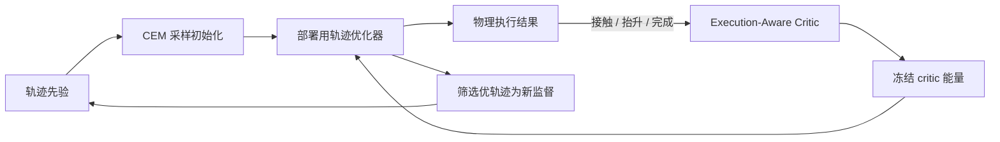

# Prior Evolution and Task Alignment for Aerial Grasping

**Prior Evolution and Task Alignment for Aerial Grasping**（[arXiv:2609.18153](https://arxiv.org/abs/2609.18153)）研究空中抓取中的解析轨迹优化。它将学习置于优化器周围：用 CEM 逐轮改进初始轨迹分布，并用真实执行结果训练的 critic 补足手工数值目标与任务成功之间的差距。

## 一句话定义

**先让候选轨迹先验学会为部署优化器提供好初值，再让物理执行成功信号成为可微优化代价。**

## 英文缩写速查

| 缩写 | 英文全称 | 简要说明 |
|------|----------|----------|
| CEM | Cross-Entropy Method | 通过采样、筛选优样本、更新分布来进化轨迹初始化 |
| Critic | Execution-Aware Critic | 根据接触、抬升与完成结果评估执行成功倾向 |
| PDF | Probability Density Function | 轨迹先验所表达的候选初始化分布 |
| Cost | Differentiable Grasping Cost | 冻结 critic 的能量，用梯度塑造抓取轨迹 |

## 为什么重要

- **把初始化从手工技巧变成可学习对象。** 非凸轨迹优化不只取决于目标函数，也取决于起点；当算力有限时，为实际优化器提供适配的初值可直接提高解的可靠性。
- **把任务结果引入解析规划。** 接触、抬升和完成等事件比单纯的几何误差更贴近“抓取成功”，可以补充人设计的代价函数。
- **形成互补而非替代。** 轨迹优化器继续承担可解释的规划求解；先验提高找到好解的机会，critic 提供贴近执行结果的学习信号。

## 方法栈与流程总览

论文摘要描述的闭环可整理为以下管线。图中区分两类反馈：CEM 用“经部署优化器求解后的优劣”更新先验；执行 critic 则把物理成功信号映射为优化代价。

### 1. Prior Evolution：进化“优化之后会变好”的分布

简单地拟合一批轨迹并不保证采样结果经后续优化后仍然有用。该方法让样本经历部署阶段实际使用的优化器，再按求解后的质量选择优样本并作为新监督。这样，先验更新的目标与运行时优化器的真实行为保持一致。

可以把迭代关系概念化为：

`候选先验 → 初始轨迹 → 部署优化器 → 优解筛选 → 新监督 → 更新先验`

CEM 在这里承担的是分布搜索 / 样本筛选的机制，而不是替换连续轨迹求解器。

### 2. Execution-Aware Critic：用执行证据修正代理目标

Critic 学习轨迹在执行时是否成功，摘要列举的监督结果包括接触、抬升和任务完成。训练后冻结其参数，并以 critic 能量构造可微的抓取代价。优化器因此可以沿梯度方向调整轨迹，使其不仅满足人为指定的数值约束，也朝预测更可能物理成功的方向变化。

这一设计的关键是**学习得到的评价信号仍能进入可微规划环**，而不仅是规划后的分类或重排序。

## 实验与评测

| 维度 | 摘要可确认的信息 | 读法 |
|------|------------------|------|
| 场景 | 仿真与真实世界 | 同时声称覆盖模型内评估与真实执行 |
| 结果 | 优化可靠性、轨迹一致性、抓取表现改善 | 支持方法方向有效；摘要未列具体数值 |
| 数值指标 | 摘要未提供成功率、样本数、显著性或耗时 | 不能把定性摘要转写成定量 SOTA 结论 |
| 复现入口 | 未发现官方项目页 / 代码 / 数据集链接 | 目前无法核对训练配置、优化器参数与真机硬件 |

定量对照、消融和系统规格应以论文全文表格及附录为准；本节点刻意不从二手摘要猜测数字。

## 与其他工作对比

| 维度 | 手工轨迹优化 | 仅用学习策略 | 本文摘要所述路线 |
|------|--------------|--------------|------------------|
| 初值来源 | 规则或人工设计 | 由策略直接预测动作/轨迹 | 从轨迹先验采样，并经 CEM 按优化器结果进化 |
| 任务成功信号 | 依赖手工代理目标 | 可从执行回报学习，但可能弱化显式优化结构 | 执行 critic 能量成为可微抓取代价 |
| 解析结构 | 强 | 取决于策略结构 | 保留部署轨迹优化器 |
| 当前复现性 | 依具体规划器而异 | 依权重 / 代码开放而异 | 本论文暂未发现官方实现入口 |

相较于 [Flying Knots](paper-flying-knots.md) 等空中操作工作，本文聚焦点不是展示某个单一任务的操作能力，而是改善空中抓取规划的初始化与“优化目标—物理成功”对齐。

## 工程实践与开源状态

| 项 | 状态 |
|----|------|
| 项目 / 代码 / 数据 | 截至 2026-10-04，在 arXiv、作者/研究公开页面和 GitHub 公开检索中未发现官方链接；属于“未发现公开实现”，不是作者明确承诺不发布 |
| 源码运行时序图 | **不适用**：未发现官方可运行代码、入口脚本或部署仓库，不能可靠描绘执行时序 |
| 正文细节 | 需阅读全文确认候选轨迹参数化、critic 标签、CEM 更新式、机器人平台及评测指标 |
| 部署注意 | 真机时应核对 critic 的校准与分布外可靠性，并评估 critic 梯度是否会与硬约束、安全约束冲突；这属于方法落地风险判断，不是摘要报告的已验证结论 |

## 局限与风险

- **摘要级知识尚非完整复现指南。** 当前可确认的是总体机制与定性实验结论，超参数、轨迹表示、执行频率和数值增益需要从全文核对。
- **critic 依赖执行监督覆盖面。** 如果接触、载荷、目标几何或失败模式超出训练样本，critic 能量可能产生误导梯度。
- **目标冲突需要显式处理。** 可微学习代价不自动等同于安全约束；实现时应保留碰撞、动力学和硬件限制等可验证约束。
- **代码状态会变化。** 本结论是 2026-10-04 的公开检索快照，后续应复核作者主页与仓库。

## 结论

**方法的关键不只是“加一个网络”，而是让先验优化和任务成功信号都在部署优化环中发挥作用。**

1. **算力受限且优化器仍有价值时优先关注先验进化**：筛样本应按优化器求解后的效果，而不是仅看原始初值。
2. **任务目标难以手工表达时关注 critic 能量**：它把执行结果转为可微信号，但需要验证对约束和安全目标的兼容性。
3. **评估时分开读两条增益路径**：一条来自更好的初始化 / 优化可靠性，另一条来自执行对齐；消融才能说明各自贡献。
4. **不要根据摘要宣称具体成功率或领先幅度**：定量结论需核对 PDF 正文、补充材料与试验设置。
5. **复现规划要预留实现成本**：截至入库日未发现官方代码仓或公开数据链接。

## 关联页面

- [Manipulation](../tasks/manipulation.md) — 抓取、接触与物理任务成功的总览
- [Trajectory Optimization](../methods/trajectory-optimization.md) — 保留显式轨迹求解器的优化背景
- [Flying Knots](paper-flying-knots.md) — 空中操作领域的近邻任务
- [Policy Optimization](../methods/policy-optimization.md) — 学习式策略优化对照

## 参考来源

- [论文摘录与公开状态核查](../../sources/papers/prior_evolution_aerial_grasping_arxiv_2609_18153.md)

## 推荐继续阅读

- [arXiv:2609.18153](https://arxiv.org/abs/2609.18153) — 正文与附录
- [arXiv PDF v1](https://arxiv.org/pdf/2609.18153v1) — 核对公式、消融、数值结果与硬件
