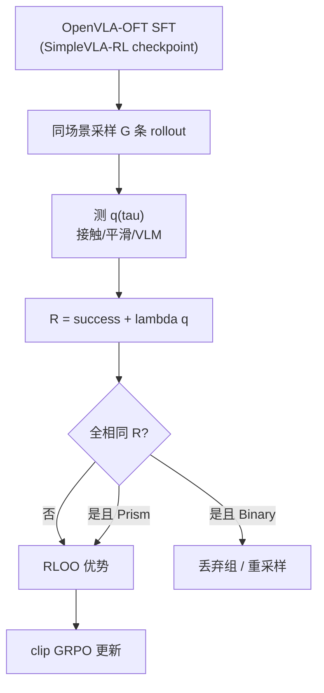
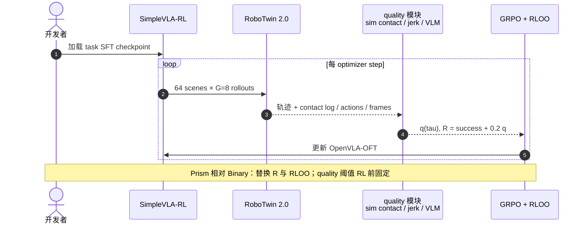

# Prism-GRPO：VLA 低样本 GRPO 优化

**Prism-GRPO**（*Faster VLA Policy Optimization via Splitting Same-outcome Groups*，[arXiv:2608.17423](https://arxiv.org/abs/2608.17423)）来自 **亚马逊（Amazon / AWS AI）**（含 Purdue 实习作者）：在 **SimpleVLA-RL** 的二值成功 **GRPO** 上，叠加有界 **trajectory execution quality** \(q(\tau)\in[0,1]\)，把 all-success / all-failure **退化组** 拆成质量谱，**恢复梯度** 且 **success 仍支配 failure**。

## 一句话定义

**Binary GRPO 把「全成功/全失败」组直接扔掉——Prism 用接触/平滑/VLM 质量在同结果组内排序，rollout 预算少一半还能少 shove-cheat。**

## 英文缩写速查

| 缩写 | 英文全称 | 简要说明 |
|------|----------|----------|
| GRPO | Group Relative Policy Optimization | 组内相对优势、无 value critic |
| VLA | Vision-Language-Action | OpenVLA-OFT 离散动作头 |
| RLOO | REINFORCE Leave-One-Out | 本文优势估计（保留 quality 尺度） |
| SFT | Supervised Fine-Tuning | SimpleVLA-RL 公开 task checkpoint 热启动 |
| SR | Success Rate | RoboTwin 主指标 |
| VLM | Vision-Language Model | Prism-VLM-Contact 零样本碰撞判据 |
| RL | Reinforcement Learning | VLA 后训练阶段 |
| AWS | Amazon Web Services | 作者机构（AWS AI） |

## 为什么重要

- **Binary GRPO 样本浪费：** 同场景 G 条 rollout 全成功或全失败 → 优势 0 → dynamic sampling 丢弃；训练早期几乎全失败时 **大量 rollout 无效**。
- **Prism 不增 rollout 期望：** 定理保证 combined reward **不增加** 获得 informative group 的期望 rollout 数。
- **Task-agnostic quality：** 非目标接触 peak impulse、关节反向计数、action jerk，或 VLM 判碰撞——**不需 task-specific progress reward**。
- **效率数字：** 四 RoboTwin 任务达目标 SR 的 rollout **最多 −56%**。
- **真机 shove-cheat：** Move Can Pot 上 Prism **0/25** cheat vs Binary 1/25、RL-ZVP 5/25。

## 核心信息

| 项 | 内容 |
|----|------|
| **机构** | Amazon / AWS AI；真机致谢 UCLA Mobility Lab |
| **基座** | [SimpleVLA-RL](https://github.com/PRIME-RL/SimpleVLA-RL) + OpenVLA-OFT SFT |
| **平台** | RoboTwin 2.0 四任务；G=8；512 rollouts/step |
| **默认** | \(\lambda=0.2\)；RLOO；reward \(R=\mathrm{success}+\lambda q\) |
| **开源** | **部分开源** — SimpleVLA-RL 可跑；Prism 算法补丁 **未单独发布** |

## 核心原理

**退化组：** \(R_1=\cdots=R_G\) → Binary GRPO 无梯度。

**Combined reward：** \(R(\tau)=\mathrm{success}(\tau)+\lambda q(\tau)\)。成功 \(\in[1,1+\lambda]\)，失败 \(\in[0,\lambda]\) → **mixed-outcome 永不退化**；same-outcome 内 \(q\) 打破 ties。

**Quality 示例（默认 Prism-Peak）：** 非目标接触 peak impulse \(I_{\mathrm{peak}}\) → 归一化 \(q\in[0,1]\)（SFT 分布标定阈值，RL 前固定）。

**优势：** RLOO \(A_i=R_i-\frac{1}{G-1}\sum_{j\neq i}R_j\)；同结果组内 \(A_i\propto q_i-\overline{q}_{-i}\)。

### 流程总览

## 源码运行时序图

**部分适用**：RL 阶段可基于 [SimpleVLA-RL](https://github.com/PRIME-RL/SimpleVLA-RL) 公开栈复现 **Binary GRPO**；Prism 需在 rollout 后追加 quality 计算 + combined reward + RLOO（论文 Algorithm 1–2）。截至 **2026-08-20** 无官方 Prism 补丁 PR。

## 工程实践

| 项 | 建议 |
|----|------|
| **何时用** | 已有 SimpleVLA-RL 管线；Binary GRPO 早期 discard 率极高 |
| **Quality 源** | 有 sim contact → Prism-Peak；无 sim → VLM-Contact 或 jerk |
| **λ** | 默认 0.2；过大可能稀释 success 信号（见 ablation） |
| **Estimator** | 必须用 **RLOO**；group-normalized GRPO 会 cancel λ 尺度 |
| **全组加 quality** | 只对 same-outcome 加 quality 会掉增益——默认 **所有组** 用 combined R |
| **真机** | 可抑制 sim 可过、deploy 失败的 cheat（shove pot） |

## 与其他工作对比

| 对照 | 差异读法 |
|------|----------|
| Binary GRPO（[SimpleVLA-RL](https://github.com/PRIME-RL/SimpleVLA-RL) 默认） | 同结果组优势为 0 → dynamic sampling 丢弃，早期几乎全失败时大量 rollout 白跑；Prism 用有界 \(q(\tau)\) 在组内破 ties，四任务达标 rollout **最多 −56%** |
| Task-specific progress reward | 需要为每个任务手写进度/子目标奖励；Prism 的 quality 是 **task-agnostic** 的接触 peak impulse / 关节反向计数 / action jerk / VLM 碰撞判据，换任务不用重写 |
| RL-ZVP（零方差组也给梯度） | 同样想救退化组，但真机 Move Can Pot 上 shove-cheat **5/25**；Prism **0/25**、Binary 1/25——质量项同时压住了 sim 可过、deploy 会崩的取巧行为 |
| Group-normalized GRPO | 组内归一化会把 \(\lambda\) 的尺度 cancel 掉，quality 信号被抹平；Prism **必须**配 RLOO 优势估计才保留质量尺度 |
| [Temporal GRPO](./paper-temporal-grpo.md) | 修的是 **阶段信用分配**（时间轴）；Prism 修的是 **同结果组内的区分度**（组内轴）——两者正交，可概念组合但论文未实验 |
| 学习式 reward model（RoboReward 类） | 用学到的 RM 打分，需额外训练与对齐验证；Prism 优先用 sim 里可直接测的物理量，无 sim 时才退到 VLM 代理 |
| 只对 same-outcome 组加 quality | 直觉上只救退化组即可，但论文消融显示这样 **掉增益**；默认对 **所有组** 用 combined reward |

## 局限与风险

- **需 observable quality aligned with success** — 无 contact/jerk 时需 VLM 或学 RM（见 RoboReward 对照）。
- **Population-level 梯度对齐** — 理论假设；全 VLA 上难直接验证。
- **Prism 未开源补丁** — 需在 SimpleVLA-RL 上自行实现 quality + RLOO。
- **OpenVLA-OFT 离散头** — 与 flow VLA（π₀ 等）需另适配。
- **与 Temporal GRPO 正交** — 后者修 **阶段信用**；可概念组合但未实验。

## 实验与评测

RoboTwin 四任务（Lift Pot、Move Can Pot、Handover Block、Beat Block Hammer）：相对 Binary GRPO **更快达目标 SR**，rollout 节省 **up to 56%**。Quality 消融：contact peak、count、VLM、flips、jerk **一致增益**。真机 Piper 25 trials：clean success 6/25（Prism）vs 4/25（Binary）；**shove-cheat 0 vs 1 vs 5**（Prism / Binary / RL-ZVP）。

## 结论

**Prism-GRPO 用 execution quality 回收 Binary GRPO 扔掉的同结果 rollout，在保持 success 支配的前提下省算力并减 cheat。**

1. **真影响：combined reward 破 ties** — 理论保证不增加期望 discard rollout。
2. **真影响：RLOO 保留 quality 尺度** — 换 group-norm 会削弱信号。
3. **真影响：rollout −56%** — 四任务均受益，早期 failure-heavy 阶段尤甚。
4. **真影响：抑制 shove-cheat** — sim 与 Piper 真机一致趋势。
5. **次要代价：quality 需可测** — 无 sim 时用 VLM/jerk 代理。
6. **工程读法：SimpleVLA-RL + 自实现补丁** — 官方 Prism 仓待发布。

## 关联页面

- [VLA 方法](../methods/vla.md)
- [Temporal GRPO](./paper-temporal-grpo.md) — 阶段条件信用（不同轴）
- [SDPG（LLM 自蒸馏）](./paper-sdpg-self-distilled-policy-gradient.md) — 同为 GRPO 族 + privileged 稠密信号，领域为 LLM 数学 RLVR（arXiv:2606.04036）
- [VLA 开源复现景观 2025](../overview/vla-open-source-repro-landscape-2025.md) — SimpleVLA-RL 入口
- [RoboTwin](./robotwin.md) — 评测平台
- [OpenVLA](./openvla.md) — 策略骨干
- [Manipulation 任务](../tasks/manipulation.md)

## 参考来源

- [Prism-GRPO 论文归档](../../sources/papers/prism_grpo_arxiv_2608_17423.md)

## 推荐继续阅读

- SimpleVLA-RL — <https://github.com/PRIME-RL/SimpleVLA-RL>
- arXiv 全文 — <https://arxiv.org/abs/2608.17423>
- DAPO / dynamic sampling 背景 — SimpleVLA-RL 引用链
