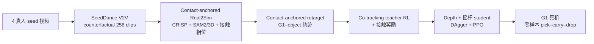

# PRISM（Counterfactual V2V Real2Sim2Real Loco-Manipulation）

> **命名消歧：** 本页为 **Real2Sim2Real + counterfactual 视频** 的 PRISM（[arXiv:2609.38172](https://arxiv.org/abs/2609.38172)）。同缩写但不同工作的 **[多项式本体表征 PRISM](./paper-prism.md)** 见 arXiv:2607.23473；VLA 侧 **[Prism-GRPO](./paper-prism-grpo.md)** 见 arXiv:2608.17423。

**PRISM**（*Counterfactual Video Generation Enables Scalable Humanoid Loco-Manipulation*，[arXiv:2609.38172](https://arxiv.org/abs/2609.38172)，**CoRL 2026**；[项目页](https://prism-real2sim2real.github.io/)）用 **video-to-video（V2V）** 在少量真人 seed 上合成 **counterfactual 人–物交互**（换物体类别/尺寸/位姿且人的行为随之适配），再经 **接触锚定 Real2Sim + 重定向** 得到可仿真 robot–object 轨迹，训练 **单一机载深度 + 摇杆** 的 G1 全身策略，**无真机微调** 完成 pick–carry–drop。

## 一句话定义

**把「视频生成当 Data++」：用 grounded V2V 扩交互经验，用接触信号贯穿重建–重定向–RL，把 imperfect 单目视频变成可部署的统一 loco-manipulation 深度策略。**

## 英文缩写速查

| 缩写 | 英文全称 | 简要说明 |
|------|----------|----------|
| PRISM | （本文系统名） | Real2Sim2Real + counterfactual V2V loco-manip 框架 |
| V2V | Video-to-Video | 以 seed 视频为条件的生成，保留场景与机位 |
| R2S2R | Real-to-Sim-to-Real | 真视频 → 仿真演示 → 真机零样本 |
| CF | Counterfactual | 源视频中未发生但合理的替代交互 clip |
| CRISP | Contact-guided Real2Sim… | 单目人–场景恢复后端（本文扩展动态物体） |
| HMR | Human Mesh Recovery | 人体网格/姿态估计（SMPL-X 4D） |
| DAgger | Dataset Aggregation | 与 PPO 混合蒸馏 privileged teacher |
| G1 | Unitree G1 | 29-DoF 真机平台（50 Hz 部署） |

## 为什么重要

- **数据瓶颈换范式：** 不依赖互联网大规模筛 clip，也不只靠几何增广；**4 seed → 256 V2V** 即覆盖多类物体与行为级变化。
- **接触作为系统纽带：** 同一 **contact anchor** 约束物体 pose 优化、重定向 IK 与 RL 奖励，专门消化 V2V + 单目重建误差。
- **部署口径干净：** **无 MOCAP、无参考 motion**；深度 + 摇杆 + 单策略，与 [VideoMimic](./videomimic.md) / OMOMO 类 mocap-heavy 推理形成对照。
- **首个完整 R2S2R 叙事：** 论文强调 **统一** pick–carry–drop 在 **20+ 真物体** 上 zero-shot（含训练视频未出现的 OOD 类）。

## 核心信息

| 项 | 内容 |
|----|------|
| **机构** | 亚马逊 FAR（Amazon FAR）；加州大学伯克利分校（UC Berkeley）；斯坦福大学（Stanford）；卡内基梅隆大学（CMU） |
| **平台** | Unitree G1 29-DoF；头载 D435i；Fast-FoundationStereo 离板深度；50 Hz 控制 |
| **仿真** | MuJoCo（文中评测与部署描述；训练吞吐受 **Isaac Lab 异构资产** 限制） |
| **生成** | SeedDance 2.0 V2V；4 seeds × 4 类 × 16 samples = **256** videos |
| **开源** | 项目页 **Code** → [`amazon-far/PRISM-Real2Sim2Real`](https://github.com/amazon-far/PRISM-Real2Sim2Real)；截至 **2026-09-30** 仓库 **404**，归类 **待公开** |
| **arXiv** | [2609.38172](https://arxiv.org/abs/2609.38172) |

## 核心原理

### 三阶段主干

| 阶段 | 输入 / 输出 | 要点 |
|------|-------------|------|
| Counterfactual V2V | 4 真人搬箱 seed → 256 CF clips | 保留背景/光照/机位；换 box/bin/barrel/ball 且 **人的行为随 affordance 变** |
| Contact-anchored Real2Sim | CF 视频 → 人+静场景+物体 6D | CRISP 后端 + SAM 2/3D；接触相位 **掌–物锚** 传播物体位姿 |
| Contact-anchored retarget | SMPL-X + 物体 → G1–物轨迹 | 在 [29] 式 interaction matching 上加 **EEF–锚点** 项 |
| Policy | 轨迹 → depth student | Co-tracking teacher + 接触奖励 → **DAgger+PPO** 蒸馏 |

### 流程总览

### 源码运行时序图

**不适用**（截至 **2026-09-30**：[`amazon-far/PRISM-Real2Sim2Real`](https://github.com/amazon-far/PRISM-Real2Sim2Real) 匿名访问 **404**，无法对齐 README 入口。项目页已挂 Code 链；公开后应按「V2V 数据 → Real2Sim 脚本 → retarget → teacher/student 训练 → 真机 depth 桥」补 `sequenceDiagram`。

## 工程实践

| 项 | 建议 |
|----|------|
| Seed 选择 | 稳定视角、少遮挡、任务兼容 motion；V2V 仅需简单 category prompt |
| 深度 Sim2Real | 真机强依赖 **Fast-FoundationStereo**；颈关节角偏差会导致 OOD 深度 |
| Warm start |  released checkpoint 自 **box-only 23K iter** actor 权重 warm start 全类 |
| 训练算力 | Teacher 40K / Student 28K iter，4096 env/GPU × 8× L40S |
| 仿真资产 | 异构物体在 Isaac Lab 限制吞吐——规模化需资产/并行策略 |
| 开源跟进 | 盯 `amazon-far/PRISM-Real2Sim2Real` 与项目页 Code 是否同步上线 |

## 实验与评测

### 跨域（Table 1，student 成功率）

| 训练数据 | OMOMO Test | PRISM OOD |
|----------|------------|-----------|
| OMOMO (90) | 91.67% | 12.50% |
| PRISM ID (80) | 100% | 72.92% |

### 真机（Table 2 节选，每物体 5 trials）

| 类别 | Box | Bin | Barrel | Ball | 代表 OOD |
|------|-----|-----|--------|------|----------|
| 成功率 | 100% | 93% | 93% | 80% | 背包/小桌 100%；头盔/灯 60% |

成功判据：够得着并抓起 → **稳定搬运 ≥3 m** 不摔不丢。

### 消融（Table 3，PRISM-ID / OOD）

| 栈 | ID | OOD |
|----|-----|-----|
| Baseline（SAM3D+FoundationPose+OmniRetarget） | 22.50% | 12.50% |
| + 接触锚定 pose | 58.75% | 29.17% |
| + 接触感知 retarget | 86.25% | 68.75% |
| + 接触奖励（完整 PRISM） | **96.25%** | **72.92%** |

V2V 亦优于纯几何增广（更少 demo、更高 SR，Appendix F）。

## 结论

**一句话总判：loco-manipulation 的规模化瓶颈可以在「少 seed + V2V 行为级扩增 + 接触贯穿 Real2Sim」下被打破，且能落到无 MOCAP 的深度 G1 部署——但开源与仿真资产吞吐仍是复现门槛。**

1. **V2V > 纯几何增广** — 同样预算下 counterfactual 带来感知、位姿与交互动力学三维变化。
2. **接触锚定是误差消化器** — 重建/retarget/RL 共用 anchor，消融从 22.5% 拉到 96.25%（ID）。
3. **OMOMO-only 不够** — 在 PRISM OOD 上 12.5%，说明 **CF 视频分布** 对 unseen 几何/深度至关重要。
4. **深度桥接必选** — Fast-FoundationStereo 显著缩小 depth gap；相机/颈角标定影响 OOD。
5. **单策略 + 摇杆可覆盖 carry 族** — 相对需 reference/mocap 的跟踪式部署更「自主」。
6. **平地训可部分零样本抬升** — 35° 坡 / 0.43 m 台架 pick-up 提示可用 V2V prompt 再扩 elevated demo。
7. **Code 待落地** — 项目页已链 GitHub；入库日 404，复现需等官方仓与 CRISP 扩展脚本。

## 局限与风险

- V2V 与单目重建 **仍有系统误差**；极端遮挡/快速运动未覆盖。
- **SeedDance 2.0** 与 SAM/CRISP 子模块 **重、闭源或第三方依赖** 多，端到端复现成本高。
- Isaac Lab **异构资产** 限制训练规模；论文讨论 sim 吞吐瓶颈。
- 真机评测 **操作员摇杆** + 离板深度，系统延迟与颈关节复位会带来 OOD。
- 与 [paper-prism.md](./paper-prism.md)（多项式本体）、[paper-prism-grpo.md](./paper-prism-grpo.md) **缩写碰撞**——引用时务必带 arXiv 或全称。

## 对比（精选）

| 维度 | PRISM（本文） | VideoMimic / OMOMO 类 | Light-Loco-Parkour |
|------|---------------|------------------------|---------------------|
| 数据源 | 少量真人 + **V2V CF** | 动捕/ curated 交互库 | 稀疏人体 seed + 仿真地形扩张 |
| 物体 | pick–carry–drop **多类** | 依数据集 | 偏跑酷/障碍，非日常小物 |
| 部署传感 | **深度 + 摇杆** | 常需 reference / 更重传感 | 深度 + 速度，无 carry 族 |
| Real2Sim | **接触锚定** 动态物 | 各管线不一 | 物理修复 mimic |

## 关联页面

- [CRISP Real2Sim](../methods/crisp-real2sim.md) — 单目后端与接触哲学（同第一作者 Zihan Wang 的 CRISP 线）
- [Loco-Manipulation 任务](../tasks/loco-manipulation.md)
- [Sim2Real 概念](../concepts/sim2real.md)
- [Real2Sim 纵深 Stage 4](../../roadmap/depth-real2sim.md)
- [VideoMimic](./videomimic.md) · [ResMimic](./paper-resmimic.md) — 视频/残差 loco-manip 对照

## 参考来源

- [PRISM 论文摘录](../../sources/papers/prism_real2sim2real_arxiv_2609_38172.md)
- [PRISM 项目页归档](../../sources/sites/prism-real2sim2real-github-io.md)
- [PRISM-Real2Sim2Real 仓库索引](../../sources/repos/prism-real2sim2real.md)

## 推荐继续阅读

- [项目页](https://prism-real2sim2real.github.io/) — 真机物体矩阵与 robustness 视频
- [arXiv:2609.38172](https://arxiv.org/abs/2609.38172)
- [CRISP（ICLR 2026）方法页](../methods/crisp-real2sim.md)
- [Z1hanW/CRISP-Real2Sim（GitHub）](https://github.com/Z1hanW/CRISP-Real2Sim) — 同作者 Real2Sim 开源基线
