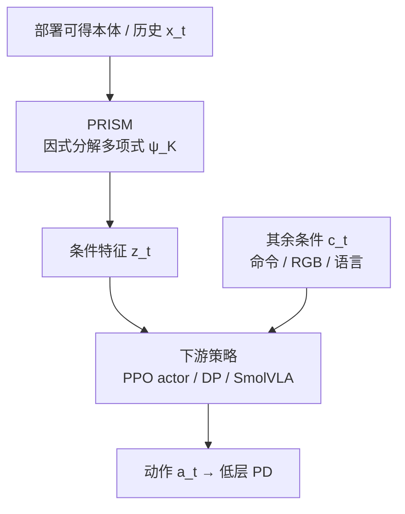
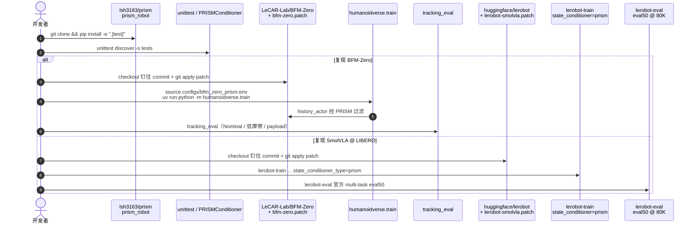

# PRISM：交互结构的多项式本体表征

**PRISM**（*Polynomial Representations for Interaction-Structured Motor Control*，[arXiv:2607.23473](https://arxiv.org/abs/2607.23473)，[项目页](https://lsh3163.github.io/prism/)，[代码](https://github.com/lsh3163/prism)）由 **密歇根大学（University of Michigan）** 提出：用**因式分解多项式模块**改写策略的本体感觉条件通路，使功率、滑移、接触冲量等依赖**变量乘积**的线索可被显式学习，同时保持动作接口与部署传感器不变。

## 一句话定义

**不要只靠加宽 MLP 去「猜」物理交互——把本体状态的可学习多项式乘积做成紧凑条件特征，再接到现有 RL / Diffusion / VLA 策略上。**

## 英文缩写速查

| 缩写 | 英文全称 | 简要说明 |
|------|----------|----------|
| PRISM | Polynomial Representations for Interaction-Structured Motor Control | 本文方法与开源 conditioner |
| MLP | Multi-Layer Perceptron | 对照基线；更大宽度作容量对照 |
| PPO | Proximal Policy Optimization | Humanoid-Gym / BFM-Zero 侧 RL 训练算法 |
| DP | Diffusion Policy | IL 侧被替换线性本体条件的基线 |
| EMD | Earth Mover's Distance | BFM-Zero 运动跟踪误差指标 |
| MCC | Minimalist Compliance Control | 力觉/传感器less 柔顺对照；Oracle 用仿真力 |

## 为什么重要

- **结构 > 容量：** Humanoid-Gym 上参数对齐的 Larger MLP 几乎不涨生存率（52.25 vs 51.0），PRISM 拉到 **92.5%**——说明缺的是交互基，不是参数量。
- **部署零硬件开销：** 不要求 force / wrench / 触觉 / 接触标签 / 显式导纳；仍在 LIBERO 上达到 **91%** 成功率，并超过 MCC-Oracle（64.5%）。
- **可插拔：** 同一模块可接到 [Humanoid-Gym](./humanoid-gym.md) / [BFM-Zero](./paper-bfm-zero.md) 与 [Diffusion Policy](../methods/diffusion-policy.md) / SmolVLA，只改本体分支。

## 核心信息

| 项 | 内容 |
|----|------|
| **机构** | 密歇根大学（University of Michigan, Ann Arbor）CSE |
| **作者** | Seung Hyun Lee、Stella X. Yu |
| **开源** | **已开源**（2026-07-30 项目页核查）：[lsh3163/prism](https://github.com/lsh3163/prism) — `PRISMConditioner` + BFM-Zero / SmolVLA 补丁；顶层 LICENSE 仍标注 finalize 中 |
| **评测栈** | Humanoid-Gym locomotion；LIBERO + DP；BFM-Zero tracking；SmolVLA multi-task LIBERO |
| **默认度数** | Degree-2（Degree-3 可更好，默认取简洁折中） |

## 核心原理

### 交互结构化本体表征

部署观测拆成 \(o_t=(x_t,c_t)\)：\(x_t\) 为部署可得本体/历史，\(c_t\) 为命令、图像、语言等。对 \(x_t\) 学两组仿射因子 \(u=W_1x+b_1,\ v=W_2x+b_2\)，默认二阶：

\[
\psi_2(x)=u+\alpha_2\odot(u\odot v)
\]

\(\alpha\) 近零初始化，训练初接近线性投影；再递归到度数 \(K\)，经投影（实现常含 MLP + RMSNorm）得到下游条件 \(z\)。

### 两条接入路径

| 设定 | 改什么 | 不改什么 |
|------|--------|----------|
| RL | 本体/历史进 actor 前过 PRISM | 动作空间、奖励、PPO、低层 PD；特权仅给 critic |
| IL | 替换 DP / SmolVLA 的线性 `state_proj` / 本体条件 | 视觉–语言骨干、扩散/动作专家接口、低层控制器 |

### 流程总览

## 源码运行时序图

官方仓 [lsh3163/prism](https://github.com/lsh3163/prism)（归档 [`sources/repos/prism.md`](../../sources/repos/prism.md)）提供独立 `PRISMConditioner`，并以**补丁**接入钉住的上游 BFM-Zero / LeRobot-SmolVLA revision（详见 `integrations/README.md`）：

- **最短路径：** 装本仓 → 跑单测 → 用 `PRISMConditioner` 试接入自有策略。
- **论文对齐数字：** 跟 `RESULTS.md` / `REPRODUCIBILITY.md`；上游 ckpt、Isaac/LIBERO 数据需自行按上游安装。
- **Humanoid-Gym / 任务专属 DP：** 论文主表有结果；公开仓当前重点放出更强 backbone 集成。

## 工程实践

| 项 | 建议 |
|----|------|
| 何时试 | 接触/滑移/负载变化明显，但**不能或不想加力觉**；或怀疑「加宽 MLP 没用」 |
| 默认超参 | `degree=2`、`gated`、`gate_init≈1e-2`、可选 RMSNorm；先保持下游策略其余设置不变 |
| RL 接入 | 只改 deployable 本体/历史分支；特权信息继续只给 critic |
| IL / VLA 接入 | 只替换 proprio / `state_proj`；冻结视觉编码器等现有配方可保留 |
| 容量对照 | 务必设 **matched-parameter larger MLP/conditioner**，避免把增益误读成「更大网络」 |
| 调试 | `polynomial_features()` 检查中间特征；用线性探针看 slip/power/impulse 是否更可预测 |
| 复现 | BFM-Zero / SmolVLA 必须用 `integrations/README.md` 的钉住 commit，勿盲跟 upstream tip |

## 实验与评测

| 设定 | Baseline / Larger | **PRISM** | 读法 |
|------|-------------------|-----------|------|
| Humanoid-Gym 生存率 % | 51.0 / 52.25 | **92.5** | 容量对照几乎无效 |
| Humanoid-Gym episode length | ~1341 / ~1350 | **2233** | 跟踪更稳、更少早落 |
| LIBERO 成功率 %（DP 栈） | 63.8；MCC-S 47.8；MCC-O 64.5 | **91.0** | 无 force 仍超 Oracle 柔顺 |
| BFM-Zero Mean EMD ↓ | 1.269 / 1.264 | **1.224** | 名义/低摩擦/载荷均降 |
| SmolVLA LIBERO Avg ↑ | 63.50 / 64.90 | **66.55** | Long 套件增益最大（53.4） |

线性探针（相对 DP）：joint-power MSE **−14.0%**、contact-impulse MSE **−19.9%**、slip PCC **+9.6%**。消融显示 locomotion 动作对 velocity–memory / cross-joint velocity 等涌现乘积项敏感。

## 结论

**对接触与动力学敏感的电机控制，显式多项式本体交互往往比「同容量更大的 MLP」更划算，且不必为部署加力觉硬件。**

1. **先改表征基，再谈加宽网络** — Larger MLP 在 Humanoid-Gym / BFM-Zero / SmolVLA 上都远小于 PRISM 增益。
2. **默认 Degree-2 够用** — Degree-3 可再挖一点，但复杂度上升；论文默认取 2。
3. **只动本体条件通路** — 动作接口、奖励/扩散目标、低层 PD 可原样保留，接入成本低。
4. **传感器less 柔顺可读作涌现行为** — LIBERO 接触力曲线显示接触后主动降速；对比 MCC 时注意 Oracle 不可部署。
5. **探针与消融用于解释，不用于训练** — 物理量与交互名是 post-hoc；部署仍只用本体。
6. **复现走补丁路径** — 钉住上游 commit；本仓不重分发仿真资产与权重。

## 与其他工作对比

| 对照 | 差异读法 |
|------|----------|
| [Humanoid-Gym](./humanoid-gym.md) | 评测与基线栈；PRISM 是其上的 **actor 表征插件**，不是新仿真框架 |
| [BFM-Zero](./paper-bfm-zero.md) | 更强可提示 RL backbone；PRISM 改 `history_actor` 流，不改 FB 提示接口本身 |
| [Diffusion Policy](../methods/diffusion-policy.md) | IL 基线；PRISM 替换线性本体条件，扩散去噪头可不变 |
| MCC / 力觉柔顺 | 依赖力估计或仿真力；PRISM 走**纯本体多项式**路线 |
| 物理信息损失 / 辅助估计器 | 那些加监督或约束；PRISM 是**无额外物理标签的架构偏置** |

## 局限与风险

- **公开仓重点在 BFM-Zero / SmolVLA 补丁**；Humanoid-Gym 与任务专属 DP 主表结果需对照论文/项目页，勿假设一键脚本齐全。
- **LICENSE 仍 finalize 中** — 再分发前读 `NOTICE.md`；上游补丁遵循 BFM-Zero / LeRobot 条款。
- **增益依赖本体已反映接触/负载效应**；若关键动力学在观测中不可见，多项式也救不了。
- **涌现交互名为 post-hoc**，勿当成手写物理特征工程清单。
- **真机部署叙事弱于仿真评测** — 选型时把「传感器less」当归纳偏置收益，而非已验证的全场景真机保证。

## 关联页面

- [Humanoid-Gym](./humanoid-gym.md) — locomotion 主表评测框架
- [BFM-Zero](./paper-bfm-zero.md) — 更强 RL backbone 集成对象
- [Diffusion Policy](../methods/diffusion-policy.md) — IL 侧被改写的本体条件基线
- [Reinforcement Learning](../methods/reinforcement-learning.md) / [Imitation Learning](../methods/imitation-learning.md)
- [Locomotion](../tasks/locomotion.md) / [Manipulation](../tasks/manipulation.md)
- [接触丰富操作](../concepts/contact-rich-manipulation.md) — 无额外力觉时的柔顺语境

## 参考来源

- [prism_arxiv_2607_23473.md](../../sources/papers/prism_arxiv_2607_23473.md) — 论文摘录与开源核查
- [lsh3163-prism-github-io.md](../../sources/sites/lsh3163-prism-github-io.md) — 项目页归档
- [prism.md](../../sources/repos/prism.md) — GitHub 仓库归档
- [arXiv:2607.23473](https://arxiv.org/abs/2607.23473) — 原文（Submitted 2026-07-26）

## 推荐继续阅读

- 项目页：<https://lsh3163.github.io/prism/>
- 官方代码：<https://github.com/lsh3163/prism>
- PDF：<https://arxiv.org/pdf/2607.23473>
