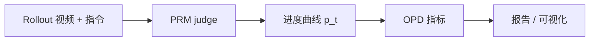
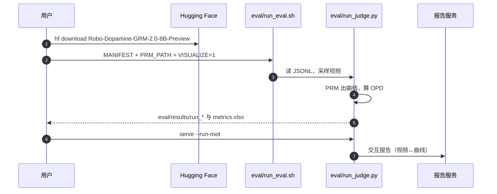

# PRM-as-a-Judge：机器人执行过程评测

**PRM-as-a-Judge 1.5**（*A Toolkit for Robot Process Assessment*，[arXiv:2608.14284](https://arxiv.org/abs/2608.14284)，[项目页](https://prm-as-a-judge.github.io/)，[代码](https://github.com/Yuheng2000/PRM-as-a-Judge)）由 **北京智源人工智能研究院（BAAI）** / **中国科学院自动化研究所（CASIA）** 提出：不改被评策略，只消费其 rollout 视频，经过程奖励模型（PRM）得到进度曲线，再输出 Outcome–Process–Diagnosis（OPD）指标与交互报告。1.0 见 [arXiv:2603.21669](https://arxiv.org/abs/2603.21669)。

## 一句话定义

**把「做成没做成」拆成「走了多远、走得顺不顺、失败有多接近成功、回撤后能不能回来」——用进度曲线评 VLA / WAM，而不是只报成功率。**

## 英文缩写速查

| 缩写 | 英文全称 | 简要说明 |
|------|----------|----------|
| PRM | Process Reward Model | 逐帧/逐段估计任务进度的过程奖励模型 |
| OPD | Outcome–Process–Diagnosis | 可达性 / 效率 / 回退与停滞的三层指标族 |
| FNS | Failure Near-Success | 失败轨迹离完成有多近（1.5 新增） |
| DRR | Drawdown Recovery Ratio | 最大回撤后恢复了多少（1.5 新增） |
| SQS | Success Quality Score | 成功轨迹的效率与稳定性（1.5 新增） |
| SR | Success Rate | 二元成功率；本页主张它不够用 |

## 为什么重要

- **SR 的两个盲区：** 走到 99% 与停在 5% 都叫失败；顺滑成功与反复修正成功都叫成功。
- **评测器本身也要测：** RoboPulse++ 用 Rising / Falling 区间检验 PRM，避免「用一个没校准的 judge 给全场打分」。
- **工程可跑：** Apache-2.0 套件把 JSONL 视频清单打成曲线、`metrics.xlsx` 与可视化报告，可直接挂到 [RoboDojo](./robodojo.md) 一类已有 rollout 上。

## 核心信息

| 项 | 内容 |
|----|------|
| **机构** | 北京智源人工智能研究院（BAAI）；中国科学院自动化研究所（CASIA） |
| **输入** | 任务指令 + rollout 视频（可选多视角 / `goal_image`） |
| **默认 judge** | Robo-Dopamine（Forward）；权重 [8B Preview](https://huggingface.co/tanhuajie2001/Robo-Dopamine-GRM-2.0-8B-Preview) |
| **被评榜** | RoboDojo-RealWorld / Sim（冻结 2026-07-03 公开视频，不微调被评模型） |
| **开源** | **已开源**（Apache-2.0）：评测 CLI + 可视化；RoboPulse 已上 HF；**RoboPulse++ 数据仍标 Coming Soon** |

## 核心原理

### 方法栈

| 模块 | 机制 |
|------|------|
| 记录 | JSONL：`case_id` / `task` / `video` |
| PRM | pair-style（Robo-Dopamine / RoboReward）或 sequence-style（RoboMeter / RynnValue）出 \(p_t\in[0,1]\) |
| 后处理 | 高斯平滑；原始曲线保留供排错 |
| Outcome | MP、MC@25/50/75 |
| Process | PPL：最高进度的平方 / 曲线总变差 |
| Diagnosis | CRA、STR；1.5 条件指标 FNS / DRR / SQS |

### 流程总览

## 源码运行时序图

复现从 `getting_started/PRM_as_a_Judge_quickstart.ipynb` 或捆绑 `eval/examples/manifest_demo_cases.jsonl` 起步；自备数据只改 manifest。

## 工程实践

| 项 | 建议 / 仓库设定 |
|----|----------------|
| 环境 | Python 3.10；`pip install -e ".[dopamine]" -c constraints/dopamine-cu128-py310.txt` |
| 模式 | 默认 `incremental`；可 `forward` / `backward` |
| `goal_image` | 仅 Robo-Dopamine；用**已核验成功演示末帧**，勿用待评失败末帧当目标 |
| 何时换 judge | 重复/振荡任务 pair-style 易糊，README 建议对照 sequence-style（如 RoboMeter） |
| 成本量级 | 论文附录：H100 上 100 条 75s 视频，Robo-Dopamine-8B 约 31.7 min；RoboMeter 约 46 s |

## 实验与评测

| 读点 | 数字 / 现象 |
|------|-------------|
| RealWorld SR 最高 | \(\pi_{0.5}\) **17.06%**，同时 MC@25 **85.29**、DRR **100**、FNS **45.39** |
| SR 与过程不一致 | GR00T-N1.7 RealWorld SR 仅 0.63，但 SQS **91.65**（成功很少但较稳） |
| Sim 总体 | Hy-Embodied-0.5-VLA SR **11.46**；\(\pi_{0.5}\) 多指标平均第一 |
| 范式 | Sim Top-k 中 VLA 占比高于 WAM |
| 规模 | 更大参数不保证更好 |
| 任务族 | Precision 相对最好；开放词汇最难；长程方差最大 |
| Sim↔Real | 共享模型排名 Spearman \(\rho=0.18\)–\(0.58\)；精对齐/复杂接触任务掉得更狠 |
| RoboPulse++ | 700 ep / 2,244 区间；Robo-Dopamine Forward Macro-F1 **0.77**；Falling 最佳 F1 仅 **0.63** |

## 结论

**过程评测的真贡献不是再发一张 SR 表，而是用同一条进度曲线同时读可达性、效率、近成功失败和恢复；评测器自己也必须在 Rising/Falling 上过关。**

1. **真影响：SR 排名会被 FNS / DRR / SQS 打乱** — 选型不要只抄官方成功率。
2. **真影响：\(\pi_{0.5}\) 是该冻结榜上最稳的通才读点** — 不是「所有指标第一」，而是跨维少短板。
3. **真影响：Sim 高分不外推 Real** — 与 [sim↔real 评测 gap](../concepts/sim-vs-real-eval-gap.md) 同结论，这里给了过程指标版相关。
4. **次要代价：judge 偏差** — 默认 Robo-Dopamine；重复动作与回退识别仍弱。
5. **部署读法：** 先跑捆绑 demo，再把自有视频写成 JSONL；振荡任务换 sequence-style 对照。
6. **工程读法：套件已开、RoboPulse++ 数据未齐** — 可复现评测管线，区间基准发布仍待跟。

## 与其他工作对比

| 对照 | 差异读法 |
|------|----------|
| [RoboDojo](./robodojo.md) | 提供 sim-and-real **任务榜与 rollout**；本页在其上做 **过程二次评测**，不替代官方 SR |
| [过程奖励建模](../concepts/progress-reward-modeling.md) / [综述](./paper-progress-reward-modeling-survey.md) | 综述讲 PRM 怎么造；本页讲 PRM 怎么当 **评测器** |
| [TOPReward](./paper-topreward.md) | 零样本 token 似然进度；在 RoboPulse++ 上 Falling 弱于专用 PRM |
| 手工规则分 / 特权状态指标 | 本页只要视频+指令，换任务成本低，但继承 PRM 标定误差 |

## 局限与风险

- **开源边界：** 工具仓可跑；RoboPulse++ 数据集截至 2026-08-17 仍 Coming Soon。
- **Judge 即偏差：** 曲线质量上限是 PRM；负进度监督不足是论文自己点名的缺口。
- **不改策略：** 诊断能指导采数/重加权，但本套件不是训练代码。
- **冻结榜快照：** 分析绑在 2026-07-03 RoboDojo 公开视频，后续上榜模型需重跑。

## 关联页面

- [过程奖励建模](../concepts/progress-reward-modeling.md) — PRM 接口与评测透镜
- [Progress Reward Survey](./paper-progress-reward-modeling-survey.md) — 领域地图
- [TOPReward](./paper-topreward.md) — 冻结 VLM 进度对照
- [RoboDojo](./robodojo.md) — 被评 rollout 来源
- [具身评测基准选型闭环](../queries/embodied-eval-benchmark-selection-loop.md) — ③ 层过程指标补丁
- [具身评测基准知识链](../overview/hub-embodied-eval-benchmark.md) — 四层入口
- [仿真 vs 真机评测 gap](../concepts/sim-vs-real-eval-gap.md) — Finding 5 的概念页
- [VLA](../methods/vla.md) — 被评策略族

## 参考来源

- [prm_as_a_judge_arxiv_2608_14284.md](../../sources/papers/prm_as_a_judge_arxiv_2608_14284.md) — 1.5 论文摘录
- [prm-as-a-judge-github-io.md](../../sources/sites/prm-as-a-judge-github-io.md) — 项目页核查
- [prm-as-a-judge.md](../../sources/repos/prm-as-a-judge.md) — 仓库入口
- [arXiv:2608.14284](https://arxiv.org/abs/2608.14284) — 原文

## 推荐继续阅读

- [PRM-as-a-Judge User Guide](https://prm-as-a-judge.github.io/doc.html)
- [Robo-Dopamine 8B Preview](https://huggingface.co/tanhuajie2001/Robo-Dopamine-GRM-2.0-8B-Preview)
- [1.0 论文 arXiv:2603.21669](https://arxiv.org/abs/2603.21669)
