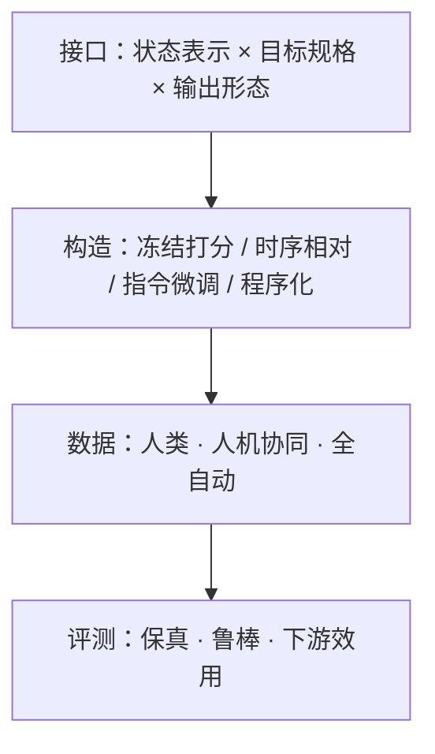

# Progress Reward Modeling Survey（过程奖励综述 · arXiv:2607.21655）

**Progress Reward Modeling for Robotic Learning: A Comprehensive Survey**（[arXiv:2607.21655](https://arxiv.org/abs/2607.21655)，Jianshu Zhang* / Keliang Wu* 等 · **西北大学（Northwestern）** / **卡内基梅隆大学（CMU）** / **威斯康星大学麦迪逊分校（UW–Madison）** / **加州大学圣巴巴拉分校（UCSB）** / **伊利诺伊大学厄巴纳-香槟分校（UIUC）**；[Awesome 索引](https://github.com/sterzhang/Awesome-Progress-Models)）给出机器人过程奖励领域的统一读法：先接口、再构造机制、再数据与评测主张。

## 一句话定义

**一篇把碎片化「进度/过程奖励」文献收束成接口–方法–证据三层地图的综述，并用开源 Awesome 仓承接可持续索引。**

## 英文缩写速查

| 缩写 | 英文全称 | 简要说明 |
|------|----------|----------|
| Survey | Comprehensive Survey | 本文体裁 |
| PRM | Progress Reward Model | 过程/进度奖励模型 |
| VLM | Vision-Language Model | 多范式共用骨干 |
| ORM | Outcome / terminal success signal | 终局成功对照 |
| Awesome | Awesome-Progress-Models | 配套 MIT 索引仓 |
| Eureka / Text2Reward | Programmatic reward lines | 程序化范式代表 |

## 为什么重要

- 同名工作可能在做完全不同的 I/O（单图成功概率 vs 视频进度百分比 vs 奖励程序）。
- 评测混用：时间序准确、偏好准确、下游成功率验证的不是同一性质。
- 给维护者一条 **可持续入口**：论文主张 ↔ Awesome 画廊行一一对应。

## 核心信息

| 项 | 内容 |
|----|------|
| 机构 | Northwestern、CMU、UW–Madison、UCSB、UIUC |
| 结构 | §2 接口 → §3 四范式 → §4 数据/基准 → §5 局限与方向 |
| 配套仓 | [sterzhang/Awesome-Progress-Models](https://github.com/sterzhang/Awesome-Progress-Models)（**MIT，已开源**） |
| 开源形态 | **索引/策展**（非单一算法训练代码） |

## 流程总览

## 核心原理（方法栈）

综述本身的「方法」是 **分类学**：

1. **Interface-first：** 任何进度模型先写成任务条件黑盒的 I/O，再比架构。
2. **Mechanism taxonomy：** 按「进度信号从哪来、如何变成可用奖励」分四范式（详见 [概念页](../concepts/progress-reward-modeling.md)）。
3. **Evidence split：** 保真度基准与下游效用基准分列，避免「策略涨了就等于进度学对了」。

画廊覆盖 ProgressLM、RoboReward、Robometer、Robo-Dopamine、VLAC、VIP、Eureka、Text2Reward 等代表工作（以 Awesome README 为准）。

## 源码运行时序图

**不适用（索引仓）** — 官方产物是 [Awesome-Progress-Models](https://github.com/sterzhang/Awesome-Progress-Models) 的 Markdown 画廊与图片资源，没有统一 `train.py`/`eval.py` 运行时。使用方式：按范式浏览 → 跳转各论文 Code/Project。

## 实验与评测（综述主张的读法）

本文不报告单一算法的最优结果排行表，而规定 **如何读别人的表**：

| 评测目标 | 真正检验什么 | 误读风险 |
|----------|--------------|----------|
| 进度保真 | 与进度参照的一致/相关/可拒答 | 单调时间曲线可能忽略目标 |
| 鲁棒泛化 | 分布偏移下意义是否保持 | 仅成功演示基准看不见回退 |
| 下游效用 | 是否改善学习/筛选/规划 | 效用↑ 不能反推标定正确 |

## 工程实践

| 项 | 实践要点 |
|----|----------|
| 跟新 | `git pull` Awesome；新条目需能回溯综述引用或同步更新 survey |
| 选型 | 先定接口三维，再挑范式，最后看有无失败/回退数据 |
| 部署 | 大 VLM 逐步奖励查询要做延迟预算 |
| License | 索引仓 MIT；各论文代码许可证仍各自为准 |

## 结论

**过程奖励领域缺的不是单篇新模型，而是共享的问题定义与证据分层；本综述 + Awesome 仓把「比什么」先对齐。**

1. **先写清 I/O** — 否则表格不可比。
2. **四范式按监督来源分，不按网络名分** — 避免假对比。
3. **保真与效用拆开主张** — 写论文/做选型都适用。
4. **时间序弱假设是第一大坑** — 必须测非单调执行。
5. **部分可观测** — 接触细进度要力/触觉/记忆，不单靠 RGB。
6. **工程入口用 Awesome** — 比从零扫 arXiv 更可维护。

## 局限与风险

- 综述覆盖截至投稿时文献；Awesome 需持续维护才不漂移。
- 不等价于「选哪个开源实现就能上真机」的部署手册。
- 程序化范式在无特权状态的真机场景适用面窄。

## 与其他工作对比

| 资源 | 焦点 | 相对本综述 |
|------|------|------------|
| [过程奖励建模（概念）](../concepts/progress-reward-modeling.md) | 本库压缩读法 | 本文是完整出处 |
| [TOPReward](./paper-topreward.md) | 冻结 VLM token 似然零样本进度 | 四范式中「冻结打分」实例；代码已开 |
| WAM / VLA 综述 | 策略与世界模型架构 | 互补：奖励侧 vs 策略侧 |
| 各单篇 ProgressLM / Robometer 等 | 具体算法 | 画廊叶子节点 |

## 关联页面

- [过程奖励建模](../concepts/progress-reward-modeling.md) — 接口×范式速查
- [TOPReward](./paper-topreward.md) — 冻结 VLM token 似然进度实例
- [Reinforcement Learning](../methods/reinforcement-learning.md) — 稠密奖励用途
- [Imitation Learning](../methods/imitation-learning.md) — 演示序弱监督
- [VLA](../methods/vla.md) — VLM 进度模型生态
- [具身评测基准选型](../queries/embodied-eval-benchmark-selection-loop.md) — 效用评测

## 参考来源

- [综述论文归档](../../sources/papers/progress_reward_modeling_survey_arxiv_2607_21655.md)
- [Awesome-Progress-Models](../../sources/repos/awesome-progress-models.md)
- [TOPReward 论文归档](../../sources/papers/topreward_arxiv_2602_19313.md)

## 推荐继续阅读

- [arXiv:2607.21655](https://arxiv.org/abs/2607.21655)
- [GitHub: Awesome-Progress-Models](https://github.com/sterzhang/Awesome-Progress-Models)
- [TOPReward 项目页](https://topreward.github.io/webpage/)
