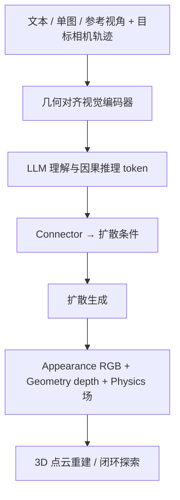
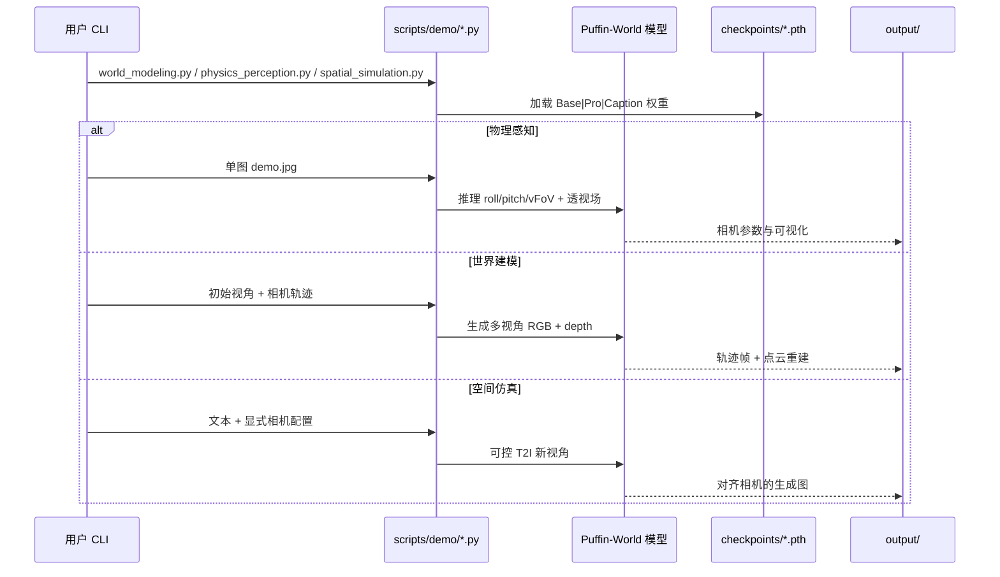

# Puffin-World（原生 3D 世界状态统一多模态世界模型 · arXiv:2609.04196）

**Puffin-World**（*Scaling a Unified Multimodal Model with Native 3D World States*，[arXiv:2609.04196](https://arxiv.org/abs/2609.04196)，Kang Liao 等 · **南洋理工大学 S-Lab** / **密歇根大学** / **北京交通大学** / **ACE Robotics**；[项目页](https://kangliao929.github.io/projects/puffin-world/)，[GitHub `Puffin-World/`](https://github.com/KangLiao929/Puffin/tree/main/Puffin-World)，[HF 权重](https://huggingface.co/KangLiao/Puffin-World)，[Puffin-16M](https://huggingface.co/datasets/KangLiao/Puffin-16M)）把世界表示从「RGB 帧序列」扩展为三类 **原生 3D 世界状态**，在 **同一框架** 内完成相机到世界理解、自由视点仿真、图文到 3D 世界生成与重建，**不依赖** 任务专用外部感知/重建模块。

## 一句话定义

**用 physics（重力/纬度）、geometry（深度）、appearance（RGB）三类原生状态 + Omni-Camera 条件，把多模态理解与扩散生成统一到可物理锚定的 3D 世界建模框架中。**

## 英文缩写速查

| 缩写 | 英文全称 | 简要说明 |
|------|----------|----------|
| vFoV | vertical Field of View | 垂直视场角，单图相机理解输出之一 |
| LLM | Large Language Model | 自回归相机理解与语义推理骨干 |
| RGB | Red Green Blue | 外观世界状态的图像观测 |
| BEV | Bird's-Eye View | 本文未主打，对比其他世界模型常用俯视监督 |
| AUC | Area Under Curve | 相机参数误差阈值曲线面积（1°/5°/10°） |
| PSNR | Peak Signal-to-Noise Ratio | RealEstate10K 等新视角合成质量指标 |
| LPIPS | Learned Perceptual Image Patch Similarity | 感知相似度，越低越好 |
| HF | Hugging Face | 官方权重与 Puffin-16M 数据集托管 |

## 为什么重要

- **超越纯外观世界模型：** 多数生成式世界模型只预测「下一帧像什么」；Puffin-World 显式建模 **相机在真实世界中的朝向** 与 **场景几何**，长轨迹大旋转时减少地平线漂移与 uprightness 不一致。
- **三层统一而非三条管线：** 表示（RGB/深度共享 VAE latent + Omni-Camera）、模态（几何对齐编码器 + LLM 理解 + connector 条件扩散）、任务（改输入组合即可切换理解/生成/重建）在同一网络内完成。
- **数据与标注规模化：** **Puffin-16M** 覆盖极端 pitch/yaw/roll 与 360° 轨迹；另对 **28** 个公开数据集 **~44.5M** 图像标注绝对相机参数，可直接用于分析视角偏差与物理接地训练。
- **机器人 / Physical AI 读法：** 闭环 demo（mimic exploration、self-calibrated exploration）指向 **World-Action** 与具身导航前的 **空间智能** 底座，与 [Generative World Models](../methods/generative-world-models.md) 中「几何可信的视频世界模型」选型相关。

## 核心信息

| 项 | 内容 |
|----|------|
| **机构** | NTU S-Lab、University of Michigan、BJTU、ACE Robotics 等 |
| **世界状态** | Physics（重力+纬度）/ Geometry（深度）/ Appearance（RGB） |
| **相机条件** | **Omni-Camera**：9 通道/像素（3 绝对 + 6 相对射线） |
| **骨干** | 几何对齐视觉编码器 + Qwen 系 LLM + SD3.5 类扩散 + connector |
| **数据** | Puffin-16M（15M Cam + 1M Traj）+ 44.5M 相机标注 |
| **开源** | **已开源**（代码 + Base/Pro/Caption 权重 + 数据集）；NTU S-Lab License 1.0 |

## 流程总览

## 源码运行时序图

复现最短路径：`cd Puffin/Puffin-World` → 安装 `requirements.txt` + `flash-attn` → `huggingface-cli download KangLiao/Puffin-World --local-dir checkpoints` → `python scripts/demo/physics_perception.py demo.jpg --checkpoint checkpoints/Puffin-World-Pro.pth`。

## 核心原理

### Omni-Camera 与物理传播

每像素条件 \(\mathbf{c}_{\mathbf{x}}=\mathrm{Concat}(\mathbf{a}_{\mathbf{x}},\mathbf{p}_{\mathbf{x}})\in\mathbb{R}^{9}\)：绝对场 \(\mathbf{a}\)（up vector + latitude）提供 **真实世界锚定**；相对射线 \(\mathbf{p}\)（origin + direction）支持 **连续跨视角运动**。

长轨迹上，参考视角重力 \(\mathbf{g}_0\) 经相对旋转传播：\(\mathbf{g}_t=\mathbf{R}^{rel}_{t\leftarrow 0}\mathbf{g}_0\)，使生成视角共享同一物理坐标系。

### 任务组合即统一接口

| 任务族 | 输入组合 | 输出 |
|--------|----------|------|
| 相机到世界理解 | 单图 | roll / pitch / vFoV + 语义描述 + 稠密透视场 |
| 自由视点仿真 | 文本 + 目标相机 | 物理对齐的新观测 |
| 3D 世界生成 | 图/文 + 轨迹 | 多视角 appearance + geometry + physics |
| 闭环探索 | 交错感知-动作-生成 | mimic / self-calibrated 轨迹扩展 |

## 工程实践

| 项 | 实践要点 |
|----|----------|
| **环境** | Python 3.10、PyTorch 2.7.0、CUDA 12.6；`flash-attn==2.8.3` |
| **权重选型** | **Pro**（Qwen2.5-1.5B + C-RADIOv4-H）为 README 推荐统一建模；**Caption** 仅理解 |
| **Demo** | `world_modeling.py` / `physics_perception.py` / `spatial_simulation.py` |
| **训练** | `configs/pipelines/final_stage_{1..4}_*` 多阶段；见 `documents/EVALUATION.md` |
| **许可** | NTU S-Lab License 1.0（商用需单独核对） |

## 实验与评测

### 相机到世界理解（四基准）

项目页报告：median error **12/12** 项最佳；AUC **33/36** 项最佳（含并列）。LaMAR roll **0.26°**；Stanford2D3D vFoV **1.62°**。

### 可控生成与 3D 世界

| 基准 | 摘录结果 |
|------|----------|
| Puffin-Cam-Bench | up-vector **0.84°**、latitude **1.26°**、gravity **0.79°**；FID 最低 |
| RealEstate10K | PSNR **17.22** ↑、LPIPS **0.318** ↓ |
| Puffin-Traj-Bench | median roll **0.80°**、pitch **1.10°** 最低 |

## 结论

**Puffin-World 把「世界模型 = 像素序列」推进到「物理 + 几何 + 外观」三类原生状态，并用已开源代码/权重把相机锚定与多视角生成做成可复现的统一多模态框架。**

1. **Omni-Camera 是核心接口** — 绝对物理锚定与相对运动在同一 9 通道条件里完成。
2. **物理传播解决长轨迹漂移** — 相对运动只描述「怎么动」，传播重力才固定「朝哪是上」。
3. **Puffin-16M 是规模关键** — 大 pitch/yaw/roll 与 360° 轨迹覆盖，否则理解/生成在极端视角下崩。
4. **工程可落地** — HF 三档权重 + demo 三脚本；选型先 **Pro** 做世界建模烟测。
5. **边界在静态场景** — 动态交互、更长时域与更丰富物理状态仍是作者明示的下一步。
6. **许可非 Apache** — 研究复现友好，产品化须读 NTU S-Lab License。

## 局限与风险

- **静态场景为主：** 动态物体与交互物理未充分建模。
- **算力门槛：** 训练依赖大模型 + 扩散 + flash-attn；非轻量边缘部署栈。
- **与机器人控制距离：** 主贡献在空间智能与视角一致生成；到 WAM / 策略闭环仍需额外动作接口。
- **系列演进：** 前作 [Puffin](https://arxiv.org/abs/2510.08673)（ICLR 2026）偏相机中心理解/生成；World 版扩展原生状态与 16M 数据，API 与权重不自动兼容。

## 与其他工作对比

| 对比轴 | Puffin-World | [WorldWeaver](./paper-worldweaver.md) | [RynnWorld-4D](./paper-rynnworld-4d-rgb-depth-flow.md) |
|--------|--------------|--------------------------------------|--------------------------------------------------------|
| **状态表示** | physics + depth + RGB 原生场 | 显式 WSR 寄存器 token | RGB + depth + flow 四模态 |
| **相机** | Omni-Camera 绝对+相对 | 多智能体动作条件 | 轨迹/动作条件视频 |
| **理解** | 单图 roll/pitch/vFoV | 弱 | 偏生成 |
| **开源** | **代码+权重+数据** | 占位（截至 2026-07） | 视子项目而定 |
| **场景** | 静态 3D 室内/室外 | Minecraft 多智能体 | 机器人/驾驶等 |

## 关联页面

- [Generative World Models](../methods/generative-world-models.md)
- [World Action Models](../concepts/world-action-models.md)
- [世界模型物理保真：输出阅读轴](../overview/world-model-physics-fidelity-outputs.md)
- [WorldWeaver](./paper-worldweaver.md) · [RynnWorld-4D](./paper-rynnworld-4d-rgb-depth-flow.md)
- [Video-as-Simulation](../concepts/video-as-simulation.md)

## 参考来源

- [puffin_world_arxiv_2609_04196.md](../../sources/papers/puffin_world_arxiv_2609_04196.md)
- [puffin.md](../../sources/repos/puffin.md)
- [puffin-world-project.md](../../sources/sites/puffin-world-project.md)
- [HF Blog](https://huggingface.co/blog/KangLiao/puffin-world)

## 推荐继续阅读

- [arXiv:2609.04196](https://arxiv.org/abs/2609.04196)
- [项目页](https://kangliao929.github.io/projects/puffin-world/)
- [GitHub — Puffin-World/](https://github.com/KangLiao929/Puffin/tree/main/Puffin-World)
- [Puffin-16M 数据页](https://kangliao929.github.io/projects/puffin-16m/)
