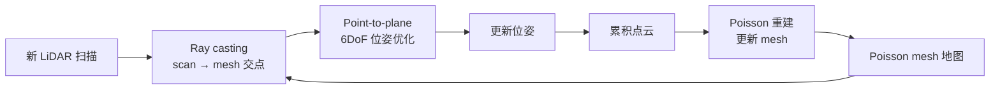
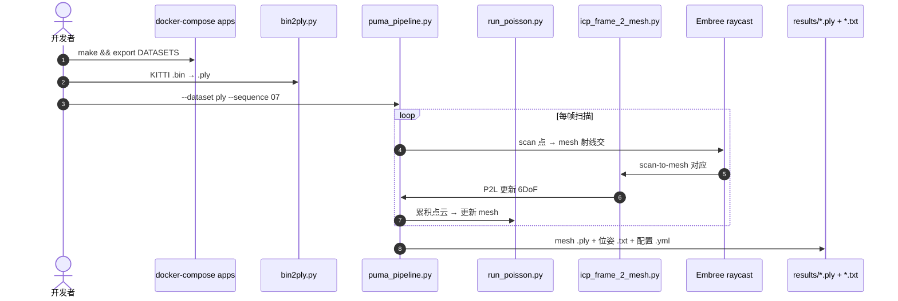

# PUMA：Poisson Surface Reconstruction for LiDAR Odometry and Mapping

**PUMA**（*Poisson Surface Reconstruction for LiDAR Odometry and Mapping*；[ICRA 2021 PDF](https://www.ipb.uni-bonn.de/pdfs/vizzo2021icra.pdf)，[代码](https://github.com/PRBonn/puma)，[视频](https://youtu.be/7yWtYWaO5Nk)）由 **波恩大学 Photogrammetry & Robotics Lab（PRBonn）** 的 Ignacio Vizzo、Xieyuanli Chen、Nived Chebrolu、Jens Behley、Cyrill Stachniss 提出：用 **Poisson 曲面重建** 将 LiDAR 地图表示为 **三角 mesh**，通过 **射线投射** 建立 **scan-to-mesh** 对应，并以 **point-to-plane** 配准完成 **frame-to-mesh** 里程计与建图。

> **同名消歧：** 本文的 scan-to-mesh 是 **几何 SLAM 配准**；与 CVPR 2019 学习式 **[Scan2Mesh（Dai & Nießner）](./paper-scan2mesh-cvpr2019-dai.md)**（range scan → 生成 mesh）不同。

## 一句话定义

**把 LiDAR 地图建成 Poisson 三角 mesh，用 ray casting 找 scan-to-mesh 对应，再以 point-to-plane 迭代估计每帧 6DoF 位姿。**

## 英文缩写速查

| 缩写 | 英文全称 | 简要说明 |
|------|----------|----------|
| PUMA | Poisson Surface Reconstruction for LiDAR Odometry and Mapping | 本文系统；mesh 地图 LiDAR 里程计 |
| PSR | Poisson Surface Reconstruction | 从点云隐式场提取 watertight mesh 的经典算法 |
| P2L | Point-to-Plane | 点到平面 ICP 变体；本文位姿优化核心 |
| LiDAR | Light Detection and Ranging | 64-beam Velodyne 类旋转激光（KITTI / Mai City） |
| SLAM | Simultaneous Localization and Mapping | 同步定位与建图；本文偏研究型 LiDAR 管线 |
| ICP | Iterative Closest Point | 迭代配准族；本文为 scan-to-mesh 特化 |

## 为什么重要

- **地图表示新轴：** 相对 surfel / TSDF 点云地图，**显式三角 mesh** 更紧凑、表面更连续，利于可视化与部分规划/碰撞接口（见 README 与 KITTI `00` 定性对比）。
- **Scan-to-mesh 可算：** 用 **Embree 加速 ray-to-triangle** 把「扫描点 ↔ 地图面片」对应写清楚，避免只在点云上做最近邻。
- **PRBonn 开源基线：** [`PRBonn/puma`](https://github.com/PRBonn/puma) 提供 Docker、`puma_pipeline.py` 与 `icp_frame_2_mesh.py`，适合作为 **mesh 地图 LiDAR 里程计** 复现入口。
- **与 PSR 生态衔接：** [Points as Tori](./paper-points-as-tori.md) 等页将 PSR 作为重建对照；PUMA 展示 PSR 在 **在线 SLAM** 中的用法，而非仅离线重建。

## 核心信息

| 项 | 内容 |
|----|------|
| **机构** | 波恩大学（University of Bonn），Photogrammetry & Robotics Lab |
| **出处** | IEEE ICRA 2021 |
| **论文** | <https://www.ipb.uni-bonn.de/pdfs/vizzo2021icra.pdf> |
| **代码** | <https://github.com/PRBonn/puma> |
| **开源** | **已开源** — Docker + `puma_pipeline.py` + `INSTALL.md`（2026-09-15 项目页/GitHub 核查） |
| **数据** | KITTI Odometry、Mai City（64-beam Velodyne 类） |

## 流程总览

## 核心原理

### 地图：Poisson mesh

- 从累积（或窗口）点云运行 **Poisson Surface Reconstruction**，得到 **三角 mesh** 全局地图。
- 相对 **TSDF 体素**：mesh 表面更 **连续**；相对 **surfel**：更少碎片、更适合射线求交。

### 位姿：frame-to-mesh

| 步骤 | 机制 |
|------|------|
| 对应 | 对扫描中每点向 mesh 发射射线，求 **ray-triangle** 交点 |
| 加速 | [Intel Embree](https://www.embree.org/) + [pyembree](https://github.com/scopatz/pyembree) |
| 优化 | **Point-to-plane** 迭代最小化点到局部平面距离 |
| 入口 | `apps/pipelines/odometry/icp_frame_2_mesh.py` |

## 与其他工作对比

与「点云 / 体素地图 + scan-to-map」这一主流 LiDAR 里程计栈的定位差异：

| 维度 | PUMA | FAST-LIO / LIO-SAM |
|------|------|---------------------|
| 地图 | **三角 mesh（PSR）** | 点云 / ikd-Tree / 因子图 |
| 配准 | Scan-to-**mesh** + P2L | Scan-to-map 点 / 边特征 |
| 工程 | 研究管线 + Docker | ROS 生态成熟 |
| 场景 | KITTI / Mai City 自动驾驶取向 | 通用 3D LIO |

## 源码运行时序图

节点对齐 [`sources/repos/puma.md`](../../sources/repos/puma.md)：

## 工程实践

| 项 | 内容 |
|----|------|
| **推荐环境** | Docker（`docker/README.md`）+ `make` 构建 `apss` 镜像 |
| **数据准备** | `bin2ply.py` 将 KITTI `.bin` 转为 `.ply` |
| **主命令** | `pipelines/slam/puma_pipeline.py --dataset ... --sequence 07 --n_scans 40` |
| **输出** | `*_p2l_raycasting.ply`（mesh）、`.txt`（位姿）、`.yml`（配置） |
| **可视化** | Open3D / MeshLab / CloudCompare |
| **注意** | 全序列较慢；非 ROS 实时节点；需自备 KITTI / Mai City |

## 评测

| 项 | 内容 |
|----|------|
| **基准** | KITTI Odometry（如 seq `00`、`07`）；Mai City |
| **传感器** | 64-beam Velodyne 类 |
| **定性** | README 对比 surfel / TSDF / PUMA mesh（KITTI `00`） |
| **读法** | 关注 **mesh 地图质量 + 里程计稳定性**；与 FAST-LIO 等需同协议数值对比时再查原论文表 |

## 结论

**PUMA 把「mesh 地图」从离线重建推进到 LiDAR 里程计闭环，ray casting + P2L 是可复现的核心接口。**

1. 选型 mesh 地图时，先确认下游是否需要 **显式三角面**（规划、渲染）而非点云/TSDF 即可。
2. **Embree 射线投射** 是 scan-to-mesh 吞吐关键；换硬件需重测 raycast 延迟。
3. Poisson 重建频率与窗口决定 **地图新鲜度 vs 算力**；全量重建不适合无脑实时化。
4. 与 [FAST-LIO](./fast-lio.md) 等 ROS LIO **互补**：PUMA 是 mesh 表示研究基线，不是 Nav2 默认可插模块。
5. 勿与 [Scan2Mesh（CVPR 2019）](./paper-scan2mesh-cvpr2019-dai.md) 混淆——后者是学习式 **scan→mesh 生成**，不做 SLAM。

## 局限与风险

- **算力：** Poisson 重建 + 射线投射比纯点云 ICP 更重；论文面向离线/批处理研究管线。
- **动态场景：** 经典 SLAM 假设；动态物体未作为主线处理。
- **ROS 集成：** 官方仓非 Nav2 / `ros2` 节点；工程落地需自行封装。
- **退化几何：** 长廊、开阔平面等与点云 ICP 类似的退化仍可能发生。

## 关联页面

- [里程计与激光雷达融合](../methods/lidar-odometry-fusion.md)
- [LiDAR / LIO / VIO 选型](../comparisons/lidar-slam-lio-vio-selection.md)
- [导航·SLAM 栈总览](../overview/navigation-slam-autonomy-stack.md)
- [Scan2Mesh（CVPR 2019，学习式生成）](./paper-scan2mesh-cvpr2019-dai.md)
- [Points as Tori（PSR 理论对照）](./paper-points-as-tori.md)
- [FAST-LIO](./fast-lio.md)

## 参考来源

- [puma_icra_2021_vizzo.md](../../sources/papers/puma_icra_2021_vizzo.md)
- [puma.md](../../sources/repos/puma.md)
- [ipb-puma-vizzo.md](../../sources/sites/ipb-puma-vizzo.md)

## 推荐继续阅读

- [PRBonn/puma README](https://github.com/PRBonn/puma)
- [Poisson Surface Reconstruction 原始论文](http://sites.fas.harvard.edu/~cs277/papers/poissonrecon.pdf)
- [KITTI Odometry Benchmark](http://www.cvlibs.net/datasets/kitti/eval_odometry.php)
