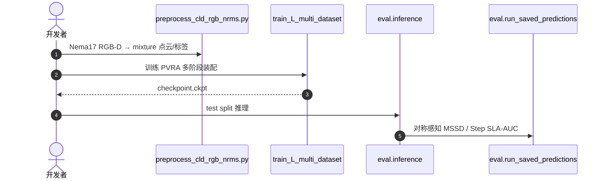

# PVRA

**PVRA: A Pointwise Key-point Voting Framework for Robotic Assembly**（[arXiv:2608.19968](https://arxiv.org/abs/2608.19968)，[代码](https://github.com/KulunuOS/PVRA)）——（见论文；Helsinki Institute of Physics 等资助方）。

## 一句话定义

**装配感知的下一步是从看见物体走向理解依赖并输出可执行装配线索。**

## 英文缩写速查

| 缩写 | 英文全称 | 简要说明 |
|------|----------|----------|
| RGB-D | Red-Green-Blue + Depth | 深度相机观测 |
| 6-DoF | Six Degrees of Freedom | 位姿六自由度 |
| SLA | Step-wise Assembly metric | 渐进装配评测指标 |

## 为什么重要

- 纳入 [具身智能小站 2026-08-22 十篇盘点](../../sources/blogs/wechat_embodied_station_video_contact_control_10_papers_2026-08-22.md) 的「视频→接触→控制→VLA 持续学习」主线。
- 开源状态（入库日）：**已开源**。

## 核心信息

| 项 | 内容 |
|----|------|
| **机构** | （见论文；Helsinki Institute of Physics 等资助方） |
| **出处** | arXiv:2608.19968（2026-08） |
| **开源** | **已开源** |

### 流程总览

## 评测

| 项 | 内容 |
|----|------|
| **指标 1** | 对称感知 MSSD（Maximum Symmetry-aware Surface Distance） |
| **指标 2** | Step SLA-AUC（逐装配步的成功–精度曲线下面积） |
| **外部 baseline** | FoundationPose |
| **数据/预处理** | 依赖外部 6DAPose 与 Nema17 装配序列预处理脚本 |
| **发表** | ECoR 2026 |

- 数据出处：[ingest 摘录「装配感知 / 评测」](../../sources/papers/pvra_arxiv_2608_19968.md)。
- **本页未列定量数值**：摘录只给出指标口径；[开源仓 `KulunuOS/PVRA`](https://github.com/KulunuOS/PVRA) 含训练/推理/评测全流程，数值可按原仓复跑核对。
- 口径提示：Step SLA-AUC 按装配步累计，跨数据集数值不可直接横比。

## 结论

**渐进式装配需要学依赖关系而不只是 object-centric pose。**

- target-base 抽象 + 双阶段 pose 输出
- 对称感知 MSSD 与 Step SLA-AUC 评测
- 依赖外部 6DAPose/Nema17 数据预处理
- FoundationPose 作外部 baseline

## 源码运行时序图

## 与其他页面的关系

- [manipulation](../tasks/manipulation.md)
- [assembly](../tasks/manipulation.md)
- [contact-rich-manipulation](../concepts/contact-rich-manipulation.md)
- [视频–接触–控制 10 篇技术地图](../overview/video-contact-control-10-papers-technology-map.md)

## 参考来源

- [pvra_arxiv_2608_19968](../../sources/papers/pvra_arxiv_2608_19968.md)
- [pvra](../../sources/repos/pvra.md)
- [wechat_embodied_station_video_contact_control_10_papers_2026-08-22](../../sources/blogs/wechat_embodied_station_video_contact_control_10_papers_2026-08-22.md)

## 推荐继续阅读

- [arXiv:2608.19968](https://arxiv.org/abs/2608.19968)
- [PVRA 官方代码](https://github.com/KulunuOS/PVRA)
