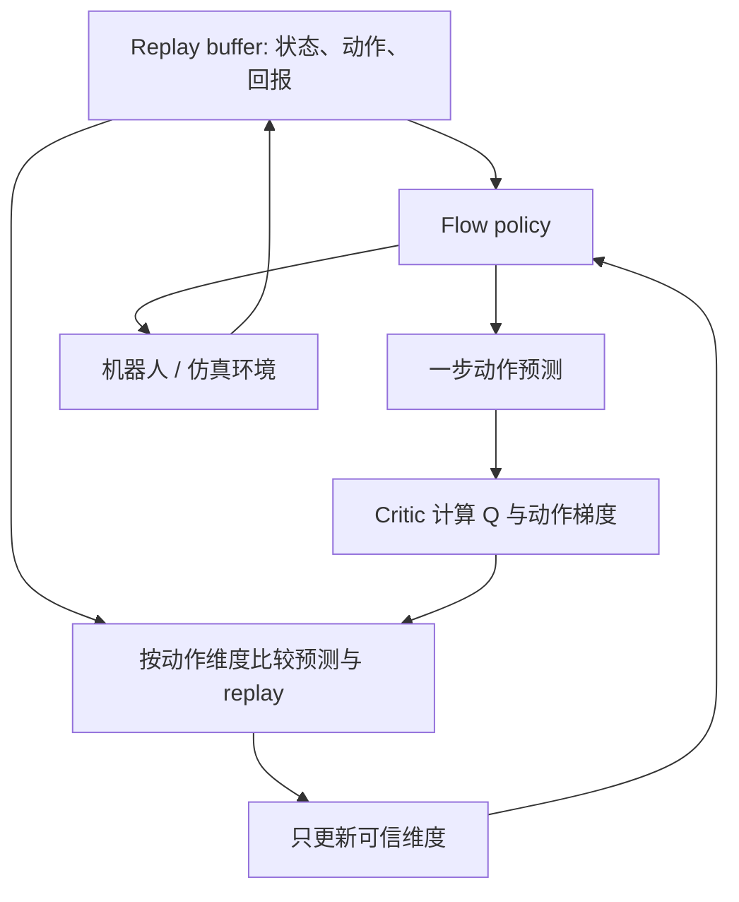

# QF3：用过滤后的 Q 梯度训练流策略

**QF3**（*Fast Flow RL with Filtered Q-Gradients*）将 flow matching 与 critic 的动作价值梯度结合，用离策略 replay 训练流策略；它只在预测动作仍靠近 replay 动作的维度上使用 Q 梯度。

## 一句话定义

让机器人从旧交互数据中重复学习 flow policy，同时过滤掉 critic 不够可信的动作维度，避免一次不可靠的 Q 更新把整段动作推远。

## 英文缩写速查

| 缩写 | 英文全称 | 简要说明 |
|------|----------|----------|
| QF3 | Fast Flow RL with Filtered Q-Gradients | 对流策略动作梯度做逐维筛选的离策略 RL |
| RL | Reinforcement Learning | 利用环境回报优化机器人策略 |
| Q | Action-Value Function | 估计状态—动作的预期回报 |
| FPO++ | Flow Policy Optimization++ | 论文对比的 on-policy flow RL 方法 |
| ABC-Sim | ABC Simulation benchmark | 论文用于操纵策略微调的仿真任务集之一 |

## 核心信息

| 项目 | 内容 |
|------|------|
| 作者 | Chung Min Kim、Brent Yi、David McAllister、Hongsuk Choi、Himanshu Gaurav Singh、Jinkun Cao、Ken Goldberg、Pieter Abbeel、Carmelo Sferrazza、Angjoo Kanazawa |
| 论文 | [arXiv:2610.08789](https://arxiv.org/abs/2610.08789)，2026-10-06 提交 |
| 项目页 | [QF3](https://qf3-rl.github.io/) |
| 代码状态 | arXiv 条目提供项目页链接，但未列算法仓库；截至 2026-10-08 未核验到可确认的官方训练/部署代码 URL，因此不将其标为已开源实现。 |

## 方法流程

1. **Flow policy 提出动作。** 根据状态与噪声输入，在 flow matching 轨迹上预测动作。
2. **Critic 评估并给出 Q 梯度。** 通过 flow 的一步预测，将 critic 对动作的梯度传回策略。
3. **逐维过滤更新。** 仅在预测动作维度仍接近 replay buffer 中对应动作的条件下施加 critic gradient；超出可信邻域的维度不接收该更新。
4. **离策略复用样本。** 高吞吐训练配方从 replay 经验中反复取样，兼顾从零训练与对示教策略微调。
5. **任务覆盖。** 同一方法用于人形 locomotion/motion tracking 和 flow-based manipulation policy fine-tuning。

过滤机制的直觉是：Q gradient 对“离数据很远”的动作更可能是外推误差，因此 QF3 限制其影响范围；这不是把 replay action 直接复制到策略输出，也不是离线 RL。

## 实验与评测

- **人形控制：** 论文报告 QF3 可从头训练离策略 flow locomotion 与 motion-tracking policy，并 zero-shot 转移到硬件。
- **速度：** 配合高吞吐训练配方，locomotion 与 motion tracking 的 wall-clock 训练速度相对 FPO++ 约快 10 倍；不应解读成所有任务一律 10 倍。
- **操纵微调：** 论文在 ABC-Sim 和 Robomimic 上微调预训练 flow policies，展示从零学习与示教后改进两种用法。
- **边界：** arXiv 目前为预印本 v1；不同任务的环境、硬件和 success 指标需要回到论文表格逐项比较。

## 源码运行时序图

**不适用（截至 2026-10-08）**：arXiv 记录只提供项目页链接，未列代码仓 URL；本次无法通过公开页面抓取确认训练或部署仓库，故暂不编造运行脚本与源码时序。若项目页后续公开代码，应在更新时补图。

## 工程实践与局限

- 过滤阈值决定 Q 更新的探索力度；阈值太宽可能引入 critic 外推误差，太窄则削弱 RL 改进。
- flow policy 的训练吞吐不等于实机控制频率；论文的 wall-clock 对照不代表端到端部署延迟。
- 零样本硬件迁移仅针对论文报告的 locomotion/motion tracking 设置，不能直接外推到操纵任务或其他机型。
- 项目页及代码状态需要后续复核；目前链接本身可记录，但不以“代码待发布”之外推测仓库内容。

## 结论

**QF3 的贡献在于让 off-policy Q 更新适配连续 flow policy，同时按维度约束 critic 梯度的可信区域。**

1. 它把 flow matching 的策略学习和 Q critic 更新结合起来，不只是拿 Q 值做测试时重排序。
2. 核心稳定化步骤是按动作维度过滤梯度，而非对所有动作分量一视同仁。
3. 约 10× 是论文中特定高吞吐 recipe 相对 FPO++ 的训练 wall-clock 对比，不是固定端到端加速保证。
4. 论文覆盖从零训练的人形移动/跟踪和示教后操纵微调，二者的实验设置应分开读。
5. 当前缺少已核实的官方代码 URL，复现前需要重新确认项目页资源区。

## 关联页面

- [强化学习](../methods/reinforcement-learning.md) — on-policy / off-policy 的区别与算法坐标
- [VLA](../methods/vla.md) — 预训练 flow-based policy 微调的背景
- [Humanoid Locomotion](../tasks/humanoid-locomotion.md) — locomotion 与 motion tracking 评测场景
- [Manipulation](../tasks/manipulation.md) — ABC-Sim / Robomimic 操纵任务

## 参考来源

- [QF3 论文摘录](../../sources/papers/qf3_arxiv_2610_08789.md)
- [QF3 项目页归档](../../sources/sites/qf3-project.md)

## 推荐继续阅读

- [arXiv:2610.08789](https://arxiv.org/abs/2610.08789)
- [QF3 项目页](https://qf3-rl.github.io/)
