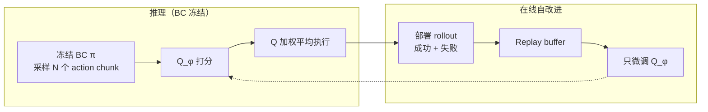
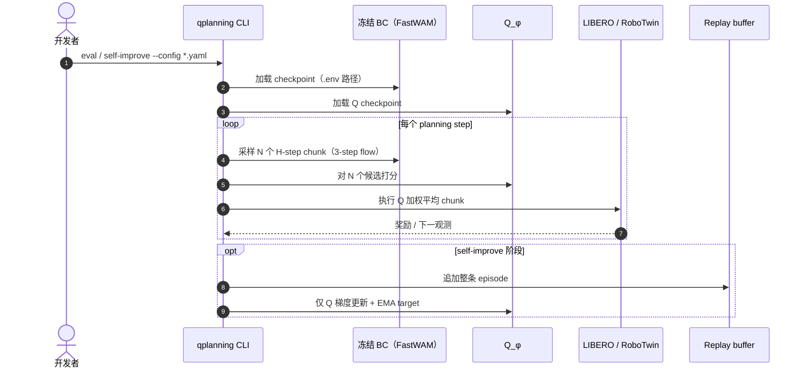

# Q-Planning：冻结 VLA 的离策略 Q 函数自改进

**Q-Planning**（*Beyond Imitation: Self-Improving Robot Policies via Off-Policy Q-Planning*，[arXiv:2608.21204](https://arxiv.org/abs/2608.21204)，[项目页](https://varungiridhar.github.io/qplanning/)，[代码](https://github.com/varungiridhar/qplanning-code)）由 **佐治亚理工学院（Georgia Tech）** 提出：为大型 visuomotor **行为克隆（BC）** 策略配备小型 **离策略 Q 函数**，在 **不更新 BC 权重** 的前提下，用价值引导 action 选择并从部署期 **成功与失败** rollout 中持续自改进。

## 一句话定义

**把昂贵的大 BC/VLA 冻结为候选动作生成器，用可吸收失败轨迹的小型 Q 函数做 chunk 级价值规划与在线自改进。**

## 英文缩写速查

| 缩写 | 英文全称 | 简要说明 |
|------|----------|----------|
| BC | Behaviour Cloning | 从成功演示模仿动作的策略学习 |
| Q | Q-function | 估计状态–动作（chunk）长期回报的 critic |
| VLA | Vision-Language-Action | 视觉–语言–动作多模态策略 |
| HL-Gauss | Histogram Loss with Gaussian | 将标量 Q 目标投影到分箱上的分类回归 |
| SFT | Supervised Fine-Tuning | 在 rollout 上继续模仿学习微调策略 |

## 为什么重要

- **突破演示天花板：** 纯 BC 无法从失败中学习；全参数 RL 微调大 VLA 昂贵且易损伤 BC 先验。
- **数据不对称被利用：** Q 估计价值而非模仿动作，可同训演示、再吸收失败轨迹——BC 做不到这一点。
- **无辅助 actor：** 相对 IBRL/DSRL/DAWR 等，Q-Planning 是表中唯一 **BC 冻结 + 可插拔大 VLA + 从失败学习 + 离策略 Q 迭代 + 无辅助 actor** 的组合。
- **真机可闭环：** 双臂接触丰富任务在 **无人类干预** 下五轮自改进显著提升，而仅对成功 rollout 做 SFT 停滞。

## 核心信息

| 项 | 内容 |
|----|------|
| **机构** | 佐治亚理工学院（Georgia Tech） |
| **BC 接口** | 黑盒「可采样 action chunk」；默认 **FastWAM** flow-matching BC |
| **Q 架构** | 自有 DinoV2 + T5 编码器；transformer decoder + **HL-Gauss** 分箱头；约 **1B** 参数 |
| **推理** | 截断 **3 步** flow 采 **N** 个 chunk → softmax(Q/λ) **加权平均**（非 argmax） |
| **自改进** | 每轮部署收集 → replay → **仅更新 Q**（EMA target）；BC 始终冻结 |
| **开源** | **已开源** — `varungiridhar/qplanning-code`（LIBERO / RoboTwin 配置） |

## 流程总览

## 源码运行时序图

## 实验与评测读法

### 仿真（10 轮在线自改进后）

| Benchmark | FastWAM BC | Q-Planning 离线 | Q-Planning 在线 |
|-----------|------------|-----------------|-----------------|
| LIBERO-Spatial | 90.5% | 91.5% | **98.5%** |
| LIBERO-10 | 90.0% | 93.0% | **99.0%** |
| RoboTwin（47 任务） | 83.2% | 83.8% | **91.4%** |

- **离线列：** 仅 Q 加权选动作、无 rollout 微调，已平均 **+1.3 pp**。
- **近天花板套件：** 成功率饱和时，循环主要 **缩短成功 episode 长度**（如 LIBERO-Object 139→120 步）。

### 双臂真机（5 轮，BC 冻结）

| 任务 | 初始 | Q-Planning 迭代 5 | SFT 仅成功 |
|------|------|-------------------|------------|
| stack-cups | 40% | **90%** | 55% |
| insert-wallet | 25% | **80%** | 30% |

### 规划延迟（L40S，严格 eval parity）

| 配置 | RoboTwin | 占 960 ms 预算 |
|------|----------|----------------|
| BC 10-step | 640 ms | 67% |
| Q-Planning N=32 | **400 ms** | **42%** |

编码器每步只算一次；Q decoder 约 **2–3 ms/候选**，故增大 N 非线性翻倍总时延。

## 结论

**Q-Planning 用「actor–critic 解耦 + 数据不对称」把大 BC 变成可自改进系统：失败轨迹喂给 Q、不碰 BC，是在线预算下最稳的增益来源。**

- **真影响指标：** 在线 Q-only 迭代在 LIBERO-10 / RoboTwin 与双臂真机接触任务上 **稳定抬成功率**；仅 SFT 成功轨迹 **无法吸收失败信号**。
- **推理侧：** 即使零在线迭代，Q 加权平均已优于纯 BC（离线 +1.3 pp 均值）；**加权优于 argmax**（Best-of-N 卡 95%）。
- **部署读法：** 需要 **episode 级成功检测**（仿真 success bit / 真机人工标签）；BC 质量与采样多样性决定探索上界。
- **代价：** Q decoder 随 N 线性增；硬任务推大 N 时 decoder 可能成为瓶颈；**不能从 BC 完全不会的动作中 bootstrap**。
- **选型：** 已有强 BC/VLA、希望 **不重训大模型** 就从部署失败中迭代时优先评估；与 [LWD](../methods/lwd.md)「整策略 offline-to-online RL」互补而非替代。
- **开源：** **已开源** CLI 与双基准配置；checkpoint 经 `.env` 配置。

## 与其他工作对比

| 对比轴 | Q-Planning | V-GPS | DSRL / IBRL | DAWR | 全参数 VLA RL 微调 |
|--------|------------|-------|-------------|------|-------------------|
| BC/VLA 冻结 | ✓ | ✓ | 部分 | ✗ | ✗ |
| 从失败学习 | ✓ | ✗ | ✓ | ✓ | ✓ |
| 无辅助 actor | ✓ | ✓ | ✗ | ✓ | ✓ |
| 更新参数量 | ~1B Q | 价值引导 only | actor+Q 等 | 全策略 | 全策略 |
| 在线 Q 迭代 | ✓ | ✗ | 各异 | 各异 | on-policy 为主 |

## 局限与风险

- **BC 依赖：** BC 采不到的 mode，Q 无法凭空创造；增益随 BC 质量缩放。
- **成功监督：** 依赖稀疏终端奖励 / 人工 episode 标签；开放任务需学习成功模型。
- **N 与延迟：** 部署 N=64（LIBERO）与 N=32（RoboTwin）需在成功率与 replan 预算间权衡。

## 工程实践

| 项 | 说明 |
|----|------|
| 安装 | `pip install -e ".[libero]"` 或 `".[robotwin]"`；RoboTwin 另需 SAPIEN 环境 |
| 健康检查 | `qplanning doctor` / `qplanning probe` |
| 关键超参 | `planner.n_samples`、`temperature`、`denoise_steps`（保持候选多样性） |
| 分片评测 | `--eval.shard=k/n` + `qplanning report` 聚合 |
| 开源边界 | 代码 **已发布**；权重路径用户自备 |

## 关联页面

- [VLA](../methods/vla.md)、[Action Chunking](../methods/action-chunking.md)、[LWD](../methods/lwd.md)
- [Manipulation](../tasks/manipulation.md)
- [π₀.₅](./paper-pi05-open-world-vla.md) — 大 VLA BC 先验语境
- [World Action Models](../concepts/world-action-models.md) — 默认 BC FastWAM 系

## 参考来源

- [Q-Planning 论文摘录](../../sources/papers/qplanning_arxiv_2608_21204.md)
- [Q-Planning 项目页](../../sources/sites/qplanning-varungiridhar.md)
- [qplanning-code 仓库](../../sources/repos/qplanning_code.md)

## 推荐继续阅读

- [arXiv:2608.21204](https://arxiv.org/abs/2608.21204) — 完整方法与附录延迟剖面
- [项目页](https://varungiridhar.github.io/qplanning/) — 真机对比视频与定位表
- [GitHub: qplanning-code](https://github.com/varungiridhar/qplanning-code) — 复现 CLI 与配置
