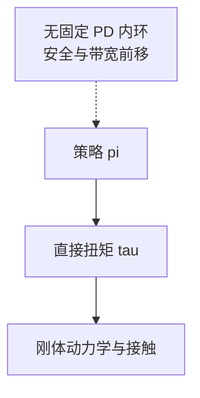

# Learning Torque Control for Quadrupedal Locomotion

**一句话定义**：用 **单网络策略直接预测关节扭矩**（相对高频），在仿真中训练并完成 **sim2real**，在多种地形与扰动下与 **位置+PD** 基线对比 **奖励与鲁棒性**。

## 为什么重要

- 给 **「我是否应去掉 PD」** 一个文献级对照点：不是概念争论，而是 **接口带宽、训练难度、安全滤波** 的综合权衡。
- 与 [RSS 2018 敏捷四足 sim2real](./paper-quadruped-agile-sim2real-rss2018.md) 一起读，可建立 **扭矩控制 loco** 的 **前后两代** 直觉。

## 核心机制（提炼）

- **动作语义变更**：从 \(q_{\text{des}}\) 变为 \(\tau\)，探索空间维数与 **接触冲量形状** 同时改变。
- **sim2real**：仍依赖 **动力学随机化、传感器噪声** 等，但 **不再通过固定 PD 隐式限幅关节加速度**。

## 与 Kp / Kd 设置的关系

- 若你在此路线与 PD 路线之间选型：列出 **电流环等效带宽、关节速度限幅、急停策略** 三行清单；任一行薄弱，**直驱扭矩** 的风险都显著上升。

## 参考来源

- [RL+PD 动作接口与增益设计论文索引](../../sources/papers/rl_pd_action_interface_locomotion.md)
- Chen et al., *Learning Torque Control for Quadrupedal Locomotion*, [arXiv:2203.05194](https://arxiv.org/abs/2203.05194)

## 关联页面

- [Legged / Humanoid RL 中 Kp/Kd 设置](../queries/legged-humanoid-rl-pd-gain-setting.md)
- [Sim-to-Real 敏捷四足 RSS 2018](./paper-quadruped-agile-sim2real-rss2018.md)
- [Sim2Real](../concepts/sim2real.md)
- [四足机器人](./quadruped-robot.md)

## 推荐继续阅读

- [arXiv PDF](https://arxiv.org/pdf/2203.05194.pdf)
