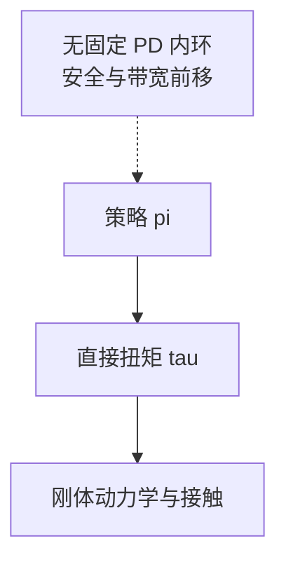

---

type: entity
tags: [quadruped, reinforcement-learning, sim2real, torque-control, berkeley]
status: stable
summary: "四足 RL：策略直接输出关节扭矩（高频），弱化固定 PD 内环，与位置目标+PD 路线形成对照，用于判断何时应弃用 PD 先验。"
updated: 2026-05-22
arxiv: "2203.05194"
venue: "RSS 2018"
related:
  - ../queries/legged-humanoid-rl-pd-gain-setting.md
  - ../entities/paper-quadruped-agile-sim2real-rss2018.md
  - ../entities/legged-gym.md
  - ../tasks/locomotion.md
sources:
  - ../../sources/papers/rl_pd_action_interface_locomotion.md
---

# Learning Torque Control for Quadrupedal Locomotion

**一句话定义**：用 **单网络策略直接预测关节扭矩**（相对高频），在仿真中训练并完成 **sim2real**，在多种地形与扰动下与 **位置+PD** 基线对比 **奖励与鲁棒性**。

## 英文缩写速查

| 缩写 | 英文全称 | 简要说明 |
|------|----------|----------|
| Sim2Real | Simulation to Real | 把仿真中学到的策略迁移落地真机的工程主线 |
| RL | Reinforcement Learning | 通过与环境交互最大化长期回报来学习策略的范式 |
| PD | Proportional–Derivative | 关节位置/阻抗底层控制，策略输出常为其 setpoint |
| Locomotion | Robot Locomotion | 足式/人形等无轮移动能力的总称 |
| Kp | Proportional Gain | PD 控制的位置误差增益，影响刚度与响应 |
| Kd | Derivative Gain | PD 控制的速度误差增益，抑制振荡 |

## 为什么重要

- 给 **「我是否应去掉 PD」** 一个文献级对照点：不是概念争论，而是 **接口带宽、训练难度、安全滤波** 的综合权衡。
- 与 [RSS 2018 敏捷四足 sim2real](./paper-quadruped-agile-sim2real-rss2018.md) 一起读，可建立 **扭矩控制 loco** 的 **前后两代** 直觉。

## 核心机制（提炼）

- **动作语义变更**：从 \(q_{\text{des}}\) 变为 \(\tau\)，探索空间维数与 **接触冲量形状** 同时改变。
- **sim2real**：仍依赖 **动力学随机化、传感器噪声** 等，但 **不再通过固定 PD 隐式限幅关节加速度**。

```mermaid
flowchart TB
  pol["策略 pi"]
  tau["直接扭矩 tau"]
  plant["刚体动力学与接触"]
  pol --> tau --> plant
  note1["无固定 PD 内环<br/>安全与带宽前移"]
  note1 -.-> pol
```

## 与 Kp / Kd 设置的关系

- 若你在此路线与 PD 路线之间选型：列出 **电流环等效带宽、关节速度限幅、急停策略** 三行清单；任一行薄弱，**直驱扭矩** 的风险都显著上升。

## 实验与评测

- 量化指标、消融与 sim2real / 实机结果见 **原文 PDF** 与 [参考来源](#参考来源)；本页正文侧重方法结构与知识库交叉引用。

## 结论

**这篇的用处是给「我是否该去掉 PD 内环」提供一个文献级对照点：直接输出扭矩换来的是接口带宽，付出的是探索难度，以及原本由固定 PD 隐式提供的那层安全限幅。**

- 变化的本质是动作语义从 \(q_{\text{des}}\) 变为 \(\tau\)：探索空间维数与接触冲量形状同时改变，训练难度与真机风险不再由固定 PD 兜底。
- sim2real 该做的一样要做（动力学随机化、传感器噪声），但「固定 PD 隐式限幅关节加速度」这条免费保险没了，安全与带宽被前移到策略与硬件侧。
- 选型判据很具体：电流环等效带宽、关节速度限幅、急停策略三行清单，任一行薄弱，直驱扭矩路线的风险都显著上升——这也是本页把它当对照点而非默认推荐的原因。
- 与 [Sim-to-Real 敏捷四足 RSS 2018](./paper-quadruped-agile-sim2real-rss2018.md) 对读可建立扭矩控制 loco 的前后两代直觉；本页正文侧重结构，定量对比与消融见原文 PDF。

## 与其他工作对比

- 正文已给出与相邻路线 / baseline 的 **定性对照**；定量表格与 ablation 见原文（[参考来源](#参考来源)）。

## 参考来源

- [RL+PD 动作接口与增益设计论文索引](../../sources/papers/rl_pd_action_interface_locomotion.md)
- Chen et al., *Learning Torque Control for Quadrupedal Locomotion*, [arXiv:2203.05194](https://arxiv.org/abs/2203.05194)

## 关联页面

- [Legged / Humanoid RL 中 Kp/Kd 设置](../queries/legged-humanoid-rl-pd-gain-setting.md)
- [Sim-to-Real 敏捷四足 RSS 2018](./paper-quadruped-agile-sim2real-rss2018.md)
- [Sim2Real](../concepts/sim2real.md)
- [四足机器人](./quadruped-robot.md)

## 推荐继续阅读

- [arXiv PDF](https://arxiv.org/pdf/2203.05194.pdf)
