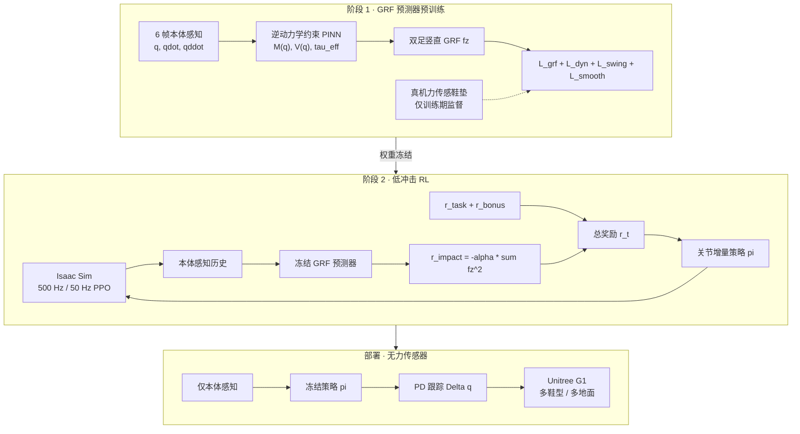

# QuietWalk：面向多样鞋型的物理感知低噪人形行走

**QuietWalk**（*Physics-Informed Reinforcement Learning for Ground Reaction Force-Aware Humanoid Locomotion Under Diverse Footwear*，NIMTE / UCAS / Westlake 等，arXiv:[2604.23702](https://arxiv.org/abs/2604.23702)）提出 **「物理感知 GRF 估计 + 强化学习」** 耦合框架：先用 **逆动力学约束 PINN** 从 **6 帧本体感知历史** 估计双足 **竖直地面反力（GRF）**，再将 **冻结预测器** 嵌入 PPO 训练环作为 **冲击惩罚奖励**，使策略在 **无部署期力传感器** 时仍能 **显式抑制足地冲击**；配套 **足+鞋统一几何建模管线** 与 **分阶段课程**，在 **Unitree G1** 上实现跨 **赤脚 / 滑板鞋 / 运动鞋 / 高跟鞋** 与多地面材质的 **低噪鲁棒行走**。

## 一句话定义

**先让 PINN 用逆动力学「猜」出每一步踩得多重，再让 RL 学着轻踩——鞋换了、地换了，照样安静走。**

## 英文缩写速查

| 缩写 | 英文全称 | 简要说明 |
|------|----------|----------|
| QuietWalk | — | 本文物理感知低噪人形行走框架 |
| GRF | Ground Reaction Force | 足–地接触产生的地面反力 |
| PINN | Physics-Informed Neural Network | 将物理约束写入损失的网络范式 |
| RL | Reinforcement Learning | 本文用 PPO 学习低冲击步态策略 |
| PPO | Proximal Policy Optimization | on-policy actor–critic 策略优化 |
| MNL | Mean Noise Level | 行走段 A 加权 SPL 时间均值（dBA） |
| PNL | Peak Noise Level | 行走段 A 加权 SPL 瞬时峰值（dBA） |
| DLS | Damped Least Squares | 阻尼最小二乘，稳定接触力伪逆重构 |
| KAN | Kolmogorov–Arnold Network | 可学习 B-spline 映射层，用于 $M(q)$/$V(q)$ |

## 核心信息

| 字段 | 内容 |
|------|------|
| 机构 | 中科院宁波材料技术与工程研究所（NIMTE, CAS）、中国科学院大学（UCAS）、西湖大学（Westlake University） |
| 平台 | Unitree G1；Isaac Sim 训练 |
| 控制频率 | 500 Hz 仿真 / 50 Hz 策略 |
| 观测 | 6 帧（0.12 s）本体感知 $[q;\dot{q};\ddot{q}]$，$n=29$ |
| 动作 | 关节位置增量 $\Delta q$ + 固定 PD |
| 训练力传感 | 足底八单元植埋式力传感鞋垫（仅 GRF 预测器监督） |
| 部署传感 | **仅本体感知**，无外部力传感器 |

## 为什么重要

- **填补「室内低噪行走」空白：** 多数人形 locomotion 论文优化速度/鲁棒/感知，较少把 **足地冲击噪声** 作为一等公民；QuietWalk 面向 **家庭/医院/办公室** 等人机共处场景的 **声学舒适度与硬件寿命**。
- **比运动学代理更直接：** 传统低噪路线惩罚 **足端接触速度**（如 Aibo、Olaf），易牺牲敏捷与稳定；本文用 **物理一致的竖直 GRF 惩罚** $r_{\mathrm{impact}}=-\alpha\sum (f_z)^2$，在任务奖励之外 **直接对准冲击瞬态**。
- **传感器无关部署：** 力传感器噪声大、易损，直接进 RL 奖励常致训练不稳；**预训练 + 冻结 PINN** 在训练与部署间保持 **一致的力反馈语义**，且部署 **不需力传感硬件**。
- **新鲁棒维度——鞋型：** 将 **鞋诱导的接触动力学变化** 系统纳入课程与评测（含 **高跟鞋** 极端情形），类比人类 **换鞋仍稳走** 的泛化能力，区别于仅关注 **外部地形** 的 locomotion 工作。
- **与 [MPC-RL](./paper-mpc-rl-humanoid-locomotion-manipulation.md) 互补：** 后者在仿真 critic 中用 **特权真实 GRF** 做 `mpc_grf` 软对齐；QuietWalk 探索 **无特权传感、用学习力估计器作奖励 critic** 的第三条力感知 RL 轴。

## 方法

| 模块 | 作用 |
|------|------|
| **DynamicsKAN** | 从 $q$ 学惯性矩阵 $M(q)$，对称正定因子化 |
| **PotentialKAN** | 学标量势 $V(q)$，$G(q)=\nabla V(q)$ 保持保守结构 |
| **Sequence-Net** | 学有效广义力矩 $\tau_{\mathrm{eff}}$（摩擦与未建模项） |
| **力重构** | 逆动力学残差 $\tau_c = M\ddot{q}+C\dot{q}+G-\tau_{\mathrm{eff}}$ → DLS 伪逆 → $f_z=\max(f_{\mathrm{raw}},0)$ |
| **多损失训练** | $\mathcal{L}_{\mathrm{grf}}$ 监督 + $\mathcal{L}_{\mathrm{dyn}}$ 动力学残差 + $\mathcal{L}_{\mathrm{swing}}$ 摆动相零力 + $\mathcal{L}_{\mathrm{smooth}}$ 时序平滑 |
| **低冲击 RL** | PPO；$r_t=r_{\mathrm{task}}+r_{\mathrm{bonus}}+r_{\mathrm{impact}}$；**冻结** GRF 预测器 |
| **鞋模管线** | Blender 足–鞋布尔并集 → URDF/MJCF/USD；统一密度重算惯量 |
| **课程** | $\alpha$ 从小渐增；地形随机化；赤脚 → 多鞋型联合采样 |

### 流程总览

## 实验要点（归纳）

| 轴 | 报告口径（以论文为准） |
|----|------------------------|
| **GRF 预测** | held-out 四基元运动（前/侧/后退/原地转）；完整损失 C1：左右 RMSE **14.5/14.0 N**，$R^2$ **0.99/0.99**；去掉 $\mathcal{L}_{\mathrm{dyn}}$（C3）RMSE **6–7×** 恶化 |
| **声学（赤脚，1.2 m/s）** | 四地面均值：MNL **89.47→82.30 dBA（−7.17 dB）**；PNL **104.28→99.30 dBA（−4.98 dB）** vs 基线 RL |
| **工程基线** | 宇树内置控制器 D3：MNL/PNL 差距约 **4.17/2.34 dB**（部分地面 PNL 差 <2 dB） |
| **跨鞋×地面** | 缓冲鞋型更低噪；高跟鞋×木 vs 运动鞋×瑜伽垫差近 **20 dB** |
| **户外** | 草地/碎石/鹅卵石/石板/沥青，多鞋型无显著失稳 |
| **局限** | 仅竖直 GRF；声学为固定录制链相对比较；未建模切向接触 |

## 常见误区或局限

- **误区：「降噪 = 只调麦克风」。** 论文强调 A 加权 SPL 在 **一致录制设置** 下做 **相对比较**；跨平台绝对 dBA 可比性有限。
- **误区：「PINN 预测器部署时还要跑」。** 部署期 **策略本身** 已内化低冲击步态；预测器主要服务 **训练期奖励**（冻结），推理闭环 **不需** 力传感或显式 GRF 前向（除非做监控）。
- **误区：「高跟鞋结果说明能穿高跟鞋干活」。** 高跟鞋是 **接触动力学极端扰动** 的 stress test，噪声仍显著高于缓冲鞋型。
- **局限：** 当前仅 **法向 GRF**；切向摩擦与扭矩未入奖励；真机力数据收集依赖 **专用鞋垫**；暂无开源代码。

## 与其他工作对比

| 维度 | QuietWalk | 足端速度惩罚低噪 | MPC-RL | OpenCap Monocular |
|------|-----------|------------------|--------|-------------------|
| 目标 | **低冲击 + 低噪 + 跨鞋** | 低噪（运动学代理） | 训练期 MPC 地标 | 人体临床运动学/动力学 |
| 力信号 | **PINN 估计竖直 GRF** | 接触速度 | 仿真特权 GRF | 仿真+ML 估计 GRF |
| 部署传感 | **本体感知 only** | 本体感知 | 纯 RL | 单目手机视频 |
| 平台 | **G1** | 四足/娱乐机器人 | Themis | 人体 |

## 关联页面

- [Humanoid Locomotion](../tasks/humanoid-locomotion.md) — 人形行走任务总览
- [Locomotion](../tasks/locomotion.md) — 足式移动广义任务
- [Contact Dynamics](../concepts/contact-dynamics.md) — 接触建立/冲击与力反馈
- [Locomotion 奖励设计指南](../queries/locomotion-reward-design-guide.md) — 接触冲击类奖励项
- [MPC-RL](./paper-mpc-rl-humanoid-locomotion-manipulation.md) — 特权 GRF 训练期指导对照
- [Unitree G1](./unitree-g1.md) — 实验平台

## 参考来源

- [QuietWalk 论文摘录（arXiv:2604.23702）](../../sources/papers/quietwalk_arxiv_2604_23702.md)

## 推荐继续阅读

- 论文 HTML：<https://arxiv.org/html/2604.23702v1>
- 论文 PDF：<https://arxiv.org/pdf/2604.23702>
- [MPC-RL](./paper-mpc-rl-humanoid-locomotion-manipulation.md) — 训练期 `mpc_grf` 力对齐的另一条混合 RL 路线
- [OpenCap Monocular](./paper-opencap-monocular.md) — 单目视频估计人体 GRF 的临床向对照
