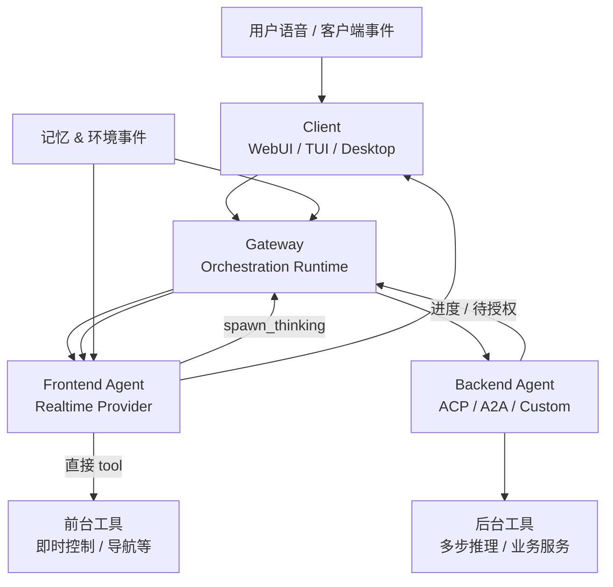
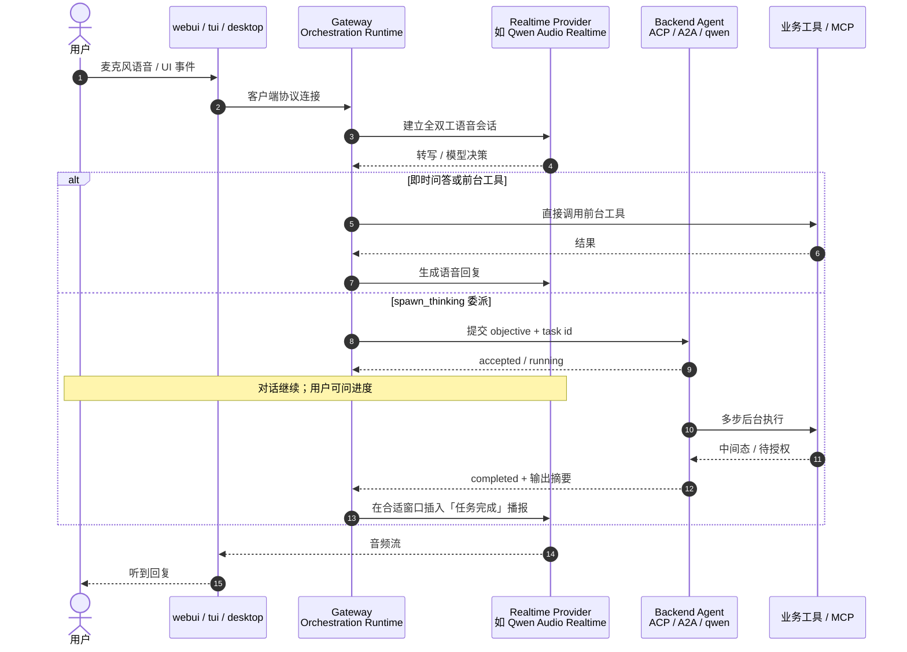

# Qwen-Audio-Agent：全双工语音与异步任务怎么同时跑？

**Qwen-Audio-Agent**（*Qwen-Audio-Agent Technical Report*，[arXiv:2609.25195](https://arxiv.org/abs/2609.25195)，[代码](https://github.com/QwenAudio/qwen-audio-agent)）由 **阿里巴巴（Alibaba）Token Foundry** 提出并 **开源**：一套 **harness（编排运行时）**，把 **全双工语音 Frontend Agent** 与 **可委派的后台 Backend Agent** 拆开，在对话不停的前提下并行执行多步工具任务，并独立处理 **打断、取消、结果投递与跨会话记忆**。对人形 / 座舱 / 桌面 HRI 而言，它补的是「语音环路与 Agent 任务环路的 **时间尺度不一致**」这一工程缝。

## 一句话定义

**用开源 Orchestration Runtime 把「Realtime 语音前台」和「后台 LLM Agent」解耦：即时问题前台直答或直调工具，多步任务 spawn 到后台，对话可继续，任务完成后结果再自然插回当前会话。**

## 英文缩写速查

| 缩写 | 英文全称 | 简要说明 |
|------|----------|----------|
| ACP | Agent Client Protocol | 后台 Agent 接入协议之一 |
| A2A | Agent2Agent | 多 Agent 互操作协议 |
| LLM | Large Language Model | 后台推理与工具规划 |
| HRI | Human–Robot Interaction | 人机交互；座舱 / 数字人 / 桌面均属外延场景 |
| TTS | Text-to-Speech | 语音输出（多由 Realtime 前台端到端承担） |
| ASR | Automatic Speech Recognition | 语音输入（Realtime 前台内嵌） |

## 为什么重要

- **问题真实：** 用户会在搜索 / 写代码 / 办业务进行中 **改口、补约束、插话**；全双工系统若把「停播」等同于「停任务」，或任务一完成就硬插话，体验与正确性都会崩。
- **对标清晰：** 报告 Table 1 对照 gpt-realtime、GPT-Live、Gemini Live，强调 **跨厂商 Realtime 前台**、**可扩展后台 Agent** 与 **开源编排层**——适合做语音 Agent 选型时的 runtime 参照，而非单一模型论文。
- **可跑开源：** [QwenAudio/qwen-audio-agent](https://github.com/QwenAudio/qwen-audio-agent) 提供 Gateway CLI、WebUI/TUI/桌面客户端与座舱 / 客服示例；与站内 [人形智能语音交互](../methods/humanoid-voice-interaction.md) 的「可打断闭环」形成 **异步委派** 维度的对照。

## 核心信息

| 项 | 内容 |
|----|------|
| **机构** | 阿里巴巴（Alibaba）Token Foundry, Alibaba Group |
| **形态** | 技术报告 + 开源 Node 运行时（npm `qwen-audio-agent`） |
| **前台示例** | 论文评测用 **Qwen Audio 3.0 Realtime Plus**；仓库另支持 OpenAI / Gemini / 本地 S2S 等 |
| **后台示例** | 论文评测用 **qwen3.8-max**；仓库支持 Qwen Code 等 ACP/A2A 后端 |
| **开源** | **已开源**（MIT）：编排运行时与客户端；**模型权重不在仓内**，需 API Key 或本地服务 |

## 核心原理

### Foreground–background 分工

- **Frontend Agent：** 流式听说的全双工对话；在 **直接工具调用** 与 **`spawn_thinking` 委派后台** 之间路由。
- **Backend Agent：** 独立 context、工具与工作区执行多步任务（办公写码、座舱购物调研、客服 preview-and-commit 等）。
- **Orchestration Runtime：** 维护任务状态机，协调 **进度、补问、授权、结果回传**；适配器隔离具体 Realtime 厂商与后台 Agent 实现。

### 异步任务协调（设计要点）

| 机制 | 行为 |
|------|------|
| **spawn_thinking** | 前台提交 **自包含 objective**（含约束与输入引用）；**不会**自动搬运完整对话历史到后台 |
| **生命周期** | queued / running → completed / failed / cancelled；前台可在后续轮次查询同一 task id |
| **打断 vs 取消** | 打断语音 **不** 默认取消后台任务；取消经 backend 支持的 control 显式转发 |
| **完成 vs 投递** | 任务完成后可 **等待** 用户说完或合并窗口再播报，避免抢话 |
| **环境事件** | 座舱 UI 改目的地等 **非语音** 状态经统一 event 协议入上下文（可静默更新） |
| **记忆** | 规则 + 画像 + 显式偏好 + 长期记忆；异步 consolidation，显式修正优先于推断偏好 |

### 流程总览

## 源码运行时序图

官方仓库 [QwenAudio/qwen-audio-agent](https://github.com/QwenAudio/qwen-audio-agent)（归档见 [sources/repos/qwen-audio-agent.md](../../sources/repos/qwen-audio-agent.md)）Quickstart 路径：

- **最短复现：** `qwenaudio config` → 配置 `config.env`（如 `DASHSCOPE_API_KEY`、`QWEN_AUDIO_REALTIME_MODEL`）→ 终端 1 `qwenaudio` → 终端 2 `qwenaudio webui`；加后台则设 `AGENT_PROTOCOL` 并重启 Gateway（见 [Quickstart](https://qwenaudio.github.io/qwen-audio-agent/getting-started/quickstart)）。

## 工程实践

| 项 | 建议 |
|----|------|
| 路由策略 | 短指令 / 即时控制走 **前台工具**；多步检索、写码、交易链走 **spawn_thinking**；论文 **mixed** 在座舱上优于全前台或全委派 |
| 上下文 | 委派 objective 写全约束与引用；**不要假设**后台自动看见完整聊天历史 |
| 座舱 / 机器人 | 业务状态经 **统一 domain service + 环境事件** 对齐 GUI、前台与后台工具（论文 §3.2） |
| 客服 / 高风险 | **preview-and-commit**：后台暂停 → 前台语音确认 → 再 commit |
| 部署 | Node **≥22.22.2**；模型走云 API 或本地 S2S URL；桌面端可免 CLI 安装 |
| 与人形栈 | 真机仍要把工具 接到 **白名单技能 / ROS / 导航**（见 [语音交互流水线](../queries/humanoid-voice-interaction-pipeline.md)）；本仓库提供 **会话与任务编排**，不替代运控安全层 |

## 实验与评测

- **座舱 benchmark（in-house）：** **134** cases（86 短交互 + 48 多步），**159** user turns，**41** 业务工具；指标含 Tool F1、参数准确率、**任务成功率**、回复质量（adapted FDB V3 + 执行成功）。
- **任务成功率（Table 2）：** Audio 前台 **direct** **72.39%**；**all delegated** **80.60%**；**mixed** **91.04%**（同设置下 text backend direct **90.30%** 作参照）。
- **延迟（80 成功 turns 子集）：** **mixed** 平均任务执行 **4.729 s**；相对 audio direct **6.455 s** **−26.73%**；相对 all delegated **6.845 s** **−30.91%**（不含后续播报生成时间）。
- **解读：** 纯前台短任务强、多步弱；全委派改善多步但损伤部分短任务；**mixed 自适应**在成功率与延迟上同时占优——支持「两路径并存」而非二选一。

## 与其他工作对比

| 维度 | gpt-realtime / Gemini Live 类产品 | GPT-Live 类前后台分离 | **Qwen-Audio-Agent（开源）** |
|------|-----------------------------------|------------------------|------------------------------|
| 前台直接工具 | 部分支持 | 通常否 | **支持** |
| 对话中执行后台任务 | 支持异步函数 | 支持 | **支持**（spawn_thinking + 任务状态机） |
| 换 Realtime 厂商 | 绑定单一 API | 绑定单一栈 | **适配器** 接多 Provider |
| 后台 Agent | 应用自集成 | 固定后端 | **ACP / A2A / 自定义** |
| 编排运行时 | 闭源 | 闭源 | **MIT 开源 Gateway** |
| 机器人复现 | 需自建工具桥 | 需自建 | 同样需 **白名单技能 / ROS**；runtime 可复用 |

论文 Table 1 用 ✓ / △ / × 细化上述能力；本表仅作站内选型速览，数值 benchmark 以座舱 **mixed vs direct vs delegated** 三配置为准（见上一节）。

## 结论

**全双工语音 Agent 的关键不只是 Realtime 模型，而是把任务状态从「轮次」里拆出来：对话可以打断，任务可以并行，结果再择机回到同一位助手。**

1. **架构：** Frontend / Backend / Orchestration Runtime 三环分工，是报告的主贡献；模型可换，**runtime 语义**（任务 id、pending 授权、投递窗口）应稳定。
2. **路由：** 座舱数据支持 **mixed**——即时走前台、多步走后台；全前台或全委派都不是最优默认。
3. **工程语义：** **语音打断 ≠ 任务取消**；**执行完成 ≠ 立即播报**——做人形 / 座舱 UI 时要显式建模。
4. **开放生态：** ACP/A2A 与多 Realtime Provider 降低 vendor lock-in；相对闭源 Realtime 产品的差异在 **可自托管编排层**。
5. **记忆与事件：** 跨会话个性化与环境事件是「长期在场 Agent」的底座，但当前请求与显式用户修正应覆盖推断偏好。
6. **复现边界：** 开源的是 **harness**；论文数字依赖特定 Qwen Realtime + qwen3.8-max 组合，换模型需重评路由与延迟。
7. **站内读法：** 与 [人形智能语音交互](../methods/humanoid-voice-interaction.md) 串联——后者讲四环闭环，本页讲 **第五维：后台异步任务与结果回插**。

## 局限与风险

- **benchmark 私有：** 134 例座舱集为 in-house，外推需谨慎；与公开 Full-Duplex-Bench / τ-bench 仅部分指标同源。
- **安全：** 工具白名单、授权与 preview-and-commit 需按业务域配置；开源 runtime **不**自动保证机器人物理安全。
- **依赖云：** 默认 Quickstart 走 DashScope 等 API；离线需自行接 HF speech-to-speech 等本地栈。
- **与机器人论文关系：** 报告主场景是 **语音 Agent 编排**，非 loco-manipulation 策略；接入人形时仍是 **SDK / ROS 工具层** 问题。

## 关联页面

- [人形智能语音交互](../methods/humanoid-voice-interaction.md) — ASR→LLM→技能→TTS 闭环与 barge-in
- [人形语音交互流水线](../queries/humanoid-voice-interaction-pipeline.md) — 逐环选型与排障
- [VoiceStudio](./voicestudio.md) — 本地 TTS/ASR 实验台（非 Realtime Agent runtime）
- [Xiaomi-CocktailASR-1](./paper-xiaomi-cocktailasr-1.md) — 座舱混合场只听目标说话人（上游 ASR 对照）
- [大模型赋能人形](../overview/large-model-empowered-humanoids.md) — 大模型在人形系统中的位置

## 参考来源

- [Qwen-Audio-Agent 技术报告摘录](../../sources/papers/qwen_audio_agent_arxiv_2609_25195.md)
- [qwen-audio-agent 仓库归档](../../sources/repos/qwen-audio-agent.md)
- [Qwen-Audio-Agent 文档站](../../sources/sites/qwen-audio-agent.md)

## 推荐继续阅读

- 论文 PDF：<https://arxiv.org/pdf/2609.25195>
- 架构深读：<https://github.com/QwenAudio/qwen-audio-agent/blob/main/docs/architecture/deep-dive.md>
- Realtime 前台列表：<https://github.com/QwenAudio/qwen-audio-agent#frontend-and-backend-support>
