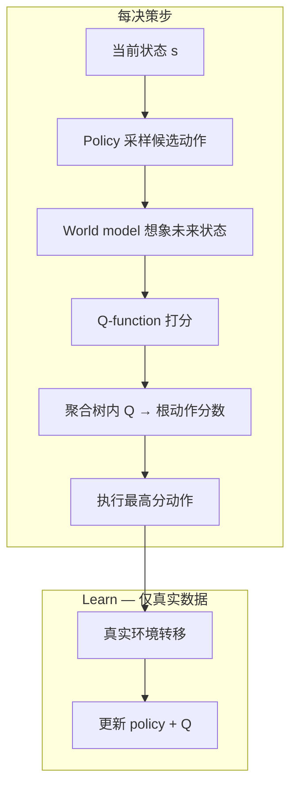

# QWM（Q-Learning With World Models）

**QWM**（*Q-Learning With World Models*，[arXiv:2608.17163](https://arxiv.org/abs/2608.17163)，[项目页](https://pd-perry.github.io/qwm/)）由 **Perry Dong、Yueru Jia、Chelsea Finn、Dorsa Sadigh**（**Stanford**；Jia 亦属 **PKU**）提出：在标准 **Q-learning** 之上，用学习到的 **世界模型** 做 **测试时树搜索（test-time scaling）**——每步问「哪个动作导向最好未来」，而非仅「哪个动作现在看起来最好」。**策略与价值函数只在真实环境转移上训练**；想象轨迹 **不参与梯度更新**，从而避开多数 model-based RL 在 imagined rollouts 上的 **复合模型偏差**。

## 一句话定义

**用世界模型在 Q-learning 上做短视界树搜索选高价值动作，学习仍完全 grounding 于真实在线数据，在 Robomimic 与 LIBERO 操作基准上提升样本效率与最终成功率。**

## 英文缩写速查

| 缩写 | 英文全称 | 简要说明 |
|------|----------|----------|
| QWM | Q-Learning with World Models | 本文框架 |
| RL | Reinforcement Learning | 从交互中学习策略 |
| MBRL | Model-Based Reinforcement Learning | 使用动力学/世界模型的 RL |
| Q | Action-Value Function | 状态–动作对期望回报 |
| WM | World Model | 预测状态如何随动作演化 |
| EXPO | — | 主要实验基座算法（扩散策略 + Q-learning） |
| LIBERO | — | 像素级操作 benchmark 套件 |

## 为什么重要

- **划界 MBRL 用法：** 与 [TD-MPC2](./paper-td-mpc2.md)、[DreamerV3](./paper-shenlan-wm-13-dreamerv3.md) 等「在模型 rollout 上优化」不同，QWM 把世界模型 strictly 用于 **动作选择时的 lookahead**，训练环仍是无偏的真实数据 RL。
- **对接 RL 微调趋势：** 项目页与论文语境强调 **off-policy RL 已很 sample-efficient**、VLA **RL fine-tuning** 正在推进；QWM 提供「世界模型 + Q」的 **test-time compute** 杠杆而不污染学习信号。
- **双阶段增益：** 搜索同时用于 **在线采样**（收集更高质量经验）与 **评测执行**（直接提升 rollout 表现）；消融显示两阶段都开时最佳。
- **可插拔：** 除 EXPO 外，论文展示叠在 **RLPD** 等任意带 Q 函数的算法上仍增益样本效率。

## 核心结构

| 模块 | 作用 |
|------|------|
| **Policy** | 在当前状态提出 **候选动作**（搜索树扩展源） |
| **World model** | 对每个候选动作预测 **下一状态/未来**，递归扩展至固定深度 |
| **Q-function** | 评估 imagined 树内 **state–action** 价值 |
| **Tree aggregation** | 保留 promising branches，聚合 **中间节点与叶节点** Q 值 → 根动作分数 |
| **Action selection** | 在线 RL 与评测均按 tree-search score 选动作 |
| **Learning loop** | Policy + critic **仅** 用 **真实转移** 更新（Imagine/Evaluate 不参与反传训练） |

### 流程总览

## 源码运行时序图

**不适用**（截至 2026-09-21）：项目页 **Code (coming soon)**，尚无官方可运行仓库；待代码发布后应对齐 README 中训练/评测入口补 mermaid `sequenceDiagram`。

## 主要结果（项目页摘要）

| 对比轴 | 结论 |
|--------|------|
| vs **model-free** | Robomimic 在线设置成功率与样本效率全面领先 |
| vs **TD-MPC2 / EZ-V2** | Lift、Can、Square、Tool Hang；sparse/dense reward 均优 |
| **EXPO + QWM** | Tool Hang、Square、Can 三线样本效率一致提升 |
| **RLPD + QWM** | 高斯策略 sample-efficient RL 上进一步加速 |
| **LIBERO（pixel）** | Task 60/79 明显增益；Task 28 学习更快；其余任务可比或更强 |

### 消融要点

- **何时搜索：** 在线采样 **与** 评测 **同时** 启用搜索最佳。
- **深度与候选：** 中等 search depth、future-value 加权、适量 action candidates 在 lookahead 强度、模型可靠性与算力间平衡最好。

## 工程实践

| 项 | 内容 |
|----|------|
| **机构** | 斯坦福大学（Stanford）、北京大学（PKU） |
| **基准** | Robomimic（state）；LIBERO（pixel，含 agent/wrist 视角） |
| **基座** | 主要 **EXPO**；扩展 **RLPD** |
| **世界模型可视化** | LIBERO 上 action-conditioned next-step 生成 vs GT 对比视频 |
| **开源状态** | **待发布** — 见下节 |
| **部署读法** | 搜索深度与候选数直接换 **推理算力**；需与 WM 预测质量联调 |

## 局限与风险

### 开源状态（步骤 2.5，2026-09-21）

| 资源 | 状态 |
|------|------|
| 论文 PDF | **已公开**（arXiv） |
| 项目页 | **已上线** |
| GitHub 代码 | **待发布** — 按钮 *Code (coming soon)* |

- **算力税：** 树搜索每步多次 WM 前向 + Q 评估；像素 LIBERO 比 state Robomimic 更重。
- **WM 误差边界：** 虽不在 imagined 数据上训练，**错误想象仍可能误导动作选择**；深度过大时风险上升（消融支持中等深度）。
- **与 latent MPC 不同路线：** 需要 **显式 Q** 与 **可展开 WM**；与 [TD-MPC2](./paper-td-mpc2.md) 的 latent MPC 选型不同。

## 与其他工作对比

| 对比轴 | QWM | [TD-MPC2](./paper-td-mpc2.md) | [DreamerV3](./paper-shenlan-wm-13-dreamerv3.md) |
|--------|-----|-------------------------------|------------------------------------------------|
| WM 用途 | **仅 test-time search** | 潜空间 MPC + 想象训练 | 想象 rollout 上策略优化 |
| 训练数据 | **仅真实转移** | 真实 + 模型想象 | 模型生成轨迹 |
| 动作选择 | Q 聚合树搜索 | 短视界 CEM/MPC | 策略直接采样 |
| 开源 | 待发布 | 已开源 | 已开源 |

## 结论

**QWM 把世界模型从「想象训练数据」改成「测试时 Q 搜索的 lookahead 引擎」，在操作 RL 上给出清晰的 sample-efficiency 证据，但官方代码截至入库日仍待发布。**

1. **核心机制** 是 WM + Q **树搜索**，不是 imagined rollout 上的策略梯度。
2. **在线 + 评测双阶段搜索** 是增益关键，不是仅 eval-time trick。
3. **EXPO/RLPD 可插拔** 说明框架面向 broader off-policy RL 栈，而非单算法 patch。
4. **Robomimic + LIBERO** 覆盖 state 与 pixel，适合作为 MBRL「不污染训练」路线的对照基线。
5. **复现前** 需等待官方 code；自行复现需对齐 WM 架构、搜索深度与 Q 聚合细节。
6. **选型：** 已有 Q-learning 栈且 WM 可单步展开时优先考虑；要端到端 latent 想象训练见 TD-MPC2/Dreamer。

## 关联页面

- [Model-Based RL](../methods/model-based-rl.md)
- [Generative World Models](../methods/generative-world-models.md)
- [Manipulation](../tasks/manipulation.md)
- [TD-MPC2](./paper-td-mpc2.md)
- [DreamerV3](./paper-shenlan-wm-13-dreamerv3.md)
- [Real-Time EXPO-FT](./paper-real-time-expo-ft.md)

## 参考来源

- [qwm_arxiv_2608_17163.md](../../sources/papers/qwm_arxiv_2608_17163.md)
- [qwm 项目页归档](../../sources/sites/qwm-project.md)
- [arXiv:2608.17163](https://arxiv.org/abs/2608.17163)

## 推荐继续阅读

- [项目页](https://pd-perry.github.io/qwm/) — 方法图、Robomimic/LIBERO 曲线与 WM 可视化
- [arXiv PDF](https://arxiv.org/pdf/2608.17163)
- [EXPO-FT 项目页](https://pd-perry.github.io/expo-ft/) — RL 微调背景
- [TD-MPC2 实体页](./paper-td-mpc2.md) — latent MBRL 对照
