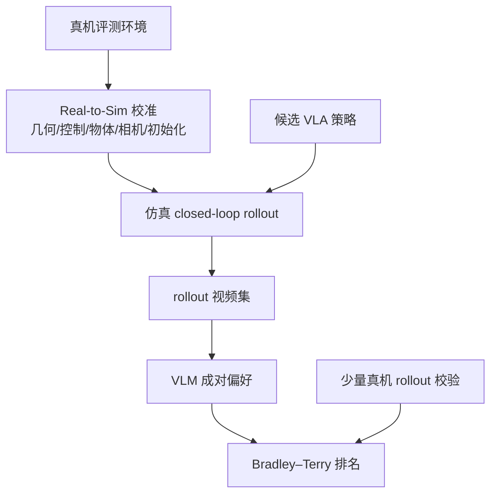

# R2S-Eval：真实—仿真校准 + VLM 的机器人策略评测

**R2S-Eval**（*Robot Evaluation with Real-to-Sim Calibration via Vision-Language Models*，[arXiv:2609.03276](https://arxiv.org/abs/2609.03276)，[项目页](https://r2s-eval.github.io/)）将机器人策略评测从 **反复硬件试次 + 成功率计数** 推进到 **校准仿真 rollout + VLM 行为偏好排名**：在仿真中复现真机评测的几何、控制接口、物体、相机与初始化，用 VLM 比较完整执行质量并聚合为稳定策略排序。

## 一句话定义

**用校准仿真代替大量硬件 rollout，用 VLM 偏好代替单一成功位，把评测从「数成功」变成「比行为质量」。**

## 英文缩写速查

| 缩写 | 英文全称 | 简要说明 |
|------|----------|----------|
| R2S-Eval | Real-to-Sim Evaluation | 本文评测管线 |
| VLM | Vision-Language Model | 看视频成对偏好判断 |
| VLA | Vision-Language-Action | 被评测的通用操作策略族 |
| BT | Bradley–Terry Model | 聚合成对偏好为策略分数 |
| Sim2Real | Simulation to Real | 仿真与真机对齐校准 |

## 为什么重要

- 纳入 [2026-09-06 九篇资源汇总](../../sources/blogs/wechat_embodied_station_9_papers_resources_2026-09-06.md) 的「可信评测」支线。
- **减少硬件人工**：校准仿真批量生成候选策略 rollout，降低复位与监控成本。
- **揭示成功标签盲区**：双方均失败/均成功的 rollout 仍可有显著质量差，VLM 偏好可区分。

## 核心信息

| 项 | 内容 |
|----|------|
| **机构** | 南京大学（NJU）；同济大学（Tongji）；清华大学（Tsinghua）；Sharpa 等 |
| **栈** | **Isaac Lab-Arena** 校准仿真；评测 π₀、π₀.₅、OpenVLA、SmolVLA、NORA-Long、X-VLA 等 |
| **规模** | LIBERO **40** 任务；**7** 个真机桌面任务（盖杯、捡球入盒等） |
| **开源** | **待发布**（项目页无官方实现仓，截至 2026-09-06） |

### 流程总览

## 实验与评测

| 设置 | 要点 |
|------|------|
| LIBERO | 6 策略 × 8 VLM；偏好排序与成功率 Spearman **0.823**；与人类标注一致 **82.9%** |
| 真机 7 任务 | 与硬件成功率 Spearman **0.957**；人类一致 **91.9%** |
| 行为质量 | 双方失败/成功对仍可被 VLM 区分（项目页案例） |

## 结论

**机器人评测正在从手工数成功转向自动化、质量感知、与人类偏好对齐的 rollout 比较。**

1. **Real-to-sim 校准足够** — 不必照片级孪生，对齐决定行为的因子即可生成可比视频。
2. **VLM 偏好与人类一致** — 真机设置 **91.9%** 成对一致，可作自动评委。
3. **成功率不够** — 需看进度、连续性、平滑度等执行质量维度。
4. **官方管线待发布** — 复现依赖 Isaac Lab-Arena 与第三方 VLA，非一体仓。

## 源码运行时序图

**不适用** — 截至 **2026-09-06** 无官方 R2S-Eval 训练/评测脚本发布。

## 局限与风险

- **无官方代码** — 工程细节需跟踪项目页。
- **VLM 评委偏差** — 8 个 judge 已有差异，需报告不确定性。
- **校准域** — 当前以桌面操作为主；移动/双手协作外推未验证。

## 与其他工作对比

| 对照 | 差异读法 |
|------|----------|
| 纯真机 SR 评测 | 成本高、波动大、信息量少 |
| 未校准仿真评测 | 排名可能与真机不一致；R2S-Eval 强调校准 |
| [RoboTok](./paper-robotok.md) | 数据检索引擎；R2S-Eval 是策略评测管线 |

## 关联页面

- [VLA](../methods/vla.md)
- [Manipulation](../tasks/manipulation.md)
- [Isaac Lab Arena](./isaac-lab-arena.md)
- [具身资源与可靠性 9 篇地图](../overview/embodied-resources-reliability-9-papers-technology-map.md)

## 参考来源

- [r2s_eval_arxiv_2609_03276.md](../../sources/papers/r2s_eval_arxiv_2609_03276.md)
- [r2s-eval 项目页](../../sources/sites/r2s-eval.md)
- [具身智能小站 2026-09-06 九篇盘点](../../sources/blogs/wechat_embodied_station_9_papers_resources_2026-09-06.md)

## 推荐继续阅读

- [arXiv:2609.03276](https://arxiv.org/abs/2609.03276)
- [R2S-Eval 项目页](https://r2s-eval.github.io/)
