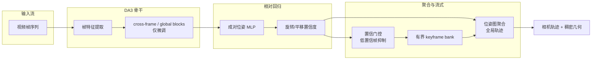
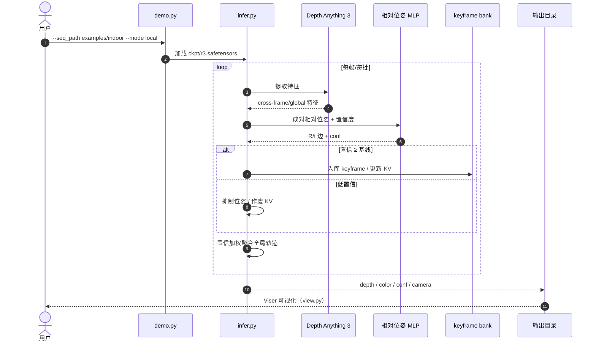

# R³：相对回归的 3D 重建

**R³**（*3D Reconstruction via Relative Regression*，arXiv:[2605.26519](https://arxiv.org/abs/2605.26519)，[项目页](https://kevinxu02.github.io/r3-site/)，[GitHub](https://github.com/KevinXu02/R3)，[HF](https://huggingface.co/KevinXu02/R3)）由 **密歇根大学、西湖大学与 NVIDIA** 提出：在 **Depth Anything 3（DA3）** 骨干上，用 **轻量 MLP** 回归 **置信加权成对相对位姿**，替代「所有相机回归到一个全局坐标系」的前馈范式；同一 checkpoint 支持 **因果流式**（有界内存、20+ FPS）与 **全上下文离线** 重建，并可扩展至 **数千帧**。

## 一句话定义

**把长视频重建从「全局绝对位姿回归」改为「成对相对位姿 + 置信加权聚合」，用有界 keyframe bank 实现流式回环一致。**

## 英文缩写速查

| 缩写 | 英文全称 | 简要说明 |
|------|----------|----------|
| R³ | Relative Regression Reconstruction | 本文：相对回归 3D 重建 |
| DA3 | Depth Anything 3 | 上游视觉骨干（ByteDance-Seed） |
| KV | Key-Value cache | 流式注意力缓存；低置信帧作废 |
| MLP | Multi-Layer Perceptron | 轻量成对位姿回归头 |
| FPS | Frames Per Second | 流式吞吐（项目页报 40 FPS*） |
| CC BY-NC | Creative Commons Non-Commercial | 权重许可（DA3 衍生） |

## 核心信息

| 字段 | 内容 |
|------|------|
| **机构** | 密歇根大学（University of Michigan）；西湖大学（Westlake University）；英伟达（NVIDIA） |
| **arXiv** | [2605.26519](https://arxiv.org/abs/2605.26519)（v2 2026-05-28） |
| **骨干** | **Depth Anything 3**；仅微调 cross-frame/global blocks 与相对相机 decoder |
| **规模** | **372M** 参数（约 1B 级基线 ⅓） |
| **推理** | **20+ FPS** 流式；有界内存；支持 **数千帧** |
| **开源（截至 2026-09-09）** | **已开源**：Apache-2.0 代码 + HF 权重（CC BY-NC 4.0）；**评测代码待发布** |

## 为什么重要

- **直击全局坐标系瓶颈：** VGGT 类前馈模型把全部相机回归到一个 **任意全局原点**；长视频下平移幅值 **无界增长**，网络需维护不稳定的时间原点。R³ 用 **相对位姿** 让回归目标随视频长度 **保持稳定**。
- **流式 + 离线双模式：** 与 [LingBot-Map](../methods/lingbot-map.md)（在线流式）和 [VGG-T³](./paper-vgg-ttt.md)（离线线性化）不同，R³ 用 **同一权重** 覆盖两种部署形态，靠 **置信门控** 在流式中防污染。
- **机器人上游：** 长视频 **有界内存** 重建 + **回环一致**（新帧回连早期 keyframe）对移动机器人 **在线建图** 与 **视觉定位** 有直接工程含义；相对位姿表示也更贴近 SLAM 因子图直觉。

## 流程总览

## 核心原理

### 1. 相对位姿回归

不预测每帧在全局系下的绝对位姿，而是对 **帧对** 回归相对旋转与平移。目标分布不随视频长度漂移，天然适合 **长上下文** 与 **流式**。

### 2. 置信加权统一锚点

每条相对边输出 **rotation + translation** 两个置信度：
- **训练：** 加权 loss（可靠边主导）
- **推理：** 加权 **位姿图聚合** 成全局轨迹
- **流式：** 决定 **keyframe bank** 入库与 KV-cache 保留

### 3. 置信门控防污染

当新帧对 active context 的 **平均置信** 低于校准基线时，R³ **抑制其位姿估计**、作废其 KV 条目、跳过 keyframe 入库——防止运动模糊、遮挡、瞬态物体、场景切换污染地图。

### 4. 回环一致

相机重访旧区域时，新帧可与 keyframe bank 中 **早期观测** 建立相对约束，轨迹重新对准已有几何，避免重复/错位结构（项目页对比 InfiniteVGGT / TTT3R）。

## 源码运行时序图

**复现路径：** `pip install -e .` → 下载 `r3.safetensors` 到 `ckpt/` → `python demo.py --seq_path examples/indoor --mode local`；长轨迹用 `--mode long` + `r3_long.safetensors`。

## 评测要点（项目页/论文摘要）

| 维度 | R³ 主张 | 对照 |
|------|---------|------|
| **参数** | **372M** | 约 1B 级前馈基线 ⅓ |
| **流式吞吐** | **20+ FPS**（RTX PRO 6000） | 有界内存长视频 |
| **位姿/重建** | 匹配或超越 SOTA 流式方法 | 项目页对比 InfiniteVGGT / TTT3R |
| **双模式** | 单 checkpoint 支持 causal streaming + offline | 无需分别训练 |

## 对比定位

| 对照 | R³ 差异 |
|------|---------|
| **VGGT / VGG-T³** | 全局绝对位姿 / TTT 线性化；R³ **相对位姿** + **流式** |
| [LingBot-Map](../methods/lingbot-map.md) | 在线流式 GCA + Paged KV；R³ 用 **相对回归 + keyframe bank**，骨干为 DA3 |
| [SLAMFormer-∞](./paper-slamformer-infinity.md) | 学习型在线 SLAM + PGGO；R³ 更轻量、无显式回环优化器 |
| [Glob3R](./paper-glob3r.md) | 离线全局 SfM（tracks + BA）；R³ **前馈流式**，不做 BA |
| **TTT3R** | TTT 线性替代；项目页 1k 图 **场景不完整**，R³ 强调 **回环一致** |

## 工程实践

| 项 | 建议 |
|----|------|
| **安装** | `conda env create -f environment.yml && pip install -e .` |
| **Checkpoint** | `r3`（4–32 视图，室内/小范围）；`r3_long`（32–100，室外/长轨迹） |
| **Demo** | `python demo.py --mode {test,local,long,strided}`；`--no_viewer` 无头 |
| **可视化** | `python view.py --data_dir scratch/demo/<run>` |
| **训练** | `R3/training/` 已开源；注意 **上游非商业限制**（NOTICE） |
| **评测** | **官方评测代码待发布** — 复现论文数字需等更新 |
| **许可** | 代码 Apache-2.0；权重 **CC BY-NC 4.0**（DA3 衍生，商用需授权） |

## 结论

**R³ 把前馈 3D 重建从「全局坐标系回归」拉回到「相对位姿 + 置信聚合」，用 ⅓ 参数量实现有界内存流式重建——它不是要取代离线 SfM 的精度，而是给长视频一个可扩展、防污染、回环一致的前馈前端。**

- **相对表示是长视频的关键**：全局坐标系迫使网络维护任意原点与无界平移；成对相对位姿让回归目标 **长度无关**，天然支持流式与回环。
- **置信度是统一控制信号**：同一组置信同时驱动 **训练加权、推理聚合、keyframe 管理、outlier 门控**——比手工规则更简洁，且直接提升鲁棒性。
- **轻量微调即可**：仅微调 DA3 的 cross-frame/global blocks 与相对 decoder，**372M** 参数即可匹配/超越更大基线，说明 **表示设计 > 盲目扩参**。
- **双模式单权重降低部署成本**：同一 checkpoint 覆盖 **causal streaming** 与 **full-context offline**，无需维护两套模型。
- **工程边界要前置**：权重 **CC BY-NC**（非商业）；**评测代码待发布**；训练管线含上游非商业限制——商用与学术复现需分别评估。
- **机器人读法**：适合 **在线建图 / 视觉定位 / 长视频扫描** 上游；要厘米级离线精度仍应接 [Glob3R](./paper-glob3r.md) 类 BA 精炼。

## 局限与风险

- **非商业权重：** CC BY-NC 4.0 限制商用；训练代码亦含上游非商业条款。
- **评测代码未发布：** 论文数字暂不可完全复现。
- **依赖 DA3：** 上游骨干更新或许可变化会传导到 R³。
- **流式 ≠ 实时控制：** 20+ FPS 适合建图/定位前端；硬实时控制环仍需更低延迟估计器。

## 关联页面

- [LingBot-Map](../methods/lingbot-map.md) — 在线流式 3D 重建对照
- [VGG-T³](./paper-vgg-ttt.md) — 离线线性化 VGGT 对照
- [Glob3R](./paper-glob3r.md) — 离线全局 SfM 精炼对照
- [SLAMFormer-∞](./paper-slamformer-infinity.md) — 学习型在线 SLAM 对照
- [State Estimation](../concepts/state-estimation.md) — 视觉几何在状态估计链中的位置
- [状态估计知识链](../overview/hub-state-estimation.md) — SLAM / VIO 入口
- [Sim2Real](../concepts/sim2real.md) — 重建到仿真/真机迁移

## 参考来源

- [R³ 论文摘录](../../sources/papers/r3_arxiv_2605_26519.md)
- [R³ 项目页归档](../../sources/sites/r3-site.md)
- [KevinXu02/R3 官方仓归档](../../sources/repos/kevinxu02_r3.md)
- Xu et al., *R³: 3D Reconstruction via Relative Regression* — <https://arxiv.org/abs/2605.26519>
- 项目页：<https://kevinxu02.github.io/r3-site/>
- 代码：<https://github.com/KevinXu02/R3>
- 权重：<https://huggingface.co/KevinXu02/R3>

## 推荐继续阅读

- 项目页流式演示与对比：<https://kevinxu02.github.io/r3-site/>
- Depth Anything 3（上游骨干）：<https://github.com/ByteDance-Seed/Depth-Anything-3>
- VGGT（全局回归基线）：<https://github.com/facebookresearch/vggt>
- LingBot-Map（流式对照）：<https://arxiv.org/abs/2604.14141>
