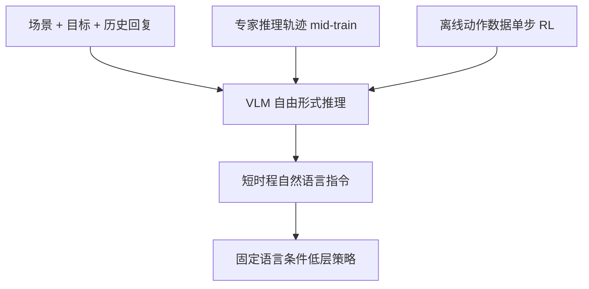

# R³

**R³: Training Robots to Reason in Natural Language via Reinforcement Learning**（[arXiv:2608.26053](https://arxiv.org/abs/2608.26053)，[项目页](https://robotic-reasoner.github.io/)）——卡内基梅隆大学（CMU）。

## 一句话定义

**语言推理的价值不是再当一层监督，而是给低层策略一个可加预算的测试时计算接口。**

## 英文缩写速查

| 缩写 | 英文全称 | 简要说明 |
|------|----------|----------|
| R³ | Robotic Reasoners via Reinforcement Learning | 本文后训练配方 |
| VLM | Vision-Language Model | 高层推理器 |
| Dr.GRPO | Group Relative Policy Optimization variant | Stage II 单步 RL 算法 |
| ECoT | Embodied Chain-of-Thought | 结构化推理轨迹基线 |

## 为什么重要

- 纳入 [具身智能小站 2026-08-28 九篇盘点](../../sources/blogs/wechat_embodied_station_wam_vla_cross_embodiment_9_papers_2026-08-28.md)：语言推理可以分配测试时计算。
- 开源状态（入库日）：**待发布**。

## 核心信息

| 项 | 内容 |
|----|------|
| **机构** | 卡内基梅隆大学（CMU） |
| **出处** | arXiv:2608.26053（2026-08） |
| **开源** | **待发布** |

### 流程总览

## 工程实践

| 项 | 内容 |
|----|------|
| **层级** | 高层 VLM 推理 + 冻结低层策略（Language Table 用预训练语言条件策略；打包任务微调 π0.5） |
| **Stage I** | 专家推理轨迹 SFT；Grocery Packing 因基座 VLM 已能推理而跳过 |
| **Stage II** | Dr.GRPO 单步 RL；Language Table 用量表 VLM judge，打包用 pack/remove/transfer 字符串匹配 |
| **专家** | Language Table 的推理轨迹来自 Gemini 3 Flash |

## 评测

| 项 | 内容 |
|----|------|
| **Language Table** | 14 个长时程积木任务；R³ 在每个 held-out OOD 任务上显著优于仅指令模仿 |
| **Grocery Packing** | 双臂 xArm-7 装 YCB；12 held-out，R³（仅 RL）成功率 **47.9%** vs 指令模仿 **38.0%** |
| **测试时预算** | 截断推理会掉点，说明推理不只是表征学习 |

- 数据出处：[ingest 摘录「评测」](../../sources/papers/r3_robotic_reasoner_arxiv_2608_26053.md)。

## 结论

**自由形式语言推理可以当测试时计算，用来跟踪进度、比较方案并在低层策略出错后恢复。**

1. 中期训练给 RL 一个像样的推理先验；从基座直接 RL 会改写指令分布而不是精修。
2. 结构化 ECoT 状态标注在本设定下并不比自由形式推理更强。
3. VQA 变好解释不了全部操作增益——要看推理是否在推理时真正被调用。
4. 代码未发布，无法核对照表与置信区间。

## 源码运行时序图

**不适用**（截至 **2026-08-28**）：项目页 Code Coming Soon。

## 局限与风险

- 依赖专家推理轨迹或已会推理的基座 VLM。
- 低层策略仍是瓶颈：推理只能「steer」，不能替代接触控制。
- 评测在受控仿真测试床，不是开放厨房。

## 与其他工作对比

- 相对把 CoT 当辅助损失：R³ 在推理时输出可执行短指令。
- 相对 [MA-VLA](./paper-ma-vla.md)：一个解决「推理预算」，一个解决「多臂角色组合」。

## 关联页面

- [VLA](../methods/vla.md)
- [Reinforcement Learning](../methods/reinforcement-learning.md)
- [Manipulation](../tasks/manipulation.md)
- [WAM / VLA / 跨本体 9 篇技术地图](../overview/wam-vla-cross-embodiment-9-papers-technology-map.md)

## 参考来源

- [r3_robotic_reasoner_arxiv_2608_26053](../../sources/papers/r3_robotic_reasoner_arxiv_2608_26053.md)
- [r3-robotic-reasoner 项目页](../../sources/sites/r3-robotic-reasoner.md)
- [具身智能小站 9 篇盘点](../../sources/blogs/wechat_embodied_station_wam_vla_cross_embodiment_9_papers_2026-08-28.md)

## 推荐继续阅读

- [arXiv:2608.26053](https://arxiv.org/abs/2608.26053)
- [R³ 项目页](https://robotic-reasoner.github.io/)
