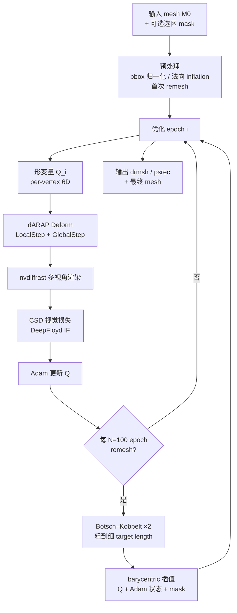
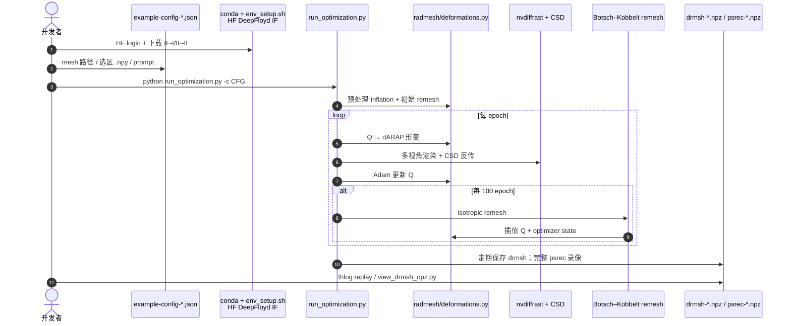

# RADmesh（Remesh-Aware Mesh Deformation · ECCV 2026 Oral）

**RADmesh**（*Remesh-Aware Mesh Deformation*，[arXiv:2608.17182](https://arxiv.org/abs/2608.17182)，[项目页](https://threedle.github.io/radmesh/)，[代码](https://github.com/threedle/radmesh)，**ECCV 2026 Oral**）由 **芝加哥大学 Threedle Lab**（Dinh / Lang / Hanocka）与 **USC / Technion**（Stein）提出：在 **显式三角网格** 上直接做 **文本引导生成式形变**，把 **周期性各向同性 remesh** 写进优化环，而不是只在固定连通性下挪顶点。核心是用 **per-vertex 6D 形变量 Q**（方向 + 局部缩放，扩展 [Geometry in Style](https://arxiv.org/abs/2409.12921) 的 dARAP）配合 **Botsch–Kobbelt remesh** 与 **Adam 状态 barycentric 插值**；视觉监督为 **nvdiffrast 渲染 + Cascaded Score Distillation（CSD）+ DeepFloyd IF**。相对 TextDeformer / MeshUp 等固定三角网形变，能 **局部生长大尺度 appendage** 并保持 **干净各向同性三角**；相对隐式/多视图重建管线，**不经过中间表示**，直接在 mesh 上优化。

## 一句话定义

**把 remesh 当成生成式网格形变的一等公民：用 vertex-based Q + 粗到细 remesh 日程，在 CSD 噪声下仍能做大尺度文本引导网格编辑。**

## 英文缩写速查

| 缩写 | 英文全称 | 简要说明 |
|------|----------|----------|
| RADmesh | Remesh-Aware Mesh Deformation | 本文 remesh-in-the-loop 文本引导网格形变框架 |
| dARAP | differentiable As-Rigid-As-Possible | 可微 ARAP 形变求解；本文 Local/Global 两步 |
| CSD | Cascaded Score Distillation | 多阶段扩散的 SDS 变体；本文用 DeepFloyd IF |
| SDS | Score Distillation Sampling | 2D 扩散模型对 3D 渲染图的得分蒸馏监督 |
| IF | Imagen Foundation / DeepFloyd IF | Hugging Face 上的级联 2D 扩散骨干 |
| Q | Deformation quantity | 每顶点 6 维优化变量（方向 3 + 缩放 3） |
| BK | Botsch–Kobbelt remeshing | 各向同性 remesh：split/collapse/flip/smooth/reproject |

## 为什么重要

- **Sim / 数字孪生资产编辑：** 机器人场景里常需给 **已有 mesh**（物体、简模、扫描）按文本 **长出新结构**（把手、支架、装饰）且保持 **显式三角网 + UV**；RADmesh 选区外可 **保纹理与对应**。
- **固定连通性的天花板：** 大尺度生长若不改 triangulation，单元会被拉爆；inverse rendering remesh 又多以顶点位置为变量，难接生成式 **Jacobian / rotation** 表示。
- **工程可跑：** 官方 [threedle/radmesh](https://github.com/threedle/radmesh) 提供 `run_optimization.py`、示例配置与 `radmesh/deformations.py` 几何核（可单独复用）。
- **与 ECCV 2026 薄壳生成互补：** [DiffGI](./paper-diffgi.md) 从 **2D TSDF GI** 生成薄壳；RADmesh 从 **已有 mesh + prompt** 做 **局部/全局形变**——一条偏「生成」，一条偏「编辑」。

## 核心信息

| 项 | 内容 |
|----|------|
| **机构** | 芝加哥大学（University of Chicago，Threedle Lab）；南加州大学（USC）；以色列理工学院（Technion） |
| **Venue** | ECCV 2026 **Oral** |
| **监督** | CSD + DeepFloyd IF；可微渲染 nvdiffrast |
| **Remesh** | 每 **100** epoch、**2** 次 BK 迭代；粗到细 target edge length |
| **任务** | 局部选区生长（≤2600 epoch）；全局 detailization（≤2200 epoch） |
| **开源** | **已开源** — [threedle/radmesh](https://github.com/threedle/radmesh)；需 HF DeepFloyd IF + **48GB 级 GPU**（README：A40/L40S） |

## 流程总览

## 核心原理

### 形变量 Q 与 dARAP

| 分量 | 含义 | 作用 |
|------|------|------|
| `q_dir` | 3D 方向 | Procrustes 求局部旋转 R_k（扩展 Geometry in Style） |
| `q_scale` | 3D 对角缩放 | 组成 S_k，与 R_k 合成 T_k=S_k R_k，支持 **大尺度生长** |
| GlobalStep | cotangent 加权 ARAP | 在 **固定当前 F** 上解全局顶点位置 |

选区外顶点：**T_k=I** 且 GlobalStep 固定原位置 → **局部形变 + 区外保几何/UV**。

### Remesh 与状态插值

- **BK remesh** 仅作用于选区边（mask≥0.5）；**重投影** 得到新顶点在旧三角上的 **barycentric**。
- **Adam 一阶/二阶矩** 与 Q 一并插值到新顶点 — 论文消融表明对 **对称生长** 与 **全局尺度稳定** 关键。
- **粗到细 target length**：局部 1.7×→1.0× 平均边长（分阶段 ramp）；全局 1.4×→1.0×。**单次细 remesh** 或仅 curvature-adaptive 均不如该日程（Fig. 10）。

### 与相关路线对比（方法栈内）

| 路线 | 代表 | 相对 RADmesh |
|------|------|-------------|
| 固定连通性 mesh 形变 | TextDeformer / MeshUp / Geometry in Style | 难做大尺度 appendage；RADmesh **改连通性** |
| IR remesh | Palfinger / Barda | 变量是 **顶点位置**；难插值生成式形变量 |
| 隐式 / 多视图生成 | TRELLIS、多阶段 2D inpainting→3D | 非直接 mesh 优化；RADmesh **纯 mesh 路径** |
| 薄壳潜扩散 | [DiffGI](./paper-diffgi.md) | 从 GI 生成服装；RADmesh 从 **已有 mesh 编辑** |

## 与其他工作对比

| 维度 | RADmesh | DiffGI | PhysForge / Articraft |
|------|---------|--------|------------------------|
| 输入 | 已有三角 mesh + 文本 | 图像/标签/图案 | 文本/图像 → sim-ready 资产 |
| 连通性 | **周期 remesh** | 固定 GI 栅格 | 生成阶段定拓扑 |
| 监督 | CSD + DeepFloyd IF | 潜扩散 + DMS | 物理 grounded 训练 |
| 开源 | **已开源**（threedle/radmesh） | 待发布（入库日） | 视各项目页 |

## 源码运行时序图

官方仓 [threedle/radmesh](https://github.com/threedle/radmesh)（归档见 [sources/repos/radmesh.md](../../sources/repos/radmesh.md)）：

- **最短复现：** `env_setup.sh` → HF 许可 + login → `python run_optimization.py -c example-config-localized.json`（headless 设 `NO_POLYSCOPE=1`）。
- **仅几何核：** `radmesh/deformations.py` 可单独依赖（numpy/scipy/torch/libigl/cholespy/thlog）。
- **输入建议：** 8k–20k 面各向同性 mesh 更稳；非各向同性或超高分辨率需调 `targetlen_schedule`。

## 工程实践

| 项 | 建议 |
|----|------|
| GPU | 按 README 准备 **≥48GB**；DeepFloyd IF 占显存大头 |
| 选区 | `.npy` bool `(n_verts,)`；太小的选区可 **dilate** 调节 inflation 启发式 |
| 人体/细长形 | 配置 `dist_minmax: [1.4, 2.6]`、`elev_minmax: [0.0, 30.0]` |
| 随机性 | GPU 稀疏 op 导致 **非确定性**；不满意可 **多次 run**（README Caveats） |
| UV 工作流 | 选区外 corner UV/纹理 **不变**；新区需用户自行 unwrap/贴图 |
| 与 sim-ready 资产 | 输出是 **编辑后三角网**；物理属性/关节/碰撞仍要 [PhysForge](./paper-physforge-physics-grounded-3d-assets.md) 等下游 |

## 实验与评测

论文以 **定性 Gallery + 消融** 为主（局部生长、全局 detailization、triangulation 自适应、UV 工作流），强调：

- **远距生长 + extremity 细节**（翅膀、长尾、鹿角、服装等）与 **选区边界干净**。
- **三角形质量**：各向同性、近等边；非均匀 upsample 的简单对照。
- **消融**：无 scale、无 optimizer 插值、无 coarse-to-fine remesh、无 initial inflation 均显著变差。

## 结论

**文本引导网格编辑若要做「长出来」而不只是「捏形」，必须把 remesh 和 vertex-based 形变量绑在同一优化环里，并用粗到细日程扛住 CSD 噪声。**

1. **选型先看任务** — 局部加部件 / 全局 detailization 用 RADmesh；从零生成 closed 资产或薄壳批量生成看 DiffGI / 隐式基础模型。
2. **真杠杆是 remesh 日程 + 状态插值** — 不是「remesh 一次到很细」；Adam 状态插值影响对称性与稳定性。
3. **Q 的 scale 分量** — 大尺度生长依赖 rotation-only 不够；scale 可 **直接 clamp**（全局 leaky ReLU floor 0.98 抗 shrink）。
4. **复现成本在 IF + 大 GPU** — 代码已开源，但 DeepFloyd 许可与 48GB 显存是硬门槛。
5. **机器人管线定位** — 适合 **sim 网格资产生长/改型**；不替代 RL、不产出 sim-ready 物理字段。

## 局限与风险

- **SDS/CSD 噪声与初始化敏感** — 同一 prompt 多次 run 结果方差大；依赖 inflation / 选区形态。
- **算力与依赖重** — DeepFloyd IF + nvdiffrast CUDA 编译；非轻量工具链。
- **无物理/语义约束** — 文本视觉对齐 ≠ 可制造/可仿真；薄结构可能自交。
- **许可证** — 仓库根目录未标 SPDX；商用需自行确认。

## 关联页面

- [DiffGI](./paper-diffgi.md) — ECCV 2026 薄壳/显式网格生成（2D TSDF GI）。
- [PhysForge](./paper-physforge-physics-grounded-3d-assets.md) — 物理 grounded 3D 资产生成。
- [Articraft](./articraft.md) — 可关节程序化资产 Agent。
- [EmbodiedGen V2](./paper-embodiedgen-v2-sim-ready-world-engine.md) — sim-ready 世界引擎。
- [Differentiable Simulation](../concepts/differentiable-simulation.md) — 可微仿真总览（与本文视觉形变区分）。
- [Manipulation](../tasks/manipulation.md) — 操作任务对 **网格/碰撞几何** 的需求语境。

## 参考来源

- [RADmesh 论文归档（arXiv:2608.17182）](../../sources/papers/radmesh_arxiv_2608_17182.md)
- [RADmesh 项目页归档](../../sources/sites/radmesh-threedle-github-io.md)
- [threedle/radmesh 仓归档](../../sources/repos/radmesh.md)

## 推荐继续阅读

- 论文：<https://arxiv.org/abs/2608.17182>
- 项目页：<https://threedle.github.io/radmesh/>
- 代码：<https://github.com/threedle/radmesh>
- Geometry in Style（形变表示前作）：<https://arxiv.org/abs/2409.12921>
