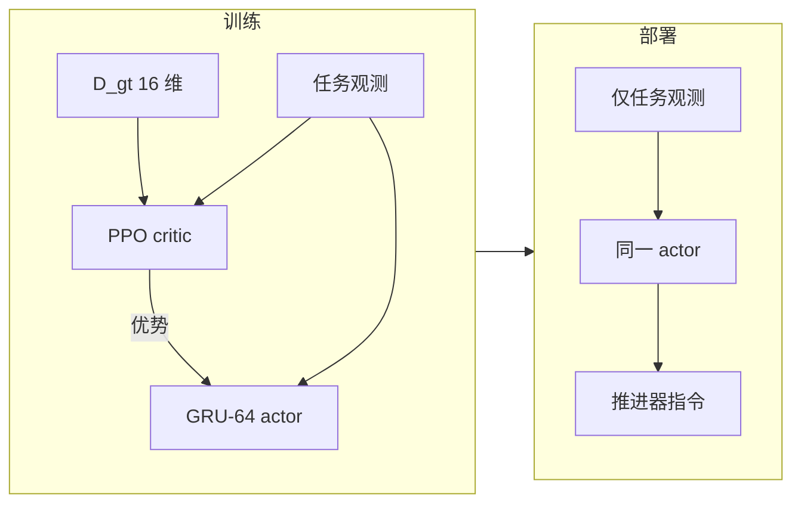
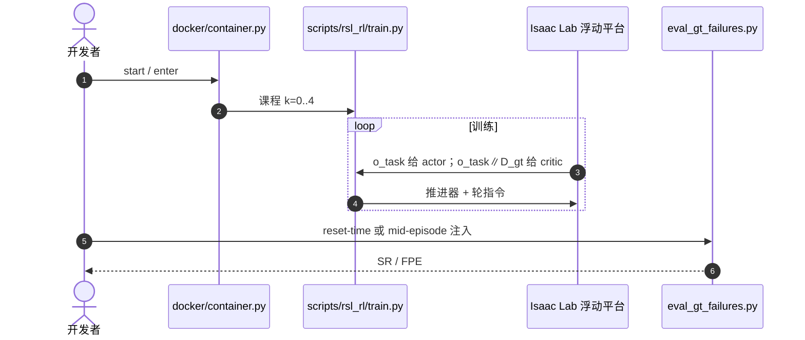

# RAFT：特权 Critic 塑造无传感器推进器容错

**RAFT**（*Recurrent Asymmetric Fault Tolerant*，[arXiv:2608.22976](https://arxiv.org/abs/2608.22976)，[代码](https://github.com/snt-spacer/RAFT)）由 **卢森堡大学（University of Luxembourg）** 提出：给 PPO **价值函数**训练期特权 \(D_{gt}\)，actor 只收标准任务观测；部署时无需故障检测传感器，也能补偿连续退化、死推进器与卡开阀门。

> 名称易与光流 **RAFT** 混淆；本页专指推进器容错策略。

## 一句话定义

**故障信息不必进部署观测——放进 critic 的优势估计，就能把容错写进 actor 权重。**

## 英文缩写速查

| 缩写 | 英文全称 | 简要说明 |
|------|----------|----------|
| RAFT | Recurrent Asymmetric Fault Tolerant | 本文：GRU actor + 特权 critic |
| FDI | Fault Detection and Isolation | 经典检测–隔离–切换管线 |
| VAN | Vanilla policy | 无故障环境训练的失败朴素基线 |
| SR | Success Rate | 5 cm 内保持 50 步的成功率 |
| GRU | Gated Recurrent Unit | RAFT actor 记忆，dim 64 |

## 为什么重要

- 真实推进器故障不是干净的 0/1 开关，组合会撑爆查找表 FDI。
- Oracle（actor 看见 \(D_{gt}\)）给上界但部署不可得。
- 消融把「记忆」和「特权 critic」拆开：没有 critic 特权，GRU/LSTM 最高 4.0%；有了之后无记忆 MLP 已 66.4%。

## 核心信息

| 项 | 内容 |
|----|------|
| **机构** | 卢森堡大学（University of Luxembourg） |
| **平台** | 8 推进器 + 1 反作用轮浮动平台 |
| **任务** | Go-to-Position，观测 \(\mathbb{R}^{15}\) |
| **故障** | DEG / DEAD / STK，课程最多 4 个同时 |
| **开源** | **已开源** — Docker + rsl_rl 训练/评测 |

## 流程总览

## 源码运行时序图

关键复现路径：Isaac Lab fork、rsl_rl fork 与本仓并排后 `docker/container.py start`；训练入口 `scripts/rsl_rl/train.py`。

## 实验与评测读法

\(k=4\) 混合三模式（5120 episode × 3 seed）：

| 方法 | SR | 读法 |
|------|-----|------|
| VAN | 4.8% | 无故障训练，高 \(k\) 崩溃 |
| VAN-MLP-AC | 66.4% | 无记忆 + 同特权 critic（79% gap） |
| **RAFT** | **70.2%** | GRU-64，84% gap |
| Oracle | 82.4% | actor 看见 \(D_{gt}\) |
| 无 AC 的最佳 RNN | 4.0% | 记忆不能替代特权 critic |

模式难度 DEG < STK < DEAD。中途（第 100/400 步）注入故障时，无记忆 AC 与 RAFT 掉点几乎一样（~5.5 pp），再次说明适应主机制是 critic 塑形而非 GRU。OBS-MSE 给出可读故障估计，SR 低 11 pp。

## 结论

**要把容错写进策略，优先给 critic 特权，而不是给 actor 加传感器或加更大 RNN。**

1. **真影响指标：** \(k=4\) 的 SR 与 VAN→Oracle gap 闭合率；FPE 只描述成功 episode 的精度。
2. **架构：** dim-64 优于 256；过大隐状态有害。
3. **解释性：** 显式 observer 有代价，默认 RAFT 把容错压在权重里。
4. **对照：** 与 [无奖励持续适应](./paper-reward-free-continual-adaptation-space.md) 互补——一个无部署奖励，一个无部署故障传感。

## 与其他工作对比

| 对比轴 | RAFT | RMA 蒸馏 | 经典 FDI |
|--------|------|----------|----------|
| 特权用法 | 只给 critic，无第二阶段 BC | 特权 encoder → 历史学生 | 运行时识别再切换 |
| 部署故障传感 | 无 | 无（从历史推断） | 通常要 |
| 故障形态 | 连续 + 多模式同时 | 多为外参/地形 | 预定义签名 |

## 工程实践

| 项 | 说明 |
|----|------|
| 奖励 | 位置/航向指数奖励 − 速度惩罚 − 边界惩罚 |
| 成功 | \(\|p-p^\star\|_2<0.05\) m 连续 50 步 |
| 不要 | 把本页 RAFT 当成光流网络 |

## 局限与风险

- 仿真浮动平台，非轨道/水下真机。
- DEAD 模式与 Oracle 差距最大（~28 pp）——突发全失最需要显式故障信息。
- 依赖自有 Isaac Lab / rsl_rl fork。

## 关联页面

- [Privileged Training](../concepts/privileged-training.md) — 非对称 AC 谱系
- [PPO](../methods/ppo.md)
- [无奖励持续适应](./paper-reward-free-continual-adaptation-space.md)
- [RMA](./paper-rma-rapid-motor-adaptation.md) — 特权→历史的另一条路
- [开源 7 篇系统结构地图](../overview/open-source-7-papers-system-structure-technology-map.md)

## 参考来源

- [论文摘录](../../sources/papers/raft_thruster_fault_arxiv_2608_22976.md)
- [RAFT 仓库](../../sources/repos/raft_snt_spacer.md)
- [具身智能小站 7 篇盘点](../../sources/blogs/wechat_embodied_station_7_papers_vla_intent_space_2026-08-26.md)

## 推荐继续阅读

- [arXiv:2608.22976](https://arxiv.org/abs/2608.22976)
- [GitHub snt-spacer/RAFT](https://github.com/snt-spacer/RAFT)
